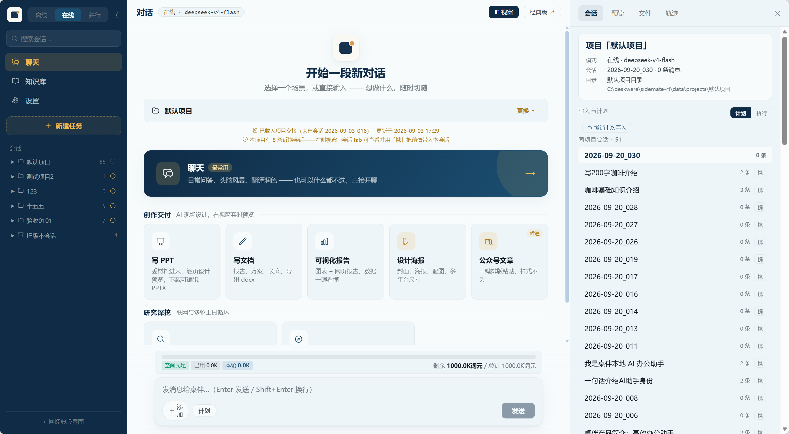

<div align="center">

# 桌伴 Sidemate

**在你的电脑上运行 AI——数据由你掌控，模型由你选择。**

本地优先的 AI 桌面应用 — 对话、知识库、文档生成、Agent 工作区，数据全部留在你的电脑上。

[](https://github.com/zwq871482439/sidemate/releases/tag/v0.10.1-pre) [](LICENSE)

[功能](#-核心功能) · [界面预览](#-界面预览) · [快速开始](#-快速开始) · [文档](#-文档) · [技术栈](#-技术栈) 

[English](#english) | 中文

</div>

---

## 中文

桌伴 Sidemate 是一款 **本地优先的 AI 桌面应用**。它提供模型运行、知识库管理、工具链和文档生成的完整工作环境——AI 能力来自你选择的开源模型（离线运行）或在线 API，Sidemate 负责编排一切，数据由你掌控。

- 🔒 **数据不出本机**：Sidemate 本身不收集、不上传你的数据。对话、文件、知识库全部存储在你的电脑上
- 🔌 **断网照用**：离线模式（llama.cpp + Qwen3.5）完全本地运行，坐飞机也能用
- ☁️ **在线按需**：需要更强模型时，可配置在线模型 API（OpenAI 兼容 / Anthropic 双接口），数据直接发给你选的服务商，不经第三方
- 📚 **本地知识库**：上传 PDF/Word/笔记，AI 基于你的资料回答，向量化+重排序全在本地
- 🌌 **知识星图**：文档关系图谱可视化——相似度连线、AI 聚类分色、点选查看关联，一眼看清你的知识脉络
- 📁 **项目即文件夹**（0.10.1）：一个文件夹 = 一个项目——材料在根目录、AI 产物在 .sidemate/，写文件先出确认清单，删除项目永不动你的文件
- 📊 **报告与 PPT 生成**：Word 文档（离线可用）、HTML 可视化报告（应用内实时预览）、**可编辑的原生 PPTX**（AI 逐页设计 → 实时预览 → 下载即用）
- 🛠️ **AI Agent 工作区**（0.10.1）：调用计划编排、并行深读、写权限计划/执行双模式、成果一键打包、完整调用轨迹
- 🧠 **记忆分层**（0.10.1）：项目会话索引 + 前情携带 + 历史会话读取；会话可标私密（不进任何注入）
- ⚡ **轻启动**（0.10.1）：默认启动不加载模型（快、零后台占用），首条离线消息自动加载、闲置 30 分钟自动卸载

### 🎯 核心功能

| 功能 | 说明 |
|------|------|
| **三种模式** | 离线（本地运行）/ 在线（在线大模型）/ 并行（本地检索+在线推理） |
| **新版三栏界面**（0.10.1 预览） | 左栏项目与会话 · 中栏对话 · 右视窗（会话/预览/文件/轨迹），与经典版数据完全互通，随时互切 |
| **项目即文件夹**（0.10.1） | 项目=一个文件夹：材料在根目录、产物在 .sidemate/；跨项目引用；项目知识库（大材料向量化检索，仅在线）；删除项目永不触碰磁盘文件 |
| **本地知识库** | bge-m3 向量化 + bge-reranker-v2-m3 精排，向量检索与重排序全在本地 |
| **KB 智能标签** | 自动为文档打标、语义分组（打标引擎可选离线/在线），支持 AI 智能筛选 |
| **知识星图** | 文档关系图谱：k-NN 相似度连线、力导向布局、AI 聚类同色系分组、点选浮条查看关联知识与 AI 详解 |
| **云端配置** | 一键拉取模型列表（下拉可选/手填兜底）、上下文上限可覆盖、网络代理开关、token 用量统计（今日/本周·按模型） |
| **文档生成** | 提纲确认→两阶段生成：.docx（离线可用）/ .html 可视化报告（应用内实时预览）/ **原生 PPTX**（在线模式：AI 逐页手写设计 → 右视窗实时预览 → 下载可编辑的中文原生文本演示文稿） |
| **AI Agent**（0.10.1 增强） | 联网搜索三段式工作流、并行深读、**调用计划**（一次编排多步只读工具）、**写权限计划/执行双模式**（写项目文件先出确认卡，点同意才落盘，可撤销、防路径穿越）、成果打包下载、**调用轨迹时间线** |
| **记忆分层**（0.10.1） | 同项目会话索引 + 「携」前情携带 + 历史会话读取；离线会话可标私密——不进在线注入与携带 |
| **模型下载** | 内置下载页，从魔搭 ModelScope 一键下载，按内存自动推荐档位，支持断点续传 |
| **开箱即用** | 一键下载推荐方案；0.10.1 起启动默认不预载模型（快+零后台占用），首条离线消息自动加载、闲置自动卸载 |
| **审计日志** | 知识库每次检索记录访问明细（时间/访问者/查询词/命中片段/相关性评分） |
| **深色模式** | 经典版完整深色/浅色主题（新版界面深色档在路线图中） |

### 🖼 界面预览

**0.10.1 新版三栏界面**（预览，`/newUI.html`；经典版仍为默认，设置中随时互切）：



更多截图（PPT 逐页预览 / 场景卡 / 用量统计 / 经典版）见 [Releases · v0.10.1-pre](https://github.com/zwq871482439/sidemate/releases/tag/v0.10.1-pre) 附件。

### 🚀 快速开始

**普通用户**：下载安装包 → 一键安装 → 模型下载页选模型 → 开始使用

**开发者**：clone 源码后运行 `python envsetup.py` 一键部署（自动下载嵌入式 Python、pip 依赖、llama-server、编译 Launcher），详细步骤见 [BUILD.md](BUILD.md)

1. 下载安装包或 clone 源码
2. 启动后进入 **设置 → 模型下载**（或使用首页"快速开始"一键下载推荐方案）
3. 下载 LLM（按内存自动推荐档位：16GB→0.8B / 24GB→2B / 32GB→4B）和知识库模型（4.5GB）
4. 下载完成自动加载并预热模型，直接开始对话或知识库问答

**系统要求**：Windows 10/11 · 16GB 内存起步（离线模型；纯在线模式 8GB 即可）· 10GB 磁盘（含模型）

> 💡 0.10.1 新版三栏界面：启动后在 **设置 → 常规 → 界面版本** 切换，或直接访问 `/newUI.html`；两版数据完全互通。

### 📖 文档

完整使用文档位于官网 Wiki：**[desk.deskware.cn/wiki](https://desk.deskware.cn/wiki/)**

- 产品介绍 · 三模式详解 · 使用场景 · FAQ · 隐私政策

### 🛠 技术栈

| 层 | 技术 |
|----|------|
| **推理引擎** | llama.cpp（llama-server）+ Qwen3.5 GGUF（0.8B/2B/4B） |
| **后端** | Python 3.14（嵌入式）+ FastAPI |
| **前端** | 原生 HTML/CSS/JS（无框架，CSS 变量主题） |
| **知识库** | bge-m3（embedding）+ bge-reranker-v2-m3（reranker） |
| **Launcher** | Go（进程管理 + 看门狗 + GPU 检测） |
| **CI** | GitHub Actions |
| **协议** | Apache-2.0 |

### 📦 项目结构

```
envsetup.py                 ← 一键环境部署（嵌入式 Python + 依赖 + llama-server + Launcher 编译）
requirements.txt            ← Python 依赖清单
server/
├── core/
│   ├── llamacpp_backend/   ← llama.cpp 推理引擎
│   ├── cloud_engine.py     ← 在线 API（OpenAI 兼容）
│   ├── anthropic_adapter.py← Anthropic 接口适配
│   ├── download_engine.py  ← 模型下载
│   ├── agent_loop.py       ← Agent 工具循环
│   └── model_manager.py    ← 模型管理
├── pipelines/              ← 三模式 SSE 管道
│   ├── local_pipeline.py   ← 离线
│   ├── cloud_pipeline.py   ← 在线
│   └── parallel_pipeline.py← 并行
├── knowledge/              ← 知识库（检索/分块/向量化）
├── session/                ← 会话与项目（chat_store / projects 项目即文件夹）
├── core/（0.10.1 增）
│   ├── ppt_compile.py      ← 真 PPT 编译链（SVG 质量门 → PPTX）
│   ├── project_write.py    ← 写权限计划/执行双模式 + 撤销
│   └── project_kb.py       ← 项目知识库（向量化检索）
├── routers/                ← API 路由
└── static/                 ← 前端（js/v2/ = 新版三栏界面，esbuild 构建）
launcher/                   ← Go Launcher
```

---

<div id="english"></div>

## English

**Sidemate** is a **privacy-first AI desktop app**. It provides a complete workspace for running models, managing knowledge bases, chaining tools, and generating documents — AI capabilities come from open-source models (running locally) or online model APIs (your choice), Sidemate orchestrates everything, and your data stays in your hands.

- 🔒 **Your data stays local**: Sidemate itself doesn't collect or upload your data. Conversations, files, and knowledge base are stored on your machine
- 🔌 **Works offline**: Offline mode (llama.cpp + Qwen3.5) runs entirely on your machine — use it on a plane
- ☁️ **Online on your terms**: Connect online model APIs (OpenAI-compatible / Anthropic) when you need more power — data goes directly to your chosen provider, no middleman
- 📚 **Local knowledge base**: Upload PDFs/Word/notes, AI answers from your documents with vector search + reranking, all local
- 🌌 **Knowledge star map**: Visual graph of document relationships — similarity links, AI-clustered colors, click to explore connections
- 📁 **Project = folder** (0.10.1): One folder is one project — materials at root, AI artifacts in .sidemate/, writes gated by a confirm-card plan mode, deleting a project never touches your files
- 📊 **Reports & native PPT** (0.10.1): Word docs (offline), HTML visual reports with in-app live preview, and **editable native PPTX** — AI designs page by page with live preview
- 🛠️ **AI Agent workspace** (0.10.1): Call-plan orchestration, parallel deep reading, plan/execute write modes, artifact packaging, full tool-call trace
- 🧠 **Layered memory** (0.10.1): Per-project session index, carry-forward contexts, cross-session reading; private sessions never leave the machine's injections
- ⚡ **Lightweight start** (0.10.1): No model preloaded at startup by default — first offline message loads it, idle auto-unload after 30 min

### 🎯 Key Features

| Feature | Description |
|---------|-------------|
| **Three modes** | Offline (local inference) / Online (third-party LLM APIs) / Parallel (local retrieval + online reasoning) |
| **Local knowledge base** | bge-m3 embedding + bge-reranker-v2-m3 — vector search and reranking, all local |
| **KB smart tagging** | Auto-tag and group documents semantically (tagging engine: offline or online), with AI-powered filtering |
| **Knowledge star map** | Document relationship graph — k-NN similarity links, force-directed layout, AI clustering in color families, click any node for connections & AI insights |
| **Cloud API configuration** | One-click model list fetching (dropdown or manual entry), context-limit override, network proxy toggle |
| **Document generation** | Outline confirmation → two-phase generation: .docx (offline) / visual .html reports with in-app preview / **native PPTX** (online: page-by-page AI design with live preview, editable Chinese text) |
| **AI Agent** (0.10.1) | Web search workflow, parallel deep reading, call plans, plan/execute write modes for project files, artifact packaging, tool-call trace timeline |
| **Model downloader** | Built-in download page — ModelScope one-click download, RAM-based tier recommendation, resume support |
| **Zero-config start** | One-click recommended bundle — models auto-load and warm up after download |
| **Audit logging** | Every KB search logs access details (time/actor/query/matched text/relevance score) |
| **Dark mode** | Full dark/light theme |

### 🚀 Quick Start

1. Download the installer → one-click install
2. Go to **Settings → Model Download** (or use the "Quick Start" one-click recommended bundle)
3. Download an LLM (auto-recommended by RAM: 16GB→0.8B / 24GB→2B / 32GB→4B) and knowledge base models (4.5GB)
4. Models auto-load and warm up after download — start chatting right away

**Requirements**: Windows 10/11 · 16GB+ RAM (offline models; 8GB for online-only) · 10GB disk (incl. models)

**Developers**: clone the repo and run `python envsetup.py` for a one-shot setup — see [BUILD.md](BUILD.md) for details.

### 🛠 Tech Stack

| Layer | Technology |
|-------|------------|
| **Inference** | llama.cpp (llama-server) + Qwen3.5 GGUF (0.8B/2B/4B) |
| **Backend** | Python 3.14 (embedded) + FastAPI |
| **Frontend** | Vanilla HTML/CSS/JS (no framework, CSS variable theming) |
| **Knowledge base** | bge-m3 (embedding) + bge-reranker-v2-m3 (reranker) |
| **Launcher** | Go (process management + watchdog + GPU detection) |
| **CI** | GitHub Actions |
| **License** | Apache-2.0 |

### 📄 License

Core code is licensed under **Apache-2.0**. See [LICENSE](LICENSE) and [THIRD-PARTY-NOTICES](THIRD-PARTY-NOTICES).

---

### 🔗 Links

- **Latest release**: [v0.10.1-pre](https://github.com/zwq871482439/sidemate/releases/tag/v0.10.1-pre)
- **Website**: [desk.deskware.cn](https://desk.deskware.cn)
- **Wiki**: [desk.deskware.cn/wiki](https://desk.deskware.cn/wiki/) — 产品介绍、模式详解、使用场景、FAQ
- **GitHub**: [github.com/zwq871482439/sidemate](https://github.com/zwq871482439/sidemate)
- **Contact**: sidemate@deskware.cn

---

<div align="center">

**桌伴 Sidemate** · 本地优先 · 隐私可控 · Apache-2.0 开源

[官网](https://desk.deskware.cn) · [Wiki](https://desk.deskware.cn/wiki/) · [GitHub](https://github.com/zwq871482439/sidemate)

</div>
