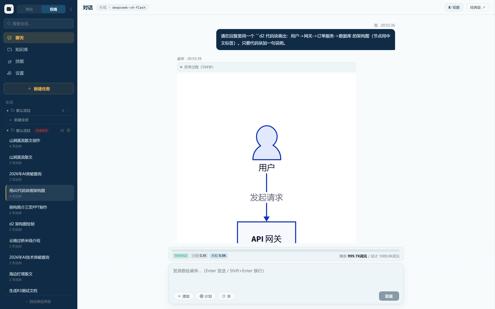

# 桌伴 Sidemate

**在你电脑上运行的 AI 办公助手——断网能用，数据不出门。**

  

[能做什么](#它能做什么) · [快速开始](#快速开始) · [技术细节](#技术细节) · [English](#english)

---

桌伴是一个装在你电脑上的 AI 助手。它能聊天、读你的资料、写文档做 PPT，还能替你上网查资料、整理文件。它和你见过的网页版 AI 有一个根本区别：**它跑在你自己的电脑上**——不用它联网也能工作，对话和文件都存在你本地，想用大模型时再接你自己选的 API。

## 它能做什么

### 聊天问答

| | |
|---|---|
| **三种工作模式** | 离线：不联网、用本地模型，坐飞机也能用 · 在线：接 DeepSeek 等大模型 API，能力更强 · 并行：本地帮你翻资料、云端负责作答 |
| **思考档位** | 在线对话可以调 AI"想多深"——高、低、关三档，快慢自己定 |
| **消息排队** | AI 还在回答时就可以把下一句排上队，答完自动发出 |

### 知识库——让 AI 读你的资料

| | |
|---|---|
| **资料问答** | 把 PDF、Word、笔记拖进去，AI 基于你的资料回答问题，检索过程全部在本机完成 |
| **知识星图** | 一张图看清所有资料之间的关系：谁和谁相似、自动分了哪些主题 |
| **智能标签** | 文档自动归类打标，找资料不用靠记忆 |
| **审计日志** | 每次检索都有记录——什么时候、查了什么、命中了哪段 |

### 做文档、做演示

| | |
|---|---|
| **Word 文档** | 输入主题，AI 写好后给你一份排版正式的 .docx（封面、标题层级、页眉页脚），离线也能做 |
| **PPT 演示** | AI 逐页设计、你在旁边实时看预览，最后下载的是**可以在 PowerPoint 里继续编辑**的原生文件，不是图片拼的 |
| **可视化报告** | 图文 HTML 报告，应用内直接预览 |
| **画图** | 流程图、架构图、ER 图——说一句"画个架构图"，AI 用 D2 语言出图，自动布局；也支持 mermaid |

### 项目——一个文件夹就是一个项目

| | |
|---|---|
| **项目即文件夹** | 指定一个文件夹当作项目：材料放根目录，AI 的产物统一收在 .sidemate/ 里，互不干扰 |
| **跨项目引用** | 写方案时可以直接引用另一个项目里的材料 |
| **项目知识库** | 给某个项目的大批材料单独建检索索引，不混进全局知识库 |

### 让 AI 自己干活

| | |
|---|---|
| **联网查资料** | AI 自己搜索、自己判断结果质量（搜出来一堆日历垃圾页会自动换关键词重搜）、自己读原文，最后附来源 |
| **并行深读** | 多份长资料同时读，最后汇总给你 |
| **写文件有确认** | AI 要写项目文件时先列一张清单，你点"同意"才落笔，写完还能撤销；越过项目边界的写入一律拒绝 |
| **调用轨迹** | AI 每一步用了什么工具、花了多久，右侧时间线看得清清楚楚 |
| **定时任务** | "每天早上九点查一下行业新闻"这类事交给它定时跑 |

### 扩展能力

| | |
|---|---|
| **技能开关** | 内置的十项能力（做 PPT、写 Word、跑代码、画图……）每一项都能单独开关，关了 AI 就彻底不会用 |
| **社区技能** | 别人写的 SKILL.md 技能文件放进 skills 目录就能用，兼容 Claude Code 社区格式 |
| **MCP 工具** | 通过 MCP 协议接入外部工具服务器，AI 能用的工具由你决定 |
| **模型自选** | 离线模型三档（0.8B/2B/4B）随时切换；在线 API 支持 OpenAI 兼容与 Anthropic 两种接口 |

### 隐私与数据

| | |
|---|---|
| **数据不出本机** | 对话、文件、知识库全部存在你的电脑上；离线模式下没有任何网络请求 |
| **在线透明** | 用在线模式时，数据只发给你自己配置的那家服务商，经过谁、用了多少 token 都有统计 |
| **私密会话** | 个别对话可以标为私密——不进任何跨会话引用和 AI 记忆 |

## 快速开始

1. 下载 [安装包](https://github.com/zwq871482439/sidemate/releases/tag/v0.10.1)（344MB），双击安装，不需要管理员权限
2. 打开桌伴，进 **设置 → 模型下载**，点"一键下载推荐方案"（按你的内存自动选档位）
3. 下载完就能用了。想用在线模式？**设置 → 在线 AI** 填入你的 API Key

**系统要求**：Windows 10/11 · 16GB 内存（离线模式；纯在线 8GB 够用）· 磁盘 10GB 起（含模型）

> 开发者：`git clone` 后运行 `python envsetup.py` 一键部署，详见 [BUILD.md](BUILD.md)。

## 文档

产品文档与使用指南在官网 Wiki：**[desk.deskware.cn/wiki](https://desk.deskware.cn/wiki/)**

---

## 技术细节

| 层 | 选型 |
|----|------|
| 推理引擎 | llama.cpp（llama-server）+ Qwen3.5 GGUF（0.8B / 2B / 4B，Q4 量化） |
| 后端 | Python 3.14（嵌入式）+ FastAPI，SSE 流式 |
| 前端 | 原生 HTML/CSS/JS，esbuild 打包，无框架 |
| 知识库 | bge-m3 向量化 + bge-reranker-v2-m3 重排序，全程本地 |
| 图表 | D2（服务端 d2.exe 出 SVG / 浏览器 D2.js WASM）+ mermaid 双渲染器 |
| 启动器 | Go（进程管理 + 看门狗 + GPU 检测） |

架构一句话：Go 启动器拉起嵌入式 Python 后端，前端经 SSE 订阅生成流；离线走 llama.cpp，在线走云 API，Agent 层统一编排工具与技能。

目录结构与开发指南见 [BUILD.md](BUILD.md)；版本历史见 [CHANGELOG.md](CHANGELOG.md)。

**协议**：Apache-2.0，第三方声明见 [THIRD-PARTY-NOTICES](THIRD-PARTY-NOTICES)。

---

## English

**Sidemate** is a local-first AI desktop assistant for Windows. It chats, reads your documents, writes Word/PPT/report files, and runs agent workflows (web search, parallel reading, confirmed file writes, scheduled tasks) — all on your machine.

- **Works offline**: local Qwen3.5 models via llama.cpp; no network required
- **Your data stays local**: conversations, files, and the knowledge base never leave your computer; online mode sends data only to the API provider you configure
- **Real document output**: natively editable PPTX (AI designs page by page with live preview), formatted DOCX, HTML reports, D2/mermaid diagrams
- **Projects are folders**: materials at root, AI artifacts in `.sidemate/`, writes gated by a confirm-first plan mode
- **Extensible**: per-capability toggles, community SKILL.md skills, MCP tool servers

**Quick start**: download the [installer](https://github.com/zwq871482439/sidemate/releases/tag/v0.10.1), install (no admin required), fetch models from the built-in download page. Requires Windows 10/11, 16GB RAM (8GB for online-only).

Docs: [desk.deskware.cn/wiki](https://desk.deskware.cn/wiki/) · License: Apache-2.0

---

**桌伴 Sidemate** · 本地优先 · Apache-2.0

[官网](https://desk.deskware.cn) · [Wiki](https://desk.deskware.cn/wiki/) · [联系](mailto:sidemate@deskware.cn)

