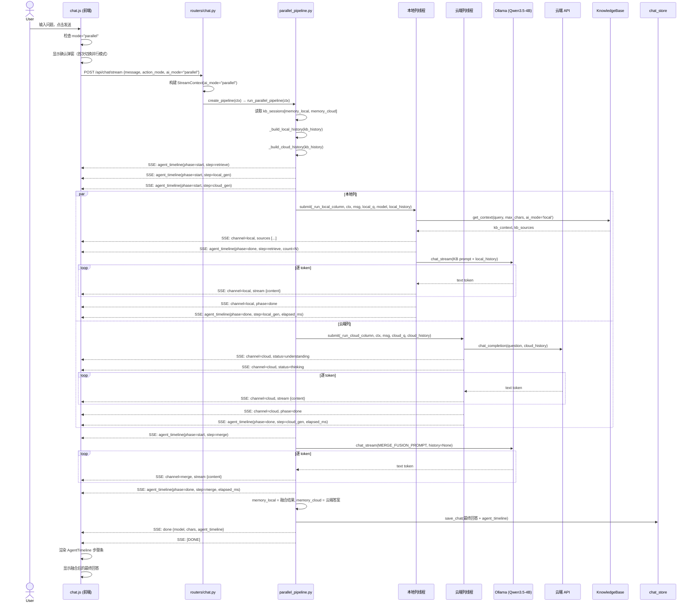
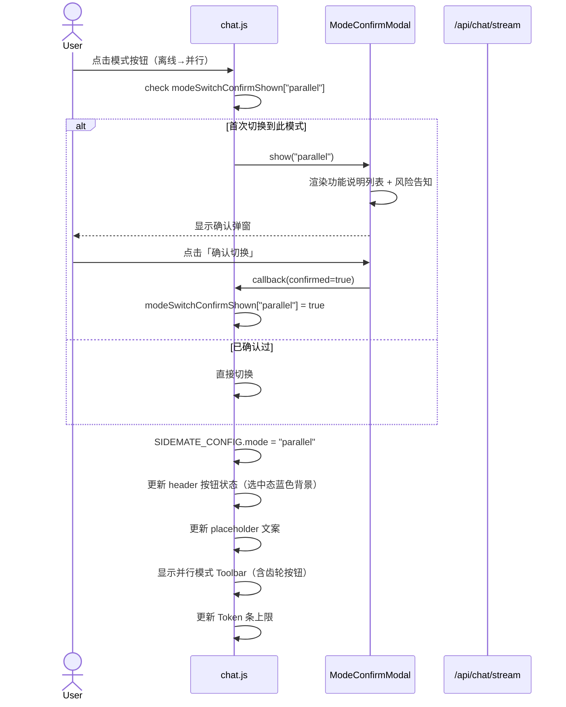
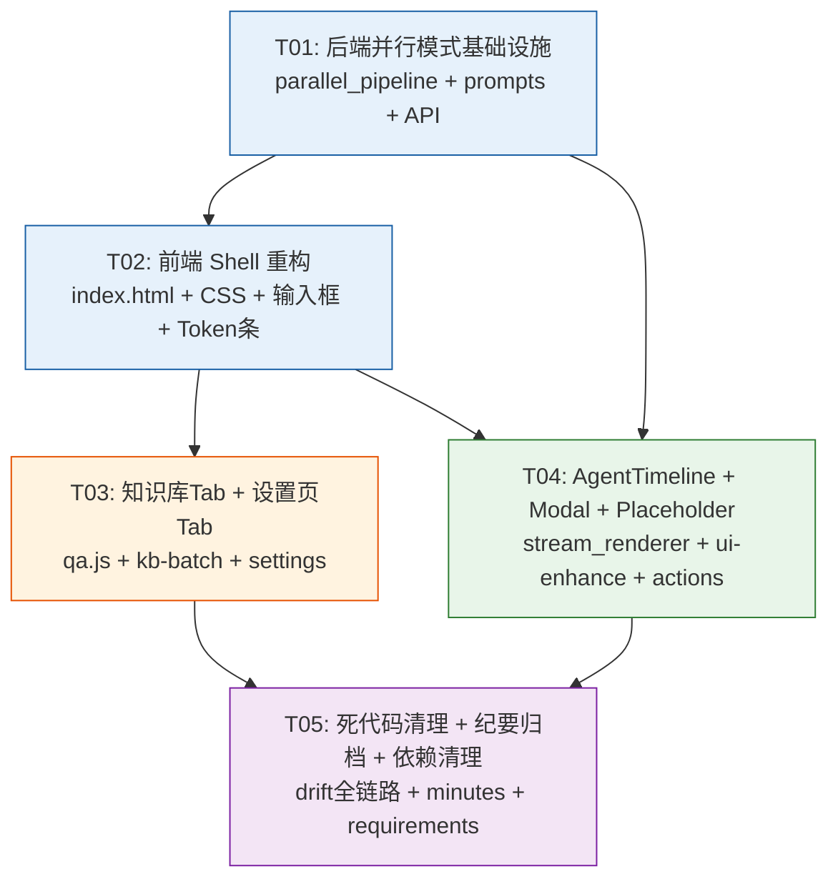

# Sidemate v0.9.6 (P6) — 系统架构设计 + 任务分解

> 架构师：Bob | 日期：2026-06-21 | 基线：v0.9.5

---

## Part A：系统设计

---

### 1. 实现方案

#### 1.1 核心技术挑战

| 挑战 | 描述 | 决策 |
|------|------|------|
| **三模式路由** | 当前 ai_mode 仅 local/cloud 两档，需新增 parallel | 扩展 StreamContext.ai_mode 支持 "parallel"，在 `pipelines/__init__.py` 新增路由分支 |
| **并行模式本地 history 注入** | compare_pipeline 本地列 `history=None` 硬编码，多轮对话上下文丢失 | 复用 `_build_cloud_history` 对称逻辑，新增 `_build_local_history`，从 `memory_local` 字段提取历史注入本地列 |
| **前端 chat.js 重构安全性** | chat.js ~1765 行，`appendStreamingMsg` 用 innerHTML 替换+手动恢复 3 种 DOM 极脆弱 | **不改核心渲染逻辑**，仅在 SSE 事件处理层新增 channel="merge" 分支和 AgentTimeline SSE 事件；输入框/Token条原地重构 |
| **AgentTimeline re-render 丢数据** | `_agentTimelineEl=null` 后重新渲染丢失历史 | P6 改为将 timeline 步骤持久化到 messages.json 的 `agent_timeline` 字段（已有机制，P4 v3.1 BUG#7 已实现收集），渲染时从消息数据恢复而非依赖内存 DOM 引用 |
| **CSS 品牌色统一** | 当前 `main.css` 多处硬编码颜色，`.btn` 重复定义 | 新增 CSS 变量 `--brand-primary: #1E3A5F`，全局替换关键硬编码颜色 |

#### 1.2 框架与库选型

**保持现有技术栈，不换框架：**

| 层 | 技术 | 版本 | 说明 |
|----|------|------|------|
| 后端框架 | FastAPI | 现有 | 不改 |
| LLM 运行时 | Ollama (Qwen3.5-4B GGUF) | 现有 | 不改 |
| 前端架构 | 传统 `<script>` 引入（非 ES Module） | 现有 | 保持，不迁移到 Vite/React |
| Markdown 渲染 | marked.js | 现有 | 保持 |
| 代码高亮 | highlight.js | 现有 | 保持 |
| 公式渲染 | KaTeX | 现有 | 保持 |
| XSS 防护 | DOMPurify | 现有 | 保持 |
| CSS 方案 | 原生 CSS + CSS 变量 | 现有 | P6 统一为 `--brand-*` 变量体系 |

**不引入新依赖**。所有 P6 需求通过修改现有代码实现。

#### 1.3 架构模式

```
┌─────────────────────────────────────────────────────┐
│                 index.html (SPA)                     │
│  ┌──────┐  ┌──────────┐  ┌────────┐  ┌──────────┐  │
│  │ Chat │  │ 知识库    │  │ 设置   │  │ (纪要×)  │  │
│  │ Tab  │  │ Tab      │  │ Tab   │  │ 已移除   │  │
│  └──┬───┘  └────┬─────┘  └───┬────┘  └──────────┘  │
│     │            │            │                      │
│  ┌──┴────────────┴────────────┴──────────────────┐  │
│  │        SSE Event Bus (EventSource)             │  │
│  │  chat.js → dispatch: token/agent_status/...    │  │
│  └──────────────────────┬────────────────────────┘  │
└─────────────────────────┼───────────────────────────┘
                          │ POST /api/chat/stream
┌─────────────────────────┼───────────────────────────┐
│              FastAPI Server                          │
│  routers/chat.py ──→ pipelines/__init__.py          │
│                          │                           │
│       ┌──────────────────┼──────────────────┐       │
│       ▼                  ▼                  ▼       │
│  local_pipeline    cloud_pipeline    parallel_pipe  │
│  (不变)            (不变)            (新增)         │
│                                                      │
│  parallel_pipeline 复用 compare_pipeline 双线程架构  │
│  新增: _build_local_history + memory_local 注入      │
└─────────────────────────────────────────────────────┘
```

---

### 2. 文件列表

> 标记： **[新]** 新增 | **[改]** 修改 | **[删]** 删除

#### 2.1 后端文件

```
server/
├── config.py                                    [改] 新增 ai_mode="parallel" 默认值、parallel_keyword_gen 开关
├── prompts.py                                   [改] 新增 PARALLEL_SYSTEM_PROMPT、PARALLEL_MERGE_PROMPT
├── pipelines/
│   ├── __init__.py                              [改] 新增 parallel 模式路由分支
│   ├── _base.py                                 [改] StreamContext 扩展: memory_local 字段
│   ├── parallel_pipeline.py                     [新] 并行模式管道（基于 compare_pipeline）
│   ├── local_pipeline.py                        [不改]
│   ├── cloud_pipeline.py                        [不改]
│   ├── compare_pipeline.py                      [不改] 保留供 KB 对比模式使用
│   └── doc_action.py                            [不改]
├── routers/
│   ├── chat.py                                  [改] SSE 端点支持 ai_mode="parallel"，移除 drift 代码
│   ├── settings_system.py                       [改] 新增 parallel_keyword_gen GET/POST API
│   ├── kb.py                                    [改] 新增标签树 API，移除 /api/kb/ask 端点
│   └── ...                                      [改] 移除纪要相关路由引用
├── intelligence/
│   └── task_classifier.py                       [改] 移除 check_topic_drift 函数
├── core/
│   └── ...                                      [改] 移除 _compress_cloud_history 等死代码
└── requirements.txt                             [改] 移除 13 个冗余包
```

#### 2.2 前端文件

```
server/
├── index.html                                   [改] 三段按钮 header、移除纪要 Tab、设置 Tab 引用
├── static/
│   ├── css/
│   │   ├── main.css                             [改] CSS 变量统一、品牌色 #1E3A5F、移除 .drift-bar/.skeleton/.btn重复定义
│   │   └── skeleton.css                         [删] P6 去骨架屏
│   └── js/
│       ├── chat.js                              [改] 新增并行模式 SSE 处理(channel=merge)、AgentTimeline 渲染、三段按钮事件
│       ├── chat-ui.js                           [改] 融合输入框、Token 条、模式选择器 UI、确认弹窗
│       ├── chat-session.js                      [改] 模式切换逻辑、并行模式 memory_local 管理
│       ├── chat-actions.js                      [改] 离线模式新增「查知识库」action
│       ├── chat-files.js                        [改] 并行模式文件引用处理
│       ├── chat-export.js                       [不改]
│       ├── qa.js                                [改] 知识库 Tab 重构为纯档案管理（标签树+卡片网格+AI概览）
│       ├── kb-batch.js                          [改] 热力图圆点替代火焰图标
│       ├── settings.js                          [改] 左侧竖排 Tab 导航布局
│       ├── token-estimator.js                   [改] 删除 estimateTotal 函数
│       ├── stream_renderer.js                   [改] 支持 AgentTimeline SSE 事件渲染
│       ├── ui-enhance.js                        [改] 模式确认弹窗、齿轮开关、Placeholder 联动
│       ├── minutes.js                           [删] 纪要模块归档移除
│       └── skeleton.js                          [删] P6 去骨架屏
```

#### 2.3 删除/清理引用文件汇总

以下文件需要删除（非单纯"移除引用"）：

| 文件 | 原因 |
|------|------|
| `static/css/skeleton.css` | P0-06 去骨架屏 |
| `static/js/skeleton.js` | P0-06 去骨架屏 |
| `static/js/minutes.js` | P2-01 纪要模块归档 |

以下文件需要删除特定代码段（非删除整个文件）：

| 文件 | 删除内容 |
|------|---------|
| `routers/chat.py` | `_compress_cloud_history` 函数、`drift_hint` 参数链路 |
| `intelligence/task_classifier.py` | `check_topic_drift` 函数 |
| `static/js/chat.js` | `topic_drift` SSE 处理、`showDriftBar`、`_refFilePath` 拆分 |
| `static/js/chat-ui.js` | `.drift-bar` DOM 操作 |
| `static/css/main.css` | `.drift-bar` 样式、`.btn` 重复定义（line 627）、`.skeleton-*` 残留 |
| `static/js/token-estimator.js` | `estimateTotal` 函数（与 `_estimateDoc` 逻辑重复） |
| `prompts.py` | 清理无引用旧 prompt（保留向后兼容别名） |

---

### 3. 数据结构和关键接口

#### 3.1 类图（Mermaid classDiagram）

```mermaid
classDiagram
    direction TB

    %% ── 上下文数据类 ──
    class StreamContext {
        +str message
        +str model_name
        +Optional~int~ max_tokens
        +str chat_file
        +List~dict~ history_raw
        +str action_mode
        +Optional~str~ file_path
        +str ai_mode
        +object mgr
        +object kb
        +str prompt
        +Optional~List~dict~~ llm_history
        +Optional~str~ context_cache
        +str model_choice
        +dict body
        +bool is_kb_compare
        +List~dict~ memory_local
        +float _pipeline_t0
    }

    class EngineResult {
        +str raw_text
        +str response_text
        +str think_content
        +bool think_folded
        +str saved_task_type
        +dict token_stats
    }

    %% ── 管道接口 ──
    class PipelineFactory {
        +create_pipeline(ctx) Generator
    }

    class LocalPipeline {
        +run_local_pipeline(ctx) Generator
    }
    class CloudPipeline {
        +run_cloud_pipeline(ctx) Generator
    }
    class ComparePipeline {
        +run_compare_pipeline(ctx) Generator
    }
    class ParallelPipeline {
        +run_parallel_pipeline(ctx) Generator
        -_run_local_column(ctx, query, q, model, local_history) void
        -_run_cloud_column(ctx, question, cloud_history, q) void
        -_build_local_history(kb_history) List
        -_build_cloud_history(kb_history) List
        -_sse_channel_event(channel, type, data) str
        -_sse_progress(step_id, status) str
    }

    %% ── 配置与 Prompt ──
    class Prompts {
        +PARALLEL_SYSTEM_PROMPT: str
        +MERGE_FUSION_PROMPT: str
        +KB_USER_PROMPT_TEMPLATE: str
        +KB_SYSTEM_PROMPT_TEMPLATE: str
        +CLOUD_KB_SYSTEM_PROMPT: str
        +get_module_info() dict
    }

    class SettingsSystemRouter {
        +GET /api/parallel/config
        +POST /api/parallel/config
        +GET /api/resource-info
    }

    class KbRouter {
        +GET /api/kb/documents
        +POST /api/kb/upload
        +DELETE /api/kb/documents/{id}
        +GET /api/kb/tags
        +POST /api/kb/tags/update
        +POST /api/kb/search
    }

    class ChatRouter {
        +POST /api/chat/stream
        +GET /api/chats
        +POST /api/chats/new
        +DELETE /api/chats/{name}
    }

    %% ── 前端核心对象 ──
    class SidemateApp {
        -str _currentMode
        -str _currentAction
        -object _agentTimelineEl
        -List _agentTimelineSteps
        +switchMode(mode) void
        +showModeConfirmModal(mode, callback) void
        +renderAgentTimeline(steps) void
        +updateTokenBar(round, history, total, limit) void
        +updatePlaceholder(mode, action) str
    }

    class ModeSelector {
        -str activeMode
        +onModeClick(mode) void
        +updateButtonStates() void
        +render() void
    }

    class AgentTimeline {
        -HTMLElement containerEl
        -List steps
        +addStep(step) void
        +updateStep(id, status) void
        +expandStep(id) void
        +renderFromHistory(timelineData) void
    }

    class TokenBar {
        -int roundTokens
        -int historyTokens
        -int totalLimit
        -str status
        +update(round, history, limit, status) void
        +render() void
    }

    class KnowledgeBaseView {
        -HTMLElement tagTreeEl
        -HTMLElement cardGridEl
        -HTMLElement overviewPanelEl
        +loadTagTree() void
        +filterByTag(tagId) void
        +renderCards(docs) void
        +showOverview() void
    }

    class SettingsView {
        -str activeTab
        +switchTab(tabId) void
        +renderGeneralTab() void
        +renderCloudTab() void
        +renderKbTab() void
        +renderPrivacyTab() void
        +renderAboutTab() void
    }

    %% ── 关系 ──
    PipelineFactory --> LocalPipeline : ai_mode="local"
    PipelineFactory --> CloudPipeline : ai_mode="cloud"
    PipelineFactory --> ComparePipeline : is_kb_compare=true
    PipelineFactory --> ParallelPipeline : ai_mode="parallel"
    PipelineFactory ..> StreamContext : 使用
    LocalPipeline ..> StreamContext : 使用
    CloudPipeline ..> StreamContext : 使用
    ParallelPipeline ..> StreamContext : 使用
    ParallelPipeline ..> Prompts : 引用
    LocalPipeline ..> Prompts : 引用
    SidemateApp *-- ModeSelector
    SidemateApp *-- AgentTimeline
    SidemateApp *-- TokenBar
    SidemateApp *-- KnowledgeBaseView
    SidemateApp *-- SettingsView
```

#### 3.2 关键 API 接口

**新增/修改的后端 API：**

| 方法 | 路径 | 说明 | 变更类型 |
|------|------|------|---------|
| POST | `/api/chat/stream` | SSE 流式对话，扩展支持 `ai_mode=parallel` | 改 |
| GET | `/api/parallel/config` | 获取并行模式配置（keyword_gen 开关） | 新 |
| POST | `/api/parallel/config` | 设置并行模式配置 | 新 |
| GET | `/api/kb/tags` | 获取标签树（含父子层级） | 新 |
| POST | `/api/kb/tags/update` | 更新文档标签 | 新 |
| POST | `/api/kb/ask` | **删除** — KB 问答迁移到 Chat Tab | 删 |

**SSE 事件类型扩展（并行模式新增）：**

```json
// 并行模式专用 channel 事件
{"type": "stream", "channel": "local", "content": "..."}
{"type": "stream", "channel": "cloud", "content": "..."}
{"type": "stream", "channel": "merge", "content": "..."}
{"type": "step",    "channel": "local", "step": "searching|organizing|generating"}
{"type": "step_done", "channel": "local", "step": "search|organize|generate"}
{"type": "status",  "channel": "cloud", "status": "understanding|thinking|generating"}
{"type": "phase",   "channel": "merge", "phase": "started|done"}
{"type": "sources", "channel": "local", "sources": [...]}
{"type": "mode_hint", "channel": "merge", "message": "..."}

// AgentTimeline 事件（前端渲染用）
{"type": "agent_timeline", "phase": "start", "step": "retrieve", "label": "本地知识库检索"}
{"type": "agent_timeline", "phase": "done",  "step": "retrieve", "elapsed_ms": 230, "count": 3}
{"type": "agent_timeline", "phase": "start", "step": "local_gen", "label": "本地AI生成回答"}
{"type": "agent_timeline", "phase": "done",  "step": "local_gen", "elapsed_ms": 1520}
{"type": "agent_timeline", "phase": "start", "step": "cloud_gen", "label": "云端AI补充"}
{"type": "agent_timeline", "phase": "done",  "step": "cloud_gen", "elapsed_ms": 2100}
{"type": "agent_timeline", "phase": "start", "step": "merge", "label": "本地自动融合优化"}
{"type": "agent_timeline", "phase": "done",  "step": "merge", "elapsed_ms": 800}

// done 事件扩展
{"type": "done", "model": "...", "chars": 1234, "time": 4.5, "task_type": "parallel",
 "agent_timeline": [{"step":"retrieve","elapsed_ms":230,...}, ...]}
```

**前端全局配置对象（新增）：**

```javascript
// SIDEMATE_CONFIG 扩展
SIDEMATE_CONFIG = {
  // 现有字段...
  mode: "offline",           // "offline" | "online" | "parallel"
  parallel_keyword_gen: false, // 并行模式齿轮开关
  parallel_action: "auto",     // 并行模式固定 "auto"（自动融合）
  modeSwitchConfirmShown: {},  // 各模式确认弹窗展示状态
};
```

---

### 4. 程序调用流程

#### 4.1 并行模式完整 SSE 流（时序图）



#### 4.2 模式切换流程



---

### 5. 待明确事项

| # | 问题 | 影响范围 | 当前假设 |
|---|------|---------|---------|
| 1 | **并行模式 actions**：当前无 actions 分类（自动融合），未来是否需支持「并行+查知识库」组合？ | `chat-actions.js`, `parallel_pipeline.py` | P6 不实现，保持 auto 融合 |
| 2 | **在线模式 API 可用性校验**：切换在线/并行模式时是否校验云端 API 配置？ | `chat.js` mode switch 逻辑 | P6 不强制校验，仅在首次发送时提示 |
| 3 | **Tag 父子层级算法**：是否在 P6 中实现 `tag_parent` 字段和自动归并？ | `kb.py`, `qa.js`, `knowledge/tags.py` | P6 仅实现前端标签树展示，`tag_parent` 归并推迟到 P7 |
| 4 | **依赖清理回归范围**：13 个 pip 包移除后回归测试范围？ | `requirements.txt` | 仅针对核心流程（三种模式发消息 + KB 上传检索）做冒烟测试 |
| 5 | **Live Trace 持久化方案**：AgentTimeline 步骤数据用 SQLite 还是 JSON？ | `chat_store.py`, `chat.js` | P6 复用现有 messages.json 的 `agent_timeline` 字段（JSON），不引入 SQLite |
| 6 | **render_html 安全边界**：云端生成的 HTML 服务端预清洗还是仅依赖 CSP？ | `stream_renderer.js`, `index.html` | P6 前端沙箱 iframe + CSP 策略，不做服务端清洗 |
| 7 | **并行模式多轮对话 reformulation**：默认本地 4B 改写，开关开启时云端拆解 3-5 个关键词 | `parallel_pipeline.py`, `core/reformulate.py` | 默认关闭（不启用云端关键词），P6 仅实现开关 UI |

---

## Part B：任务分解

---

### 6. 依赖包列表

**无需新增**第三方包。P6 仅清理冗余依赖：

```
# 删除（13 个冗余包）
- jieba
- rank_bm25
- av
- onnxruntime
- mdurl
- markdown_it
- mdit_py_plugins
- jiter
- click
- typer
- shellingham
- websockets
- httptools
- watchfiles
- rich
- pygments
- google

# 保留（间接依赖）
- ctranslate2
- faiss-cpu
- scipy
- scikit-learn
- huggingface_hub
```

---

### 7. 任务列表（有序，按依赖排列）

#### T01：后端并行模式基础设施

| 属性 | 值 |
|------|-----|
| **Task ID** | T01 |
| **Task Name** | 后端并行模式基础设施 |
| **优先级** | P0 |
| **依赖** | 无 |

**源文件：**

| 操作 | 文件 | 说明 |
|------|------|------|
| 新 | `server/pipelines/parallel_pipeline.py` | 基于 `compare_pipeline.py` 创建，新增 `_build_local_history`、`memory_local` 历史注入到本地列 |
| 改 | `server/pipelines/__init__.py` | `create_pipeline()` 新增 `ai_mode=="parallel"` 分支，路由到 `run_parallel_pipeline` |
| 改 | `server/pipelines/_base.py` | `StreamContext` 新增 `memory_local: List[dict]` 字段 |
| 改 | `server/prompts.py` | 新增 `PARALLEL_SYSTEM_PROMPT`（并行模式本地列 prompt，强调"综合本地知识库和云端补充"） |
| 改 | `server/routers/chat.py` | SSE 端点 `api_chat_stream` 支持 body 传入 `ai_mode="parallel"` |
| 改 | `server/routers/settings_system.py` | 新增 `GET/POST /api/parallel/config` 端点，管理 `parallel_keyword_gen` 开关 |

**详细实现说明：**

1. **parallel_pipeline.py 核心修改点**（相对 compare_pipeline.py）：
   - 新增 `_build_local_history(kb_history)` → 从 `memory_local` 字段提取本地列历史
   - 修改 `_run_local_column` 签名：`kb_history` → `local_history`，传入 `se.run(history=local_history)`（当前硬编码 `history=None`）
   - 并行本地列不再从 `_kb_sessions` 读写，改用 Chat Tab 的 `history_raw` 中的 `memory_local` 字段
   - 融合后双线记忆回写到 assistant 消息的 `memory_local` 和 `memory_cloud` 字段
   - 新增 `agent_timeline` SSE 事件发射

2. **prompts.py 新增内容**：
```python
PARALLEL_SYSTEM_PROMPT = (
    "你正在并行处理模式中生成回答。"
    "你的回答将和云端AI的回答进行融合。"
    "严格基于知识库内容回答，不编造。"
)
```

3. **chat.py SSE 端点修改**：
   - `_ai_mode` 取值从 `_cfg_get("ai_mode", "local")` 改为优先读 `body.get("ai_mode")` 再 fallback 到 config
   - `StreamContext` 构造时传入 `ai_mode` 为 body 中的实际值

---

#### T02：前端 Shell 重构（header + CSS + 输入框 + Token 条）

| 属性 | 值 |
|------|-----|
| **Task ID** | T02 |
| **Task Name** | 前端 Shell 重构 |
| **优先级** | P0 |
| **依赖** | T01（需确保后端 API 就绪后再联调） |

**源文件：**

| 操作 | 文件 | 说明 |
|------|------|------|
| 改 | `server/index.html` | header 三段按钮（离线/在线/并行）替换旧 modeTag 下拉；移除纪要 Tab；引用统一后的 CSS/JS |
| 改 | `server/static/css/main.css` | 品牌色统一 `--brand-primary: #1E3A5F`；移除 `.btn` 重复定义(line 627)；移除 `.drift-bar`/`.skeleton-*` 样式；新增 `.mode-btn`/`.mode-btn.active`/`.token-bar`/`.input-fused` 样式 |
| 删 | `server/static/css/skeleton.css` | P0-06 去骨架屏 |
| 改 | `server/static/js/chat-ui.js` | 融合输入框（+ 附件按钮 + textarea + 发送按钮同容器）、Token 条（本轮+历史=总计/上限·状态）、三段按钮 UI 状态管理 |
| 改 | `server/static/js/chat.js` | `appendStreamingMsg` 新增 channel="merge" 分支；SSE 事件处理新增 `agent_timeline` 类型；模式切换 `switchMode()` 函数 |
| 删 | `server/static/js/skeleton.js` | P0-06 去骨架屏 |

**详细实现说明：**

1. **CSS 变量体系重构**：
```css
:root {
  --brand-primary: #1E3A5F;
  --brand-primary-light: #E6F1FB;
  --brand-primary-text: #185FA5;
  --brand-gradient-start: #EEEDFE;
  --brand-gradient-end: #F5EBE0;
  /* 保留原有变量，仅新增/覆盖品牌色相关 */
}
```

2. **三段按钮 HTML 结构（index.html header 内）**：
```html
<div class="mode-segment">
  <button class="mode-btn active" data-mode="offline">离线</button>
  <button class="mode-btn" data-mode="online">在线</button>
  <button class="mode-btn" data-mode="parallel">并行</button>
</div>
```

3. **融合输入框结构**：
```html
<div class="input-fused">
  <button class="input-attach-btn" title="上传附件">+</button>
  <textarea placeholder="输入消息..." rows="1"></textarea>
  <button class="input-send-btn">发送</button>
</div>
<div class="token-bar">
  本轮 1.2K + 历史 7.7K = 8.9K / 16K · 正常
</div>
```

4. **chat.js 不重构核心渲染**：保持现有 appendStreamingMsg 逻辑，仅新增 SSE 事件分发 case：
```javascript
case "stream":
  if (data.channel === "merge") {
    appendStreamingMsg(data.content, "merge");
  } else if (data.channel === "local") {
    appendStreamingMsg(data.content, "local");
  } // ... 其他 channel
  break;
case "agent_timeline":
  updateAgentTimeline(data);
  break;
```

---

#### T03：知识库 Tab 改造 + 设置页 Tab 化

| 属性 | 值 |
|------|-----|
| **Task ID** | T03 |
| **Task Name** | 知识库 Tab 改造 + 设置页 Tab 化 |
| **优先级** | P0 / P1 |
| **依赖** | T02（需要 CSS 变量体系和新布局） |

**源文件：**

| 操作 | 文件 | 说明 |
|------|------|------|
| 改 | `server/static/js/qa.js` | 重构为纯档案管理：左侧标签树（父子缩进）+ 右侧卡片网格 + AI 概览面板 + 搜索文件名 |
| 改 | `server/static/js/kb-batch.js` | 热力图三色圆点（冷灰/暖橙/热红）替代火焰图标 |
| 改 | `server/static/js/settings.js` | 左侧竖排 Tab 导航（常规/云端AI/知识库/隐私安全/关于）；常规 Tab 含系统资源占用+数据目录+反馈渠道 |
| 改 | `server/routers/kb.py` | 新增 `GET /api/kb/tags` 标签树 API；移除 `POST /api/kb/ask` KB 问答端点 |
| 改 | `server/index.html` | 设置页容器改为左右布局（竖排Tab + 内容区）；知识库 Tab 容器改为标签树+卡片网格布局 |

**详细实现说明：**

1. **KB Tab 移除对话功能**：
   - 删除 `qa.js` 中的 `sendKbMessage`、`renderKbChat` 等对话函数
   - 保留 `uploadDocument`、`deleteDocument`、`batchTag`、`diagnose`、`reset` 功能
   - 新增 `renderTagTree()`（父子缩进 `padding-left: 22px`）、`renderCardGrid()`（grid 自适应 195px 列）
   - 新增 `renderAIOverview()`（紫色渐变面板）

2. **标签树 API**：
```python
@router.get("/api/kb/tags")
def api_kb_tags():
    """返回标签树结构"""
    # 从 kb 获取所有标签，按父子关系构建树
    return {
        "tags": [
            {"id": "all", "name": "全部", "count": 12, "children": []},
            {"id": "tcm", "name": "中医", "count": 5, "children": [
                {"id": "tcm_basic", "name": "中医基础", "count": 3},
                {"id": "tcm_health", "name": "中医养生", "count": 2},
            ]},
            # ...
        ]
    }
```

3. **设置页 Tab 化**：
   - 保留现有 settings.js 中五个内容面板的渲染逻辑
   - 新增 `switchSettingsTab(tabId)` 函数
   - 左侧竖排 Tab 使用 CSS `flex-direction: column`

---

#### T04：AgentTimeline + 模式确认弹窗 + Placeholder + 齿轮开关

| 属性 | 值 |
|------|-----|
| **Task ID** | T04 |
| **Task Name** | AgentTimeline + 模式确认弹窗 + Placeholder + 齿轮开关 |
| **优先级** | P0 / P1 |
| **依赖** | T01, T02（需要后端并行管道 SSE 事件 + 前端 Shell） |

**源文件：**

| 操作 | 文件 | 说明 |
|------|------|------|
| 改 | `server/static/js/stream_renderer.js` | 新增 `renderAgentTimeline(steps)` 函数，渲染三步状态条（圆点+步骤名+耗时+展开详情） |
| 改 | `server/static/js/ui-enhance.js` | 新增 `showModeConfirmModal(mode, callback)` 弹窗；新增齿轮开关 `toggleKeywordGen()` |
| 改 | `server/static/js/chat-actions.js` | 离线模式新增「查知识库」action 按钮；placeholder 文案按模式+action 六组联动 |
| 改 | `server/static/js/chat-files.js` | 并行模式文件引用处理（仅本地列使用 KB 内容） |
| 改 | `server/static/js/token-estimator.js` | 删除 `estimateTotal` 函数（与 `_estimateDoc` 逻辑重复） |
| 改 | `server/static/js/chat.js` | AgentTimeline `_handleAgentSummary` 后不从 null 恢复 DOM 引用；改为从 `agent_timeline` 数据重建 |

**详细实现说明：**

1. **AgentTimeline 渲染**（stream_renderer.js）：
```javascript
function renderAgentTimeline(steps) {
  // 三步：检索 → 生成 → 融合
  // 每步：状态圆点(ok绿/run紫脉冲/wait灰) + 步骤名 + 耗时(ms)
  // 支持 click 展开查看详情
  const container = document.getElementById('agentTimeline');
  if (!container) return;
  
  let html = '<div class="timeline-steps">';
  for (const step of steps) {
    const dotClass = step.phase === 'done' ? 'dot-ok' : 
                     step.phase === 'start' ? 'dot-run' : 'dot-wait';
    const elapsed = step.elapsed_ms ? ` ${(step.elapsed_ms/1000).toFixed(1)}s` : '';
    html += `<div class="timeline-step" data-step="${step.step}">
      <span class="timeline-dot ${dotClass}"></span>
      <span class="timeline-label">${step.label}</span>
      <span class="timeline-time">${elapsed}</span>
    </div>`;
  }
  html += '</div>';
  container.innerHTML = html;
}
```

2. **AgentTimeline DOM 引用修复**（chat.js）：
   - `_handleAgentSummary` 执行后不再设置 `_agentTimelineEl = null`
   - 渲染时从 `messages.json` 的 `agent_timeline` 字段恢复
   - SSE 实时步骤通过 `_agentTimelineSteps` 数组累积，done 事件后持久化

3. **模式确认弹窗**（ui-enhance.js）：
```javascript
function showModeConfirmModal(mode, onConfirm) {
  const configs = {
    offline: { title: '离线模式', features: [...], risks: null },
    online:  { title: '在线模式', features: [...], risks: '问题会发送到云端' },
    parallel: { title: '并行模式', features: [...], 
                risk: '问题会同时发送到云端AI，但KB文档不出机器' }
  };
  // 渲染 Modal → 用户确认 → onConfirm()
}
```

---

#### T05：死代码清理 + 纪要归档 + 依赖清理 + 最终集成

| 属性 | 值 |
|------|-----|
| **Task ID** | T05 |
| **Task Name** | 死代码清理 + 纪要归档 + 依赖清理 + 最终集成 |
| **优先级** | P2 |
| **依赖** | T01, T02, T03, T04（所有功能就绪后再清理） |

**源文件：**

| 操作 | 文件 | 说明 |
|------|------|------|
| 改 | `server/routers/chat.py` | 删除 `_compress_cloud_history` 函数（line ~929）；删除 `drift_hint` 参数链路 |
| 改 | `server/intelligence/task_classifier.py` | 删除 `check_topic_drift` 函数（line ~174） |
| 改 | `server/pipelines/_base.py` | `StreamContext` 删除 `drift_hint`、`drift_result` 字段；删除 `_refFilePath` 拆分 |
| 改 | `server/pipelines/local_pipeline.py` | 删除 drift 检测注释/残留代码 |
| 改 | `server/pipelines/cloud_pipeline.py` | 删除 `drift_hint=""` 传递残留 |
| 改 | `server/pipelines/doc_action.py` | 删除 `drift_hint` 参数 |
| 改 | `server/static/js/chat.js` | 删除 `topic_drift` SSE 事件处理、`showDriftBar` 函数、`_refFilePath` 改为 `_kbRefDocId`/`_uploadedFileName` |
| 改 | `server/static/js/chat-ui.js` | 删除 `.drift-bar` DOM 操作代码 |
| 改 | `server/static/css/main.css` | 删除 `.drift-bar` 样式（确认已在 T02 移除） |
| 删 | `server/static/js/minutes.js` | 纪要模块全量归档移除 |
| 改 | `server/index.html` | 移除纪要 Tab 按钮（确认已在 T02 移除）；移除 `minutes.js` 引用 |
| 改 | `server/requirements.txt` | 移除 13 个冗余 pip 包 |

**详细实现说明：**

1. **drift 全链路清理范围**（~30 文件）：
   - 后端搜索关键词：`drift_hint`、`check_topic_drift`、`drift_result`、`_compress_cloud_history`
   - 前端搜索关键词：`topic_drift`、`showDriftBar`、`drift-bar`、`driftHint`
   - 每个文件用全局搜索确认后精确删除

2. **纪要模块归档**：
   - 删除 `static/js/minutes.js`
   - `index.html` 移除 `<script src="...minutes.js">` 和纪要 Tab 按钮
   - 后端 `/api/minutes/*` 路由保留但标记 deprecated（不影响其他功能）

3. **依赖清理验证**：
   - pip 包移除后运行 `pip check` 验证无 broken dependencies
   - 核心流程冒烟测试：三种模式各发一条消息 + KB 上传一篇文档并检索

---

### 8. 共享知识（跨文件约定）

```
━━━━━━━━━━━━━━━━━━━━━━━━━━━━━━━━━━━━━━━━━━━━━━━━━━
  跨文件约定（Engineer 实施时需遵守）
━━━━━━━━━━━━━━━━━━━━━━━━━━━━━━━━━━━━━━━━━━━━━━━━━━

【AI 模式枚举】
  "offline" — 离线模式（仅本地 Ollama，走 local_pipeline）
  "online"  — 在线模式（仅云端 API，走 cloud_pipeline）
  "parallel" — 并行模式（双轨，走 parallel_pipeline）

  注意：前端用 "offline/online/parallel"，后端 StreamContext.ai_mode 也用这三个值。
  后端 config.py 的 ai_mode 默认值仍是 "local"，但前端不再从 config 读取模式，
  而是由用户通过三段按钮选择，前端把 ai_mode 放在 POST body 中传给后端。

【SSE channel 枚举】
  "local"  — 本地列 token/source/step
  "cloud"  — 云端列 token/status
  "merge"  — 融合列 token/mode_hint
  "progress" — 进度步骤

【双线记忆存储】
  assistant 消息新增字段：
    "memory_local": str  — 融合后的最终结果，供下一轮本地列历史
    "memory_cloud": str  — 云端原始答案，供下一轮云端列历史
    "agent_timeline": [  — 并行模式步骤数据（供前端回放）
      {"step": "retrieve", "elapsed_ms": 230, "count": 3},
      {"step": "local_gen", "elapsed_ms": 1520},
      {"step": "cloud_gen", "elapsed_ms": 2100},
      {"step": "merge", "elapsed_ms": 800}
    ]

  在 history_raw 中：
  - 本地列从每个 assistant 消息取 memory_local（兜底 content）
  - 云端列从每个 assistant 消息取 memory_cloud（兜底 content）

【CSS 变量约定】
  --brand-primary: #1E3A5F      品牌主色（header 背景、主按钮）
  --brand-primary-light: #E6F1FB  品牌淡色（选中态背景）
  --brand-primary-text: #185FA5   品牌文字色（链接、选中文字）
  --brand-gradient-start: #EEEDFE  AI 概览面板渐变起点
  --brand-gradient-end: #F5EBE0    AI 概览面板渐变终点
  --text-primary, --text-secondary, --text-muted  保持原有

【JS 全局约定】
  所有新函数挂载在 window 对象上（传统 script 模式）
  模式状态存储在 SIDEMATE_CONFIG.mode
  并行模式开关存储在 SIDEMATE_CONFIG.parallel_keyword_gen
  AgentTimeline 数据持久化到 messages.json 的 agent_timeline 字段

【错误处理约定】
  并行模式：本地列出错 → 云端列继续；云端列出错 → 本地列继续
  融合阶段：任一方为空 → 直接展示有结果的一方 + mode_hint 提示
  超时：本地 60s，云端 30s（与 compare_pipeline 一致）

【API 响应格式】
  保持现有：{"type": "event_type", ...其他字段}
  并行模式 done 事件新增字段：agent_timeline
  新增 /api/parallel/config 响应格式：{"keyword_gen": true/false}
```

---

### 9. 任务依赖图



**图例**：🔵 P0 必须 | 🟠 P0/P1 混合 | 🟢 P1 | 🟣 P2

**建议实施顺序**：T01 → T02 → T03 + T04（可并行）→ T05

---

*本文档为 P6 系统架构设计 + 任务分解，Architect (Bob) 产出。*
