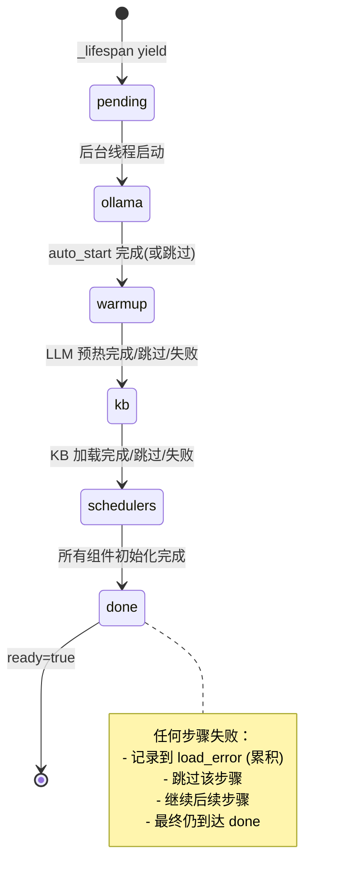
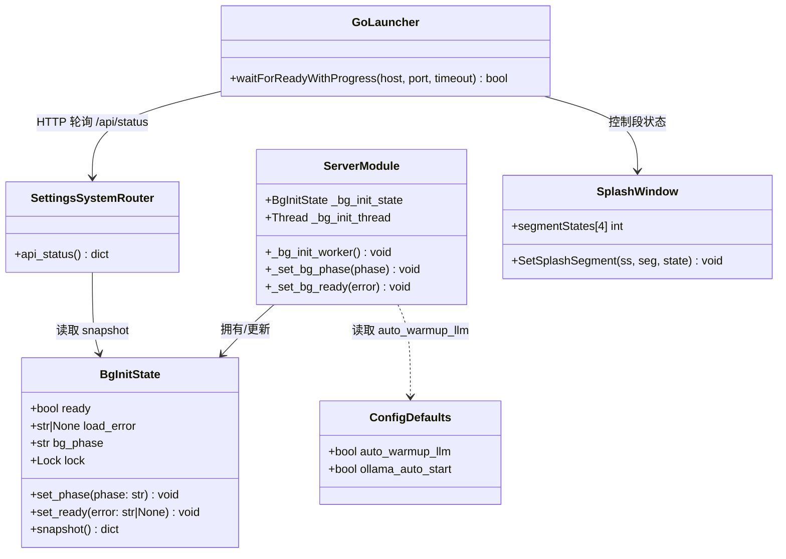
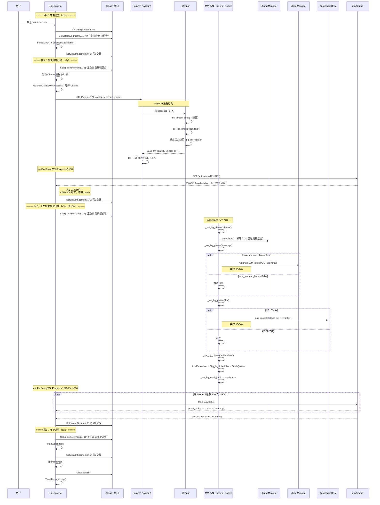
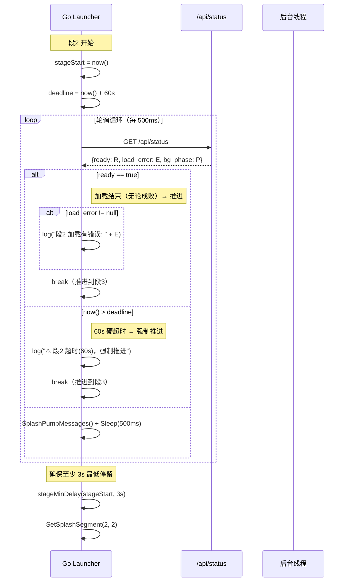
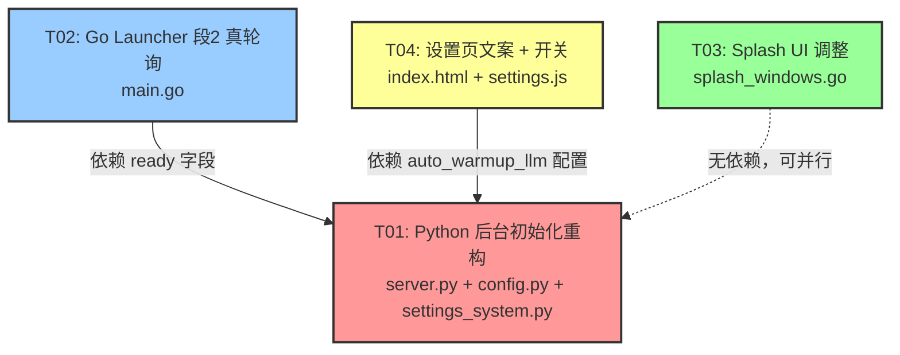

# 架构设计 — 启动流程重构 + Splash UI 调整 + 设置页模型管理改造

| 字段 | 内容 |
|------|------|
| 项目 | 桌伴 Sidemate（本地 AI 办公助手） |
| 版本 | v0.9.5 增量改造 |
| 日期 | 2025-07 |
| 作者 | 高见远（架构师） |
| 输入 | PRD-STARTUP-REFACTOR.md（许清楚） |
| 状态 | 待评审 |

---

## 目录

- [Part A：系统设计](#part-a系统设计)
  - [1. 实现方案 + 框架选型](#1-实现方案--框架选型)
  - [2. PM 四问答复](#2-pm-四问答复)
  - [3. 文件列表及改动说明](#3-文件列表及改动说明)
  - [4. 数据结构和接口](#4-数据结构和接口)
  - [5. 程序调用流程](#5-程序调用流程)
  - [6. 待明确事项](#6-待明确事项)
- [Part B：任务分解](#part-b任务分解)
  - [7. 所需依赖](#7-所需依赖)
  - [8. 任务列表](#8-任务列表)
  - [9. 共享知识](#9-共享知识)
  - [10. 任务依赖图](#10-任务依赖图)

---

## Part A：系统设计

### 1. 实现方案 + 框架选型

#### 1.1 核心技术挑战

当前启动流程的体感割裂根源在于 **FastAPI `_lifespan` 在 HTTP 监听前同步跑完了所有重活**，导致段1（基础服务就绪）卡 10–15 秒，而段2（模型引擎加载）只做一个无意义的 3 秒假停留。

本次改造的核心挑战有三个：

| 挑战 | 描述 | 难度 |
|------|------|------|
| **C1：消除 _lifespan 同步阻塞** | 将 auto_start + warmup + KB 加载 + Scheduler + BatchQueue 从 yield 前移到 yield 后的后台线程，同时保证这些组件在 yield 后仍能被 HTTP handler 正常引用 | ★★★★ |
| **C2：段2 轮询机制** | Go Launcher 段2 需要轮询 `/api/status` 的 `ready` 字段判断是否推进，需要 Python 侧后台线程暴露加载状态机 | ★★★ |
| **C3：并发安全** | 后台加载线程与 HTTP 请求线程并发访问 mgr/kb 等全局对象，需保证线程安全（这些对象本身已有锁，但 ready/load_error 状态需要线程安全的状态机） | ★★☆ |

#### 1.2 方案选型：后台初始化线程 + 内存状态机

**为什么不用 FastAPI BackgroundTask / asyncio.create_task？**

`_lifespan` 是 async 上下文管理器，其内的代码运行在事件循环主线程。模型预热（httpx.post）、KB 加载（sentence_transformers）都是 CPU/GPU 密集的同步阻塞操作。如果用 `asyncio.create_task`，它们仍会阻塞事件循环——HTTP 请求在加载期间无法响应，完全违背"段1 秒级就绪"的目标。

如果用 `asyncio.to_thread` / `run_in_executor`，需要把所有重逻辑包成 async，侵入性大，且 KB 加载（PyTorch 模型加载）在 executor 线程中可能有线程绑定问题（PyTorch CUDA context）。

**最终方案：Python `threading.Thread` 后台线程 + 模块级全局状态字典。**

理由：
1. 当前代码已有大量 `threading.Thread(daemon=True)` 用法（warmup、BatchQueue worker、TaggingScheduler），团队熟悉。
2. KB 加载、OllamaManager 内部已有线程安全机制（锁/httpx），放在独立线程中不需要额外改造。
3. 模块级全局字典 `_bg_init_state` 用 `threading.Lock` 保护，简单可靠，`/api/status` 直接读取。

#### 1.3 架构模式

不改变现有架构（Go Launcher + FastAPI + Ollama），只做**生命周期重构**：

```
改造前：
  _lifespan { auto_start → warmup → KB → Scheduler → BatchQueue → yield }
  HTTP 监听在 yield 后才开始 → 段1 卡 10-15s

改造后：
  _lifespan { 线程池初始化 → yield(立即) → HTTP 监听秒级就绪 }
  _lifespan yield 后的协程中 → threading.Thread 启动后台重活
  后台线程 { auto_start → warmup → KB → Scheduler → BatchQueue → 更新状态机 }
  /api/status 读取状态机 → 暴露 ready / load_error / bg_phase
  Go Launcher 段2 轮询 /api/status.ready → ready=true 推进到段3
```

#### 1.4 框架/库变更

**无新增第三方依赖**。全部使用 Python 标准库 `threading` + 现有 `httpx`。

---

### 2. PM 四问答复

#### Q1：`ready` 字段如何区分"加载中"与"加载结束但失败"？

**确认 PM 方案：拆为 `ready:bool` + `load_error:str|null`。**

补充完整设计：

```json
// /api/status 新增字段（与现有字段同级）
{
  "version": "0.9.5",
  "ready": false,           // false = 后台加载仍在进行中
  "load_error": null,       // null = 无错误；非空字符串 = 失败原因
  "bg_phase": "kb_loading", // 调试用：当前后台阶段（init/ollama/warmup/kb/schedulers/done/failed）
  // ...现有字段（模型 loaded 等）不变...
}
```

状态机规则：
- 初始：`ready=false, load_error=null, bg_phase="pending"`
- 后台线程开始：`bg_phase` 依次变化为 `ollama → warmup → kb → schedulers → done`
- 成功结束：`ready=true, load_error=null, bg_phase="done"`
- 任意步骤失败：**跳过该步骤**（记录到 `load_error`），继续后续步骤，最终 `ready=true, bg_phase="done"`，`load_error` 含失败原因
- 段2 Launcher 只看 `ready==true` 即推进，`load_error` 非空时记日志但不阻塞

> **关键决策**：即使某一步失败，`ready` 最终也会置 `true`。因为"加载流程结束了"（无论成败）就是段2 推进的信号。`load_error` 只是给前端做非阻塞提示用。这完全符合 P0-2"失败不阻止启动"。

#### Q2：段2 等待上限是多少？

**确认 PM 建议：60 秒硬超时。**

Go 侧实现细节：
- `waitForReadyWithProgress()`：轮询 `/api/status`，每 500ms 一次，最多 120 次（60s）
- 超时后强制推进到段3，并在日志记录 `[Launcher] ⚠ 段2 超时(60s)，强制推进`
- 超时不视为致命错误，不记 `load_error`（Python 侧的超时由后台线程自行处理）

> 60s 足够覆盖慢机器场景（KB bge-m3 + reranker 通常 15-30s，LLM 预热 10-20s，合计 <50s）。如果真超时，大概率是系统卡死，强制推进比无限等待更好。

#### Q3：Ollama 去重——Go 侧已起 Ollama，Python auto_start 是否保留？

**策略：保留 auto_start 调用，但它在 Go 已启动 Ollama 时会秒级返回 `already_running`，不会重复拉进程。**

分析：
- Go Launcher `main.go` L777-782 在段1 启动 `ollama serve` 进程（作为子进程管理）
- Python `ollama_manager.auto_start()` → `start()` → `is_healthy()` 先做 HTTP 健康检查（`GET /api/tags`）
- 如果 Go 已起 Ollama，`is_healthy()` 返回 `True`，`start()` 直接返回 `{"status": "already_running"}`，**不会拉新进程**

**结论**：后台线程仍调 `auto_start()`，但加上 `if _cfg_get("ollama_auto_start", True)` 守卫（保留现有配置开关）。它本质是一个幂等检查——有则跳过，无则兜底启动（覆盖 Go 启动失败的场景）。

**不需要额外去重逻辑**——现有 `is_healthy()` 已经是去重机制。

#### Q4：`auto_warmup_llm=false` 时，`ready` 何时置 true？

**确认 PM 理解：**
- `auto_warmup_llm=false`：跳过 LLM 预热步骤
- KB 已安装：`ready` 等 KB 模型加载完后置 `true`
- KB 未安装：`ready` **立即**置 `true`（因为"没有需要等待的加载任务"）

后台线程伪逻辑：
```python
# 步骤1：Ollama 检查（幂等）
auto_start()  # 已在运行则秒返回

# 步骤2：LLM 预热（受 auto_warmup_llm 控制）
if _cfg_get("auto_warmup_llm", True):
    do_warmup()
else:
    log.info("auto_warmup_llm=False，跳过 LLM 预热")

# 步骤3：KB 加载（不受 auto_warmup_llm 控制，看是否安装）
if _kb_installed:
    kb.load_models()

# 步骤4：Scheduler + BatchQueue（与现状一致）
init_schedulers()
init_batch_queue()

# 所有步骤完成 → ready=true
set_ready()
```

---

### 3. 文件列表及改动说明

| # | 文件路径 | 改动类型 | 改动说明 |
|---|---------|---------|---------|
| 1 | `server/server.py` | 重构 | `_lifespan` 重活移到后台线程；新增 `_bg_init_state` 状态机 + `_bg_init_worker()` 线程函数 |
| 2 | `server/routers/settings_system.py` | 修改 | `/api/status` 新增 `ready` / `load_error` / `bg_phase` 三个顶层字段 |
| 3 | `server/config.py` | 修改 | `DEFAULTS` 新增 `"auto_warmup_llm": True` |
| 4 | `launcher/main.go` | 修改 | 段2 改为真轮询 `/api/status.ready`（60s 超时）；段1 进度逻辑微调（不再读 startup_progress.json） |
| 5 | `launcher/splash_windows.go` | 修改 | 版本行拆两行；`baseStepStartY` 增大（进度条下移） |
| 6 | `server/index.html` | 修改 | 模型管理卡片下方新增 `auto_warmup_llm` 开关行 |
| 7 | `server/static/js/settings.js` | 修改 | 6 处按钮文案替换 + 新增 `auto_warmup_llm` 开关读写逻辑 |

---

### 4. 数据结构和接口

#### 4.1 `/api/status` 新增字段 JSON Schema

```
GET /api/status

Response (增量字段，与现有字段同级):
{
  "version": "0.9.5",          // 现有
  "ready": true,               // 【新增】bool — 后台加载流程是否结束（无论成败）
  "load_error": null,          // 【新增】str|null — 加载过程中的错误描述，无错误为 null
  "bg_phase": "done",          // 【新增】str — 调试用，当前后台阶段
                               //   值域: "pending"|"ollama"|"warmup"|"kb"|"schedulers"|"done"
  ...现有字段（模型 loaded 等）不变...
}
```

#### 4.2 `auto_warmup_llm` 配置项

```python
# config.py DEFAULTS 新增
"auto_warmup_llm": True,   # 启动时是否自动加载（预热）LLM 模型
```

- 类型：`bool`
- 默认值：`True`
- 存储位置：`data/settings.json`
- 读取方式：`config.get("auto_warmup_llm", True)`
- 前端绑定：设置页模型管理卡片下方开关

#### 4.3 后台初始化状态机（Python 侧）

```python
# server.py 模块级全局
_bg_init_state = {
    "ready": False,
    "load_error": None,
    "bg_phase": "pending",  # pending→ollama→warmup→kb→schedulers→done
}
_bg_init_lock = threading.Lock()
_bg_init_thread = None
```

状态转移图：



#### 4.4 类图（数据结构与接口关系）



---

### 5. 程序调用流程

#### 5.1 启动全流程时序图（改造后）



#### 5.2 段2 轮询与超时处理流程



---

### 6. 待明确事项

| # | 问题 | 当前假设 | 影响 |
|---|------|---------|------|
| 1 | 后台线程失败后，前端 web 页面如何感知并提示？ | 架构建议：前端启动后轮询 `/api/status`，若 `load_error` 非空，在对话页顶部或设置页资源面板显示非阻塞 banner | 需前端额外开发，本 PRD 标注为"前端非阻塞提示"但未指定具体 UI 位置 |
| 2 | 段1 的 `startup_progress.json` 进度文件机制是否移除？ | 架构建议：保留但不依赖。段1 改为只看 HTTP 200 就绪，不再读进度文件映射进度（进度文件是旧阻塞架构的产物） | Go 侧 `waitForServerWithProgress` 简化为纯 HTTP 轮询 + 时间线性 fallback |
| 3 | `baseStepStartY` 增大到多少像素？ | PRD 要求"上下留白对称"。窗口高度 baseH=320，标题栏 baseTitleH=42，Logo 区域约 logoY(42+28) + logoBox(68) = 138px，版本行+分隔线约 40px = 178px。当前 baseStepStartY=200。建议改为 **230**（下移 30px），使"进度条底→窗口底"≈"标题栏底→Logo 顶"≈70px | 需实测微调 |

---

## Part B：任务分解

### 7. 所需依赖

**无新增第三方包。** 全部基于现有技术栈：
- Go 标准库（net/http, encoding/json, time）— Launcher 侧
- Python 标准库（threading）+ 现有 httpx — Server 侧
- 原生 JS（fetch）— 前端侧

---

### 8. 任务列表

#### T01：Python 后台初始化重构（server.py + config.py + settings_system.py）

**依赖**：无
**优先级**：P0
**源文件**：
- `server/server.py`（L180-315 _lifespan 重构 + 新增 _bg_init_state / _bg_init_worker）
- `server/config.py`（L106 附近新增 `auto_warmup_llm`）
- `server/routers/settings_system.py`（L133-142 api_status 新增字段）

**改动详情**：

**① `server/config.py` L106 附近**（`"ollama_auto_start": True,` 之后）新增：
```python
"auto_warmup_llm": True,           # 启动时是否自动加载（预热）LLM 模型
```

**② `server/server.py` — 新增模块级状态机**（在 `_lifespan_entered = False` 之后，即 L178 之后）：
```python
import threading as _threading

_bg_init_state = {
    "ready": False,
    "load_error": None,
    "bg_phase": "pending",  # pending→ollama→warmup→kb→schedulers→done
}
_bg_init_lock = _threading.Lock()
_bg_init_thread = None

def _set_bg_phase(phase: str):
    """更新后台初始化阶段（线程安全）"""
    with _bg_init_lock:
        _bg_init_state["bg_phase"] = phase
    log.info("[STARTUP] 后台阶段: %s" % phase)

def _set_bg_ready(error: str = None):
    """标记后台初始化完成（线程安全）"""
    with _bg_init_lock:
        _bg_init_state["ready"] = True
        if error:
            existing = _bg_init_state.get("load_error")
            _bg_init_state["load_error"] = (existing + "; " + error) if existing else error
    log.info("[STARTUP] 后台初始化完成 (ready=true, error=%s)" % (_bg_init_state.get("load_error")))

def _add_bg_error(error: str):
    """累积后台初始化错误（不结束流程，继续后续步骤）"""
    with _bg_init_lock:
        existing = _bg_init_state.get("load_error")
        _bg_init_state["load_error"] = (existing + "; " + error) if existing else error
```

**③ `server/server.py` — 新增后台线程函数 `_bg_init_worker`**（紧接上面的状态机代码之后）：

将当前 `_lifespan` 中 L202-313 的重活**整体搬迁**到这个函数中，改造要点：
- `auto_start()` 仍保留（幂等检查），但包在 `try/except` 中，失败调 `_add_bg_error()` 而非中断
- 模型预热逻辑用 `if _cfg_get("auto_warmup_llm", True):` 包裹
- 每个步骤前后调 `_set_bg_phase()`
- 最后调 `_set_bg_ready()`

```python
def _bg_init_worker():
    """后台初始化线程：在 HTTP 监听后执行所有重活"""
    try:
        _set_bg_phase("ollama")
        if _cfg_get("ollama_auto_start", True):
            try:
                result = ollama_manager.auto_start()
                if result.get("status") in ("started", "already_running"):
                    log.info("[BG-INIT] Ollama 就绪: %s" % result.get("status"))
                else:
                    _add_bg_error("Ollama 启动失败: %s" % result.get("error", "unknown"))
            except Exception as e:
                _add_bg_error("Ollama 异常: %s" % str(e)[:100])

        _set_bg_phase("warmup")
        if _cfg_get("auto_warmup_llm", True):
            _warmup_model = mgr._get_default_llm()
            if _warmup_model:
                try:
                    # [此处搬迁现有 L213-248 的预热逻辑，含 httpx.post]
                    # ... 预热代码 ...
                    pass  # 占位，实际搬迁预热代码
                except Exception as e:
                    _add_bg_error("模型预热失败: %s" % str(e)[:120])
            else:
                log.info("[BG-INIT] 无可用 LLM 模型，跳过预热")
        else:
            log.info("[BG-INIT] auto_warmup_llm=False，跳过 LLM 预热")

        _set_bg_phase("kb")
        try:
            if _kb_installed and not kb._embedder_loaded:
                kb.load_models()
                log.info("[BG-INIT] KB 模型加载完成")
        except Exception as e:
            _add_bg_error("KB 加载失败: %s" % str(e)[:100])

        _set_bg_phase("schedulers")
        try:
            global _llm_scheduler
            from core.llm_scheduler import LLMScheduler
            _llm_scheduler = LLMScheduler()
            log.info("[BG-INIT] LLMScheduler 已初始化")
        except Exception as e:
            _add_bg_error("LLMScheduler 失败: %s" % str(e)[:100])

        if _kb_installed:
            try:
                global _tagging_scheduler
                from core.tagging_scheduler import TaggingScheduler
                _tagging_scheduler = TaggingScheduler(kb, mgr)
                _tagging_scheduler.start()
                kb._tagging_scheduler = _tagging_scheduler
                log.info("[BG-INIT] TaggingScheduler 已启动")
            except Exception as e:
                _add_bg_error("TaggingScheduler 失败: %s" % str(e)[:100])

            try:
                global _batch_queue
                from core.batch_queue import BatchQueue
                _bq_db_path = _cfg_get("batch_queue_db_path", "") or None
                _batch_queue = BatchQueue(db_path=_bq_db_path, data_dir=DATA_DIR)
                recovered = _batch_queue.recover_pending()
                if recovered > 0:
                    log.info("[BG-INIT] BatchQueue 断点恢复: %d 个任务" % recovered)
                _batch_queue.start_worker(kb)
                if _tagging_scheduler and hasattr(_tagging_scheduler, 'set_batch_queue'):
                    _tagging_scheduler.set_batch_queue(_batch_queue)
                log.info("[BG-INIT] BatchQueue worker 已启动")
            except Exception as e:
                _add_bg_error("BatchQueue 失败: %s" % str(e)[:120])

    except Exception as e:
        _add_bg_error("后台初始化未捕获异常: %s" % str(e)[:200])
    finally:
        _set_bg_ready()
        _report_startup("ready", 85, "后台初始化完成")
```

**④ `server/server.py` — 重构 `_lifespan`**（L180-315）：

改造前的 `_lifespan` 包含全部重活（L202-313），改造后只保留轻量初始化 + 启动后台线程：

```python
@asynccontextmanager
async def _lifespan(app):
    global _lifespan_entered, _bg_init_thread
    if _lifespan_entered:
        yield
        return
    _lifespan_entered = True

    log.info("[STARTUP] _lifespan 开始（轻量模式，重活移入后台线程）")

    # 初始化线程池（轻量，保留在同步路径）
    try:
        from core.thread_pool import init_thread_pool
        init_thread_pool()
        log.info("[STARTUP] 全局线程池已初始化")
    except Exception as e:
        log.warning("[STARTUP] 线程池初始化失败: %s" % str(e)[:100])

    # 启动后台初始化线程
    _bg_init_thread = _threading.Thread(target=_bg_init_worker, daemon=True)
    _bg_init_thread.start()
    log.info("[STARTUP] 后台初始化线程已启动")

    _report_startup("ready", 85, "HTTP 已就绪，后台加载中...")

    yield  # ← HTTP 立即监听，段1 秒级就绪

    # ===== shutdown 逻辑保持不变 =====
    if _batch_queue is not None:
        try:
            _batch_queue.stop_worker()
            _batch_queue.close()
        except Exception:
            pass
    if _tagging_scheduler:
        try:
            _tagging_scheduler.stop()
        except Exception:
            pass
    try:
        ollama_manager.stop()
    except Exception:
        pass
    try:
        from core.thread_pool import shutdown_thread_pool
        shutdown_thread_pool(wait=False)
    except Exception:
        pass
```

**⑤ `server/routers/settings_system.py` L133-142 — `api_status` 新增字段**：

```python
@router.get("/api/status")
def api_status():
    """模型状态 + 后台初始化状态"""
    from server import FULL_VERSION
    mgr = get_mgr()
    s = mgr.status()
    result = {"version": FULL_VERSION}
    for name, info in s.items():
        result[name] = info

    # 【新增】后台初始化状态
    try:
        import server as _svr
        with _svr._bg_init_lock:
            result["ready"] = _svr._bg_init_state["ready"]
            result["load_error"] = _svr._bg_init_state["load_error"]
            result["bg_phase"] = _svr._bg_init_state["bg_phase"]
    except Exception:
        result["ready"] = True  # fallback：读取失败时默认 ready
        result["load_error"] = None
        result["bg_phase"] = "unknown"

    return result
```

---

#### T02：Go Launcher 段2 真轮询改造（main.go）

**依赖**：T01（需要 `/api/status` 返回 `ready` 字段）
**优先级**：P0
**源文件**：
- `launcher/main.go`（L1073-1084 段2 改造 + L948-1018 段1 进度简化）

**改动详情**：

**① 段1 进度简化**（`waitForServerWithProgress` 函数 L948-1018）：

当前逻辑读 `startup_progress.json` 映射进度。改造后段1 不再依赖进度文件（因为 `_lifespan` 不再写进度），但**保留 fallback**：

在 `waitForServerWithProgress` 中，将进度文件读取改为可选（如果读不到就用时间线性 fallback）。关键修改点：
- L976-990：当 `fileProgress < 0` 时（读不到进度文件）的时间线性 fallback 已存在，**保持不变**即可（改造后 Python 不写进度文件，自动 fallback 到线性）
- **无需改代码**，因为 Python 侧 `_lifespan` yield 后后台线程调用 `_report_startup("ready", 85, ...)` 仍会写一次进度文件，Go 侧仍能读到

**② 新增 `waitForReadyWithProgress` 函数**（在 L1077 之前，`waitForServerWithProgress` 之后新增）：

```go
// waitForReadyWithProgress 轮询 /api/status 的 ready 字段
// 返回 true=ready，false=超时
func waitForReadyWithProgress(host string, port int, timeout time.Duration) (bool, string) {
	url := fmt.Sprintf("http://%s:%d/api/status", host, port)
	deadline := time.Now().Add(timeout)

	for time.Now().Before(deadline) {
		SplashPumpMessages()
		resp, err := http.Get(url)
		if err == nil && resp.StatusCode == 200 {
			body, _ := io.ReadAll(io.LimitReader(resp.Body, 8192))
			resp.Body.Close()

			// 解析 JSON，检查 ready 字段
			var status struct {
				Ready     bool   `json:"ready"`
				LoadError string `json:"load_error"`
				BgPhase   string `json:"bg_phase"`
			}
			if json.Unmarshal(body, &status) == nil {
				if status.Ready {
					return true, status.LoadError
				}
			}
		}
		if resp != nil {
			resp.Body.Close()
		}
		time.Sleep(500 * time.Millisecond)
	}
	return false, "" // 超时
}
```

**③ 段2 改造**（替换 L1077-1084）：

改造前：
```go
// ---- 段 2：正在加载模型引擎（至少 3s）----
SetSplashSegment(splash, 2, 1)
SetSplashSegmentText(splash, "正在加载模型引擎")
stageStart = time.Now()
stageMinDelay(stageStart, 3*time.Second)
SetSplashSegment(splash, 2, 2)
```

改造后：
```go
// ---- 段 2：正在加载模型引擎（真轮询 /api/status.ready，至少 3s，最多 60s）----
SetSplashSegment(splash, 2, 1)
SetSplashSegmentText(splash, "正在加载模型引擎")
stageStart = time.Now()

// 真轮询后台加载状态（60s 超时）
ready, loadError := waitForReadyWithProgress("127.0.0.1", cfg.ServerPort, 60*time.Second)
if ready {
	elapsed := time.Since(stageStart).Seconds()
	log.Printf("[Launcher] ✅ 模型引擎就绪 (%.1fs)", elapsed)
	if loadError != "" {
		log.Printf("[Launcher] ⚠ 模型引擎加载有错误（不阻塞）: %s", loadError)
	}
} else {
	log.Println("[Launcher] ⚠ 段2 超时(60s)，强制推进")
}
// 确保至少 3s 最低停留
stageMinDelay(stageStart, 3*time.Second)
SetSplashSegment(splash, 2, 2)
```

---

#### T03：Splash UI 调整（splash_windows.go）

**依赖**：无（可与 T01/T02 并行）
**优先级**：P0（版本行拆两行）/ P1（进度条下移）
**源文件**：
- `launcher/splash_windows.go`（L25 baseStepStartY + L495-499 版本行 + L609 进度条区域）

**改动详情**：

**① 版本行拆两行**（替换 L495-499）：

改造前：
```go
// --- 版本行 ---
verY := logoY + sLogoBox + 18*dpi/96
verFontSize := 16 * dpi / 96
verText := "桌伴 · Sidemate · " + ss.version
splashDrawTextEx(hdc, verText, verFontSize, 0, verY, sW, verFontSize+8*dpi/96, splashColorTitleBG, true)
```

改造后：
```go
// --- 版本行（拆两行）---
verY := logoY + sLogoBox + 14*dpi/96 // 与 Logo 拉开间距（略缩小，因为两行更高）
verFontSize := 16 * dpi / 96
// 第一行：产品名
splashDrawTextEx(hdc, "桌伴 Sidemate", verFontSize, 0, verY, sW, verFontSize+8*dpi/96, splashColorTitleBG, true)
// 第二行：版本号
verY2 := verY + verFontSize + 4*dpi/96
splashDrawTextEx(hdc, ss.version, verFontSize, 0, verY2, sW, verFontSize+8*dpi/96, splashColorSubtitle, true)
```

**② 进度条下移**（L25 常量修改）：

```go
// 改造前
baseStepStartY = 200

// 改造后（下移 30px，使上下留白更对称）
baseStepStartY = 230
```

> 注意：`baseStepStartY` 通过 `splashInitDPI()` 中的 `scale()` 函数自动 DPI 缩放到 `sStepStartY`。只改基准值即可。

**③ 分隔线位置适配**（L502，因为版本行从 1 行变 2 行，分隔线需下移）：

改造前：
```go
sepY := verY + verFontSize + 20*dpi/96
```

改造后（多了第二行版本号的高度）：
```go
sepY := verY2 + verFontSize + 16*dpi/96 // verY2 = 第二行版本号 Y 坐标
```

> 如果 verY2 在作用域外不可见，直接计算：`sepY := verY + (verFontSize+4)*2 + 12*dpi/96`

---

#### T04：设置页按钮文案 + 自动加载开关（index.html + settings.js）

**依赖**：T01（需要 `auto_warmup_llm` 配置项存在）
**优先级**：P0（按钮改名）/ P1（开关）
**源文件**：
- `server/static/js/settings.js`（L243/251/263/269/306/334/350 共 7 处文案 + 新增开关逻辑）
- `server/index.html`（L632 模型管理卡片下方新增开关行）

**改动详情**：

**① settings.js 按钮文案替换**（7 处精确行号）：

| 行号 | 改造前 | 改造后 |
|------|--------|--------|
| L243 | `btn.textContent = '卸载模型';` | `btn.textContent = '取消加载';` |
| L251 | `btn.textContent = '预热模型';` | `btn.textContent = '加载模型';` |
| L263 | `btn.textContent = '预热中...';` | `btn.textContent = '加载中...';` |
| L269 | `btn.textContent = '预热模型';` | `btn.textContent = '加载模型';` |
| L306 | `btn.textContent = '预热模型';` | `btn.textContent = '加载模型';` |
| L334 | `'确定卸载当前模型？卸载后需要重新预热才能使用对话功能。'` | `'确定取消加载当前模型？取消加载后需要重新加载才能使用对话功能。'` |
| L350 | `btn.textContent = '卸载模型';` | `btn.textContent = '取消加载';` |

L334 还需改确认弹窗标题和按钮：
- `'卸载模型'`（标题）→ `'取消加载'`
- `confirmLabel: '卸载'` → `confirmLabel: '确认'`

**② settings.js 新增 `auto_warmup_llm` 开关读写逻辑**（在文件末尾或 `handleUnload` 之后新增）：

```javascript
// ===== 启动时自动加载模型开关 =====
async function loadAutoWarmupSetting() {
  try {
    var resp = await fetch(_apiBase + '/api/config');
    var data = await resp.json();
    var chk = document.getElementById('autoWarmupChk');
    if (chk && data.config) {
      chk.checked = data.config.auto_warmup_llm !== false; // 默认 true
    }
  } catch(e) {}
}

async function saveAutoWarmup(checked) {
  try {
    await fetch(_apiBase + '/api/config', {
      method: 'POST',
      headers: {'Content-Type': 'application/json'},
      body: JSON.stringify({auto_warmup_llm: checked})
    });
    if (typeof showToast === 'function') {
      showToast(checked ? '已开启自动加载' : '已关闭自动加载', 'success');
    }
  } catch(e) {
    if (typeof showToast === 'function') showToast('保存失败', 'error');
  }
}
```

并在 `refreshStatus()` 函数末尾或页面初始化时调用 `loadAutoWarmupSetting()`。

**③ index.html 新增开关行**（在 L632 `</div>` 即 `modelManageContent` 关闭标签之后，`<pre id="statusText">` 之前插入）：

```html
<!-- 启动时自动加载模型开关 -->
<div style="margin-top:10px;padding-top:10px;border-top:1px solid var(--border-color)">
  <label style="display:flex;align-items:center;gap:8px;font-size:13px;cursor:pointer;color:var(--text-primary)">
    <input type="checkbox" id="autoWarmupChk" onchange="saveAutoWarmup(this.checked)" style="width:15px;height:15px">
    启动时自动加载模型（推荐）
  </label>
  <div style="font-size:12px;color:var(--text-muted);margin-top:4px;padding-left:23px">勾选后启动器会在启动阶段自动加载 LLM，省去首次问答的等待</div>
</div>
```

---

### 9. 共享知识

以下约定跨文件生效，寇豆码在实现时需全局遵守：

#### 9.1 段切条件（Go ↔ Python 契约）

| 段 | 推进条件 | 数据来源 | 超时 |
|----|---------|---------|------|
| 段0 | GPU 检测完成（Go 本地） | 无外部依赖 | 无 |
| 段1 | `GET /api/status` 返回 HTTP 200 | FastAPI HTTP 监听 | 60s（3 次重试） |
| 段2 | `GET /api/status` 返回 `ready==true` | Python 后台线程状态机 | 60s（强制推进） |
| 段3 | Watchdog 启动完成（Go 本地） | 无外部依赖 | 无 |

> **关键约定**：段1 只看 HTTP 200，**不等 `ready`**。段2 才等 `ready`。这是"段1 秒级就绪"的基石。

#### 9.2 `ready` 字段语义（Python ↔ Go ↔ 前端 三方契约）

- `ready=false`：后台加载**仍在进行中**，Go 段2 继续轮询，前端可显示"模型加载中"
- `ready=true` + `load_error=null`：加载**全部成功**，一切正常
- `ready=true` + `load_error="xxx"`：加载流程**已结束但部分失败**，Go 段2 推进（记日志），前端应显示非阻塞错误提示
- `ready` 一旦置 `true` **不会回退**（不是"模型是否在内存"的实时状态，而是"启动加载流程是否结束"的一次性信号）

#### 9.3 后台线程异常不崩溃主服务

- `_bg_init_worker` 内所有步骤都用 `try/except` 包裹
- 任何单步失败只调 `_add_bg_error()`，不 `raise`，不 `sys.exit`
- 最外层有 `finally: _set_bg_ready()` 保证 `ready` 最终一定变 `true`
- 即使后台线程整个崩溃，Go 段2 的 60s 超时兜底也会强制推进

#### 9.4 `auto_warmup_llm` 与 `ollama_auto_start` 的区别

| 配置项 | 控制范围 | 默认值 | 备注 |
|--------|---------|--------|------|
| `ollama_auto_start` | 是否启动 Ollama **进程** | True | 进程级开关，Go 已起则 Python 幂等跳过 |
| `auto_warmup_llm` | 是否预热 **LLM 模型**到显存 | True | 模型级开关，关闭时跳过预热但 Ollama 进程仍启动 |

> 两个配置独立。用户关 `auto_warmup_llm` 只是不预热 LLM，不影响 Ollama 进程启动和 KB 加载。

#### 9.5 进度条段位映射

- 段0 → 0%~25%（环境检查）
- 段1 → 25%~50%（基础服务就绪）
- 段2 → 50%~75%（模型引擎加载）
- 段3 → 75%~100%（守护进程）

`SetSplashSegment(ss, seg, 2)` 触发段变绿，对应进度条该段填满。

#### 9.6 Splash 尺寸常量参考（splash_windows.go）

| 常量 | 改造前 | 改造后 | 说明 |
|------|--------|--------|------|
| `baseH` | 320 | 320（不变） | 窗口高度 |
| `baseTitleH` | 42 | 42（不变） | 标题栏高度 |
| `baseStepStartY` | 200 | **230** | 进度条区域起点（下移） |
| `baseLogoBox` | 68 | 68（不变） | Logo 背景框尺寸 |

---

### 10. 任务依赖图



**执行顺序建议**：
1. **T01 优先**（核心改动，其他任务都依赖它产出的接口）
2. T01 完成后，T02 和 T04 可并行
3. T03 随时可做（纯 UI，无功能依赖）
