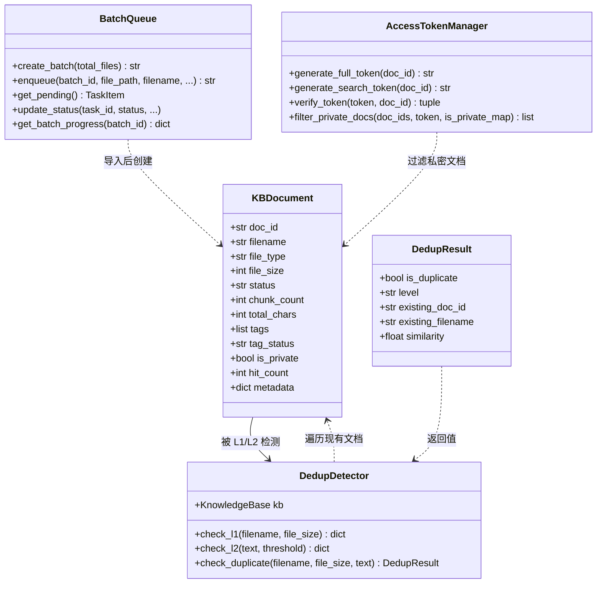
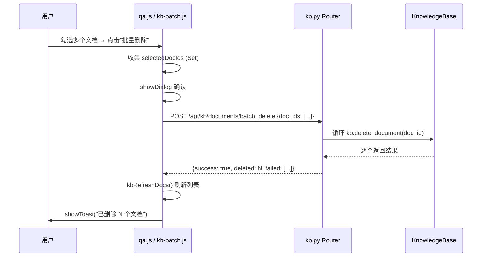
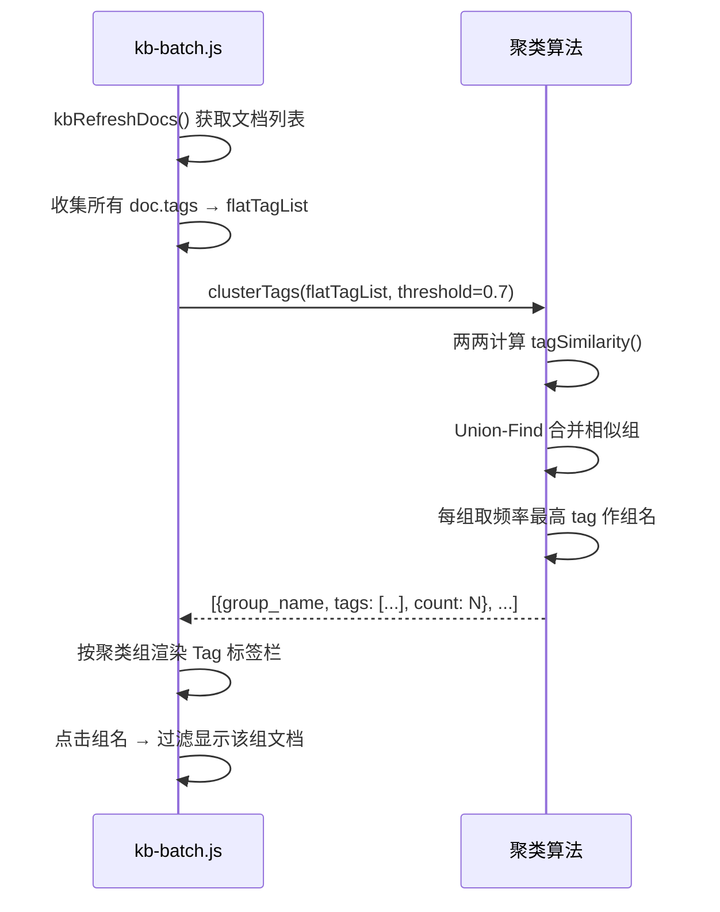
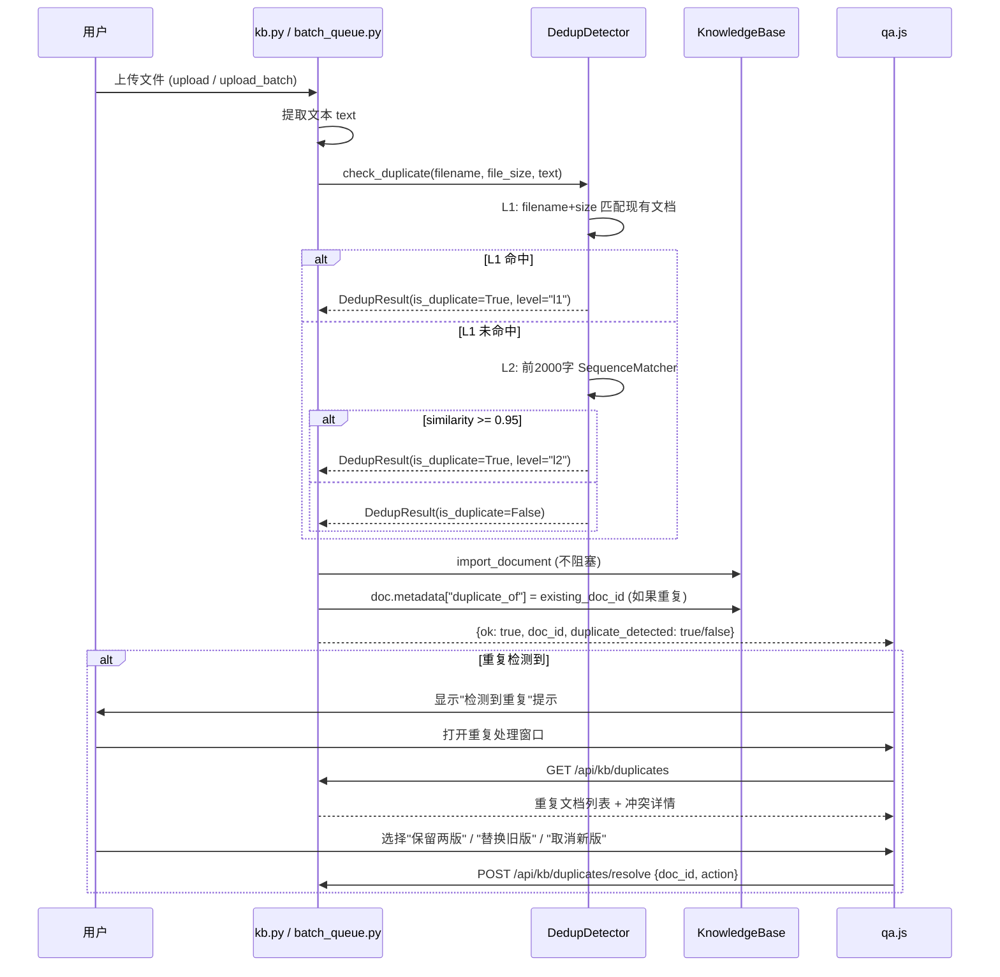
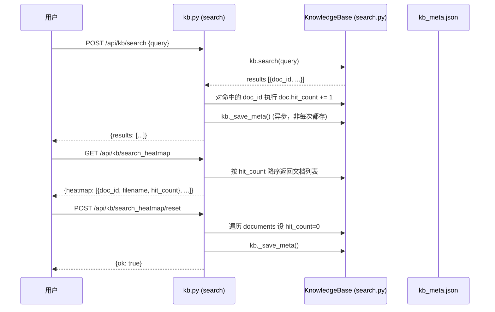
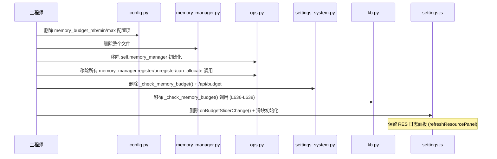
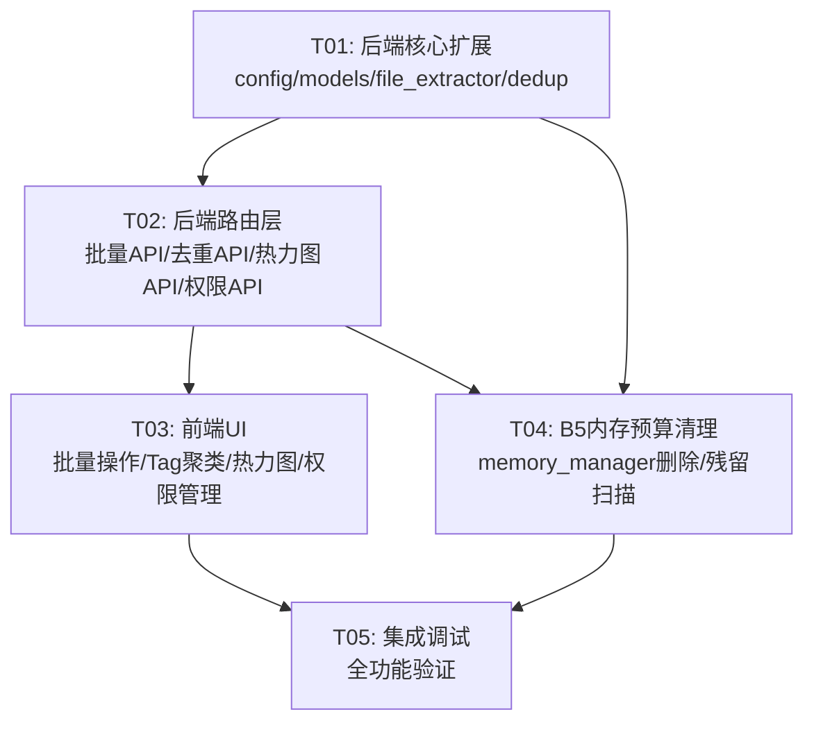

# 桌伴 Patch5 批次 B — 系统架构设计 + 任务分解

> **架构师**: 高见远  
> **日期**: 2026-06-20  
> **范围**: B1 批量操作UI + Tag聚类 + 热力图 / B2 文件类型扩展 + 扩展包改造 / B3 权限系统UI + 私密文档UI / B4 去重检测 / B5 内存预算移除

---

## Part A: 系统设计

### 1. 实现方案

#### B1: 批量操作 UI + Tag 聚类 + 检索热力图

**核心挑战**: 前端纯 JS 实现（非 React），需在不引入框架的前提下实现 checkbox 全选/反选、批量操作、Tag 模糊聚类、热力图展示。

**技术方案**:

| 子功能 | 方案 | 说明 |
|--------|------|------|
| 文档列表 checkbox | 前端原生 JS | 每个文档项加 `<input type="checkbox">`，维护 `Set<doc_id>` 选中集合；全选/反选按钮操作集合 |
| 批量删除 | 新增后端 API `DELETE /api/kb/documents/batch` | 接收 `doc_ids[]`，循环调用现有 `kb.delete_document()`，返回逐个结果 |
| 批量重新打标 | 新增后端 API `POST /api/kb/documents/batch_retag` | 循环设置 `tag_status=pending` + `enqueue` 打标调度器 |
| 批量设置私密 | 扩展现有 `POST /api/kb/documents/{doc_id}/privacy` → 新增批量版 | 循环设置 `is_private` + `_save_meta()` |
| Tag 前端聚类 | 纯前端 JS，**编辑距离 + token Jaccard 混合算法** | 见下方详细算法 |
| 检索热力图 | 后端 SQLite 存 `hit_count`，前端显示 🔥 + 重置按钮 | hit_count 存 `kb_meta.json` 的 `documents[].hit_count` 字段（复用现有持久化） |

**Tag 聚类算法（前端 JS 实现）**:

```javascript
// 算法：编辑距离归一化相似度 + token Jaccard 混合
// 1. 收集所有文档的所有 tags → 扁平化数组
// 2. 两两计算相似度：
//    - 短 tag（≤6字符）：Levenshtein 距离归一化 = 1 - dist/maxLen
//    - 长 tag（>6字符）：token Jaccard（按2-gram分词后交集/并集）
// 3. 相似度 > 0.7 → 归为同一组（并查集 Union-Find）
// 4. 每组取频率最高的 tag 作为组名（display name）
// 5. 前端按组折叠显示，组名后标注 "(N)" 表示合并数

function tagSimilarity(a, b) {
  a = a.toLowerCase().trim();
  b = b.toLowerCase().trim();
  if (a === b) return 1.0;
  if (a.length <= 6 || b.length <= 6) {
    // 编辑距离归一化
    var dist = levenshtein(a, b);
    return 1 - dist / Math.max(a.length, b.length);
  }
  // 2-gram Jaccard
  var ga = bigrams(a), gb = bigrams(b);
  var inter = 0;
  for (var i = 0; i < ga.length; i++) {
    if (gb.indexOf(ga[i]) >= 0) inter++;
  }
  var union = ga.length + gb.length - inter;
  return union > 0 ? inter / union : 0;
}
```

**设计决策 — hit_count 存储位置**: 存 `kb_meta.json`（在 `KBDocument` 上新增 `hit_count: int = 0` 字段）。

理由：
1. hit_count 是文档级元数据，跟 `chunk_count`、`total_chars` 同级
2. 复用现有 `_save_meta()` 持久化机制，无需新建表
3. 重置热力图 = 遍历 documents 设 `hit_count=0` + `_save_meta()`
4. 不会高频写入（每次检索命中 +1，但只在 `_save_meta` 时落盘）

#### B2: 文件类型扩展 + 扩展包改造

**核心挑战**: 新增 4 种文件格式解析（epub/html/srt/rtf），且扩展包结构需去掉 wheels 目录。

**技术方案**:

| 格式 | 解析库 | 说明 |
|------|--------|------|
| `.epub` | `ebooklib` + `beautifulsoup4` | ebooklib 读取章节 → bs4 去 HTML 标签提纯文本 |
| `.html` | `beautifulsoup4`（已有依赖） | bs4 解析 → 提取 `<p>`/`<div>`/`<table>` 文本 |
| `.srt` | 纯文本正则解析（无第三方库） | 正则去掉序号 + 时间轴 → 保留字幕文本 |
| `.rtf` | `striprtf` | 轻量库，RTF → 纯文本 |

**改造点（3 处文件解析入口）**:
1. `files/file_extractor.py` → `extract_text()` 函数（聊天附件注入用）
2. `routers/kb.py` → `_extract_upload_text()` 函数（文库单文件上传用）
3. `core/batch_queue.py` → `_extract_file_text()` 函数（文库批量上传用）

> **关键约定**: 三处解析逻辑保持一致。建议抽取为公共函数 `files.file_extractor.extract_text_by_ext()`，三处统一调用。

**扩展包改造**:
- 移除 `kb.py` 安装逻辑中的 `wheels/` 目录处理（L519-L538）
- 移除 `kb.py` 卸载逻辑中的 `wheels_dir` 清理（L611-L614）
- `_SUPPORTED_EXTENSIONS` 常量扩展（`batch_queue.py` L72）
- `upload_batch` 的格式检查扩展（`kb.py` L1291）

#### B3: 权限系统 UI + 私密文档 UI

**核心挑战**: 前端需实现预设 + 高级展开的交互模式，且复用现有 2 层权限（会话上下文 + KB 权限）。

**技术方案**:

权限系统分三层：
1. **后端权限引擎**: 已有（批次 A 的 `access_token.py` + `search.py` 的 `accessible_doc_ids` 过滤），无需改动
2. **设置页权限管理卡片**: 新增前端 UI — 3 预设 + 高级展开
3. **文档列表 🔒 标记**: 文档项加锁图标 + 批量设私密

**3 个权限预设**:

| 预设 | 说明 | 对应配置 |
|------|------|----------|
| 完全信任 | 所有工具可用，联网/文件操作不需确认 | `confirm_external_read: False`, `sandbox_cleanup: "never"` |
| 谨慎模式 | 联网需确认，文件操作需确认，私密文档默认隔离 | `confirm_external_read: True`, `sandbox_cleanup: "24h"` |
| 纯离线 | 禁止联网，仅本地操作 | `confirm_external_read: True`, 联网工具 toggle off |

**高级展开**: 每个工具单独 toggle（联网搜索、文件读写、代码执行、文库检索等），映射到 `config.py` 的 `confirm_external_read` + 各工具的 enabled 标志。

> **设计决策**: 权限预设不新增数据结构，复用 `settings.json` 的现有配置项。预设 = 一组配置值的快捷设置。高级展开 = 直接修改单个配置项。

**文档列表 🔒 标记**: 在 `qa.js` 的 `kbRefreshDocs()` 渲染循环中，检查 `d.is_private` → 显示 🔒 图标。批量设置私密复用 B1 的 checkbox 选择机制。

#### B4: 去重检测

**核心挑战**: 导入时不阻塞主流程，检测到重复后放入"待处理队列"，需复用 A2 SQLite 队列。

**技术方案**:

两层检测策略：

| 层级 | 检测条件 | 实现 |
|------|----------|------|
| L1 快速检测 | filename 完全相同 + file_size 相同（字节级） | 纯 Python，O(N) 遍历现有 documents |
| L2 内容检测 | 前 2000 字相似度 ≥ 95% | difflib.SequenceMatcher（Python 标准库，无需第三方） |

**流程**:
1. 导入时（`upload` / `upload_batch`），文本提取后、`import_document` 前，调用 `check_duplicate()`
2. L1 检测：遍历 `kb.documents`，匹配 filename+size
3. L2 检测：取前 2000 字与现有文档前 2000 字做 `SequenceMatcher.ratio()`
4. 检测到重复 → **不阻塞导入** → 正常导入文档 → 标记 `metadata.duplicate_of = existing_doc_id` → 放入"待处理队列"
5. 前端单独窗口/弹窗展示冲突列表，用户批量决策（保留两版/替换旧版/取消新版）

**待处理队列**: 复用 `kb_meta.json` 的 `metadata.duplicate_of` 标记 + 前端过滤显示。

> **设计决策**: 不在 SQLite batch_queue 中新建去重表。去重标记存在文档 metadata 中，前端通过 `GET /api/kb/documents?filter=duplicates` 过滤。原因：去重是文档级状态，不是队列任务状态；文档导入后已存在于 kb_meta 中。

#### B5: 内存预算移除

**核心挑战**: 需干净移除配置项 + 管理器逻辑 + UI 组件，同时不破坏现有功能。

**技术方案**:

移除清单：

| 文件 | 移除内容 | 保留内容 |
|------|----------|----------|
| `config.py` | `memory_budget_mb` / `memory_budget_min_mb` / `memory_budget_max_mb` 默认值 | `reranker_idle_timeout_sec` / `reranker_resident` 保留 |
| `knowledge/memory_manager.py` | 整个文件删除 | — |
| `knowledge/ops.py` | `self.memory_manager` 初始化 + 所有 `memory_manager.register/unregister/can_allocate` 调用 | — |
| `routers/settings_system.py` | `_check_memory_budget()` 函数 + `/api/budget` 端点 | RES 日志保留 |
| `routers/kb.py` | `_check_memory_budget()` 调用处（L636-L638） | — |
| `static/js/settings.js` | `onBudgetSliderChange()` + 预算滑块初始化逻辑 | RES 面板保留 |
| `index.html` | 内存预算滑块 HTML | 资源面板 HTML 保留 |

**保留项**:
- `RES 日志`（`/api/resource-info` 的 system/modules 信息）→ C5 系统诊断用
- `reranker_idle_timeout_sec` / `reranker_resident` → Reranker 空闲卸载逻辑保留（独立的内存优化机制）
- `_get_memory_info()`（kb.py）→ 用于加载前 RAM 检查（`available_mb < 800` 警告）

> **风险标注**: `memory_manager` 被 `ops.py` 的 `init_embedder()` / `init_reranker()` / `unload_models()` / `_unload_reranker()` 引用。移除时需确保所有 `self.memory_manager.xxx()` 调用被清理，否则启动时 AttributeError。

---

### 2. 文件列表

#### 新增文件

| 文件路径 | 说明 |
|----------|------|
| `server/core/dedup_detector.py` | B4 去重检测引擎（L1+L2 检测） |
| `server/static/js/kb-batch.js` | B1 批量操作 + Tag 聚类 + 热力图前端逻辑（从 qa.js 拆出，减少 qa.js 膨胀） |

#### 修改文件

| 文件路径 | 涉及任务 | 改动说明 |
|----------|----------|----------|
| `server/routers/kb.py` | B1/B2/B3/B4/B5 | 新增批量操作 API + 扩展格式支持 + hit_count 记录 + 去重检测调用 + 移除内存预算检查 |
| `server/core/batch_queue.py` | B2/B4 | 扩展 `_SUPPORTED_EXTENSIONS` + `_extract_file_text()` 新增格式 + 去重检测调用 |
| `server/files/file_extractor.py` | B2 | `extract_text()` 新增 epub/html/srt/rtf 分支 |
| `server/knowledge/models.py` | B1/B4 | `KBDocument` 新增 `hit_count: int = 0` 字段 |
| `server/knowledge/ops.py` | B1/B5 | search 时 hit_count+1 + `_save_meta` / 移除 memory_manager 引用 |
| `server/knowledge/search.py` | B1 | search() 返回结果时记录命中文档 ID（回调或直接操作） |
| `server/knowledge/memory_manager.py` | B5 | **删除整个文件** |
| `server/config.py` | B5 | 移除 memory_budget_mb/min/max 配置项 |
| `server/routers/settings_system.py` | B5 | 移除 `_check_memory_budget()` + `/api/budget` 端点 |
| `server/server.py` | — | 无需改动（lifespan 不涉及 memory_manager） |
| `server/static/js/qa.js` | B1/B3 | 文档列表 checkbox 渲染 + 🔒 标记 + 引入 kb-batch.js |
| `server/static/js/settings.js` | B3/B5 | 权限管理卡片 + 移除预算滑块逻辑 |
| `server/static/js/kb-batch.js` | B1 | 批量操作 + Tag 聚类 + 热力图（新文件） |
| `server/index.html` | B1/B3/B5 | 引入 kb-batch.js + 权限管理卡片 HTML + 移除预算滑块 HTML |

---

### 3. 数据结构和接口

#### 3.1 类图



#### 3.2 新增 API 端点

| 方法 | 路径 | 任务 | 说明 |
|------|------|------|------|
| `POST` | `/api/kb/documents/batch_delete` | B1 | 批量删除文档 |
| `POST` | `/api/kb/documents/batch_retag` | B1 | 批量重新打标 |
| `POST` | `/api/kb/documents/batch_privacy` | B1/B3 | 批量设置私密 |
| `GET` | `/api/kb/search_heatmap` | B1 | 获取检索热力图数据 |
| `POST` | `/api/kb/search_heatmap/reset` | B1 | 重置热力图 |
| `GET` | `/api/kb/duplicates` | B4 | 获取待处理重复文档列表 |
| `POST` | `/api/kb/duplicates/resolve` | B4 | 解决重复冲突（保留/替换/取消） |
| `GET` | `/api/permissions/presets` | B3 | 获取权限预设列表 |
| `POST` | `/api/permissions/preset/apply` | B3 | 应用权限预设 |
| `GET` | `/api/permissions/tools` | B3 | 获取工具级权限列表 |
| `POST` | `/api/permissions/tool/{tool_id}` | B3 | 设置单个工具权限 |

#### 3.3 关键数据结构

**KBDocument 扩展字段** (knowledge/models.py):
```python
@dataclass
class KBDocument:
    # ... 现有字段 ...
    hit_count: int = 0          # B1: 检索命中次数（热力图）
    # metadata.duplicate_of: str = ""  # B4: 重复标记（存在 metadata dict 中）
```

**DedupResult** (core/dedup_detector.py):
```python
@dataclass
class DedupResult:
    is_duplicate: bool
    level: str           # "none" | "l1_filename_size" | "l2_content"
    existing_doc_id: str
    existing_filename: str
    similarity: float    # 0.0 - 1.0
```

**权限预设结构** (前端 → 后端):
```json
{
  "preset_id": "trusted",
  "name": "完全信任",
  "description": "所有工具可用",
  "config_overrides": {
    "confirm_external_read": false,
    "sandbox_cleanup": "never"
  }
}
```

---

### 4. 程序调用流程

#### 4.1 批量删除流程



#### 4.2 Tag 聚类 + 渲染流程



#### 4.3 去重检测流程



#### 4.4 检索热力图记录流程



#### 4.5 内存预算移除流程



---

### 5. 待明确事项

| # | 问题 | 当前假设 | 需确认 |
|---|------|----------|--------|
| 1 | B1 批量操作最多支持选多少个文档？ | 假设无限制（受文库最大文档数 200 限制） | 是否需要设上限？ |
| 2 | B1 Tag 聚类相似度阈值 0.7 是否合理？ | 0.7（可配置） | 是否需要前端可调？ |
| 3 | B1 hit_count 每次检索都 +1 还是去重后 +1？ | 每次检索命中都 +1（不去重） | 同一文档一次检索多个 chunk 命中算 1 次还是 N 次？ → 假设算 1 次（文档级去重） |
| 4 | B2 epub 是否需要保留章节结构（heading）？ | 提取纯文本，章节标题作为 heading | 是否需要 TOC？ |
| 5 | B3 权限预设的"纯离线"模式是否禁用云端 AI？ | 是，切换 ai_mode=local + 联网工具 off | 与现有 ai_mode 配置的关系？ |
| 6 | B4 L2 内容检测的前 2000 字是否包含文档标题？ | 包含（取文本前 2000 字） | — |
| 7 | B5 移除内存预算后，_get_memory_info() 的 RAM 警告（<800MB）是否保留？ | 保留（独立的 RAM 检查，不依赖 budget） | — |
| 8 | B5 移除后 reranker 空闲卸载逻辑是否保留？ | 保留（独立机制，不受 budget 影响） | — |

---

## Part B: 任务分解

### 6. 依赖包列表

```
# B2 新增 pip 包
ebooklib==0.18:        EPUB 电子书解析
striprtf==0.0.26:      RTF 富文本转纯文本
# beautifulsoup4:      已有依赖（HTML 解析），无需新增
# difflib:              Python 标准库（B4 去重），无需安装
```

> **注意**: B2 扩展包改造后，这些依赖应预装到 `python/site-packages/`，不再通过 wheels 分发。

---

### 7. 任务列表

#### T01: 项目基础设施 + 后端核心扩展（config / models / file_extractor / batch_queue）

| 项 | 内容 |
|----|------|
| **源文件** | `config.py`, `knowledge/models.py`, `files/file_extractor.py`, `core/batch_queue.py`, `core/dedup_detector.py`(新) |
| **依赖** | 无（批次 A 已完成） |
| **优先级** | P0 |

**内容**:
- `config.py`: 移除 `memory_budget_mb` / `memory_budget_min_mb` / `memory_budget_max_mb` 三个配置项（B5）
- `knowledge/models.py`: `KBDocument` 新增 `hit_count: int = 0` 字段（B1）
- `files/file_extractor.py`: `extract_text()` 新增 `.epub` / `.html` / `.srt` / `.rtf` 四个格式分支（B2）
- `core/batch_queue.py`: `_SUPPORTED_EXTENSIONS` 扩展为 `{"txt","md","csv","docx","xlsx","pdf","epub","html","srt","rtf"}`；`_extract_file_text()` 新增对应解析逻辑（B2）
- `core/dedup_detector.py`(新): `DedupDetector` 类 — `check_l1()` / `check_l2()` / `check_duplicate()` 方法（B4）

#### T02: 后端路由层 — 批量操作 API + 去重 API + 热力图 API + 权限 API

| 项 | 内容 |
|----|------|
| **源文件** | `routers/kb.py`, `routers/settings_system.py`, `knowledge/ops.py`, `knowledge/search.py` |
| **依赖** | T01 |
| **优先级** | P0 |

**内容**:
- `routers/kb.py`:
  - 新增 `POST /api/kb/documents/batch_delete` — 接收 `{doc_ids: []}`，循环删除（B1）
  - 新增 `POST /api/kb/documents/batch_retag` — 接收 `{doc_ids: []}`，循环 enqueue 打标（B1）
  - 新增 `POST /api/kb/documents/batch_privacy` — 接收 `{doc_ids: [], is_private: bool}`（B1/B3）
  - 新增 `GET /api/kb/search_heatmap` — 返回 `[{doc_id, filename, hit_count}]` 降序（B1）
  - 新增 `POST /api/kb/search_heatmap/reset` — 遍历 documents 设 hit_count=0 + save_meta（B1）
  - 新增 `GET /api/kb/duplicates` — 返回 metadata.duplicate_of 非空的文档列表（B4）
  - 新增 `POST /api/kb/duplicates/resolve` — 接收 `{doc_id, action: "keep_both"/"replace"/"cancel"}`（B4）
  - `_extract_upload_text()` 新增 epub/html/srt/rtf 解析分支（B2）
  - `upload_batch` 格式检查扩展（B2）
  - upload/upload_batch 中调用 `DedupDetector.check_duplicate()` + 标记 metadata（B4）
  - 移除 `_check_memory_budget()` 调用（L636-L638）（B5）
  - 移除扩展包安装中的 wheels 逻辑（L519-L538）+ 卸载中的 wheels 清理（L611-L614）（B2）
- `routers/settings_system.py`:
  - 移除 `_check_memory_budget()` 函数（B5）
  - 移除 `POST /api/budget` 端点（B5）
  - `api_resource_info()` 中移除 budget_report 引用（B5）
  - 新增 `GET /api/permissions/presets` — 返回 3 预设定义（B3）
  - 新增 `POST /api/permissions/preset/apply` — 接收 `{preset_id}` 写入 config（B3）
  - 新增 `GET /api/permissions/tools` — 返回工具列表 + enabled 状态（B3）
  - 新增 `POST /api/permissions/tool/{tool_id}` — 接收 `{enabled: bool}` 写入 config（B3）
- `knowledge/ops.py`:
  - 移除 `self.memory_manager` 初始化（L67）（B5）
  - 移除所有 `memory_manager.register/unregister/can_allocate` 调用（B5）
  - `delete_document()` 支持批量调用优化（减少 _save_meta 次数）（B1）
- `knowledge/search.py`:
  - `search()` 内部，命中结果对应的 doc_id → `doc.hit_count += 1`（B1）

#### T03: 前端 — 批量操作 UI + Tag 聚类 + 热力图 + 私密标记 + 权限管理

| 项 | 内容 |
|----|------|
| **源文件** | `static/js/qa.js`, `static/js/kb-batch.js`(新), `static/js/settings.js`, `index.html`, `static/css/main.css` |
| **依赖** | T01, T02 |
| **优先级** | P0 |

**内容**:
- `static/js/kb-batch.js`(新):
  - `_kbSelectedDocs = new Set()` — 选中文档集合
  - `kbToggleSelect(docId)` / `kbSelectAll()` / `kbSelectInvert()` — checkbox 操作（B1）
  - `kbBatchDelete()` / `kbBatchRetag()` / `kbBatchPrivacy()` — 批量操作（B1）
  - `clusterTags(tagList, threshold)` — Tag 聚类算法（Levenshtein + 2-gram Jaccard + Union-Find）（B1）
  - `kbRenderTagClusters()` — 渲染聚类后的 Tag 栏（B1）
  - `kbLoadHeatmap()` / `kbResetHeatmap()` — 热力图数据加载 + 重置（B1）
  - `kbRenderPrivacyIcon(doc)` — 文档项 🔒 标记渲染（B3）
  - `kbShowDuplicates()` / `kbResolveDuplicate(docId, action)` — 去重处理窗口（B4）
- `static/js/qa.js`:
  - `kbRefreshDocs()` 渲染循环中：每个文档项加 checkbox + 🔒 图标（B1/B3）
  - 文档列表顶部加批量操作工具栏（全选/反选/删除/重标/设私密）（B1）
  - 引入 kb-batch.js（index.html 中 `<script src="static/js/kb-batch.js">`）
- `static/js/settings.js`:
  - 移除 `onBudgetSliderChange()` + 预算滑块初始化逻辑（B5）
  - `refreshResourcePanel()` 中移除 budget 相关代码（B5）
  - 新增 `loadPermissionPresets()` / `applyPermissionPreset(presetId)` — 权限预设（B3）
  - 新增 `loadToolPermissions()` / `toggleToolPermission(toolId, enabled)` — 工具级权限（B3）
- `index.html`:
  - `<head>` 中引入 `<script src="static/js/kb-batch.js"></script>`（B1）
  - 设置页移除内存预算滑块 HTML（B5）
  - 设置页新增权限管理卡片 HTML（3 预设按钮 + 高级展开折叠区）（B3）
- `static/css/main.css`:
  - 新增 `.kb-batch-toolbar` / `.kb-checkbox` / `.kb-tag-cluster` / `.kb-heatmap-bar` 样式（B1）
  - 新增 `.kb-lock-icon` / `.permission-card` 样式（B3）

#### T04: B5 内存预算彻底清理 — memory_manager.py 删除 + 残留引用扫描

| 项 | 内容 |
|----|------|
| **源文件** | `knowledge/memory_manager.py`(删), `knowledge/ops.py`, `routers/settings_system.py`, `routers/kb.py`, `static/js/settings.js`, `index.html` |
| **依赖** | T01, T02, T03（部分重叠，专门做清理验证） |
| **优先级** | P1 |

**内容**:
- 删除 `knowledge/memory_manager.py` 整个文件（B5）
- 全局搜索 `memory_manager` / `MemoryManager` / `_check_memory_budget` 残留引用 → 逐一清理（B5）
- `knowledge/ops.py` 中 `init_embedder()` / `init_reranker()` / `unload_models()` / `_ensure_reranker()` / `_unload_reranker()` 移除 `memory_manager` 调用（B5）
- `routers/settings_system.py` 的 `api_resource_info()` 移除 budget_report + recommended 引用（B5）
- 验证 `_get_memory_info()`（kb.py）正常工作（保留 RAM 警告）（B5）
- 验证 Reranker 空闲卸载逻辑不受影响（保留 `_schedule_reranker_unload`）（B5）

#### T05: 集成调试 + 扩展包格式验证

| 项 | 内容 |
|----|------|
| **源文件** | 全部文件交叉验证 |
| **依赖** | T01, T02, T03, T04 |
| **优先级** | P1 |

**内容**:
- 验证 B1：勾选文档 → 批量删除/重标/设私密 → 列表刷新正确
- 验证 B1：Tag 聚类显示正确（相似 tag 归组）→ 热力图显示命中次数 → 重置清零
- 验证 B2：上传 epub/html/srt/rtf → 文本提取成功 → 检索正常
- 验证 B2：扩展包安装无 wheels 目录 → 依赖预装在 site-packages → 安装成功
- 验证 B3：权限预设切换 → 配置生效 → 私密文档 🔒 标记正确
- 验证 B4：上传重复文件 → 检测到重复 → 不阻塞导入 → 冲突窗口弹出 → 决策生效
- 验证 B5：服务启动无 AttributeError → 设置页无预算滑块 → RES 日志正常

---

### 8. 共享知识

```
=== 跨文件约定 ===

1. API 响应格式：
   - 成功: {"ok": true, ...data}
   - 失败: {"error": "错误信息"} (HTTP 400/404/500)
   - 批量操作: {"success": true, "affected": N, "failed": [{doc_id, error}]}

2. 文档 ID 格式: "doc_" + uuid4().hex[:12]

3. hit_count 更新规则：
   - 每次 kb.search() 命中后，对命中的唯一 doc_id 集合各 +1（非每 chunk +1）
   - 更新后不立即 _save_meta()（等下次自然保存或显式保存）
   - GET /api/kb/search_heatmap 时从 kb.documents 读取

4. 去重标记格式：
   - doc.metadata["duplicate_of"] = existing_doc_id（空字符串 = 无重复）
   - doc.metadata["duplicate_level"] = "l1" | "l2"
   - doc.metadata["duplicate_similarity"] = 0.95

5. 文件解析统一入口：
   - 所有文本提取都应调用 files.file_extractor.extract_text()
   - kb.py 和 batch_queue.py 的私有解析函数应委托给 file_extractor

6. 权限预设映射：
   - "trusted" → {confirm_external_read: false, sandbox_cleanup: "never"}
   - "cautious" → {confirm_external_read: true, sandbox_cleanup: "24h"}
   - "offline" → {ai_mode: "local", confirm_external_read: true}

7. 前端全局变量约定（qa.js + kb-batch.js 共享）：
   - _kbSelectedDocs: Set<doc_id> — 当前选中的文档
   - _kbTagClusters: Array — 当前 Tag 聚类结果缓存
   - _kbHeatmapData: Array — 热力图数据缓存

8. B5 移除后的安全约定：
   - 不再有任何 can_allocate() 检查（模型加载不再受预算限制）
   - RAM 检查保留：available_mb < 800 时仍发警告（kb.py _get_memory_info）
   - Reranker 空闲卸载保留：_schedule_reranker_unload 不受影响
```

---

### 9. 任务依赖图



**说明**: T01 是基础设施（无依赖）。T02 依赖 T01 的数据结构和解析能力。T03 依赖 T02 的 API 端点。T04 可与 T02/T03 并行（但有交叉文件，需注意冲突）。T05 是最终集成验证。

---

### 附：高风险改动标注

| 风险点 | 任务 | 风险描述 | 缓解措施 |
|--------|------|----------|----------|
| memory_manager 全局引用 | B5 | ops.py 中 6+ 处调用，遗漏会导致启动崩溃 | 全局搜索 `memory_manager` 逐一清理 + 启动测试 |
| _extract_upload_text 三处重复 | B2 | kb.py / batch_queue.py / file_extractor.py 三处解析逻辑需同步 | 统一委托给 file_extractor.extract_text() |
| hit_count 并发写入 | B1 | 多线程检索同时 +1 可能竞争 | KBDocument 是普通对象，GIL 保护下的 += 操作是安全的 |
| epub 解析依赖 | B2 | ebooklib 可能解析某些 DRM 保护的 epub 失败 | try-except 包裹 + 友好错误提示 |
| Tag 聚类性能 | B1 | 200 个文档 × 5 tag = 1000 个 tag 两两比较 = 50 万次 | 阈值预过滤（首字符不同跳过）+ 缓存聚类结果 |
