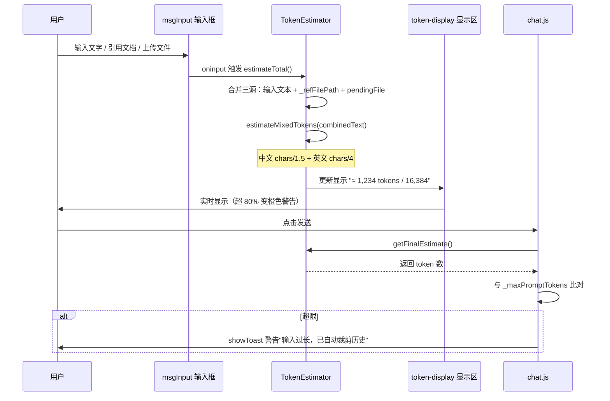
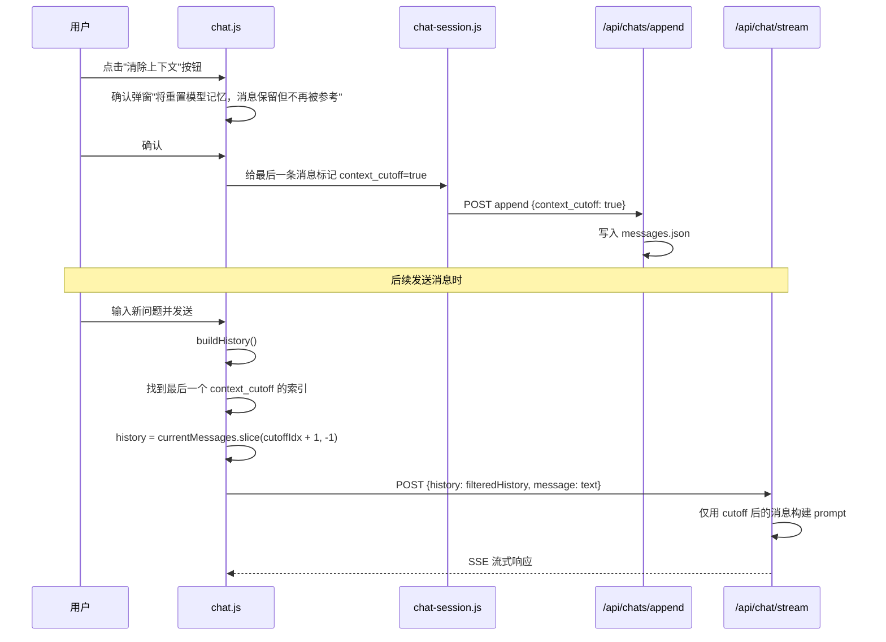
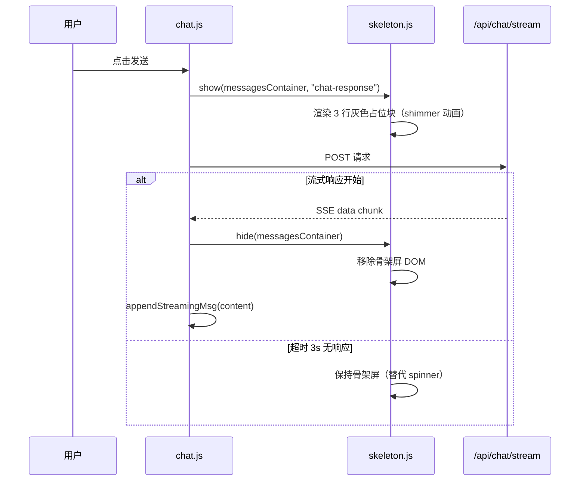
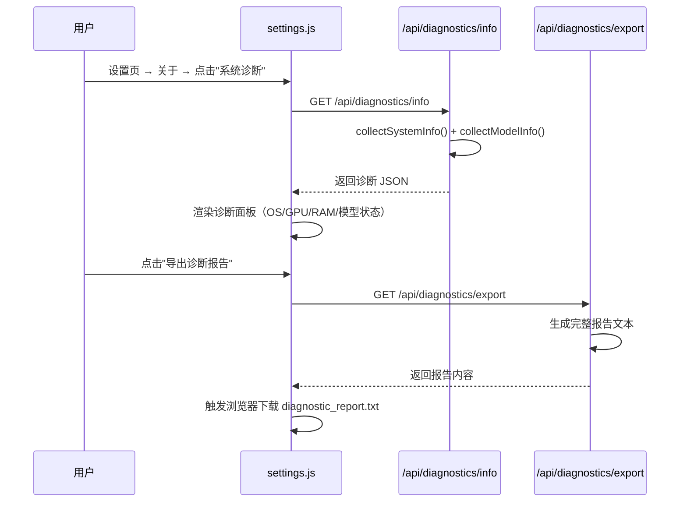
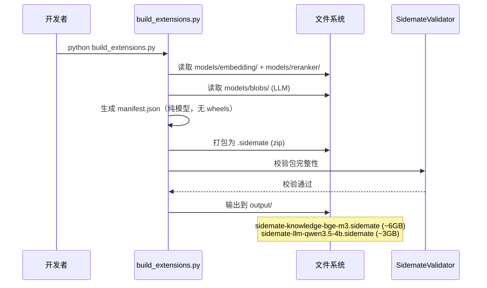
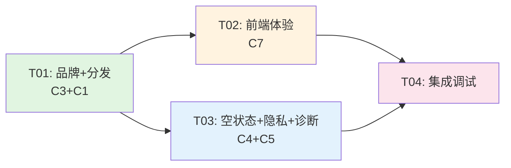

# 桌伴 Sidemate Patch5 批次 C — 系统架构设计 + 任务分解

> 版本：v0.9 Patch 5 批次 C | 架构师：高见远 | 更新：2026-06-20
> 范围：C7 前端体验 + C3 品牌视觉 + C4 空状态反馈 + C5 隐私诊断 + C1 小包分发

---

## Part A: 系统设计

### 1. 实现方案

#### 1.1 核心技术挑战

| 挑战 | 难点 | 解决方案 |
|------|------|----------|
| **纯前端骨架屏** | 原生 JS 无组件框架，需手动管理 DOM 生命周期 | CSS shimmer 动画 + 占位灰色块，替换现有 spinner |
| **统一 Token 估算** | 输入文本 + 引用文档 + 上传文件三源合并 | 新建 `token-estimator.js`，统一 `estimateTokens(text)` 公式，输入框右下角实时显示 |
| **清除上下文（保留消息）** | 消息保留但模型"忘记"之前的对话 | 消息加 `context_cutoff: true` 标记，`sendMessage()` 构建 history 时跳过 cutoff 之前的消息 |
| **消息样式切换（气泡/列表）** | 两种布局需动态切换不破坏已有渲染 | CSS class 控制（`.msg-list-mode` 父容器），localStorage 持久化偏好 |
| **代码块折叠/行号** | 已有复制功能，需增强 | 扩展现有 `.code-block` 结构，加 `.code-header`（语言+行数+折叠按钮）+ 行号渲染 |
| **Splash 启动画面 Logo** | Go 原生 GDI 绘制，当前是纯文字+ico 图标 | 已加载 logo.ico → `DrawIconEx`，增加品牌色背景渐变 + 副标题优化 |
| **轻量安装包 <2GB** | 当前全量包 6GB+ 触发 Defender | setup.iss 移除模型文件，仅含主程序+Python+Ollama+Lib（~1.6GB）|
| **纯模型扩展包** | 旧扩展包含 wheels/，与嵌入式 Python 重复 | 移除 wheels/，只保留 models/，manifest.json 的 `requires` 声明依赖已预装 |

#### 1.2 框架与技术选型

| 层 | 技术 | 说明 |
|----|------|------|
| **前端** | 原生 HTML/JS/CSS | 已有技术栈，不引入框架 |
| **后端** | FastAPI (Python 3.14) | 已有技术栈 |
| **Launcher** | Go + Win32 GDI | 已有技术栈 |
| **安装包** | Inno Setup (ISS) | 已有技术栈 |
| **图标生成** | Python Pillow + icoutils | 从 logo.svg 生成多尺寸 PNG/ICO |
| **字体** | Inter (woff2) | 开源字体，SIL Open Font License |

#### 1.3 架构模式

保持现有 **前后端分离** 架构：
- 前端：原生 JS 模块化（`<script>` 引入，全局函数挂载 `window`）
- 后端：FastAPI 路由分模块（`routers/` 目录）
- Launcher：Go 独立进程（看门狗 + Splash + 托盘）

批次 C 全部是 **前端为主 + 少量后端端点 + 安装脚本** 的改动，不涉及核心架构变更。

---

### 2. 文件列表

#### 2.1 新增文件

| 路径 | 类型 | 说明 |
|------|------|------|
| `server/static/js/token-estimator.js` | 前端 | 统一 Token 估算模块 |
| `server/static/js/skeleton.js` | 前端 | 骨架屏渲染模块 |
| `server/static/js/ui-enhance.js` | 前端 | 代码块增强（折叠+行号）+ 消息样式切换 |
| `server/static/css/skeleton.css` | 前端 | 骨架屏样式（shimmer 动画） |
| `server/static/fonts/Inter-Regular.woff2` | 资源 | Inter 字体 Regular 字重 |
| `server/static/fonts/Inter-Medium.woff2` | 资源 | Inter 字体 Medium 字重 |
| `server/static/fonts/Inter-SemiBold.woff2` | 资源 | Inter 字体 SemiBold 字重 |
| `server/static/img/icon-16.png` | 资源 | 16x16 图标 |
| `server/static/img/icon-32.png` | 资源 | 32x32 图标 |
| `server/static/img/icon-48.png` | 资源 | 48x48 图标 |
| `server/static/img/icon-256.png` | 资源 | 256x256 图标 |
| `server/static/img/favicon.ico` | 资源 | 多尺寸 favicon（16/32/48） |
| `server/routers/diagnostics.py` | 后端 | 系统诊断端点（导出诊断报告） |
| `CHANGELOG.md` | 文档 | 版本更新日志（P4 + P5） |
| `docs/PRIVACY.md` | 文档 | 隐私声明正文 |
| `installer/generate_icons.py` | 工具 | 从 logo.svg 生成多尺寸图标脚本 |
| `installer/build_extensions.py` | 工具 | 生成纯模型扩展包脚本 |

#### 2.2 修改文件

| 路径 | 类型 | 改动说明 |
|------|------|----------|
| `server/index.html` | 前端 | favicon 引用 + 字体引入 + 骨架屏容器 + Token 估算显示位 + 消息样式切换按钮 + 清除上下文按钮 + 空状态优化 + 隐私声明入口 + 诊断面板入口 + 反馈入口 + JS 引入 |
| `server/static/css/main.css` | 前端 | 代码块增强样式 + 消息列表模式样式 + 空状态样式 + 隐私/诊断面板样式 + 字体 @font-face |
| `server/static/js/chat.js` | 前端 | 清除上下文逻辑（context_cutoff）+ 骨架屏触发 + Token 估算集成 + 代码块增强调用 |
| `server/static/js/chat-session.js` | 前端 | 消息持久化增加 context_cutoff 字段 |
| `server/static/js/core/utils.js` | 前端 | 代码块渲染增强（折叠+行号 header）|
| `server/static/js/core/errors.js` | 前端 | 错误 toast 增加"复制详情"按钮 |
| `server/static/js/settings.js` | 前端 | 诊断面板渲染 + 隐私声明渲染 + 反馈入口 |
| `server/routers/chat.py` | 后端 | history 构建跳过 context_cutoff 消息 + append 支持 context_cutoff 字段 |
| `server/routers/settings_system.py` | 后端 | 诊断信息端点增强（GPU/磁盘/Python 版本）|
| `server/server.py` | 后端 | 注册 diagnostics 路由 |
| `server/config.py` | 后端 | 版本号更新到 0.9.5 |
| `launcher/splash_windows.go` | Launcher | Splash 品牌色背景优化 + Logo 区域增强 |
| `launcher/main.go` | Launcher | 版本号同步 |
| `setup.iss` | 安装 | 版本号更新 + 图标引用 + 排除模型文件确认 |
| `setup_full.iss` | 安装 | 版本号更新 |
| `THIRD-PARTY-NOTICES` | 文档 | 新增 FlagEmbedding / ebooklib / striprtf / Inter Font |
| `launcher/build.bat` | Launcher | 版本号同步（自动从 config.py 提取）|

---

### 3. 数据结构与接口

#### 3.1 类图

```mermaid
classDiagram
    class TokenEstimator {
        +CHARS_PER_TOKEN_CN: 1.5
        +CHARS_PER_TOKEN_EN: 4.0
        +estimateTokens(text: str) int
        +estimateMixedTokens(text: str) int
        +formatTokenCount(n: int) str
        +updateInputDisplay(inputEl, displayEl) void
    }

    class SkeletonLoader {
        +show(container, type) void
        +hide(container) void
        +renderChatSkeleton() HTMLElement
        +renderKBSkeleton() HTMLElement
    }

    class CodeBlockEnhancer {
        +enhance(container) void
        +addHeader(codeBlock) void
        +addLineNumbers(codeBlock) void
        +toggleCollapse(codeBlock) void
    }

    class MessageStyleManager {
        -MODE_KEY: str
        +getMode() str
        +setMode(mode: str) void
        +applyMode(container) void
        +toggleMode() void
    }

    class ContextCutoff {
        +markCutoff(messages) void
        +filterHistory(messages) array
        +hasCutoff(messages) bool
    }

    class DiagnosticsRouter {
        +GET /api/diagnostics/info dict
        +GET /api/diagnostics/export dict
        +collectSystemInfo() dict
        +collectModelInfo() dict
        +generateReport() str
    }

    class ChatRouter {
        +POST /api/chat/stream SSE
        +POST /api/chats/{name}/append dict
        -buildHistory(messages, cutoff_idx) list
    }

    TokenEstimator --> MessageStyleManager : 显示 token 数
    SkeletonLoader ..> ChatRouter : 等待响应时显示
    ContextCutoff --> ChatRouter : 过滤 history
    CodeBlockEnhancer ..> ChatRouter : 渲染后增强
    DiagnosticsRouter --> ChatRouter : 独立模块
```

#### 3.2 关键数据结构

**消息对象（增加 context_cutoff 字段）**：
```json
{
  "role": "user",
  "content": "清除上下文后的新问题",
  "ts": "14:30:00",
  "context_cutoff": true
}
```

**诊断报告结构**：
```json
{
  "timestamp": "2026-06-20T18:00:00",
  "version": "0.9.5",
  "system": {
    "os": "Windows 11 22H2",
    "python_version": "3.14.0",
    "cpu": "Intel i7-12700K",
    "gpu": "NVIDIA RTX 3060 / CUDA 12.1",
    "ram_total_gb": 32,
    "ram_available_gb": 16.5,
    "disk_free_gb": 120.3
  },
  "models": {
    "llm": {"name": "qwen3-5-4b", "loaded": true, "mem_mb": 4300},
    "embedder": {"name": "bge-m3", "loaded": true, "mem_mb": 600},
    "reranker": {"name": "bge-reranker-v2-m3", "loaded": false, "mem_mb": 0}
  },
  "config": {
    "ai_mode": "local",
    "kb_permission": "full",
    "ollama_port": 11434
  },
  "extensions": ["knowledge", "recorder"]
}
```

**扩展包 manifest.json（纯模型版）**：
```json
{
  "type": "model",
  "name": "sidemate-knowledge-bge-m3",
  "version": "1.0.0",
  "description": "BGE-M3 向量模型 + BGE-Reranker-v2-m3 精排模型",
  "requires": ["FlagEmbedding", "torch", "transformers"],
  "models": {
    "embedding": "BAAI/bge-m3",
    "reranker": "BAAI/bge-reranker-v2-m3"
  }
}
```

---

### 4. 程序调用流程

#### 4.1 统一 Token 估算流程



#### 4.2 清除上下文流程



#### 4.3 骨架屏流程



#### 4.4 诊断报告导出流程



#### 4.5 扩展包构建流程



---

### 5. 待明确事项

| # | 问题 | 当前假设 |
|---|------|----------|
| 1 | Token 估算中"引用文档"的文本来源 | 假设 `_refFilePath` 指向的文件可前端读取（txt/md），docx/pdf 等用文件大小估算（size_kb × 200）|
| 2 | 消息样式切换的默认值 | 默认气泡式（当前样式），列表式作为可选 |
| 3 | 诊断报告导出格式 | 纯文本（.txt），便于用户复制粘贴给支持团队 |
| 4 | 反馈渠道的具体邮箱 | 占位 `support@sidemate.app`，发布前替换 |
| 5 | Inter 字体的具体子集 | 使用完整 Latin 子集（不含 CJK，中文回退系统字体）|
| 6 | Splash 画面 Logo 增强 vs 重绘 | 当前 logo.ico 已可用，仅优化背景色和文字布局，不大改 |
| 7 | 扩展包 requires 字段 | 声明依赖包名，安装时检查 site-packages 是否已存在，不存在则提示 |

---

## Part B: 任务分解

### 6. 依赖包

本批次不新增 Python 运行时依赖（全部已有）。工具类依赖：

```
- Pillow>=10.0.0: 图标生成（开发工具，非运行时）
- icoutils/pillow: ICO 文件生成（开发工具）
- Inter Font (SIL OFL 1.1): 前端字体内嵌
```

### 7. 任务列表

#### T01: 项目基础设施 + 品牌 + 分发（C3 + C1）

| 项目 | 内容 |
|------|------|
| **Task ID** | T01 |
| **Task Name** | 品牌视觉全套 + 小包分发 + 扩展包改造 |
| **Source Files** | `server/static/img/icon-{16,32,48,256}.png`(新增), `server/static/img/favicon.ico`(新增), `server/static/fonts/Inter-*.woff2`(新增×3), `installer/generate_icons.py`(新增), `installer/build_extensions.py`(新增), `server/index.html`(favicon+字体), `server/static/css/main.css`(@font-face), `launcher/splash_windows.go`(品牌色), `setup.iss`(轻量版确认), `setup_full.iss`(版本号), `THIRD-PARTY-NOTICES`(更新), `server/config.py`(版本号) |
| **Dependencies** | 无（logo.svg 已有） |
| **Priority** | P1 |

**具体工作**：
1. **图标生成**：用 Pillow 从 logo.svg 渲染 16/32/48/256 PNG + 多尺寸 favicon.ico
2. **Inter 字体**：下载 3 个字重 woff2，加入 `@font-face` 声明
3. **favicon 引用**：index.html `<link rel="icon">` 改为引用 `/static/img/favicon.ico`
4. **Splash 增强**：Go Launcher 的 splashPaint 优化品牌色背景（已有 logo.ico 加载逻辑）
5. **轻量 setup.iss**：确认 setup.iss 不含模型文件（当前已不含，仅需版本号 0.9.4→0.9.5）
6. **扩展包构建脚本**：`build_extensions.py` 打包纯模型 .sidemate
7. **THIRD-PARTY 更新**：新增 FlagEmbedding / ebooklib / striprtf / Inter Font

#### T02: 前端体验核心（C7 — Token 估算 + 清除上下文 + 消息样式 + 代码块 + 骨架屏）

| 项目 | 内容 |
|------|------|
| **Task ID** | T02 |
| **Task Name** | 前端体验细节全套 |
| **Source Files** | `server/static/js/token-estimator.js`(新增), `server/static/js/skeleton.js`(新增), `server/static/js/ui-enhance.js`(新增), `server/static/css/skeleton.css`(新增), `server/static/css/main.css`(代码块+消息模式+空状态), `server/static/js/chat.js`(集成), `server/static/js/chat-session.js`(context_cutoff 持久化), `server/static/js/core/utils.js`(代码块渲染增强), `server/index.html`(UI 元素+JS 引入), `server/routers/chat.py`(history 过滤+append 字段) |
| **Dependencies** | T01（字体+样式基础） |
| **Priority** | P0 |

**具体工作**：
1. **TokenEstimator**：`token-estimator.js` — 统一估算输入+引用+上传，输入框右下角显示
2. **清除上下文**：chat.js 加 `clearContext()` 函数，chat.py 的 history 构建 + append 支持 `context_cutoff`
3. **骨架屏**：`skeleton.js` + `skeleton.css` — 替代 spinner，灰块 shimmer 动画
4. **消息样式切换**：`ui-enhance.js` — 气泡/列表切换，localStorage 持久化
5. **代码块增强**：utils.js 的 renderer.code 增强 — 加 header（语言+折叠）+ 行号
6. **index.html**：加清除上下文按钮 + 样式切换按钮 + Token 显示区 + JS 引入

#### T03: 空状态 + 反馈 + 隐私 + 诊断 + CHANGELOG（C4 + C5）

| 项目 | 内容 |
|------|------|
| **Task ID** | T03 |
| **Task Name** | 空状态优化 + 反馈渠道 + 错误复制 + 隐私声明 + 诊断面板 + 更新日志 |
| **Source Files** | `server/static/js/core/errors.js`(错误复制), `server/static/js/settings.js`(诊断面板+隐私+反馈), `server/static/js/chat.js`(空状态文案), `server/static/css/main.css`(空状态+诊断+隐私样式), `server/index.html`(空状态+诊断入口+隐私入口+反馈入口), `server/routers/diagnostics.py`(新增), `server/server.py`(注册路由), `server/routers/settings_system.py`(诊断增强), `CHANGELOG.md`(新增), `docs/PRIVACY.md`(新增) |
| **Dependencies** | T01（THIRD-PARTY 更新参考）|
| **Priority** | P1 |

**具体工作**：
1. **Chat 空状态**：chat.js renderMessages 空状态文案按模式动态显示（已有基础，优化文案）
2. **KB 空状态**：index.html kbEmpty 文案优化（已有基础，加操作引导）
3. **反馈渠道**：settings.js 设置页加反馈入口（mailto 链接占位）
4. **错误复制**：errors.js showToast 的 type='error' 时增加"复制详情"按钮
5. **隐私声明**：docs/PRIVACY.md 撰写 + settings.js 关于区域加隐私声明展开
6. **诊断面板**：diagnostics.py 新增 `/api/diagnostics/info` + `/api/diagnostics/export`
7. **CHANGELOG**：CHANGELOG.md 记录 P4 + P5 所有改动

---

### 8. 共享知识（跨文件约定）

```
- 版本号单一来源：server/config.py DEFAULTS["version"]，前端/launcher/iss 全部从此同步
- 前端 JS 模块挂载 window 全局函数（无模块系统），通过 <script> 引入顺序保证依赖
- 所有 API 响应格式：{code: 0, data: ..., message: ...} 或直接返回数据对象
- Token 估算公式：中文 chars/1.5，英文 chars/4，混合文本按字符比例加权
- 消息持久化格式：data/chats/{name}/messages.json，每条消息可选 context_cutoff 字段
- 代码块 HTML 结构：<div class="code-block"><div class="code-header">...</div><pre><code>...</code></pre></div>
- CSS 变量体系：已有 --accent-color / --bg-primary / --text-primary 等，新增样式复用
- 骨架屏 CSS 类名：.skeleton-block / .skeleton-line / .skeleton-shimmer
- 消息模式 CSS：父容器 .msg-list-mode 切换列表布局
- 图标资源路径：/static/img/icon-{size}.png，favicon: /static/img/favicon.ico
- 字体资源路径：/static/fonts/Inter-{weight}.woff2
- 扩展包格式：.sidemate = zip，含 manifest.json + models/，不含 wheels/
- 诊断报告格式：纯文本 .txt，包含时间戳/版本/系统/模型/配置/扩展信息
- 隐私声明核心承诺：所有数据存储在 {localappdata}/Sidemate/data/，不上传任何用户数据
```

### 9. 任务依赖图



**依赖说明**：
- T01 先做：提供字体+图标+CSS 基础，T02/T03 的 UI 改动依赖这些资源
- T02 和 T03 可并行：T02 纯前端交互，T03 以后端端点+文档为主
- T04（集成调试）：验证所有功能正常，版本号统一，端到端走通

---

## 附录：各任务技术细节

### A1. Token 估算公式实现

```javascript
// token-estimator.js
var TokenEstimator = {
  // 估算单段文本的 token 数
  estimateTokens: function(text) {
    if (!text) return 0;
    // 区分中英文字符
    var cnChars = (text.match(/[\u4e00-\u9fff]/g) || []).length;
    var otherChars = text.length - cnChars;
    // 中文 ~1.5 字/token，英文 ~4 字/token
    return Math.ceil(cnChars / 1.5 + otherChars / 4.0);
  },

  // 合并三源估算
  estimateTotal: function() {
    var inputText = '';
    var inputEl = document.getElementById('msgInput');
    if (inputEl) inputText = inputEl.value;

    var refText = '';
    if (typeof _refFilePath !== 'undefined' && _refFilePath) {
      // 引用文档：无法前端读取，用文件信息估算
      refText = '[引用文档]'; // 占位，实际按文档字数
    }

    var fileText = '';
    if (typeof pendingFile !== 'undefined' && pendingFile) {
      fileText = '[上传文件]'; // 占位，实际按文件大小
    }

    return this.estimateTokens(inputText + refText + fileText);
  },

  // 格式化显示
  formatCount: function(n) {
    if (n > 1000) return (n / 1000).toFixed(1) + 'k';
    return String(n);
  }
};
```

### A2. 清除上下文后端实现

```python
# chat.py — api_chat_stream 中的 history 构建
history_raw = req.history or []

# 查找最后一个 context_cutoff 标记
cutoff_idx = -1
for i, msg in enumerate(history_raw):
    if msg.get("context_cutoff"):
        cutoff_idx = i

# 只取 cutoff 之后的消息作为 history
if cutoff_idx >= 0:
    history_raw = history_raw[cutoff_idx + 1:]
    log.info("[CHAT] context_cutoff at idx %d, history trimmed to %d msgs" % (cutoff_idx, len(history_raw)))
```

### A3. 代码块增强 HTML 结构

```html
<!-- 增强后的代码块 -->
<div class="code-block">
  <div class="code-header">
    <span class="code-lang">python</span>
    <span class="code-lines">12 行</span>
    <button class="code-toggle" onclick="toggleCodeCollapse(this)">折叠</button>
    <button class="code-copy-btn" onclick="copyCode(this)">复制</button>
  </div>
  <pre><code class="language-python">...</code></pre>
</div>
```

### A4. 诊断端点实现

```python
# diagnostics.py
@router.get("/api/diagnostics/info")
def api_diagnostics_info():
    """收集系统诊断信息"""
    import platform, psutil, sys
    return {
        "timestamp": datetime.now().isoformat(),
        "version": config.get("version"),
        "system": {
            "os": platform.platform(),
            "python_version": sys.version.split()[0],
            "ram_total_gb": round(psutil.virtual_memory().total / 1024**3, 1),
            "ram_available_gb": round(psutil.virtual_memory().available / 1024**3, 1),
            "disk_free_gb": round(psutil.disk_usage(PROJECT_ROOT).free / 1024**3, 1),
        },
        "models": _collect_model_status(),
        "config": _collect_key_config(),
    }

@router.get("/api/diagnostics/export")
def api_diagnostics_export():
    """导出完整诊断报告（纯文本）"""
    info = api_diagnostics_info()
    report = _format_report(info)
    return PlainTextResponse(report, media_type="text/plain",
                             headers={"Content-Disposition": "attachment; filename=sidemate_diagnostic.txt"})
```

### A5. 扩展包构建脚本

```python
# build_extensions.py
def build_kb_extension():
    """构建知识库模型扩展包（bge-m3 + reranker）"""
    manifest = {
        "type": "model",
        "name": "sidemate-knowledge-bge-m3",
        "version": "1.0.0",
        "description": "BGE-M3 向量模型 + BGE-Reranker-v2-m3 精排模型",
        "requires": ["FlagEmbedding", "torch", "transformers"],
    }
    # 打包 models/embedding/ + models/reranker/ + manifest.json
    # 不含 wheels/
    _pack_sidemate(
        name="sidemate-knowledge-bge-m3",
        manifest=manifest,
        dirs=["models/embedding", "models/reranker"],
    )

def build_llm_extension():
    """构建 LLM 模型扩展包（Qwen3.5-4B）"""
    manifest = {
        "type": "model",
        "name": "sidemate-llm-qwen3.5-4b",
        "version": "1.0.0",
        "description": "Qwen3.5-4B 本地大语言模型（Ollama 格式）",
        "requires": [],
    }
    _pack_sidemate(
        name="sidemate-llm-qwen3.5-4b",
        manifest=manifest,
        dirs=["models/blobs", "models/manifests"],
    )
```
