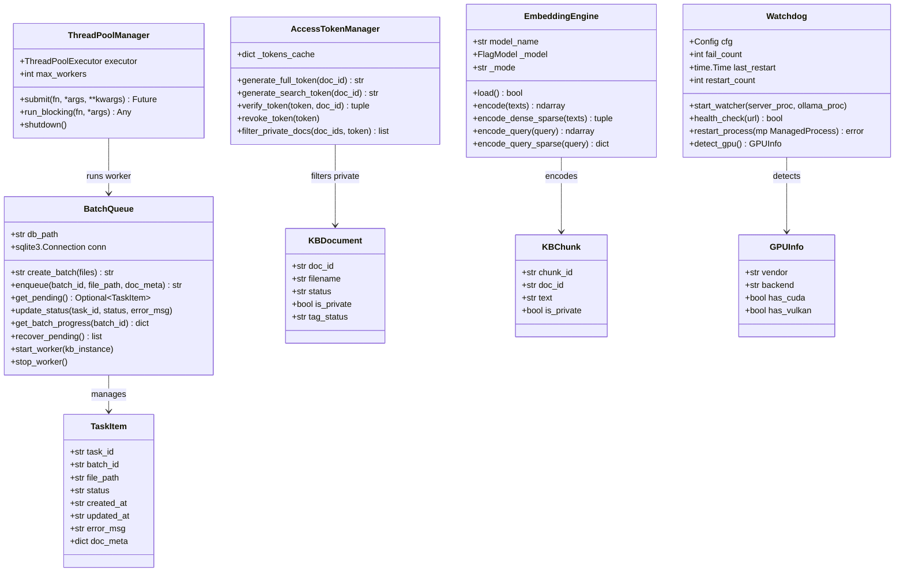
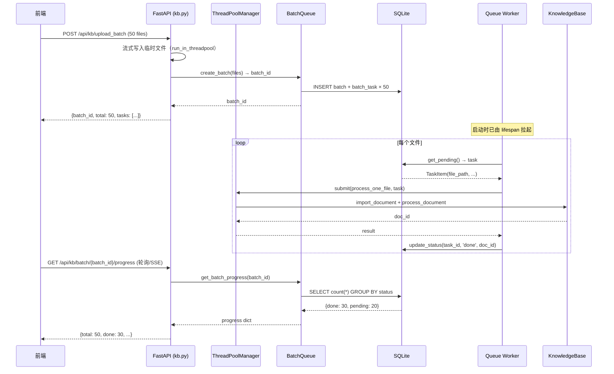
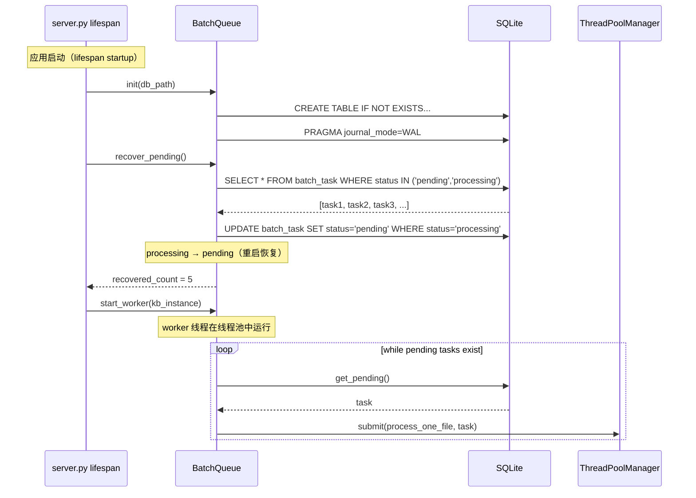
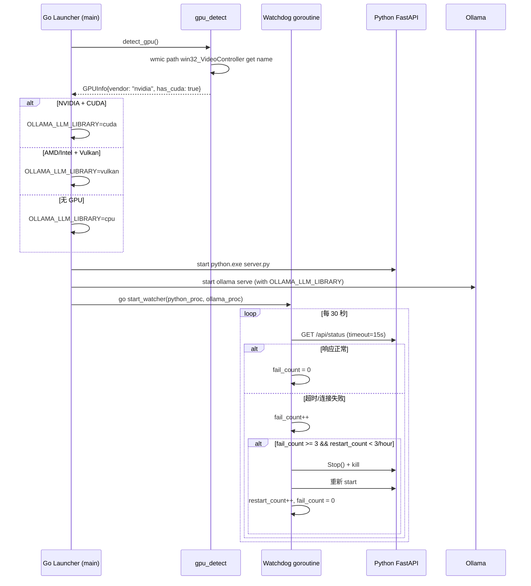
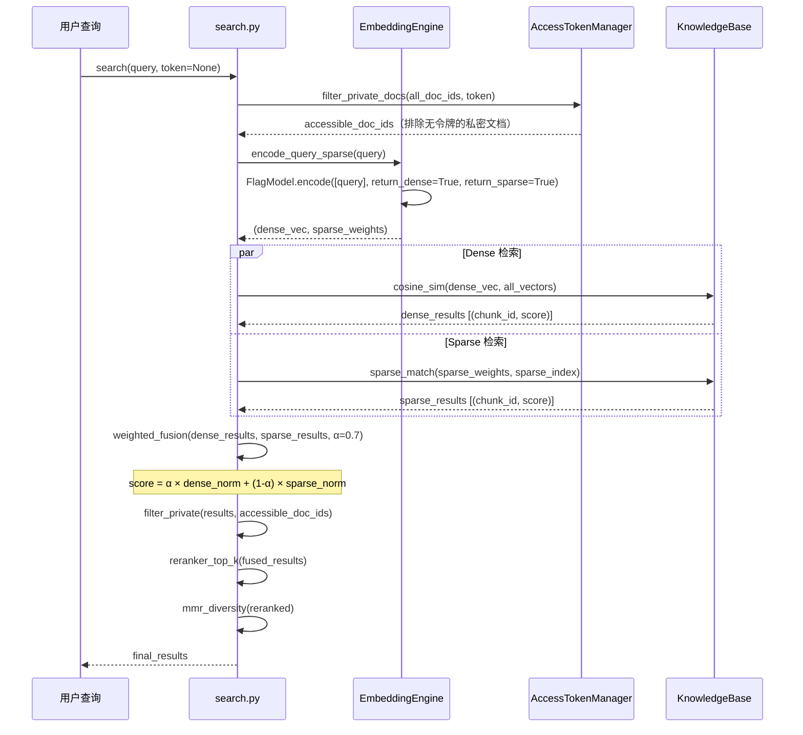
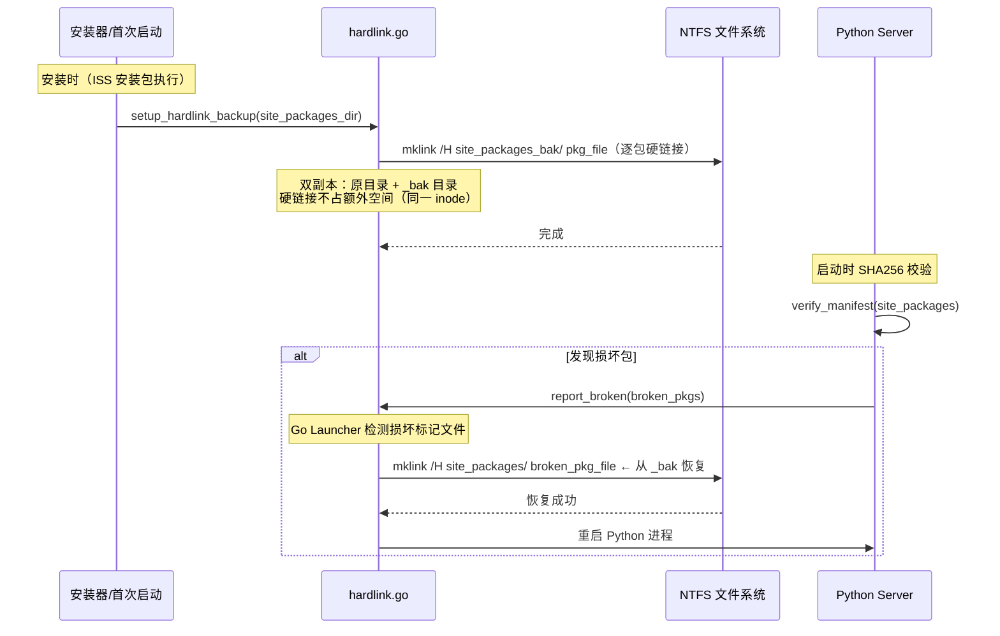
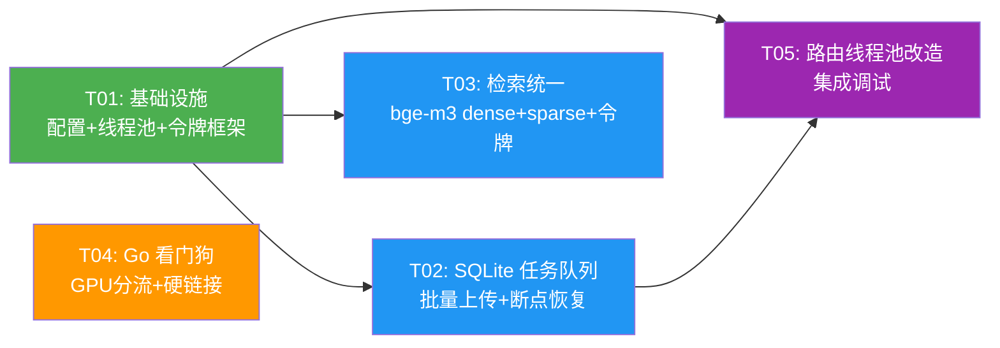

# 桌伴 Sidemate Patch5 批次 A — 系统架构设计 + 任务分解

> **版本**: v0.9.5-Patch5-A  
> **架构师**: 高见远  
> **日期**: 2026-06-20  
> **状态**: 待评审

---

## Part A: 系统设计

### 1. 实现方案与框架选型

#### 1.1 核心技术挑战分析

| 挑战 | 根因 | 影响 | 对应任务 |
|------|------|------|----------|
| FastAPI 假死 | 同步阻塞操作（文件解析、embedding 计算）在事件循环线程执行，卡死所有请求 | 100 文件导入时整个服务不可用，前端误报断联 | A1 |
| 导入不可恢复 | 每个文件上传是独立线程，无持久化队列，进程中断后所有进行中的文件丢失 | 切到一半关掉，下次启动从头开始 | A2 |
| Python 挂了无人救 | Go Launcher 目前只在**启动时**做 3 次重试，运行期间不做健康监测 | Python 运行期间 OOM/崩溃后无人重启 | A3 |
| GPU 适配差 | 硬编码 `OLLAMA_VULKAN=1`，NVIDIA GPU 跑不了 CUDA，性能浪费 | NVIDIA 显卡用户体验差 | A3 |
| 检索依赖 jieba/BM25 | bge-m3 自带 sparse 向量（学习型 BM25），但代码仍用 jieba 分词 + rank_bm25 | 多余依赖、维护负担 | A4 |
| 无隐私控制 | 所有文档平等暴露给云端 AI | 私密文档可能泄漏 | A4 |
| 依赖恢复太慢 | 启动时全量 zip 恢复 site-packages（~2GB），耗时 30-60s | 用户体验差 | A5 |

#### 1.2 框架与库选型

| 任务 | 选型 | 理由 |
|------|------|------|
| A1 线程池 | `concurrent.futures.ThreadPoolExecutor`（标准库） | 零新依赖；与 FastAPI 的 `run_in_threadpool` 天然兼容 |
| A2 SQLite 队列 | Python 标准库 `sqlite3` | 零新依赖；单文件持久化；WAL 模式支持并发读写 |
| A3 看门狗 | Go 标准库 `net/http` + `os/exec` + `time.Ticker` | 零新 Go 依赖；复用现有 Launcher 架构 |
| A3 GPU 检测 | Go 调用 `wmic path win32_VideoController` + DXGI fallback | wmic 在 Win10/11 预装；DXGI 通过 `dxgi.dll` syscall |
| A4 bge-m3 sparse | `FlagModel.encode(return_dense=True, return_sparse=True)` | bge-m3 原生支持；去 jieba + rank_bm25 |
| A4 令牌系统 | Python `secrets` + `hashlib`（标准库） | 零新依赖；HMAC-SHA256 签名 |
| A5 硬链接 | Windows `mklink /H`（通过 Go `os/exec`） | NTFS 原生支持；零额外空间；原子操作 |

#### 1.3 架构模式

保持现有的 **Mixin 组合模式**（KnowledgeBase = Ops + Search + Ask + Stats），不改变整体架构。新增模块以独立文件/Mixin 方式注入：

- **线程池**: 全局单例 `ThreadPoolManager`，在 `server.py` 启动时初始化
- **任务队列**: 独立 `BatchQueue` 类，SQLite 持久化，`server.py` lifespan 中启动 worker
- **看门狗**: Go Launcher 新增 `watchdog.go`，独立 goroutine 运行
- **令牌系统**: `core/access_token.py`，FastAPI 依赖注入
- **硬链接**: Go Launcher `hardlink.go`，安装时调用

---

### 2. 文件列表

#### 2.1 新增文件

| 文件路径 | 说明 | 任务 |
|----------|------|------|
| `server/core/thread_pool.py` | 全局线程池管理器 | A1 |
| `server/core/batch_queue.py` | SQLite 任务队列 + 断点恢复 worker | A2 |
| `server/core/access_token.py` | 令牌授权系统（全文令牌/搜索令牌/无令牌） | A4 |
| `launcher/watchdog.go` | Go 看门狗 goroutine（健康检查 + 自动重启） | A3 |
| `launcher/gpu_detect.go` | GPU vendor 检测 + 三档分流 | A3 |
| `launcher/hardlink.go` | 依赖硬链接恢复（双副本 + mklink /H） | A5 |

#### 2.2 修改文件

| 文件路径 | 改动范围 | 说明 | 任务 |
|----------|----------|------|------|
| `server/server.py` | lifespan 初始化线程池 + 队列 worker；注册 `/api/kb/upload_batch` | A1, A2 |
| `server/config.py` | 新增 P5 配置项（线程池大小、队列参数、令牌配置） | A1, A2, A4 |
| `server/routers/kb.py` | 新增 `upload_batch` 端点；现有 `upload` 端点改用线程池；`search` 端点加令牌校验 | A1, A2, A4 |
| `server/routers/chat.py` | Agent 工具调用改用线程池 | A1 |
| `server/knowledge/search.py` | bge-m3 dense+sparse 融合替代 BM25+RRF；加 `is_private` 过滤 | A4 |
| `server/knowledge/embedding_engine.py` | 改用 `FlagModel`（支持 dense+sparse），替代 `SentenceTransformer` | A4 |
| `server/knowledge/ops.py` | 文档/chunk 加 `is_private` 字段；导入逻辑对接 BatchQueue | A2, A4 |
| `server/knowledge/models.py` | `KBDocument` / `KBChunk` 加 `is_private: bool` 字段 | A4 |
| `server/core/agent_tools.py` | `search_kb` 工具加令牌参数 | A4 |
| `launcher/main.go` | 启动时 GPU 检测分流；启动 watchdog goroutine；硬链接初始化 | A3, A5 |
| `server/requirements.txt` | 新增 `FlagEmbedding`；标注 `rank_bm25`/`jieba` 为 deprecated | A4 |

---

### 3. 数据结构与接口

#### 3.1 类图



#### 3.2 核心数据结构

**A2: SQLite 任务队列表结构**

```sql
-- 批次表
CREATE TABLE IF NOT EXISTS batch (
    batch_id    TEXT PRIMARY KEY,
    created_at  TEXT NOT NULL DEFAULT (datetime('now')),
    total_files INTEGER NOT NULL DEFAULT 0,
    status      TEXT NOT NULL DEFAULT 'active'  -- active / completed / cancelled
);

-- 任务表（每个文件一条记录）
CREATE TABLE IF NOT EXISTS batch_task (
    task_id     TEXT PRIMARY KEY,              -- UUID
    batch_id    TEXT NOT NULL,
    file_path   TEXT NOT NULL,                 -- 临时文件路径
    filename    TEXT NOT NULL,                 -- 原始文件名
    file_type   TEXT NOT NULL,                 -- 扩展名
    file_size   INTEGER DEFAULT 0,
    status      TEXT NOT NULL DEFAULT 'pending', -- pending / processing / done / error / cancelled
    doc_id      TEXT,                           -- 处理完成后关联的文档 ID
    error_msg   TEXT DEFAULT '',
    created_at  TEXT NOT NULL DEFAULT (datetime('now')),
    updated_at  TEXT NOT NULL DEFAULT (datetime('now')),
    doc_meta    TEXT DEFAULT '{}',              -- JSON: {has_images, image_count, ...}
    FOREIGN KEY (batch_id) REFERENCES batch(batch_id)
);

-- 索引：按 batch_id + status 查询（进度统计用）
CREATE INDEX IF NOT EXISTS idx_batch_status ON batch_task(batch_id, status);
-- 索引：启动恢复用（查所有 pending/processing）
CREATE INDEX IF NOT EXISTS idx_status ON batch_task(status);
```

**A4: 令牌数据结构**

```python
@dataclass
class AccessToken:
    token: str           # 32 字节随机 hex
    doc_id: str          # 绑定的文档 ID
    level: str           # "full" | "search" | "none"
    created_at: float    # unix timestamp
    expires_at: float    # 过期时间（0=永不过期）
```

**A4: KBDocument / KBChunk 新增字段**

```python
@dataclass
class KBDocument:
    # ... 现有字段 ...
    is_private: bool = False  # P5: 私密文档标记

@dataclass
class KBChunk:
    # ... 现有字段 ...
    is_private: bool = False  # P5: 继承自文档
```

#### 3.3 API 接口

**A2: 批量上传接口**

```
POST /api/kb/upload_batch
  Request: multipart/form-data
    files: List[UploadFile]   (多个文件)
  
  Response: 200
    {
      "batch_id": "b_20260620_abc123",
      "total_files": 50,
      "tasks": [
        {"task_id": "t_xxx", "filename": "报告1.pdf", "status": "pending"},
        ...
      ]
    }

GET /api/kb/batch/{batch_id}/progress
  Response: 200
    {
      "batch_id": "b_xxx",
      "total": 50,
      "done": 30,
      "processing": 2,
      "pending": 15,
      "error": 3,
      "status": "active",
      "tasks": [
        {"task_id": "t_xxx", "filename": "报告1.pdf", "status": "done", "doc_id": "d_xxx"},
        {"task_id": "t_yyy", "filename": "报告2.pdf", "status": "error", "error_msg": "..."},
      ]
    }

POST /api/kb/batch/{batch_id}/cancel
  Response: 200
    {"cancelled": 15}  -- 取消的 pending 任务数

GET /api/kb/batch/active
  Response: 200
    {"batches": [{"batch_id": "b_xxx", "total": 50, "done": 30, ...}]}
```

**A4: 令牌接口**

```
POST /api/kb/documents/{doc_id}/token
  Body: {"level": "full" | "search"}
  Response: {"token": "a1b2c3...", "expires_at": 0}

DELETE /api/kb/documents/{doc_id}/token
  Response: {"revoked": true}

POST /api/kb/documents/{doc_id}/privacy
  Body: {"is_private": true}
  Response: {"doc_id": "...", "is_private": true}
```

---

### 4. 程序调用流程

#### 4.1 批量导入流程（A1 + A2）



#### 4.2 断点恢复流程（A2）



#### 4.3 Go 看门狗 + GPU 检测流程（A3）



#### 4.4 bge-m3 Dense+Sparse 检索流程（A4）



#### 4.5 硬链接恢复流程（A5）



---

### 5. 待明确事项

| # | 问题 | 假设/建议 | 需确认 |
|---|------|-----------|--------|
| 1 | bge-m3 sparse 替代 BM25 后，是否完全移除 jieba/rank_bm25 依赖？ | **建议**: P5 先保留 BM25 代码做 fallback（FlagModel sparse 失败时降级），P6 再彻底移除 | 建议确认 |
| 2 | 批量上传的进度推送用 SSE 还是轮询？ | **建议**: 前端轮询 `GET /api/kb/batch/{id}/progress`（2 秒间隔），简单可靠；SSE 增加复杂度且 FastAPI 单线程下 SSE 会占用连接 | 建议确认 |
| 3 | 令牌系统是否需要持久化（重启后保留）？ | **建议**: P5 仅内存令牌（进程重启后令牌失效，需重新生成）；私密文档标记 `is_private` 持久化到 kb_meta.json | 建议确认 |
| 4 | GPU 检测用 wmic 还是 DXGI？wmic 在 Win11 24H2 可能被移除 | **建议**: 优先 wmic（简单），fallback 用 PowerShell `Get-CimInstance Win32_VideoController`；DXGI 作为最终 fallback | 建议确认 |
| 5 | 硬链接双副本的 `_bak` 目录放在哪？ | **建议**: `python/Lib/site-packages_bak/`，与原目录同级，安装时创建 | 建议确认 |
| 6 | 看门狗重启 Python 后，正在进行的 KB 导入任务怎么办？ | **假设**: BatchQueue 的 SQLite 持久化保证重启后恢复 pending 任务；正在 processing 的任务重置为 pending | 已通过 A2 设计覆盖 |

---

## Part B: 任务分解

### 6. 依赖包列表

```
# P5 新增
FlagEmbedding>=1.3.0    # bge-m3 dense+sparse 编码（替代 sentence-transformers 直接调用）

# P5 移除（标记 deprecated，P6 彻底删除）
# rank-bm25==0.2.2       # 被 bge-m3 sparse 替代
# jieba==0.42.1          # 被 bge-m3 sparse 替代
```

> **注意**: `FlagEmbedding` 依赖 `torch` + `transformers`，这些已是现有依赖。`FlagEmbedding` 本身是轻量包（纯 Python wrapper）。
> 
> A1/A2/A3/A5 均使用标准库，**零新依赖**。

---

### 7. 任务列表（按依赖顺序）

#### T01: 项目基础设施 — 配置 + 线程池 + 令牌框架

| 属性 | 值 |
|------|-----|
| **Task ID** | T01 |
| **Task Name** | 项目基础设施：P5 配置项 + 线程池管理器 + 令牌系统框架 |
| **Source Files** | `server/config.py`（改）, `server/core/thread_pool.py`（新）, `server/core/access_token.py`（新）, `server/server.py`（改：lifespan 初始化） |
| **Dependencies** | 无 |
| **Priority** | P0 |

**内容**:
1. `config.py` 新增 P5 配置项：
   - `thread_pool_max_workers`: 2（线程池大小，避免占满 CPU）
   - `batch_queue_db_path`: 空默认值（运行时解析为 DATA_DIR/batch_queue.db）
   - `batch_queue_poll_interval`: 1.0（秒，worker 轮询间隔）
   - `kb_dense_sparse_alpha`: 0.7（dense+sparse 融合权重）
   - `kb_enable_sparse`: True（是否启用 bge-m3 sparse）
   - `access_token_default_ttl`: 0（令牌默认永不过期）
2. `core/thread_pool.py`：全局 `ThreadPoolManager` 单例，封装 `ThreadPoolExecutor(max_workers=2)`，提供 `submit()` 和 `run_blocking()` 方法
3. `core/access_token.py`：`AccessTokenManager` 类，支持生成/验证/撤销令牌，私密文档过滤
4. `server.py` lifespan 中初始化 `ThreadPoolManager` 并存为全局变量

#### T02: SQLite 任务队列 + 批量上传 + 断点恢复

| 属性 | 值 |
|------|-----|
| **Task ID** | T02 |
| **Task Name** | SQLite 持久化任务队列 + 批量上传 API + 断点恢复机制 |
| **Source Files** | `server/core/batch_queue.py`（新）, `server/routers/kb.py`（改：新增 upload_batch 端点 + 批量进度/取消端点）, `server/server.py`（改：lifespan 启动/停止 worker + 断点恢复） |
| **Dependencies** | T01 |
| **Priority** | P0 |

**内容**:
1. `core/batch_queue.py`：`BatchQueue` 类
   - SQLite WAL 模式初始化 + 建表（batch + batch_task）
   - `create_batch(files)` → batch_id
   - `enqueue(batch_id, file_path, doc_meta)` → task_id
   - `get_pending()` → TaskItem（原子 SELECT + UPDATE）
   - `update_status(task_id, status, error_msg, doc_id)`
   - `get_batch_progress(batch_id)` → 统计 dict
   - `recover_pending()` → 启动时恢复 processing→pending
   - `start_worker(kb)` → 在 T01 线程池中启动消费循环
   - `stop_worker()` → 优雅停止
2. `routers/kb.py` 新增端点：
   - `POST /api/kb/upload_batch`：多文件上传 → 临时存储 → 入队 → 返回 batch_id
   - `GET /api/kb/batch/{batch_id}/progress`：进度查询
   - `POST /api/kb/batch/{batch_id}/cancel`：取消未处理的任务
   - `GET /api/kb/batch/active`：活跃批次列表
3. `server.py` lifespan：
   - startup：`batch_queue.recover_pending()` + `batch_queue.start_worker(kb)`
   - shutdown：`batch_queue.stop_worker()`

#### T03: 检索引擎统一 + 令牌集成 + 私密文档

| 属性 | 值 |
|------|-----|
| **Task ID** | T03 |
| **Task Name** | bge-m3 dense+sparse 检索统一 + 令牌授权 + 私密文档过滤 |
| **Source Files** | `server/knowledge/embedding_engine.py`（改：FlagModel dense+sparse）, `server/knowledge/search.py`（改：dense+sparse 融合替代 BM25+RRF + is_private 过滤）, `server/knowledge/models.py`（改：加 is_private 字段）, `server/knowledge/ops.py`（改：文档导入加 is_private 支持 + meta 序列化兼容）, `server/core/agent_tools.py`（改：search_kb 加 token 参数）, `server/routers/kb.py`（改：search 端点加 token 参数 + 隐私设置端点） |
| **Dependencies** | T01 |
| **Priority** | P1 |

**内容**:
1. `embedding_engine.py`：改用 `FlagModel`（from FlagEmbedding import FlagModel）
   - `load()`：加载 BGEM3FlagModel
   - `encode_dense_sparse(texts)` → (dense_ndarray, sparse_weights_list)
   - 保留 `encode()` / `encode_query()` 兼容接口（内部调 dense）
   - **降级保护**：FlagModel 加载失败时 fallback 到 SentenceTransformer（纯 dense）
2. `search.py`：
   - 新增 `_search_sparse(query_sparse_weights, top_k)` 方法
   - 新增 `_dense_sparse_fusion(dense_results, sparse_results, alpha)` 方法（加权归一化融合）
   - `search()` 方法：bge-m3 sparse 可用时走 dense+sparse 融合；不可用时降级 BM25
   - `search()` 增加 `accessible_doc_ids` 参数：过滤 `is_private=True` 且不在令牌授权范围内的 chunk
3. `models.py`：KBDocument + KBChunk 加 `is_private: bool = False`
4. `ops.py`：
   - `_load_meta()` / `_save_meta()` 兼容 is_private 字段
   - `import_document()` 支持 `is_private` 参数
5. `agent_tools.py`：`search_kb` 工具签名加 `token: Optional[str]` 参数
6. `routers/kb.py`：
   - `POST /api/kb/search` 加 `token` query 参数
   - 新增 `POST /api/kb/documents/{doc_id}/privacy` 设置私密标记
   - 新增 `POST /api/kb/documents/{doc_id}/token` 生成令牌
   - 新增 `DELETE /api/kb/documents/{doc_id}/token` 撤销令牌

#### T04: Go 看门狗 + GPU 三档分流 + 依赖硬链接

| 属性 | 值 |
|------|-----|
| **Task ID** | T04 |
| **Task Name** | Go Launcher 看门狗健康监测 + GPU 检测分流 + 依赖硬链接恢复 |
| **Source Files** | `launcher/watchdog.go`（新）, `launcher/gpu_detect.go`（新）, `launcher/hardlink.go`（新）, `launcher/main.go`（改：启动时 GPU 检测 + 启动 watchdog goroutine + 硬链接初始化） |
| **Dependencies** | 无（可与 T01-T03 并行，独立于 Python 端） |
| **Priority** | P1 |

**内容**:
1. `gpu_detect.go`：
   - `detect_gpu() GPUInfo`：wmic 查询 GPU vendor name
   - NVIDIA → `has_cuda=true, backend="cuda"`
   - AMD/Intel → `has_vulkan=true, backend="vulkan"`
   - 无独立 GPU → `backend="cpu"`
   - PowerShell `Get-CimInstance` 作为 wmic fallback
2. `watchdog.go`：
   - `start_watcher(cfg, python_proc, ollama_proc)` goroutine
   - 每 30s 对 Python `/api/status` 和 Ollama `/api/tags` 做 GET（15s 超时）
   - 连续 3 次失败 → 重启（Stop + 重新 Start）
   - 重启上限 3 次/小时（滑动窗口计数）
   - 写日志到 `server/data/logs/launcher.log`
3. `hardlink.go`：
   - `setup_hardlink_backup(sitePackagesDir)`：创建 `site_packages_bak/` 硬链接副本
   - `verify_and_repair(sitePackagesDir, brokenPkgs)`：从 _bak 恢复损坏包
   - 使用 `cmd /c mklink /H` 创建硬链接
4. `main.go`：
   - 启动前调 `detect_gpu()` → 设置 `OLLAMA_LLM_LIBRARY` 环境变量
   - 所有进程启动后 → `go start_watcher(...)`
   - 启动前调 `setup_hardlink_backup()` （首次启动）

#### T05: 现有路由线程池改造 + 集成调试

| 属性 | 值 |
|------|-----|
| **Task ID** | T05 |
| **Task Name** | 现有阻塞路由迁移到线程池 + SSE 保护 + 全链路调试 |
| **Source Files** | `server/routers/kb.py`（改：upload/import 走线程池）, `server/routers/chat.py`（改：agent 工具调用走线程池）, `server/knowledge/ops.py`（改：process_document 内部 embedding 调用走线程池） |
| **Dependencies** | T01, T02 |
| **Priority** | P1 |

**内容**:
1. `routers/kb.py`：
   - 现有 `POST /api/kb/upload` 单文件上传：文件解析（pdfplumber/docx 等）包装到 `thread_pool.run_blocking()`
   - **SSE 保护**：`POST /api/kb/ask`（SSE 流式）不改——SSE 生成器是 async 的，不走线程池
2. `routers/chat.py`：
   - Agent Loop 中的工具调用（`search_web`, `search_kb`, `fetch_url`）包装到 `thread_pool.submit()`
   - **SSE 保护**：chat/doc 模式的 token 流不改——流式响应通过 async generator 实现，不阻塞事件循环
3. `knowledge/ops.py`：
   - `process_document()` 中的 `embedder.encode()` 调用已经是在线程中运行（通过 BatchQueue worker），确认不在事件循环线程
4. 全链路调试：验证 100 文件批量导入不再假死，SSE 流式响应正常

---

### 8. 共享知识（跨文件约定）

```
===== P5 全局约定 =====

1. 线程池
   - 全局单例：from core.thread_pool import get_thread_pool
   - 调用方式：result = get_thread_pool().run_blocking(fn, *args)
   - max_workers = 2（config.thread_pool_max_workers），不要调大
   - SSE 流式响应（StreamingResponse + async generator）不走线程池

2. BatchQueue
   - SQLite 路径：server/data/batch_queue.db
   - WAL 模式：PRAGMA journal_mode=WAL（支持并发读写）
   - 状态机：pending → processing → done/error/cancelled
   - 重启恢复：processing → pending（lifespan startup 自动执行）

3. 检索引擎
   - bge-m3 dense+sparse：alpha=0.7（config.kb_dense_sparse_alpha）
   - 降级链：FlagModel sparse → BM25 fallback → 纯 dense
   - is_private 文档：默认不在搜索结果中，需令牌授权

4. 令牌系统
   - 令牌格式：32 字节 hex（secrets.token_hex(32)）
   - 令牌级别：full（全文可见）/ search（仅搜索可见）/ none（不可见）
   - 私密文档（is_private=True）需要 full 令牌才能在云端模式中暴露内容
   - 令牌仅存内存，进程重启后失效

5. GPU 分流
   - NVIDIA → OLLAMA_LLM_LIBRARY=cuda
   - AMD/Intel → OLLAMA_LLM_LIBRARY=vulkan
   - 无 GPU → OLLAMA_LLM_LIBRARY=cpu
   - 检测失败默认走 vulkan（最兼容）

6. 硬链接
   - 副本目录：python/Lib/site_packages_bak/
   - 硬链接不占额外磁盘空间（同一 inode，两个目录项）
   - 仅 NTFS 支持（Windows 默认文件系统）
   - 校验失败时 Go Launcher 自动从 _bak 恢复并重启 Python

7. 向后兼容
   - is_private 字段默认 False，旧 kb_meta.json 自动兼容（缺失字段 → False）
   - BM25 代码保留但默认不调用（kb_enable_sparse=True 时走 sparse）
   - 现有 /api/kb/upload 端点保留，新增 /api/kb/upload_batch 端点
```

---

### 9. 任务依赖图



**关键路径**: T01 → T02 → T05（Python 端稳定性主线）  
**并行轨道**: T04（Go 端，与 Python 端完全独立）  
**并行轨道**: T03（检索改进，与 T02 独立，仅依赖 T01 的令牌框架）
