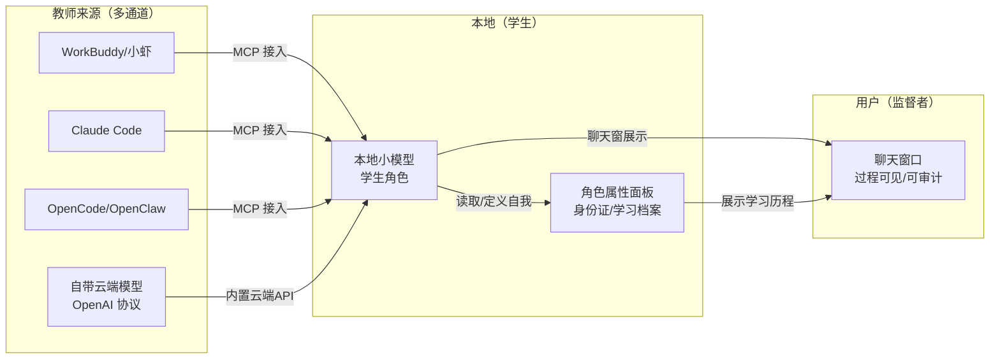
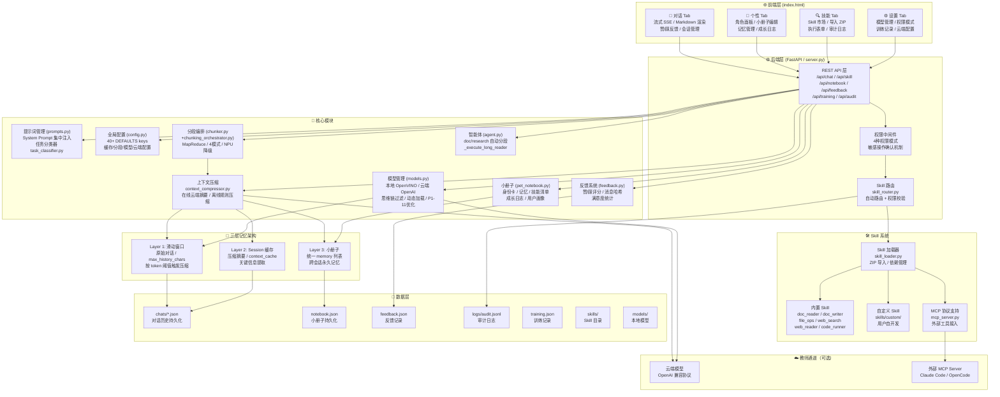
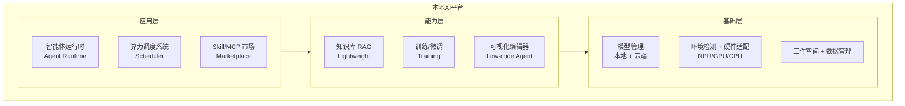
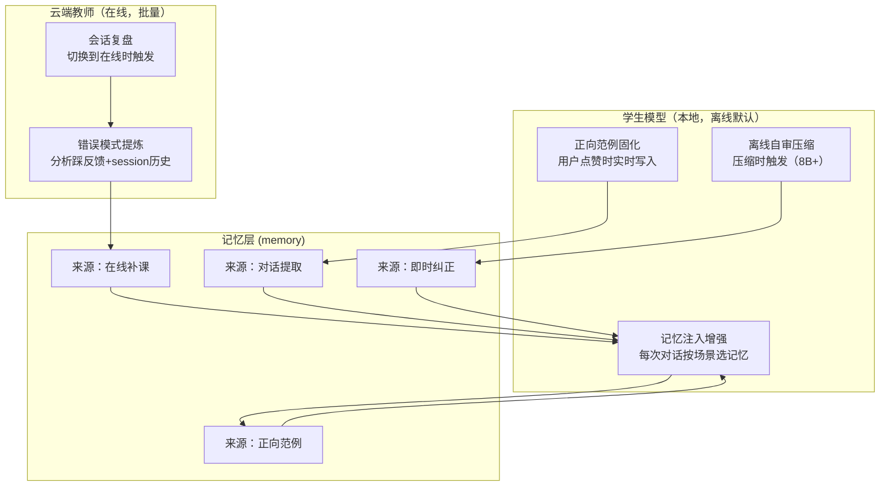
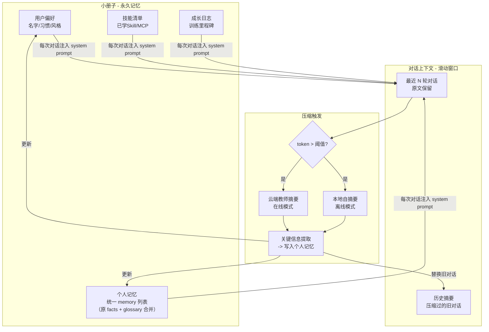
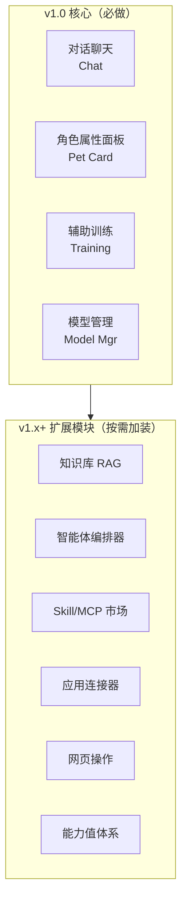
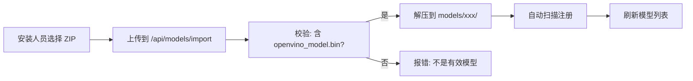
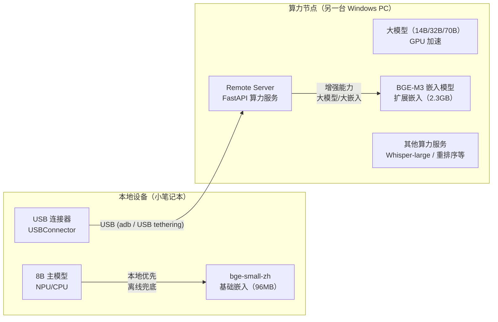
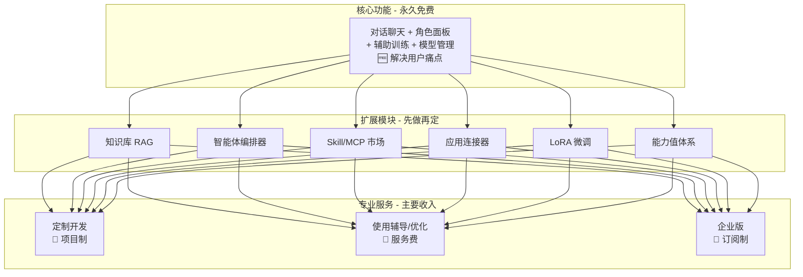

# 本地AI平台 ROADMAP

> **核心定位**：你的本地办公 AI 助手 — 数据不上网，模型跑本地
> **总目标**：用小模型实现高效的辅助日常办公 — "蚂蚁搬大象"解决方案
> **用户视角**：养一个本地 AI 小宠物 — 能互动、能干活、能学习、能成长，而且你的数据永远不离开你的电脑
> **解决痛点**：想要 AI 辅助办公但不想把数据上传云端；通过小模型+智能体，在本地完成日常办公任务
> **核心特色**：① 本地办公模型 — 写摘要、翻译、分析文档 ② 数据不上网 — 所有数据留在本机 ③ 越用越懂你 — 小册子记忆系统 ④ 能成长 — 通过训练和学习越来越聪明
> **关键说明**：Skill 和 MCP 均为标准协议接口，本平台独立运行
>
> //文档说明：这个不只是roadmap，是个详细开发文档，里面记录了"要做什么"、"怎么做"和"为什么这么做"，记录了开发一个可以本地伴你成长的小宠物的过程，它可以随着互动的深入越来越懂你

---

## 零、核心理念：知识蒸馏架构

本平台的三方协作不是简单的"工具集成"，而是一套**知识蒸馏**体系：



---

## 零点五、系统整体架构图

> v0.8 完整体系架构，涵盖前端、后端、模型层、Skill 系统、记忆系统



### 教师来源（三通道设计）

| 通道 | 说明 | 适合用户 |
|------|------|----------|
| **外部 AI 工具（MCP）** | 用户已有 Claude Code / OpenCode / WorkBuddy 等，通过 MCP 加入聊天当教师 | 开发者/高级用户 |
| **自带云端模型** | 平台内置 OpenAI 协议接口，直连云端大模型当教师 | 普通用户 |
| **纯离线模式** | 无需任何云端，用户自己当教师手动指导 | 隐私敏感用户 |

### 运行模式切换

| 模式 | 说明 |
|------|------|
| **离线模式** | 完全本地运行，无云端依赖，用户可手动指导训练 |
| **在线模式** | 连接云端模型（自带或外部 MCP），自动获取教师指导 |

用户可以随时通过界面上的**离线/在线切换按钮**在两种模式间切换。

### 关键设计原则
- **聊天窗是三方共用的** — 用户和本地模型对话，教师（无论来源）通过 MCP/云端API 介入，所有交流汇聚到一个聊天框
- **过程可见可审计** — 用户不需要信任黑盒，训练过程全程透明
- **蒸馏结果有形化** — 最终产出不仅是一个更好的模型，还有可视化的"角色面板"展示它的成长
- **教师来源灵活** — 不绑定任何特定 AI 工具，有外部工具用外部的，没有用自带的

---

## 一、产品架构总览



---

## 二、核心功能模块

### 1. 算力调度系统
| 功能 | 说明 | 优先级 |
|------|------|--------|
| 本地模型管理 | 一次仅允许加载一个 LLM，按需切换；动态扫描模型目录 | P0 ✅ 已实现 |
| 模型动态扫描 | 启动时自动扫描 `_models/` 目录发现可用模型，不再写死配置 | P0 ✅ 已实现 |
| 模型安装（在线）（不做了！！） | 设置页提供模型列表，在线下载+自动解压到 `_models/` | P1 |
| 模型安装（离线导入） | 设置页提供"导入模型"按钮，选择 zip 文件自动解压到 `_models/` | P1 |
| 重新扫描模型 | 导入新模型后点按钮刷新可用模型列表 | P1 |
| 云端模型接口 | OpenAI 协议兼容，可作为教师指导训练，也可增强本地推理 | P1 |
| 离线/在线模式切换 | 界面一键切换，离线模式完全本地运行 | P1 |
| 环境检测 | 安装时检测 NPU/GPU/内存，无 NPU 提示"环境配置过低"，建议硬件升级 | P1 |
| 一键自动修复 | 检测到环境问题自动安装依赖/驱动 | P2 |
| 硬件兼容检测 | NPU → NPU 模型；仅 GPU → GPU 模型；仅 CPU → CPU 模型（并提示性能受限） | P1 |
| NPU/GPU 模式切换 | 界面提供 NPU/GPU 切换按钮，v1.0 前可用，自动适配不同硬件 | P1 |

> **已知局限 — 思维链检测**：当前使用两层方案：
> 1. **标签对检测**（精确）：支持 `<think/thinking/reason/reasoning/thought>` 5 组标签，参考 Open WebUI 实现
> 2. **启发式兜底**（不精确）：48 条正则匹配推理语言模式，仅对 DeepSeek 1.5B 等不用标签的小模型生效
>
> 启发式方案**换模型就可能失效**（不同模型的推理风格不同），长期方案应通过模型配置文件标记"是否需要启发式检测"

### 2. 智能体系统（核心）
| 功能 | 说明 | 优先级 |
|------|------|--------|
| 智能体运行时 | 基于基础小模型执行多个专用智能体 | P0 |
| 智能体集群 | "蚂蚁搬大象" — 总指挥调度多个小智能体协同完成大任务 | P1 |
| 任务动态创建 | 根据任务自动编写/组合新的智能体 | P2 |
| 可视化编辑器 | 低代码拖拽式智能体流程编辑 | P2 |
| Tool Loop | 代理式 AI 工具调用循环（ReAct 模式） | P1 |
| MCP 协议支持 | 接入外部 MCP Server，扩展能力边界（标准协议） | P0 ✅ 已实现 |
| Skill 集成 | 搜索→安装→执行 Skill 的完整闭环（标准协议，非 WorkBuddy 专属） | P1 |

### 2.5 角色属性面板（"电子宠物"属性卡）

> **长期目标**：像养宠物一样养本地 AI — 互动、干活、学习、成长，面板就是它的"属性卡"

| 功能 | 说明 | 优先级 |
|------|------|--------|
| 角色身份证 | 展示本地模型的名称、性格、擅长领域、定位描述 | P1 |
| 学习历程 | 可视化展示模型的训练/微调历史、关键里程碑 | P1 |
| 能力雷达图 | 各维度能力值（问答、摘要、翻译、代码…）直观展示 | P2 |
| 自我认知 | 模型运行时读取面板信息确定自身角色和行为边界 | P2 |
| 成长轨迹 | 每次训练/反馈后的能力变化曲线 | P2 |
| 已学技能列表 | 展示模型已掌握的 Skill 和 MCP 能力 | P2 |
| 能力值体系（长期） | 类似 RPG 角色的能力值，随训练/使用逐步提升，形成养成感 | P3 长期 |
| 思考过程可视化 | 把模型的推理步骤按句分段展示，类似思维导图/流程图 | P2 |
| 思考过程翻译摘要 | 英文推理 → 自动摘要为中文展示（需额外调用一次模型） | P2 |

### 3. 训练与微调
| 功能 | 说明 | 优先级 |
|------|------|--------|
| 本地微调 | 基于基础模型训练专用智能体（LoRA 等） | P1 |
| 外部教师训练 | 通过 MCP 接入外部 AI 工具（Claude Code/OpenCode 等）当教师 | P2 |
| 内置云端训练 | 自带云端模型接口（OpenAI 协议），无需外部工具也能训练 | P2 |
| 纯离线训练 | 无云端依赖，用户手动指导 | P2 |
| 反馈驱动训练 | 用户满意度反馈 → 数据回流 → 迭代微调 | P2 |
| 知识库驱动训练 | RAG 知识库内容用于训练，降低幻觉 | P2 |
| @云端模型 | 聊天中可直接 @云端模型 加入对话进行即时指导 | P2 |

### 3.1 离线赋能与在线补课机制（v0.8 patch 4）

> **核心原则**：离线优先，云端仅作批量补课，不做实时干预
> **本质**：让本地学生模型从自身历史行为（反馈+压缩）中学习，在线时由云端教师批量补课提炼规律

#### 架构图



#### 三层赋能路径

| 路径 | 是否需要云端 | 触发时机 | 工程量 | 推荐度 |
|------|------------|---------|--------|--------|
| **正向范例固化** | ❌ | 实时（点赞时） | 小 | ★★★★★ |
| **踩反馈结构化** | ❌ | 实时（点踩时） | 小 | ★★★★☆ |
| **本地自审压缩** | ❌ | 压缩时（仅8B+） | 中 | ★★★★☆ |
| **会话复盘补课** | ✅ | 在线切换时 | 中 | ★★★★★ |

#### 正向范例固化（核心，离线实时）

```
用户点"赞"
    ↓
那段 QA 对自动标记为正向范例
    ↓
写入 memory：{type: "good_answer", question, answer, scenario, date}
    ↓
下次对话注入 system prompt 时，随机带 1 条正向范例
    ↓
遇到类似问题时，本地模型有"见过类似好答案"的语境
```

**与现有机制的区别**：
- 现有压缩只提取"关键事实"，不保存完整问答对
- 正向范例固化保存的是"好答案长什么样"，不是"记住这件事"

#### 会话复盘补课（核心，在线批量）

```
用户从离线切换到在线
    ↓
系统检测：离线期间的踩反馈 + 未压缩 session
    ↓
弹窗提示："检测到 N 条踩反馈，是否启动云端补课？"
    ↓
云端教师分析：
  - 读离线期间积累的踩反馈（含结构化原因）
  - 读未压缩的 session 历史
  - 输出："学生模型典型错误模式"清单（按问题类型）
    ↓
写入 memory（source=在线补课）
    ↓
下次离线对话，memory 注入 → 学生遇到同类问题时表现改善
```

**关键设计点**：云端不是替学生回答，而是提炼"这类问题应该怎么想"的规律

#### 记忆注入增强

- 当前：memory 静态注入，无差异化
- 改进：按 task_classifier 结果（reasoning/code/text/agent），从 memory 中选最相关的正向范例优先注入
- 简化实现：不做复杂排序，只是正向范例权重提高（注入时多带 1 条）

#### 离线自审压缩（仅 8B+ 模型）

- 1.5B 模型：降级为普通摘要（自审能力不足）
- 8B+ 模型：压缩 prompt 升级为结构化自审模板

---

### 3.5 训练管理 Tab
| 功能 | 说明 | 优先级 |
|------|------|--------|
| 训练记录 | 展示所有训练/微调历史，每次训练的参数、数据量、耗时 | P1 |
| 模型版本管理 | 微调产出的模型版本列表，可回滚到任意版本 | P1 |
| 训练成果对比 | 微调前后的效果对比（基准测试 + 实际案例） | P2 |
| 模型导出 | 将微调后的模型打包为可部署的格式 | P2 |
| 训练任务队列 | 排队管理多个训练任务 | P2 |

### 4. 知识库（轻量化 RAG）
| 功能 | 说明 | 优先级 |
|------|------|--------|
| 文档导入 | 支持 PDF/Word/TXT/Markdown 等格式 | P1 |
| 向量索引 | 轻量本地向量存储（如 SQLite + 向量扩展） | P1 |
| 检索增强 | 智能体回答前先检索知识库，提升准确性降低幻觉 | P1 |
| 与训练联动 | 知识库数据可用于微调，从 RAG 升级到模型内化 | P2 |

### 5. 反馈机制
| 功能 | 说明 | 优先级 |
|------|------|--------|
| 满意/不满意 | 每次回答后可标记满意度 | P1 |
| 数据回流 | 反馈数据用于后续微调优化 | P2 |
| 自动评估 | 云端模型定期评估本地智能体质量 | P2 |

### 6. Skill 搜索与市场
> Skill 是标准协议接口（类似 MCP），非 WorkBuddy 专属，本平台独立实现

| 功能 | 说明 | 优先级 |
|------|------|--------|
| 能力自检 | 用户提问 → 平台自检是否有对应 Skill | P1 |
| 市场搜索 | 本地没有 → 去市场搜索 → 推荐安装 | P1 |
| 一键安装 | 用户确认后自动安装 Skill 及依赖 | P1 |
| 能力路由 | 自动判断用哪个 Skill/MCP 完成任务 | P1 |

### 7. 三层记忆架构（"小册子" + Session 缓存 + 上下文压缩）

> **核心问题**：小模型上下文有限，对话一天就爆；没有持久记忆，每次重启都是陌生人。
> **解决方案**：
>   Layer 1: 近期对话（原始，短窗口）→ 按 max_history_chars 动态截断
>   Layer 2: Session 缓存（压缩摘要）→ 旧消息压缩为摘要，存在 session JSON 的 context_cache
>   Layer 3: Notebook 小册子（跨会话永久记忆）→ 从缓存蒸馏关键事实
> **触发条件**：上下文字符数 > max_history_chars * 0.8（按模型大小动态），不是按轮次



#### 小册子设计

| 板块 | 内容 | 更新时机 | 大小控制 |
|------|------|----------|----------|
| **身份卡** | 名字、性格、定位 | 角色创建/训练后 | 固定 ~200 token |
| **用户画像** | 用户怎么称呼、沟通风格、使用偏好（由对话中自然采集，非硬编码） | 首次提及/定期刷新 | ~300 token |
| **个人记忆** | 关键事实+私有术语统一存储（合并原 facts/glossary），支持手动增/删/改 | 对话提取/即时纠正/手动添加 | 滚动保留 ~900 token |
| **技能清单** | 已装 Skill/MCP | 安装时 | ~200 token |
| **近期摘要** | 最近 N 天对话的压缩版 | 每次压缩触发 | ~500 token |

> **v0.8 patch 规划变更**：原 facts（列表）+ glossary（字典）两套存储合并为统一 `memory` 列表，每条 `{type, content, source, date}`。前端 Tab 从"知识库"改名为"记忆"，支持按来源筛选（纠正/对话提取/手动添加）。

**总计 ~2100 token**，作为 system prompt 注入，1.5B 模型也完全可承受。

#### 个人记忆设计（v0.8 patch 规划变更）

> **解决的问题**：原 facts（列表）+ glossary（字典）是同一种数据的两种形态，却用两个存储，用户感知不统一，且不支持手动编辑已有条目。
> **解决方案**：合并为统一 `memory` 列表，前端 Tab 从"知识库"改名为"记忆"。

**统一 memory 列表结构**：
```json
[
  {"type": "fact",   "content": "用户叫 slow，住在北京",                 "source": "对话提取", "date": "2026-05-17"},
  {"type": "term",   "term": "ABC", "definition": "公司内部自动化测试框架", "source": "手动添加", "date": "2026-05-17"},
  {"type": "fact",   "content": "用户偏好简洁回答，不要啰嗦",             "source": "即时纠正", "date": "2026-05-17"}
]
```

**来源类型**：`对话提取` / `即时纠正` / `手动添加` / `批量导入`

**个人记忆注入格式**（system prompt 的一部分）：
```
[个人记忆 - 术语]
ABC = 公司内部自动化测试框架，用于回归测试
```

**更新方式**：
1. **即时纠正**：选中 AI 回复文字 → "这里不对" → 输入正确内容 → 存入记忆（来源=即时纠正）
2. **手动添加**：记忆 Tab → 新增记忆 → 选择类型（事实/术语）→ 填写内容
3. **批量导入**：支持 `术语=解释` 格式批量导入
4. **对话提取**：压缩时自动提取关键事实

> **重要设计原则**：小册子的用户画像和关键事实是**完全动态采集**的，不预设任何用户信息。
> 产品面向大众用户，每个用户的画像不同 — 有人是程序员，有人是学生，有人是家庭主妇。
> 所有用户信息只来自两种途径：(1) 对话中自然提及后自动提取；(2) 用户手动在设置页填写。
> 绝不在代码中硬编码任何默认用户信息。

小册子就是一个 JSON/Markdown 文件，存在工作空间里，类似 WorkBuddy 的 MEMORY.md 但更结构化。

#### 上下文压缩策略

| 策略 | 适用模式 | 原理 | 质量 |
|------|----------|------|------|
| **云端教师摘要** | 在线 | 把旧对话发给云端大模型，让它压缩成摘要 | 高，但依赖云端 |
| **本地自摘要** | 离线 | 让本地模型自己读旧对话写摘要 | 中，1.5B 可能丢细节 |
| **抽取式压缩** | 离线 | 不生成新文本，只保留关键词/实体提取 | 低，但不丢原始信息 |
| **混合模式** | 优先在线 | 在线用云端压缩，离线降级为本地自摘要 | 最优 |

#### 压缩触发条件

| 模型 | 上下文长度 | 触发阈值（60%） | 留白（40%） |
|------|-----------|----------------|-------------|
| 1.5B | ~32K token | ~19K token | ~13K token |
| 8B | ~64K token | ~40K token | ~24K token |

#### 压缩流程

1. 检测 token 超 threshold
2. 把"窗口外"的旧对话送去压缩（云端/本地）
3. 提取关键信息写入小册子
4. 旧对话替换为一段压缩摘要
5. 释放 token 空间，继续聊

### 8. 工作空间与数据管理
| 功能 | 说明 | 优先级 |
|------|------|--------|
| 安装目录 | 用户自选安装路径，所有运行文件集中管理 | P1 |
| 工作空间 | 默认在安装目录下，所有数据统一存放 | P1 |
| 按天归档 | 每天自动创建工作目录，存放当天对话/缓存/产出 | P1 |
| 记忆系统 | 独立于工作目录，跨会话持久化的长期记忆 | P1 |
| 文件产出 | 智能体生成的文件默认存入当天工作目录 | P1 |

### 9. 能力扩展（"宠物"的爪子）

> 本地 AI 不只是聊天，它能实际操作你的电脑帮你干活

| 功能 | 说明 | 优先级 |
|------|------|--------|
| 应用连接器 | 连接本地应用（浏览器、Office、邮件客户端等），实现自动化操作 | P2 |
| 网页操作 | 通过浏览器自动化直接操作网页（填表、点击、提取信息） | P2 |
| 文件系统操作 | 读写、整理、归档本地文件 | P1 |
| 系统工具调用 | 执行命令行、脚本、批处理等系统级操作 | P2 |
| API 连接器 | 对接第三方服务的 REST API（如天气、日程、消息推送） | P2 |

---

## 三、模块化架构：核心 + 扩展

**v1.0 的原则：核心必须轻，扩展可以慢慢加。**



### v1.0 核心 = 四件事

> **定价原则**：核心功能全部免费（解决用户痛点），扩展功能先做再定价，收入来自专业服务和定制开发。

| 模块 | 做什么 | 不做什么 | 免费？ |
|------|--------|----------|--------|
| **对话聊天** | 流式对话、多模型切换、离线/在线切换、三方聊天窗 | 不做 Skill 搜索、不做工具调用 | ✅ 免费 |
| **角色属性面板** | 宠物身份证、学习历程、已学技能展示 | 不做 RPG 能力值、不做雷达图 | ✅ 免费 |
| **辅助训练** | MCP 接入外部教师、自带云端教师、训练记录、模型版本管理 | 不做 LoRA 微调、不做自动训练 | ✅ 免费 |
| **模型管理** | 按需加载、LLM 互斥、环境检测、模型下载列表 | 不做智能体集群、不做 Tool Loop | ✅ 免费 |

### v1.0 不做的（放到扩展模块）

| 原功能 | 归属 | 理由 |
|--------|------|------|
| 知识库 RAG | 扩展模块 | 不是每个用户都需要，且依赖向量库等额外组件 |
| 智能体可视化编排 | 扩展模块 | 开发量大，v1.0 先跑通基础流程 |
| Skill 搜索市场 | 扩展模块 | 需要市场生态，不是首版能搞定的 |
| 应用连接器 | 扩展模块 | 需要逐个适配，优先级低 |
| 网页操作 | 扩展模块 | 依赖浏览器自动化，安全性需设计 |
| 能力值/RPG 体系 | 长期愿景 | 好想法但需要大量游戏化设计 |
| 智能体集群 | 扩展模块 | 先有单个智能体跑通，再搞集群 |
| LoRA 微调 | 扩展模块 | 技术门槛高，先做训练管理界面 |
| 企业版 | v2.0 | B 端需求，v1.0 先做 C 端 |

---

## 四、模型获取

> 本平台全面拥抱 Qwen3 系列，专门针对 Qwen3 做优化，其他模型仅兼容。

### 可用模型（OpenVINO INT4，NPU 加速）

| 模型 | HuggingFace 仓库 | 预估大小 | 推荐场景 |
|------|------------------|---------|----------|
| **Qwen3-0.6B** | `OpenVINO/Qwen3-0.6B-int4-ov` | ~600MB | 超轻量：极速响应，简单问答/摘要 |
| **Qwen3-1.7B** | `OpenVINO/Qwen3-1.7B-int4-ov` | ~1.2GB | 轻量：快速+基本理解 |
| **Qwen3-4B** | `OpenVINO/Qwen3-4B-int4-ov` | ~2.2GB | 均衡：速度与质量甜点 |
| **Qwen3-8B** | `OpenVINO/Qwen3-8B-int4-ov` | ~4.4GB | **主力：复杂对话/推理/翻译（推荐）** |
| **Qwen3-14B** | `OpenVINO/Qwen3-14B-int4-ov` | ~7GB | 高端：强推理/长文本（需独立 GPU） |

### 使用下载脚本

项目根目录下有 `download_qwen3.py` 一键下载脚本：

```bash
# 交互选择（推荐首次使用）
python download_qwen3.py

# 只下载指定尺寸
python download_qwen3.py 0.6b 8b

# 下载全部
python download_qwen3.py --all

# 查看可用模型
python download_qwen3.py --list

# 指定下载目录
python download_qwen3.py --dir D:\my-models
```

**下载目录**：默认下载到脚本所在目录的 `models/` 子目录。下载完成后直接可用，无需额外转换。

**下载源**（三选一）：
- `--source modelscope`（默认，阿里云 CDN，国内最快，推荐）
- `--source hf-mirror`（HuggingFace 镜像，备选）
- `--source huggingface`（直连 HuggingFace，需翻墙）

**已下载文件自动跳过**：同一文件大小一致不重复下载。

---

## 五、版本迭代计划（模块化）

### v0.1 ✅ 已完成
- FastAPI + Gradio 聊天界面
- 本地 LLM NPU 加速（全线适配 Qwen3 系列：0.5B ~ 32B）
- OCR (RapidOCR)
- MCP Server (小虾可调用本地能力)
- 三方协作验证 (slow ↔ 小虾 ↔ 本地助手)

### v0.2 ✅ 已完成
- 流式输出（打字机效果）
- LLM 互斥加载
- MCP → HTTP API 共享模型实例
- 思维链过滤
- 按需加载按钮

### v0.3 ✅ 已完成（UI 优化 + 体验打磨）

- 思维链分离：`chat_stream()` 输出分 think/response 两段，前端折叠区域显示
- 统计信息 tag 化：底部统计改为内联标签样式
- 模型选择联动：Dropdown 动态读取已加载模型
- 设置选项卡：模型加载/卸载按钮、当前模型状态、环境信息
- UI 全面打磨：聊天窗口高度自适应、Markdown 渲染、会话切换修复、模型显示紧凑化
- 动态模型选择：优先级列表自动选 DEFAULT_LLM，不再硬编码
- 全面适配 Qwen3 系列（0.6B ~ 14B）

### v0.4 ✅ 已完成（对话体验完善 + 滑动窗口）

- OCR Tab 优化，支持拖拽上传图片
- 对话历史持久化，保存到本地 JSON
- 多轮对话上下文正确传递
- 滑动窗口：保留最近 N 轮原文，超出硬截断，防止上下文爆炸
- 错误处理美化：友好提示代替报错文本
- 模型历史清洗：`<details>` 标签彻底清理 + 轮次限制，防止模型"套娃"

### v0.4.5 ✅ 已完成（小册子系统 — 让 AI "记住你"）

> 小册子 = 电子宠物的"长期记忆"，有了它角色面板才有东西展示

| # | 任务 | 文件 | 具体内容 |
|---|------|------|----------|
| 1 | 小册子数据结构 | `pet_notebook.py` ✅ | 身份卡、用户画像、关键事实、**术语库**、技能清单、近期摘要 六个板块 |
| 2 | System Prompt 注入 | `models.py` ✅ | 每次对话前自动读取小册子，拼接为 system prompt 前缀 |
| 3 | 关键信息提取 | `pet_notebook.py` ✅ | 对话中检测用户名/城市/项目等实体，自动写入小册子 |
| 4 | 术语库管理 | `pet_notebook.py` + `server.py` ✅ | 私有术语表：手动添加/删除 + 批量导入（术语=解释格式） |
| 5 | 术语库注入 | `models.py` ✅ | 术语库自动注入 system prompt，格式为 `术语 = 解释` |
| 6 | 小册子持久化 | `pet_notebook.py` ✅ | 保存为 JSON 文件到工作空间，重启后自动加载 |
| 7 | 手动编辑接口 | `server.py` ✅ | 🦐个性 Tab 提供小册子编辑入口，含用户画像/关键事实/术语库管理 |
| 8 | **[BUG]** session 选择框 | `server.py` ✅ | 切换 session 后正确显示当前名称 |
| 9 | **[BUG]** 选图片后无法输入 | `server.py` ✅ | 允许同时输入文字和图片 |
| 10 | **[BUG]** 空白消息可发送 | `server.py` ✅ | 阻止空白消息发送 |
| 11 | **[BUG]** 多余发送按钮 | `server.py` ✅ | 只保留一个发送按钮 |
| 12 | **[BUG]** 停止不彻底 | `models.py` ✅ | 停止按钮可靠中断模型生成 |

### v0.5 ✅ 已完成（纯 HTML 前端重写 + 体验打磨）

> **重大架构变更**：彻底去掉 Gradio 6，改为 FastAPI + 纯 HTML/JS 前端。
> 原因：Gradio 6 的 Tab 组件存在渲染死锁 bug（MutationObserver 冲突、Dropdown 校验崩溃），无法修复。
> 纯 HTML 不存在虚拟 DOM 冲突，彻底解决页面卡死问题。

| # | 任务 | 文件 | 状态 | 具体内容 |
|---|------|------|------|----------|
| 1 | 去掉 Gradio 依赖 | `server.py` | ✅ | 删除 `import gradio` 和所有 Gradio UI 代码（~600行） |
| 2 | 纯 HTML/JS 前端 | `index.html` | ✅ | 单页应用：💬对话/🦐个性/🔍OCR/⚙️设置 四 Tab |
| 3 | SSE 流式对话 | `server.py` + `index.html` | ✅ | `POST /api/chat/stream` 返回 SSE，前端 ReadableStream 消费 |
| 4 | 对话管理 REST API | `server.py` | ✅ | 新建/切换/删除/列表 对话，文件存储在 `chats/` 目录 |
| 5 | 小册子 REST API | `server.py` | ✅ | 用户画像/关键事实/术语库 CRUD（含删除） |
| 6 | 模型加载 loading 提示 | `index.html` | ✅ | 全局 spinner 遮罩 + 按钮状态切换 |
| 7 | 小册子 UI 优化 | `index.html` | ✅ | 用户画像表格化、关键事实/术语库可逐条删除 |
| 8 | Markdown 渲染修复 | `index.html` | ✅ | 代码块未闭合兜底、列表/引用/标题正确渲染 |
| 9 | 统计数据修复 | `server.py` + `index.html` | ✅ | 速度 = (正文+思考)/总时间，显示思考字数 |
| 10 | SSE 渲染节流 | `index.html` | ✅ | 80ms 节流避免每个 token 都操作 DOM |
| 11 | 第二次发送 bug | `index.html` | ✅ | assistant 消息补全所有字段，renderMsg 加 null check |

**v0.5 设计决策**（已记录）：
- 无模型下载器，用户手动放模型到 `models/`
- 环境检测只做提示不阻断
- 标题改为"本地办公 AI 助手 — 数据不上网，模型跑本地"
- 服务：FastAPI + 纯 HTML/JS，端口 8976

**完成标准**：页面不再卡死 → 流式对话流畅 → Markdown 正确渲染 → 多轮对话不崩溃 → 小册子可编辑可删除

### v0.5.1 ✅ 已完成（Bug 修复）

> v0.5 上线后用户测试发现的小问题，统一修复

| # | Bug | 文件 | 状态 | 修复内容 |
|---|-----|------|------|----------|
| 1 | Session 删除未删 JSON | `server.py` + `index.html` | ✅ | 后端 `os.remove` 确认 + `_current_chat_file` 重置；前端先清空 `currentChatFile` 再请求 |
| 2 | 未加载模型发消息无提示 | `index.html` | ✅ | `sendMessage()` 前检查 `modelTag` class，未加载弹 alert |
| 3 | 模型管理 UI 重构 | `index.html` + `server.py` | ✅ | OCR 不显示在列表；NPU/GPU 灰色标签（CPU 不显示）；预留离线/在线红绿标签；加载/卸载/切换合并为一个按钮 |
| 4 | System prompt 过度思考 | `models.py` | ✅ | 精简为"用中文简洁回答。直接给出答案，不要重复问题。"去掉 env_info 注入，让小册子上下文机制发挥作用 |

### v0.5.2 ✅ 已完成（自动续写 + 前端修复）

| # | 任务 | 文件 | 状态 | 具体内容 |
|---|------|------|------|----------|
| 1 | 自动续写机制 | `server.py` | ✅ | `_is_output_incomplete()` 检测截断 → 自动追加"继续"再生成一次 |
| 2 | 离线模式标签 | `index.html` | ✅ | 状态栏首位显示"正在使用本地AI模型"（绿色） |
| 3 | 未加载设备显示 | `index.html` | ✅ | 无模型时设备标签显示"--" |
| 4 | Session 删除切换 | `index.html` | ✅ | 删除后自动切到最近的 session |
| 5 | 思考动画 | `index.html` | ✅ | 等待时显示脉动动画 |
| 6 | 思考样式 | `index.html` | ✅ | 思考内容灰色斜体+折叠 |
| 7 | 智能滚动 | `index.html` | ✅ | 新消息时自动滚到底部 |

### v0.5.3 ✅ 已完成（模型管理修复 + 标签优化）

| # | 任务 | 文件 | 状态 | 具体内容 |
|---|------|------|------|----------|
| 1 | 重新扫描按钮 | `server.py` + `index.html` | ✅ | `/api/rescan` 端点 + 前端调用 + 加载动画 |
| 2 | 设备标签优化 | `index.html` | ✅ | "NPU模式"/"GPU模式"，未加载显示"--" |
| 3 | 在线标签优化 | `index.html` | ✅ | 有模型→"正在使用本地AI模型"（绿色），无→"--" |
| 4 | Session 删除修复 | `server.py` | ✅ | 后端不再自动新建 session，只重置指针 |
| 5 | 刷新加载动画 | `index.html` | ✅ | 按钮禁用+"刷新中..."文字变化 |
| 6 | 立即思考指示器 | `index.html` | ✅ | 发送后立刻显示"正在思考"，不等 SSE |
| 7 | 思考内容全展示 | `index.html` | ✅ | 去掉 max-height 限制 |
| 8 | 跳到底部按钮 | `index.html` | ✅ | 距底部 >120px 时显示浮动按钮 |

### v0.5.4 ✅ 已完成（响应过滤器 + Prompt 优化 + 截断增强）

> **核心目标**：降低小模型幻觉和截断问题，提升输出完整性

| # | 任务 | 文件 | 状态 | 具体内容 |
|---|------|------|------|----------|
| 1 | 响应过滤器 | `response_filter.py` (新) | ✅ | 幻觉检测/未闭合结构/思考外泄/重复段落，前端黄色标签展示警告 |
| 2 | System Prompt 优化 | `models.py` | ✅ | 4条硬规则：不复述、ASCII变量名、修bug直接给代码、简洁优先 |
| 3 | 截断检测增强 | `server.py` | ✅ | 新增空代码块检测、"应该是："无内容检测、多模式截断识别 |
| 4 | 过滤器集成 | `server.py` + `index.html` | ✅ | SSE `filter` 事件类型，前端渲染警告标签 |
| 5 | max_tokens 提升 | `server.py` | ✅ | 非流式 512→4096，流式不变（已为 4096） |

### v0.6 环境适配 + 云端模型 + 模型 ZIP 导入 + 智能任务分类

> **设计思路**：模型和 Skill 一样，由安装人员通过网页导入 ZIP 文件。
> 安装人员不需要了解目录结构，ZIP 里有什么程序自动识别。
> 导入过程有进度显示，安装人员知道在干什么。
> 智能任务分类器根据消息内容自动调整思考空间，翻译类任务速度提升 78%。

| # | 任务 | 文件 | 具体内容 |
|---|------|------|----------|
| 1 | 模型 ZIP 导入 API | `server.py` | `POST /api/models/import` — 接收 ZIP → 校验 openvino_model.bin → 解压到 `models/` → 自动扫描注册。SSE 流式进度反馈 |
| 2 | 模型导入 UI | `index.html` | 设置页新增"导入模型"区域：文件选择 + 进度条 + 结果提示 |
| 3 | 环境检测（轻量） | 新文件 `env_check.py` | 检测 CPU/GPU/NPU/内存，生成硬件报告；弱性能在配置页显示黄色提示，用户可忽略 |
| 4 | NPU/GPU 模式切换 | `models.py` + `server.py` | 界面提供切换按钮，自动选择对应 device 加载模型（NPU/GPU） |
| 5 | 云端模型接口 | `models.py` | 新增 OpenAI 协议客户端，可调用云端 API 做推理 |
| 6 | 离线/在线切换 | `server.py` | 设置界面有个切换按钮，在线模式自动路由到云端 |
| 7 | 设置页增强 | `server.py` | 硬件信息展示、NPU/GPU切换、云端 API Key 配置 |
| 8 | 云端压缩 | `pet_notebook.py` + `models.py` | 在线模式下，token 超阈值时用云端教师压缩旧对话，提取关键信息写入小册子 |
| 9 | Session 互锁 | `index.html` | 生成中禁止切换/新建/删除 session，纯前端拦截 |
| 10 | **智能任务分类器** | 新文件 `task_classifier.py` + `models.py` + `server.py` + `index.html` | 加权关键词评分：reasoning(完整思考) / code(精简思考) / text(关闭思考)；Qwen3 `/no_think` 原生支持；上下文继承；SSE 透传分类结果；状态栏展示当前任务类型 |

#### 模型 ZIP 打包规范

安装人员导入的 ZIP 文件支持两种结构：

**格式 A — 目录 ZIP（推荐）**：
```
model.zip
└── qwen3-8b/                  # 模型目录
    ├── openvino_model.bin      # 必须：模型权重
    ├── openvino_model.xml      # 必须：模型结构
    ├── config.json             # 必须：模型配置
    ├── tokenizer.json          # 必须：分词器
    ├── tokenizer_config.json   # 可选
    ├── special_tokens_map.json # 可选
    └── ...                     # 其他文件原样保留
```

**格式 B — 扁平 ZIP**：
```
model.zip
├── openvino_model.bin
├── openvino_model.xml
├── config.json
├── tokenizer.json
└── ...
```
→ 自动创建以 ZIP 文件名命名的子目录。

**导入流程**：



**完成标准**：安装人员在设置页选 ZIP → 看到进度条 → 完成后模型自动出现在列表 → 直接加载使用

### v0.6.1 ✅ 已完成（分类器 v3 + 8B Prompt 优化）

> 分类器全面重写，156 个测试用例 100% 通过，平均 10.6μs/分类。
> 8B 模型 system prompt 从 ~200 字精简到 ~80 字，5 条规则清晰直接。

| # | 改动 | 文件 | 说明 |
|---|------|------|------|
| 1 | 分类器 v3 重写 | `task_classifier.py` | 检测顺序 CODE→MATH→TEXT；强信号全面扩充；code 类型改用 `/no_think` |
| 2 | System Prompt 优化 | `models.py` | 5 条规则，每条 ≤20 字，动词开头，无废话 |
| 3 | 云端 Prompt 同步 | `cloud_provider.py` | 云端 system prompt 同步精简 |
| 4 | 测试套件 | `test_classifier_v3.py` | 156 用例（code 51 + reasoning 26 + text 79），含历史继承/主题漂移测试 |

### v0.6.2 ✅ 已完成（Session 008 Bug 全量修复 + Cloud 设计修正）

> Session 008 暴露 9 个问题，从 Pipe 腐化到 Think 标签泄漏，全量修复。
> Cloud provider v0.4：修正设计思路，用户 Base URL 神圣不可侵犯。

| # | 改动 | 文件 | 说明 |
|---|------|------|------|
| 1 | Pipe 空输出检测+自恢复 | `models.py` | 0-token 检测 → 自动卸载重载 → 重试一次 |
| 2 | Dangling Think fold | `models.py` | `_looks_like_reasoning()` 启发式 + fold 推理内容 |
| 3 | 正文缺失续写 | `server.py` | think 占满 token → 追加 `/no_think` 再生成正文 |
| 4 | 空回复 error 事件 | `server.py` | SSE `{"type": "error"}` 前端可见提示 |
| 5 | 错误不保存历史 | `server.py` | `[ERROR]` 消息不入 chat history |
| 6 | Cloud 设计修正 | `cloud_provider.py` v0.4 | 去掉 fallback/coding 自动修正，用户 URL 100% 原样，错误引导用户检查 |
| 7 | Cloud 分类器集成 | `server.py` | 云端路径也调用 classify_task，SSE 传 task_type |
| 8 | Cloud 模型名修正 | `server.py` | 使用 config 实际模型名而非 fallback "cloud" |
| 9 | 测试套件 | `test_v062_multi_turn.py` | 37 用例覆盖全部修复，100% 通过 |

### v0.7 ✅ 已完成（质量强化 + 技术债清理）

> **版本策略说明**：原 ROADMAP v0.7 规划的是"角色面板 + Skill 系统"，但实际 v0.7 做了技术债清理和质量强化。
> 原规划的功能合并到 v0.8。不回退版本号，往前推。

| # | 改动 | 文件 | 说明 |
|---|------|------|------|
| 1 | prompts.py 共享提示词 | `prompts.py` (新) | 系统提示词集中管理，魔法数字常量化 |
| 2 | 幻觉检测 v1.3 | `response_filter.py` | 5 类检测 + 用户意图感知 + 数学矛盾增强 + Markdown 格式检测 + 纠正建议 |
| 3 | CODE_REVIEW_REPORT 一波清 | 全部 | 41 项中 39 项已修复（2 won't fix） |
| 4 | API Key XOR 混淆 | `cloud_provider.py` | hostname+username 盐值 XOR 编码，零外部依赖 |
| 5 | urllib -> requests | `cloud_provider.py` | 连接池 + 更清晰异常 |
| 6 | Pydantic 校验 | `server.py` | ChatRequest 模型验证 API 输入 |
| 7 | 日志分级 | `server.py` | `LOCAL_AI_LOG_LEVEL` 环境变量控制 |
| 8 | 语义偏差纠正 | `task_classifier.py` v5 | drift_level(drift_level) + drift_hint 自动注入 + 三级漂移策略 |
| 9 | 幻觉检测测试 | `test_hallucination.py` | 59 个单元测试，覆盖全部检测类型 |
| 10 | 设备 token 探测 | `models.py` | 加载时读 pipe.m_max_prompt_len + 缓存 + overflow 自动降级 |

### v0.8 Skill 系统 + 权限体系 + 角色面板 + 训练管理（合并版）+ v0.8 patch 4

> **核心设计原则**：Skill 和模型都由安装人员负责安装，网页只需要一个"导入ZIP"按钮。
> 离线办公是核心定位，Skill 不能依赖网络。
> 小模型不靠谱，文件操作必须脚本化，避免误操作。
>
> **本版本合并了原 ROADMAP v0.7（角色面板+Skill）和原 v0.8（训练+权限）的全部功能。**
> **详细开发计划见 `V0.8_DEV_PLAN.md`**
>
> **v0.8 patch 4 新增**：配置中心化 + 长文本分段 + QA 幻觉控制 + 文档引用 UI + NPU 兼容增强

#### Skill 打包规范

每个 Skill 是一个 ZIP 文件，解压到 `skills/` 目录后形成如下结构：

```
skills/
└── my-skill/                    # 技能目录（ZIP 文件名 = 目录名）
    ├── skill.json               # 技能元数据（必须）
    ├── main.py                  # 技能入口脚本（必须，脚本化执行）
    ├── README.md                # 技能说明（可选）
    └── assets/                  # 附加资源（可选）
        └── template.docx        # 模板文件等
```

**skill.json 格式**：

```json
{
  "name": "word-reader",
  "version": "1.0.0",
  "description": "读取 Word 文档内容",
  "type": "tool",
  "author": "安装人员",
  "capabilities": ["file-read", "docx"],
  "inputs": [
    {"name": "file_path", "type": "string", "required": true, "description": "Word 文件路径"}
  ],
  "outputs": [
    {"name": "text", "type": "string", "description": "提取的文本内容"}
  ],
  "dependencies": ["python-docx"],
  "max_output_chars": 8000,
  "timeout_seconds": 30,
  "permissions": ["file-read"]
}
```

**导入流程**：设置页 → "导入技能" 按钮 → 选择 ZIP → 解压到 `skills/` → 自动读取 `skill.json` 注册。

#### v0.8 任务列表（23 项，分 4 个 Sprint）

> 详细开发计划在 `V0.8_DEV_PLAN.md`，这里只列核心项

**Sprint 1: Skill 框架 + 基础技能（7 项）** -- 已完成

| # | 任务 | 文件 | 具体内容 | 状态 |
|---|------|------|----------|------|
| 1 | Skill 框架 | 新文件 `skill_loader.py` | ZIP 导入 -> 解压 -> 读 skill.json -> 注册到技能列表 | done |
| 2 | Skill 执行引擎 | `skill_loader.py` | 参数校验 -> subprocess 执行 -> 超时控制 -> 结果捕获 | done |
| 3 | 文件操作技能 | 新文件 `skill_fileops.py` | 脚本化文件操作：列出目录、搜索文件、读取文本内容（白名单安全） | done |
| 4 | Word 读取技能 | 新文件 `doc_reader.py` | 分段读取 .docx：首段+尾段+标题摘要，支持追问详细段落 | done |
| 5 | Word 生成技能 | 新文件 `doc_writer.py` | 基于模板生成 .docx：报告模板、摘要模板、信函模板 | done |
| 6 | Skill REST API | `skill_router.py` + `server.py` | `/api/skill/import`、`/api/skill/list`、`/api/skill/execute`、`/api/skill/{name}` | done |
| 7 | Skill Tab 前端 | `index.html` | 技能 Tab + ZIP导入 + 执行表单 + 审计日志 | done |

**Sprint 2: 权限系统 + 审计日志（6 项）** -- 已完成

| # | 任务 | 文件 | 具体内容 | 状态 |
|---|------|------|----------|------|
| 8 | 权限模式定义 | 新文件 `permissions.py` | 4 种模式：问答/规划/执行/员工，不同权限级别 | done |
| 9 | 权限检查中间件 | `permissions.py` + `skill_router.py` | Skill 执行前检查权限 + skill.json permissions 声明 | done |
| 10 | 前端权限选择 | `index.html` | 发送按钮旁边下拉菜单切换权限模式 | done |
| 11 | 操作确认机制 | `skill_router.py` + `index.html` | 敏感操作返回 202 需确认 | done |
| 12 | 审计日志 | 新文件 `audit_log.py` | JSON Lines 格式记录所有 Skill 操作 | done |
| 13 | 审计查看 UI | `index.html` | 技能 Tab 下审计记录列表 + 筛选 | done |

**Sprint 3: 角色面板 + 训练管理（5 项）** -- 已完成

| # | 任务 | 文件 | 具体内容 | 状态 |
|---|------|------|----------|------|
| 14 | 角色面板数据 | `pet_notebook.py` v1.2 | 技能同步 + 成长日志(milestones) + 身份卡 | done |
| 15 | 角色面板 UI 优化 | `index.html` | 个性 Tab：角色身份证卡 + 已学技能 + 成长日志 | done |
| 16 | 训练管理数据结构 | 新文件 `training.py` | 训练记录：时间/模型/参数/数据量/耗时/评分 | done |
| 17 | 训练管理 API | `training.py` + `server.py` | 记录 CRUD + 参数模板 + JSON/CSV导入导出 | done |
| 18 | 训练管理 UI | `index.html` | 训练 Tab：记录列表 + 统计 + 模板 + 导入导出 | done |

**Sprint 4: 反馈 + 离线压缩 + 收尾（5 项）** -- 已完成

| # | 任务 | 文件 | 具体内容 | 状态 |
|---|------|------|----------|------|
| 19 | 反馈机制 | `feedback.py`(新) + `server.py` + `index.html` | 每条回复赞/踩按钮，持久化到 feedback.json，统计/查询API | done |
| 20 | 离线自压缩 | `context_compressor.py` + `server.py` | 离线模式用本地模型压缩旧对话，回退到规则压缩 | done |
| 21 | server.py 拆分 | `server.py` | 已拆出 skill_router.py，评估后不再继续拆（1692行可维护） | done |
| 22 | 集成测试 | `test_v08_integration.py` | 54用例覆盖：健康检查/权限/审计/Skill/训练/反馈/角色面板/小册子 | done |
| 23 | ROADMAP 更新 | `ROADMAP.md` | 标注完成状态，更新文件结构 | done |

**完成标准**：用户导入 Skill → 技能可用 → 文件操作有权限控制 → 操作可审计 → 角色面板展示成长 → 训练可追溯 → 反馈可收集 → 离线长对话自动压缩

> **安全设计原则**：
> - 文件操作默认**禁用**，用户必须在设置里手动开启
> - 操作范围**限定在沙箱目录内**，不能越界
> - 每次操作前**必须用户确认**（除非用户勾选了"自动允许"）
> - 所有操作**写入审计日志**，用户随时可查

### v0.8 patch 4 配置中心化 + 长文本分段 + QA 幻觉控制 + NPU 兼容

| # | 任务 | 文件 | 说明 | 状态 |
|---|------|------|------|------|
| 1 | 全局配置中心 | `config.py` (新 v2.0) | 40+ DEFAULTS keys，8 组：通用/Agent/缓存/上传/模型/云端/蒸馏/压缩/分段，`load_config()` + `get(key)` | ✅ |
| 2 | 文本分 chunk 核心 | `chunker.py` (新 v1.0) | 3 策略(章节/paragraph/fixed)、中文句子边界对齐(。！？；)、200 char overlap、10 char 去重阈值 | ✅ |
| 3 | MapReduce 编排器 | `chunking_orchestrator.py` (新 v1.0) | 4 模式(extract/qa/summarize/analyze)、AggregationMemory 滚动聚合、Collapse 压缩、SSE 事件 | ✅ |
| 4 | QA 幻觉控制 | `chunking_orchestrator.py` + `prompts.py` | 模型必须输出【引用原文】+【置信度】+ "原文未提及"，Reduce 交叉验证 | ✅ |
| 5 | NPU 兼容 | `chunking_orchestrator.py` | 设备检测自动降级: `chunk_npu_max_chars=1200` (default 2500) | ✅ |
| 6 | P1-11 评估 | `models.py` | 二进制搜索优化 _build_prompt → 评估为低优，暂不实施 | ✅ (评估) |
| 7 | 文档引用 UI | `index.html` (v1.3) | 📎按钮 + file-ref-bar + sendMessage 传 _refFilePath | ✅ |
| 8 | SSE chunk 事件 | `server.py` + `index.html` | chunk_start/chunk_progress/chunk_result/chunk_merge/chunk_done 自动代理到前端 | ✅ |
| 9 | agent.py 集成 | `agent.py` (新 v1.0) | `_execute_long_reader()`: 文件 → chunker → orchestrator → 结构化结果（含 source_quotes） | ✅ |
| 10 | long-reader Skill | `skills/builtin/long-reader/` (新 v1.0) | skill.json + main.py，文件读取 + encoding fallback + needs_chunking 标识 | ✅ |
| 11 | 分段测试 | `test_chunking.py` (新 v1.0) | 20 个单元测试，覆盖全部分段逻辑和 orchestrator 输出解析 | ✅ |

> **P1-11 评估结论**：触发频率极低（二级安全网），每次节省 ~50-100ms，标记为"后续"非紧急。

### v0.9 安装包 + 桌面端（100% 离线）

> **原则**：安装过程零网络依赖，用户拿到文件就能用。
> **模型获取**：不搞下载器，安装手册里写清楚"下载模型 → 解压到 `models/` 文件夹"即可。

| # | 任务 | 文件 | 具体内容 |
|---|------|------|----------|
| 1 | 运行框架安装包 | 新文件 `installer.py` + `build.spec` | PyInstaller 打包为 exe，包含 Python 运行时 + 所有依赖 + Gradio 前端（这是啥？能不能给我讲讲），双击安装 |
| 2 | 安装时环境验证 | `installer.py` | 轻量检测硬件，弱性能弹窗提示但不阻止安装 |
| 3 | 模型放置说明（这个不是说明，而是安装时候问对方是否要提前安装时候选择模型zip文件，参考C:\tmp\_local-ai\export里面的zip）这个安装过程是双击exe安装文件，让用户选安在那里，默认c盘program/localAI，然后让用户选要不要预装模型选择zip路径，然后也可以跳过，最后安好了没模型也可以网页上去导入！不过网页上要有个提示说未检测到可用模型时提示用户需要导入模型zip文件 | `server.py` | 设置页提示用户"将模型文件解压到安装目录下的 `models/` 文件夹"，无下载功能 |
| 4 | 模型 zip 分发（好像已经干了些了在C:\tmp\_local-ai\export） | `pack_model.py` | 打包脚本：把模型打成 zip 供用户下载/拷贝 |
| 5 | 工作空间管理 | 新文件 `workspace.py` | 按天创建目录、文件产出管理、记忆持久化 |
| 6 | 系统托盘 | `server.py` | 最小化到托盘，后台常驻 |

**安装包结构**：

```
local-ai-setup.exe       # 运行框架安装包（~500MB，含 Python + 依赖）
qwen3-0.5b-npu.zip       # 超轻量：极速响应，适合简单问答（~300MB）
qwen3-2b-npu.zip         # 轻量：快速+基本理解（~600MB）
qwen3-4b-npu.zip         # 均衡：速度与质量甜点（~1.2GB）
qwen3-8b-npu.zip         # 主力：复杂对话/推理（~2.5GB）
qwen3-14b-npu.zip        # 高端：强推理/长文本（~4GB，需独立GPU）
（这个先不做）qwen3-32b-npu.zip        # 旗舰：最强能力（~8GB，需高端GPU）
```

**用户流程**：
1. 双击 `local-ai-setup.exe` → 安装到自选目录 → 启动
2. 按安装手册下载模型 zip → 解压到安装目录下 `models/` 文件夹
3. 打开浏览器 → 设置页看到模型 → 加载 → 开始对话

**完成标准**：用户断网状态下双击 exe 安装 → 手动放模型到 models/ → 离线使用全部功能

### v0.10 集成测试 + 优化

| # | 任务 | 文件 | 具体内容 |
|---|------|------|----------|
| 1 | 全流程测试 | 测试脚本 | 安装→加载→对话→训练→反馈 完整链路 |
| 2 | 性能优化 | 全部 | 启动速度、内存占用、推理延迟 |
| 3 | 文档完善 | `README.md` | 用户手册 + 开发文档 |
| 4 | Bug 修复 | 全部 | 遗留问题清零 |

### v1.0 正式版 🎯
- **安装包分发**（用户双击安装，开箱即用）
- 用户使用说明书！给小白的！！
- **核心四件套完善**：聊天 + 面板 + 训练 + 模型管理
- **桌面端完整体验**
- **这就是 v1.0！** 不塞更多东西

### v1.x 扩展模块（按需发布）

> **v1.x 核心新增架构：USB 远程算力连接器**
>
> 设计思路：本地小笔记本跑 8B + 小嵌入模型保证离线可用，通过 USB 连接到另一台 Windows 电脑（算力节点）跑大模型/大嵌入模型提供增强能力。
> USB 直连比网络方案更稳定、更安全、延迟更低，适合办公室场景。



#### USB 远程算力连接器架构

| 组件 | 说明 | 位置 |
|------|------|------|
| **USBConnector** | 本地连接器模块，管理 USB 连接状态、请求路由、超时重连 | `usb_connector.py`（新增） |
| **Remote Server** | 算力节点上运行的 FastAPI 服务，暴露模型推理/嵌入/转写等 API | `remote_server.py`（新增，部署到算力节点） |
| **连接方式** | USB tethering（USB 共享网络）→ 算力节点分配固定 IP → 本地通过 IP:PORT 调用 | Windows USB RNDIS |
| **降级策略** | 远端不可用时自动降级到本地模型，用户无感知切换 | `usb_connector.py` 内置 |

#### 基础/扩展双引擎架构

| 能力 | 基础版（本地） | 扩展版（远端算力） |
|------|--------------|------------------|
| **LLM** | Qwen3-8B INT4 (~4.4GB, NPU/CPU) | Qwen3-14B/32B/70B (GPU) |
| **嵌入模型** | bge-small-zh-v1.5 (96MB, 512维) | BGE-M3 (2.3GB, 1024维, 100+语言) |
| **语音转写** | Whisper-small (~500MB) | Whisper-medium/large (GPU 加速) |
| **RAG** | 本地向量索引 (numpy) | 远端可加重排序（BGE-Reranker） |
| **内存占用** | ~6GB（8B + small 嵌入） | 不占本地，全在算力节点 |
| **离线可用** | ✅ 完全离线 | ❌ 需 USB 连接 |

#### 连接器 API 设计（草）

```
本地 → 算力节点通信协议：

GET  /api/remote/health          # 心跳检测
POST /api/remote/chat/stream     # 大模型流式推理
POST /api/remote/embed           # 文本嵌入（BGE-M3）
POST /api/remote/embed_query     # 查询嵌入
POST /api/remote/whisper         # 语音转写（大模型 Whisper）
POST /api/remote/rerank          # 重排序（BGE-Reranker）
```

#### 版本规划

- **v1.1** USB 远程算力连接器（核心） — USBConnector + Remote Server + 自动降级
- **v1.2** 知识库 RAG 模块 — 基础/扩展双嵌入引擎 + 远端重排序
- **v1.3** Skill/MCP 市场模块（不做了！！）
- **v1.4** 智能体运行时 + Tool Loop（这个不是有了吗？）
- **v1.5** 应用连接器 + 网页操作
- **v1.6** 智能体可视化编排器
- **v1.7** LoRA 微调模块（不做了！没必要）
- **v1.8** 能力值/RPG 养成体系（不做了没必要！）
- **v1.9** 智能体集群（蚂蚁搬大象完整版）

### v2.0 企业版
- 管理后台
- 终端统一管理
- 企业级权限与审计

---

## 六、商业模式（先做功能，再定价格）



### 收费逻辑

| 层级 | 内容 | 模式 |
|------|------|------|
| **核心功能** | 对话 + 面板 + 训练 + 模型管理 | **免费**（解决痛点，引流） |
| **扩展模块** | 先做出来，用户免费用，定价以后再说 | 先免费，视情况订阅 |
| **模型包** | 预打包 zip（开源模型） | 免费下载 |
| **专业服务** | 帮用户用好平台：定制开发、使用辅导、效果优化 | 项目制/服务费 ← **主要收入** |
| **企业版** | 管理后台 + 终端管控 + 审计 | 按终端数/年订阅 |

### 收入核心思路
- **不靠卖软件赚钱** — 用户用得好才是壁垒
- **靠帮用户用好赚钱** — 用户自己玩可能用不好，我来帮他们定制、优化、集成
- **扩展模块可能免费也可能收费** — 等功能做出来看市场反应再定

### 核心壁垒
- **不是卖模型** — 模型开源免费，壁垒在"怎么用小模型做好事"
- **不是卖算力** — 跑在用户自己的电脑上
- **卖的是**：让小模型通过微调+智能体+知识库，真正能帮用户干活的**能力平台**
- **竞争力**：一键安装 → 即刻可用 → 蚂蚁搬大象

---

## 七、核心理念

1. **数据不上网** — 所有数据留在本机，核心功能离线可用，云端只是可选增强
2. **本地办公模型** — 不是通用聊天机器人，是专门帮你处理办公任务的本地助手
3. **蚂蚁搬大象** — 单个小模型能力有限，但通过智能体集群+总指挥调度，协同完成复杂任务
4. **小而美** — 不追求替代大模型 100%，能做到 50% 日常办公辅助就已经有价值
5. **渐进增强** — 基础免费 → 按需付费模块 → 企业定制，用户按需选择
6. **开放生态** — MCP + Skill 均为标准协议，社区贡献能力扩展
7. **知识蒸馏** — 云端教师指导本地学生，过程可见可审计，产出可量化的角色面板
8. **独立运行** — 不依赖 WorkBuddy 或任何第三方平台，用户开箱即用
9. **养成感** — 养一个本地 AI 小宠物：能互动聊天、能帮你干活、能学习 Skill、能使用 MCP、能操作应用和网页，属性面板记录它的成长
10. **模块化** — 核心轻量免费，扩展按需加装，用户不为用不到的功能买单
11. **三层记忆** — Layer1 近期对话（原始）+ Layer2 Session 缓存（压缩摘要）+ Layer3 小册子（跨会话永久记忆），触发条件按上下文字符数而非轮次，模型大小不同阈值不同

---

*最后更新: 2026-05-19 v27 by slow & 小虾（v1.x 规划新增：USB 远程算力连接器 + 基础/扩展双引擎架构；嵌入模型本地化部署 bge-small-zh-v1.5）*
