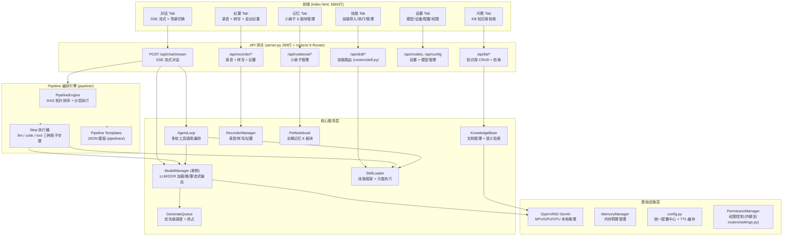
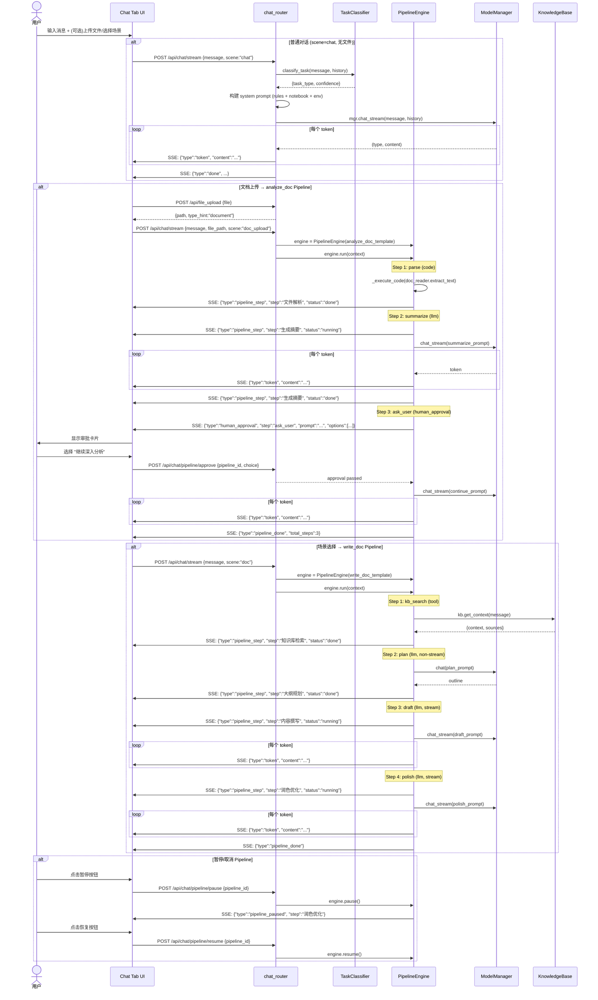

# Local AI Assistant — 项目架构文档

> **Version** | v0.8 | 2025-07-18
> 本文档是项目的长期架构参考，覆盖所有核心模块的设计与协作方式。

---

## 目录

- [1. 项目概述](#1-项目概述)
- [2. 系统架构图](#2-系统架构图)
- [3. 文件结构树](#3-文件结构树)
- [4. 各模块说明](#4-各模块说明)
- [5. 数据流](#5-数据流)
- [6. 前端架构](#6-前端架构)
- [7. API 端点索引](#7-api-端点索引)
- [8. 配置体系](#8-配置体系)
- [9. 部署架构](#9-部署架构)

---

## 1. 项目概述

### 1.1 定位

本地 AI 办公助手 —— 基于 OpenVINO GenAI + Qwen3-8B 的全本地推理方案。所有模型（LLM、OCR、Embedding、Whisper）均在本地设备运行，数据不出机。

### 1.2 技术栈

| 层级 | 技术 | 说明 |
|------|------|------|
| 前端 | 纯 HTML/CSS/JS | 单文件 `index.html`，SSE 流式渲染 |
| 后端 | Python 3.11+ / FastAPI | 异步 SSE + 同步推理混合架构 |
| LLM 推理 | OpenVINO GenAI | 支持 NPU / GPU / CPU 三种后端 |
| 嵌入 | BAAI/bge-small-zh-v1.5 | OpenVINO 优化的向量嵌入 |
| 语音 | Whisper (small/medium) | 扩展包，OpenVINO 加速 |
| 存储 | JSON / NumPy / 文件系统 | 无数据库依赖 |
| OCR | RapidOCR | CPU 推理 |

### 1.3 运行环境

- **OS**: Windows 10/11（主目标），Linux 兼容
- **硬件**: Intel NPU（推荐）或 GPU 或纯 CPU
- **内存**: 最低 8GB，推荐 16GB（含模型加载）
- **启动**: `python server.py` → 看门狗模式，`python server.py --serve` → 直接服务

---

## 2. 系统架构图



---

## 3. 文件结构树

```
local-ai/                          # 项目根目录
├── server.py                      # FastAPI 入口 (289行), Router 注册 + 看门狗
├── models.py                      # 模型管理器 (2130行), LLM/OCR 加载/推理
├── agent.py                       # Agent 循环编排器 (881行), 多轮工具调用
├── config.py                      # 统一配置中心, DEFAULTS + TTL 缓存
├── prompts.py                     # Prompt Engineering 模块 v3.0
├── response_filter.py             # 响应过滤器 + 幻觉检测 v1.4
├── task_classifier.py             # 任务分类器 (reasoning/code/text/agent)
├── knowledge_base.py              # 知识库核心 (文档/分块/检索)
├── recorder.py                    # 录音纪要管理器
├── pet_notebook.py                # 小册子 (长期记忆 6 板块)
├── skill_loader.py                # 技能框架 (导入/注册/执行)
├── training.py                    # 训练记录管理
├── cloud_provider.py              # 云端 LLM API 适配层
├── context_compressor.py          # 上下文压缩器
├── chunker.py                     # 文本分块器
├── chunking_orchestrator.py       # 长文本分段编排器
├── doc_reader.py                  # 文档读取工具
├── doc_writer.py                  # Word 文档写入工具
├── benchmark.py                   # 性能基准测试
├── mcp_server.py                  # MCP Server 适配
├── install.py                     # 安装脚本
├── index.html                     # 前端单页应用 (5660行)
│
├── pipeline/                      # Pipeline 编排引擎 (Patch 9)
│   ├── __init__.py                # 导出 PipelineEngine, PipelineContext, PipelineTemplate, StepConfig
│   ├── context.py                 # PipelineContext 运行时上下文
│   ├── engine.py                  # PipelineEngine DAG 执行引擎
│   ├── steps.py                   # Step 执行器 (llm/code/tool + 重试)
│   └── templates.py               # 模板加载 + 验证
│
├── pipelines/                     # Pipeline JSON 模板
│   ├── write_doc.json             # 文档写作 (5步: 检索→规划→撰写→润色→保存)
│   ├── analyze_doc.json           # 文档分析 (3步+审批: 解析→摘要→追问)
│   └── write_code.json            # 代码编写 (3步: 分析→编码→测试)
│
├── routers/                       # FastAPI Router 拆分 (已完成)
│   ├── __init__.py
│   ├── deps.py                    # 共享依赖注入
│   ├── kb.py                      # KB 路由
│   ├── notebook.py                # 小册子路由
│   ├── recorder.py                # 录音路由
│   ├── settings.py                # 设置路由
│   └── skill.py                   # 技能路由
│
├── skills/                        # 技能目录
│   ├── builtin/                   # 内置技能
│   │   ├── code-runner/           # 代码运行器
│   │   ├── file-ops/              # 文件操作
│   │   ├── kb-search/             # 知识库检索
│   │   ├── long-reader/           # 长文本阅读
│   │   ├── word-reader/           # Word 文档读取
│   │   ├── word-writer/           # Word 文档写入
│   │   └── xlsx-reader/           # Excel 读取
│   └── custom/                    # 用户导入的技能
│
├── extensions/                    # 扩展包
│   └── whisper/                   # Whisper 语音识别扩展
│       └── install.py
│
├── data/                          # 运行时数据
│   ├── kb/                        # 知识库数据
│   │   ├── kb_meta.json           # 文档元信息 + chunk 索引
│   │   ├── kb_vectors.npz         # 向量索引 (numpy 压缩)
│   │   └── kb_texts/              # chunk 原文
│   └── recordings/                # 录音数据
│       ├── sessions.json          # 录音会话元信息
│       ├── chunks/                # 实时录音块
│       └── audio/                 # 完整音频文件
│
├── docs/                          # 文档
│   ├── ARCHITECTURE.md            # 本文件
│   ├── PATCH9_ARCHITECTURE.md     # Patch 9 架构设计
│   └── ...                        # 其他设计文档
│
├── settings.json                  # 用户配置文件 (运行时生成)
├── notebook.json                  # 小册子数据 (运行时生成)
└── server.log                     # 运行日志
```

---

## 4. 各模块说明

### 4.1 `server.py` (289行) — 应用入口 + Router 注册

**职责**: FastAPI 应用初始化、全局服务实例化、Router 注册。所有 API 端点已拆分到 `routers/` 模块。

**关键组件**:
- 全局服务初始化链（ModelManager, PetNotebook, SkillLoader, KnowledgeBase, RecorderManager）
- 6 个 Router 模块注册（chat, kb, recorder, settings, notebook, skill）
- 看门狗机制 — 非 `--serve` 模式启动时自动重启（最多5次）

**初始化链**:
```
server.py 启动
  → ModelManager (单例)
  → PetNotebook (长期记忆)
  → SkillLoader (技能框架)
  → AgentLoop (Agent 框架)
  → KnowledgeBase (知识库, 延迟加载模型)
  → RecorderManager (录音纪要)
  → Router 注册: chat, kb, recorder, settings, notebook, skill
```

**依赖**: 几乎所有模块

---

### 4.2 `models.py` (2130行) — 模型管理器

**职责**: 统一管理 LLM/OCR 模型的加载、推理、流式输出。

**关键类**:

| 类 | 说明 |
|----|------|
| `ModelManager` | 单例，线程安全。管理模型配置、加载/卸载、推理调度 |
| `GenerateQueue` | LLM 生成请求优先级队列（HIGH=用户对话, LOW=后台任务） |
| `GenerateTicket` | 请求票据，持有"设备"使用权 |

**核心方法**:
- `chat_stream(message, model, max_tokens, history, ...)` → `Generator[(phase, content)]`
  - phase: `"task_type"` | `"raw"` | `"fold"` | `"text"` | `"mode_hint"` | `"reload"`
  - 内置生成异常检测：速度过低、重复循环、前缀累积
- `load(model_name)` / `unload(model_name)` — 模型加载/卸载（互斥）
- `_check_stall()` — 生成异常检测（Qwen3-8B 特有前缀累积问题）

**设备支持**: NPU（首选）→ GPU → CPU，环境变量 `LOCAL_AI_DEVICE` 可覆盖

**依赖**: config.py, OpenVINO GenAI, task_classifier.py, prompts.py

---

### 4.3 `agent.py` (881行) — Agent 循环编排器

**职责**: 让 8B 小模型跑 Agentic Loop — 规划 → 调用 tool → 观察结果 → 继续迭代。

**协议**:
```
模型输出: [TOOL_CALL:tool_name|JSON] → 后端解析执行
后端返回: [TOOL_RESULT:tool_name|JSON] → 追加到 scratchpad
```

**关键配置**:
- `_DEFAULT_SCENE_CONFIGS` — 各场景的可用工具和迭代上限
- `_TOOL_SKILL_MAP` — Agent 工具名 → SkillLoader 技能名映射
- `_parse_tool_call()` — 宽容解析（支持中文括号/引号修复）

**依赖**: models.py, skill_loader.py, config.py

---

### 4.4 `pipeline/` — Pipeline 编排引擎 (Patch 9 新增)

**职责**: DAG 驱动的多步骤任务编排，支持 LLM/code/tool 三种原子步骤。

| 文件 | 职责 |
|------|------|
| `context.py` | `PipelineContext` — 运行时上下文（变量/步骤输出/模板替换） |
| `engine.py` | `PipelineEngine` — DAG 拓扑排序 + 分层执行 + pause/resume/cancel |
| `steps.py` | `StepConfig` + `execute_step()` — 三种执行器 + 指数退避重试 |
| `templates.py` | `PipelineTemplate` — JSON 模板加载/验证/场景匹配 |

**SSE 事件格式**:
```json
{"type": "pipeline_start", "pipeline_id": "...", "total_steps": 5, "scene": "doc"}
{"type": "pipeline_step", "step_id": "...", "status": "running|done|failed"}
{"type": "token", "content": "..."}          // LLM 流式输出
{"type": "fold", "think_len": 123}           // 思维链折叠
{"type": "human_approval", "step_id": "...", "prompt": "...", "options": [...]}
{"type": "pipeline_progress", "overall_progress": 0.6}
{"type": "pipeline_done", "elapsed": 12.5}
{"type": "pipeline_error", "error": "..."}
```

**依赖**: models.py, skill_loader.py（通过依赖注入）

---

### 4.5 `knowledge_base.py` — 知识库核心

**职责**: 文档管理 + 分块索引 + 语义检索。

**存储结构**:
```
data/kb/
  ├── kb_meta.json    # 文档元信息 + chunk 索引
  ├── kb_vectors.npz  # 向量索引 (numpy 压缩格式)
  └── kb_texts/       # chunk 原文 (按 chunk_id 存储)
```

**关键类**:
- `KBDocument` — 文档元信息（状态机: pending→processing→indexing→ready）
- `KBChunk` — 文本块（含来源标注）
- `EmbeddingEngine` — 嵌入引擎（bge-small-zh OpenVINO pipeline）
- `KnowledgeBase` — 核心类：文档 CRUD + 异步处理 + 语义检索

**检索流程**: 查询 → 向量嵌入 → 余弦相似度 → MMR 重排序 → Reranker 精排

**依赖**: config.py, OpenVINO, numpy

---

### 4.6 `recorder.py` — 录音纪要管理器

**职责**: 录音会话管理 + 音频拼接 + 转写调度 + 崩溃恢复。

**两阶段转写**:
1. **Whisper 粗稿** — 语音转文字（分块并行）
2. **8B 纠错润色** — LLM 修正错别字 + 加标点

**关键特性**:
- 实时转写预览（10秒一个 chunk）
- 崩溃恢复（chunk 实时落盘）
- 录音独立 20 个 session 额度
- AI 会议纪要生成

**依赖**: Whisper 扩展包（可选），models.py

---

### 4.7 `pet_notebook.py` — 小册子 (长期记忆)

**职责**: 6 板块长期记忆，每次对话前注入 system prompt。

| 板块 | Key | 说明 |
|------|-----|------|
| 身份卡 | `identity` | AI 名字/性格/定位 |
| 用户画像 | `user_profile` | 名字/城市/职业/偏好 |
| 关键事实 | `facts` | 对话中发现的重要事实 |
| 术语库 | `glossary` | 私有术语表 |
| 技能清单 | `skills` | 已安装技能列表 |
| 近期摘要 | `milestones` | 对话里程碑 |

**存储**: `notebook.json`，最大注入 1700 字符到 system prompt

**自动提取**: 对话过程中自动识别名字/城市/职业等实体并更新

---

### 4.8 `skill_loader.py` + `routers/skill.py` — 技能系统

**SkillLoader**: 技能导入/注册/执行引擎
- ZIP 导入 → 解压到 `skills/` → 读 `skill.json` → 注册到 `registry.json`
- `execute_skill(name, params)` → subprocess 隔离执行 → 超时控制
- 内置 7 个技能: code-runner, file-ops, kb-search, long-reader, word-reader, word-writer, xlsx-reader

**routers/skill.py**: REST API 路由（标准 APIRouter 模式，替代原 skill_router.py 闭包模式）
- `POST /api/skill/import` — 导入技能 ZIP
- `GET /api/skill/list` — 列出已安装技能
- `POST /api/skill/execute` — 执行技能
- `DELETE /api/skill/{name}` — 删除技能

---

### 4.9 `response_filter.py` — 响应过滤器 v1.4

**8 个检测器**: 代码幻觉 / 未闭合结构 / 思考外泄 / 重复段落 / 不完整输出 / 截断检测 / 综合幻觉 / 前缀累积重复

**清理器**: 思维链标签剥离 / 废话前缀清理 / 前缀累积重复清理

**入口**: `filter_response(text)` → `{"text", "warnings", "has_issues", "cleaned"}`

---

### 4.10 `task_classifier.py` — 任务分类器

**职责**: 将用户消息分为 reasoning / code / text / agent 四类，返回思考控制指令。

**附属函数**:
- `get_think_instruction(task_type)` — 思考模式控制
- `get_dynamic_max_tokens(task_type, message)` — 动态 token 限制
- `check_topic_drift(message, history)` — 话题漂移检测
- `check_mode_hint(scene, message)` — 场景匹配建议

---

### 4.11 `prompts.py` — Prompt Engineering v3.0

**场景提示词**:
- `QA_SYSTEM_PROMPT` — 对话/问答模式
- `EXEC_SYSTEM_PROMPT` — Agent 执行模式
- 场景专用: doc / code / search / research
- `THINK_CONTROL` — 思考模式控制指令

**设计原则**: 针对 8B 小模型优化，规则 ≤5 条，每条 ≤20 字

---

### 4.12 `config.py` — 统一配置中心

**职责**: 所有模块的可调参数集中定义。

**机制**:
- `DEFAULTS` 字典 — 配置唯一真相源
- `settings.json` — 用户覆盖（合并写入）
- `get(key)` — TTL 缓存读取（5秒过期）
- `save_config(config)` / `set_value(key, value)` — 持久化

---

### 4.13 其他模块

| 模块 | 职责 |
|------|------|
| `cloud_provider.py` | 云端 LLM API 适配（OpenAI/DeepSeek/Qwen） |
| `context_compressor.py` | 离线上下文压缩（减少 history token） |
| `chunker.py` + `chunking_orchestrator.py` | 长文本分段处理 |
| `doc_reader.py` / `doc_writer.py` | 文档读写工具 |
| `training.py` | 训练记录管理 |
| `benchmark.py` | 性能基准测试 |
| `mcp_server.py` | MCP Server 适配 |

> **已聚合/删除的模块** (Patch 9): `feedback.py`（内联到 routers/chat.py）、`permissions.py`（内联到 routers/settings.py）、`audit_log.py`（内联到 routers/settings.py）、`distill.py`（功能废弃删除）、`env_check.py`（合并到 models.py）

---

## 5. 数据流

### 5.1 对话流程 (Chat)

```
用户消息 → POST /api/chat/stream
  → 1. 小册子提取（自动识别实体）
  → 2. OCR 处理（如有图片）
  → 3. 文件读取注入（如有上传文件）
  → 4. KB 检索注入（doc 场景 + kb_query）
  → 5. Session 缓存加载（上下文压缩摘要）
  → 6. 话题漂移检测
  → 7. 任务分类器 → (task_type, confidence)
  → 8. 模型自动加载（互斥）
  → 9. chat_stream() 流式推理
       → _check_stall() 异常检测
       → think 标签分离 → fold/token 事件
  → 10. response_filter 后处理
  → 11. SSE 事件流返回前端
       → "task_type" → 分类结果
       → "mode_hint" → 场景建议
       → "token" → 流式文本
       → "fold" → 思考折叠
       → "done" → 完成统计
```

### 5.2 知识库问答流程 (KB)

```
用户提问 → POST /api/qa/ask
  → 1. 查询文本 → EmbeddingEngine 编码为向量
  → 2. 向量检索 → 余弦相似度 Top-K
  → 3. MMR 重排序 → 去重 + 多样性
  → 4. Reranker 精排 → 最终 Top-5
  → 5. 构造增强提示（参考资料 + 原始问题）
  → 6. chat_stream() 流式回答
  → 7. SSE 返回: token + sources + done
```

### 5.3 Pipeline 执行流程 (Patch 9)

#### 5.3.1 内部执行步骤

```
场景路由 → 选择 Pipeline 模板
  → 1. PipelineTemplate.get_template_for_scene(scene)
  → 2. PipelineContext 初始化（user_message, history, variables）
  → 3. PipelineEngine(template, context, mgr, skill_loader)
  → 4. engine.run() Generator:
       → pipeline_start 事件
       → _resolve_dag() 拓扑排序 → 分层执行组
       → 逐层执行:
           → pipeline_step (running)
           → human_approval? → yield 等待外部审批
           → execute_step(step) → llm/code/tool
           → LLM: token/fold 事件流
           → pipeline_step (done/failed)
           → pipeline_progress
       → pipeline_done / pipeline_error
```

#### 5.3.2 完整交互序列图



### 5.4 录音纪要流程

```
录音开始 → POST /api/recorder/start
  → 前端每 10s 发送 chunk → POST /api/recorder/chunk
  → 实时转写: chunk → Whisper → 粗稿预览
  → 录音结束 → POST /api/recorder/finish
  → 后台处理:
    → Phase 1: 全量 Whisper 转写（分块并行）
    → Phase 2: 8B 纠错润色（批次处理）
    → Phase 3: AI 会议纪要生成
  → 可选: 转写结果入库知识库
```

---

## 6. 前端架构

### 6.1 Tab 结构

前端为单文件 `index.html`（5660行），6 个 Tab：

| Tab | 功能 | 核心交互 |
|-----|------|----------|
| 对话 | 主聊天界面 | SSE 流式渲染 + 场景切换 + 文件上传 |
| 问答 | KB 知识库问答 | 检索增强问答 + 来源展示 |
| 纪要 | 录音 + 转写 | 实时录音 + Whisper 转写 + AI 纪要 |
| 记忆 | 小册子管理 | 6 板块 CRUD |
| 技能 | 技能管理 | ZIP 导入 + 执行 + 参数配置 |
| 设置 | 系统配置 | 模型/设备/云端/权限/审计 |

### 6.2 SSE 事件协议

前端通过 `fetch()` + `ReadableStream` 消费 SSE 流：

```javascript
const resp = await fetch('/api/chat/stream', { method: 'POST', body: ... });
const reader = resp.body.getReader();
// 解析 "data: {JSON}\n\n" 格式
```

**事件类型**:

| type | 方向 | 说明 |
|------|------|------|
| `token` | Server→Client | 流式文本片段 |
| `fold` | Server→Client | 思维链折叠标记 |
| `done` | Server→Client | 生成完成 + 统计信息 |
| `error` | Server→Client | 错误信息 |
| `task_type` | Server→Client | 任务分类结果 |
| `mode_hint` | Server→Client | 场景切换建议 |
| `truncate` | Server→Client | 截断恢复内容 |
| `sources` | Server→Client | KB 参考资料来源 |
| `reload` | Server→Client | 模型自动重载通知 |
| `pipeline_start` | Server→Client | Pipeline 开始执行 `{pipeline_id, total_steps, scene}` |
| `pipeline_step` | Server→Client | 单步状态变更 `{step_id, step_name, status, progress}` |
| `pipeline_progress` | Server→Client | 整体进度 `{overall_progress, current_step, total_steps}` |
| `pipeline_done` | Server→Client | Pipeline 完成 `{total_steps, elapsed}` |
| `pipeline_error` | Server→Client | Pipeline 执行失败 `{step_id, error}` |
| `human_approval` | Server→Client | 请求用户审批 `{step_id, prompt, options}` |
| `pipeline_paused` | Server→Client | Pipeline 已暂停 `{step_id, reason}` |

### 6.3 状态管理

前端无框架，使用全局变量 + DOM 操作：
- `_currentChatFile` — 当前对话文件
- `_chatHistory` — 对话历史数组
- `_isStreaming` — 流式输出中标志
- `_selectedScene` — 当前场景（chat/doc/code/search/research）

#### Pipeline 控制 UI

Chat Tab 输入栏右侧根据当前状态动态切换控制按钮：

```
普通对话: [输入栏] [➕] [发送▶]
Pipeline 中: [输入栏] [⏸暂停] [⏹取消] [进度: 2/5 ██████░░░░]
等待审批: [输入栏] [审批卡片: 选择 A / B / C]
```

**状态切换逻辑**:
1. 收到 `pipeline_start` 事件 → 切换到 Pipeline 模式，显示进度条 + 暂停/取消按钮
2. 收到 `pipeline_step` 事件 → 更新进度条中的步骤名和状态
3. 收到 `human_approval` 事件 → 暂停进度，显示审批卡片供用户选择
4. 收到 `pipeline_done` 或 `pipeline_error` → 恢复到普通对话模式
5. 收到 `pipeline_paused` → 显示恢复按钮，替代暂停按钮

---

## 7. API 端点索引

### 7.1 对话

| Method | Path | 说明 |
|--------|------|------|
| POST | `/api/chat/stream` | SSE 流式对话（核心端点） |
| POST | `/api/chat` | 非流式对话 |
| POST | `/api/chat/cloud/stream` | 云端 LLM 流式对话 |
| POST | `/api/file_upload` | 文件上传 |

### 7.2 对话管理

| Method | Path | 说明 |
|--------|------|------|
| GET | `/api/chats` | 对话列表 |
| POST | `/api/chats/new` | 新建对话 |
| POST | `/api/chats/switch` | 切换对话 |
| DELETE | `/api/chats/{name}` | 删除对话 |
| GET | `/api/chats/{name}/messages` | 获取对话消息 |
| POST | `/api/chats/{name}/append` | 追加消息 |

### 7.3 模型管理

| Method | Path | 说明 |
|--------|------|------|
| GET | `/api/models` | 模型列表 |
| POST | `/api/load/{name}` | 加载模型 |
| POST | `/api/unload/{name}` | 卸载模型 |
| GET | `/api/devices` | 可用设备列表 |
| POST | `/api/device/switch` | 切换推理设备 |
| POST | `/api/models/import` | 导入模型 |
| POST | `/api/rescan` | 重新扫描模型目录 |
| POST | `/api/stop` | 停止当前生成 |

### 7.4 知识库 (KB)

| Method | Path | 说明 |
|--------|------|------|
| GET | `/api/kb/stats` | KB 统计信息 |
| GET | `/api/kb/documents` | 文档列表 |
| POST | `/api/kb/upload` | 上传文档 |
| POST | `/api/qa/ask` | KB 问答 |
| POST | `/api/qa/upload` | KB 问答上传文件 |
| POST | `/api/kb/import_text` | 导入文本 |
| GET | `/api/kb/documents/{id}/status` | 文档处理状态 |
| POST | `/api/kb/install-module` | 安装 KB 扩展包 |
| POST | `/api/kb/uninstall-module` | 卸载 KB 扩展包 |
| POST | `/api/kb/load-models` | 加载嵌入模型 |
| POST | `/api/kb/unload-models` | 卸载嵌入模型 |

### 7.5 录音纪要

| Method | Path | 说明 |
|--------|------|------|
| POST | `/api/recorder/start` | 开始录音 |
| POST | `/api/recorder/chunk` | 上传录音块 |
| POST | `/api/recorder/finish` | 结束录音 |
| POST | `/api/recorder/import` | 导入音频文件 |
| GET | `/api/recorder/sessions` | 会话列表 |
| GET | `/api/recorder/{id}/status` | 会话状态 |
| GET | `/api/recorder/{id}/transcript` | 获取转写结果 |
| POST | `/api/recorder/{id}/summarize` | 生成会议纪要 |
| POST | `/api/recorder/{id}/import_kb` | 转写入库知识库 |
| POST | `/api/recorder/{id}/refine` | 8B 纠错润色 |

### 7.6 小册子 (Notebook)

| Method | Path | 说明 |
|--------|------|------|
| GET/POST | `/api/notebook/profile` | 用户画像 |
| GET/POST/DELETE | `/api/notebook/facts` | 关键事实 |
| GET/POST/DELETE | `/api/notebook/glossary` | 术语库 |
| GET | `/api/notebook/identity_card` | 身份卡 |
| GET | `/api/notebook/knowledge` | 知识概览 |
| GET/POST/PUT/DELETE | `/api/notebook/memory` | 记忆管理 |

### 7.7 技能 (Skill)

| Method | Path | 说明 |
|--------|------|------|
| POST | `/api/skill/import` | 导入技能 ZIP |
| GET | `/api/skill/list` | 技能列表 |
| POST | `/api/skill/execute` | 执行技能 |
| DELETE | `/api/skill/{name}` | 删除技能 |

### 7.8 配置 / 设置

| Method | Path | 说明 |
|--------|------|------|
| GET/POST | `/api/config` | 读取/保存配置 |
| GET | `/api/scene_skills` | 场景技能映射 |
| POST | `/api/scene_skills` | 更新场景技能映射 |
| GET | `/api/prompts/info` | Prompt 模块信息 |
| POST | `/api/budget` | 内存预算设置 |

### 7.9 系统

| Method | Path | 说明 |
|--------|------|------|
| GET | `/api/info` | 系统信息 + 版本 |
| GET | `/api/status` | 运行状态 |
| GET | `/api/health` | 健康检查 |
| GET | `/api/env/check` | 环境检测 |
| GET | `/api/resource-info` | 资源占用信息 |

### 7.10 其他

| Method | Path | 说明 |
|--------|------|------|
| POST | `/api/ocr` | OCR 识别 |
| GET/POST/DELETE | `/api/training/*` | 训练记录管理 |
| GET/POST/DELETE | `/api/cloud/*` | 云端 LLM 配置 |
| GET/POST | `/api/feedback/*` | 用户反馈 |
| GET/POST/DELETE | `/api/permission/*` | 权限管理 |
| GET/DELETE | `/api/audit/*` | 审计日志 |
| GET | `/api/workspace` | 工作区文件列表 |
| POST/DELETE | `/api/extensions/*` | 扩展包管理 |

---

## 8. 配置体系

### 8.1 配置层级

```
环境变量 (最高优先级)
    ↓ 覆盖
settings.json (用户持久化)
    ↓ 覆盖
config.py DEFAULTS (默认值)
```

### 8.2 关键环境变量

| 变量 | 默认值 | 说明 |
|------|--------|------|
| `LOCAL_AI_HOST` | `127.0.0.1` | 监听地址 |
| `LOCAL_AI_PORT` | `8976` | 监听端口 |
| `LOCAL_AI_DEVICE` | (自动检测) | 推理设备 NPU/GPU/CPU |
| `LOCAL_AI_MODELS` | `./models` | 模型目录 |
| `LOCAL_AI_LOG_LEVEL` | `INFO` | 日志级别 |
| `LOCAL_AI_CORS` | `localhost:8976` | CORS 允许的域名 |

### 8.3 配置分组

| 分组 | 关键配置项 | 说明 |
|------|-----------|------|
| 通用 | `sandbox_cleanup`, `default_mode` | 沙箱清理策略、默认模式 |
| Agent | `agent_max_iterations`, `agent_timeout` | 迭代上限、超时 |
| 会话缓存 | `cache_keep_ratio`, `cache_threshold_ratio` | 上下文压缩参数 |
| 模型 | `npu_default_prompt_tokens`, `stall_check_tokens` | 设备 token 上限、异常检测 |
| 云端 | `cloud_default_max_tokens`, `cloud_stream_timeout` | 云端 API 参数 |
| 知识库 | `kb_max_documents`, `kb_chunk_max_chars` | KB 容量、分块参数 |
| 录音 | `recorder_chunk_seconds`, `whisper_model` | 录音/转写参数 |
| 内存 | `memory_budget_mb`, `reranker_idle_timeout_sec` | 内存预算管理 |

---

## 9. 部署架构

### 9.1 本地运行

```
┌──────────────────────────────────────────┐
│              Python 进程                  │
│                                          │
│  ┌─────────────┐   ┌─────────────────┐  │
│  │  看门狗      │   │  FastAPI Server  │  │
│  │  (父进程)    │──▶│  (--serve 模式)  │  │
│  └─────────────┘   └────────┬────────┘  │
│                             │            │
│                    ┌────────┴────────┐   │
│                    │  OpenVINO GenAI │   │
│                    │  (推理后端)      │   │
│                    │  NPU / GPU / CPU │   │
│                    └─────────────────┘   │
│                                          │
│  浏览器 ←── HTTP SSE ←── localhost:8976  │
└──────────────────────────────────────────┘
```

### 9.2 OpenVINO 硬件后端

| 设备 | 推荐模型大小 | prompt token 上限 | 说明 |
|------|-------------|-------------------|------|
| NPU | 8B (INT4) | 2,400 | Intel AI Boost，优先选择 |
| GPU | 8B (INT4/FP16) | 32,000 | Intel Arc / 集成显卡 |
| CPU | 8B (INT4) | 32,000 | 兜底方案，速度较慢 |

### 9.3 内存管理

- **LLM 互斥**: 同一时间只能加载一个 LLM 模型（8B 模型约占 5-6GB 内存）
- **GenerateQueue**: 高优先级请求自动抢占低优先级
- **MemoryManager**: 内存预算管理，超预算自动卸载 Reranker
- **延迟加载**: KB 嵌入模型、Whisper 均为按需加载，不占用初始内存

### 9.4 数据安全

- 所有推理在本地完成，数据不离开设备
- 技能执行通过 subprocess 隔离
- 沙箱目录限制文件操作范围
- 三级权限系统控制敏感操作
- 完整审计日志记录所有技能调用
