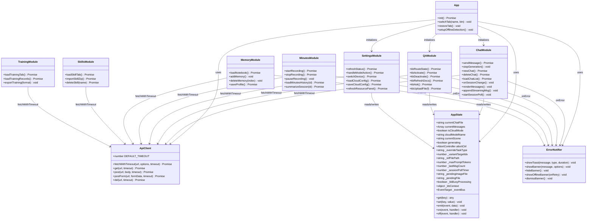
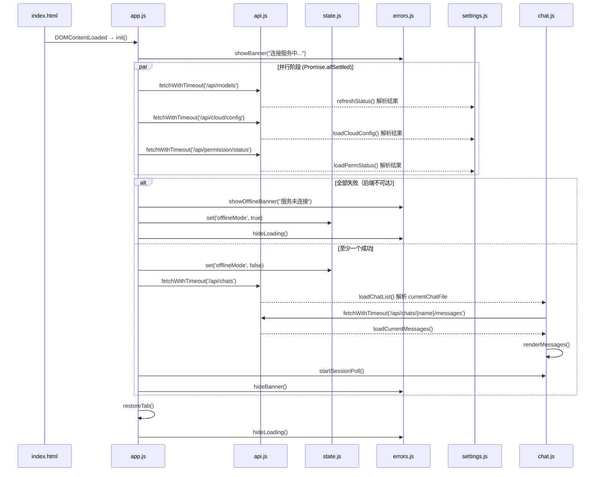
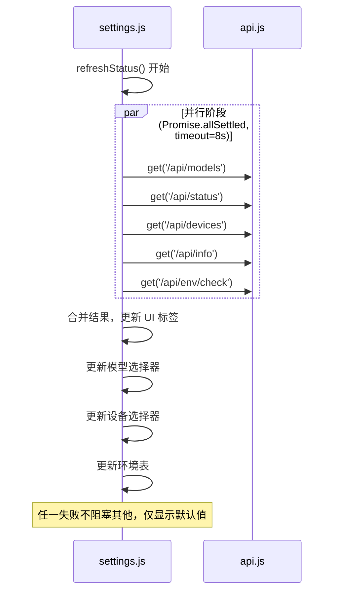
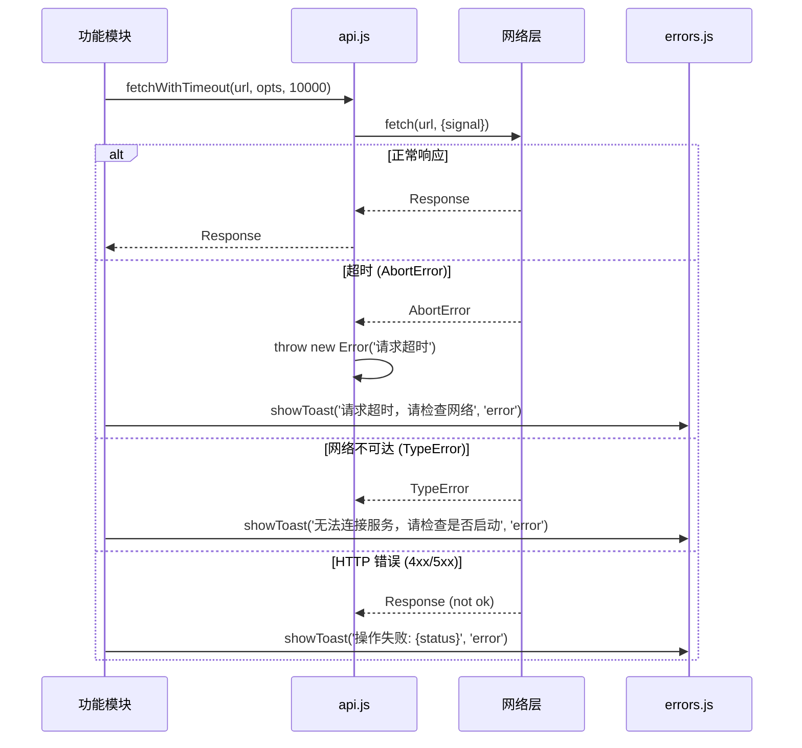
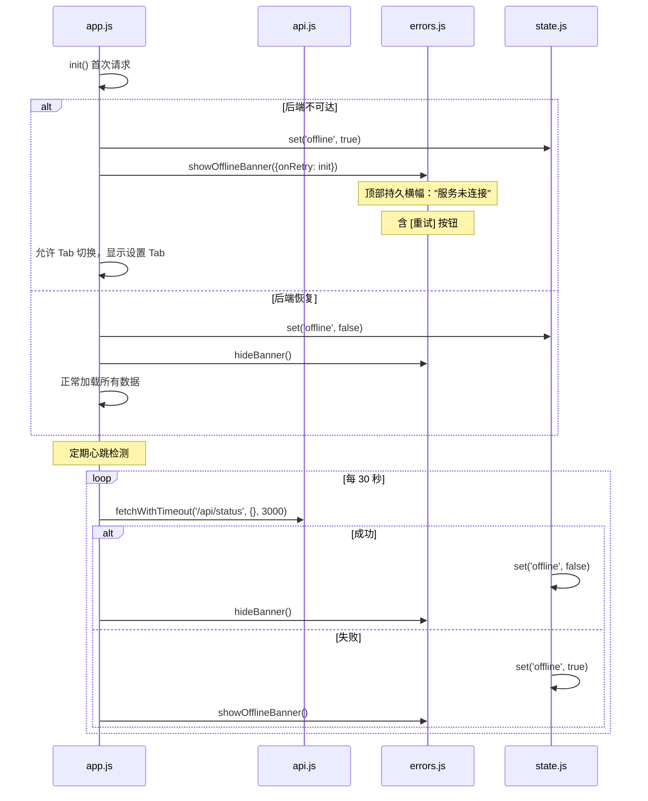
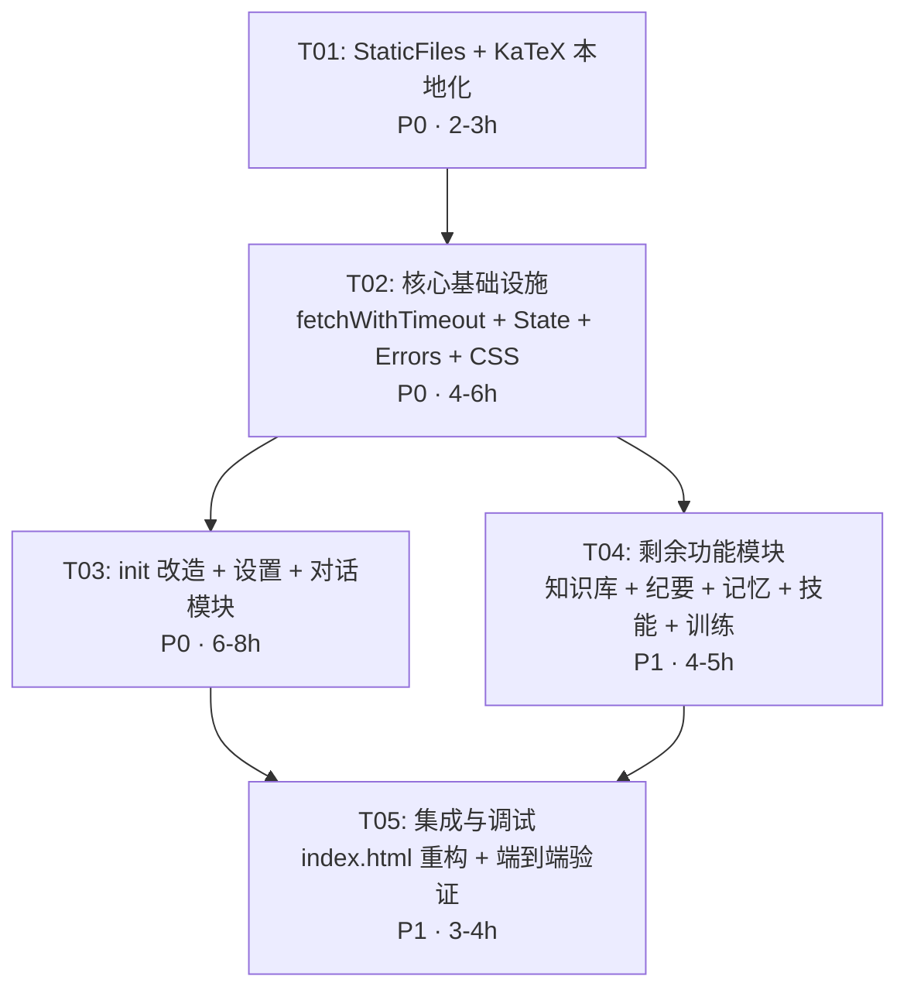

# 前端重构架构设计

**项目**：本地AI助手  
**文档版本**：v1.0  
**日期**：2025-07-14  
**作者**：高见远（Gao）· 架构师  
**PRD 基线**：`FRONTEND_PRD.md` v1.0（许清楚）

---

## Part A: 系统设计

### 1. 实现方案分析

#### 1.1 核心技术挑战

| 挑战 | 分析 | 策略 |
|------|------|------|
| **无构建工具** | 当前纯原生 JS，无 bundler。PRD REQ-09 提及构建工具但建议放入 Phase 3 | Phase 1/2 保持原生 JS，仅做文件拆分（`<script>` 标签加载），Phase 3 引入 Vite |
| **无 StaticFiles 挂载** | `server.py` 通过 `@app.get("/")` 路由直接读 `index.html` 返回，**没有 `StaticFiles` 挂载，也没有 `static/` 目录** | 拆分时需在 `server.py` 中新增 `StaticFiles` 挂载到 `/static/` |
| **122 处 fetch 无超时** | 全局替换工作量大 | 封装 `fetchWithTimeout()`，全局 monkey-patch `window.fetch` 作为快速方案，同时逐文件迁移 |
| **34 处空 catch** | 散布在各个功能函数中 | 统一错误通知系统 + 逐模块替换 |
| **KaTeX CDN 依赖** | 第 9-10 行引用 CDN | 下载到本地，用 `<link>` / `<script>` 本地路径引入 |
| **init() 串行阻塞** | 5 个 await 串行，含 refreshStatus 内部嵌套 5 个串行 fetch | `Promise.allSettled()` 并行化 + 超时降级 |

#### 1.2 技术选型

| 领域 | 选型 | 理由 |
|------|------|------|
| 框架 | 保持纯原生 HTML/CSS/JS | 内网环境、无构建工具依赖、团队熟悉度 |
| 模块化 | ES Module（`<script type="module">`） | 原生支持，无需构建工具，浏览器兼容性好（目标 Chrome） |
| 构建（Phase 3） | Vite + esbuild | 快速冷启动、原生 ESM 开发、简单配置 |
| KaTeX | 本地文件引入（katex.min.js + katex.min.css） | 无外网依赖，约 300KB 可接受 |
| 超时机制 | `AbortController` + `Promise.race` | 标准 API，兼容性好 |
| 状态管理 | 全局 `AppState` 对象 + `EventTarget` 事件 | 轻量级，无需引入框架 |
| 错误通知 | 自实现 Toast + Banner 组件 | 无外部依赖，满足需求 |

#### 1.3 架构模式

采用 **模块化单体**（Modular Monolith）架构：
- 每个功能 Tab 对应一个 JS 模块
- 共享层统一管理 API 调用、状态、错误处理
- HTML 保持单一入口，JS 通过 `<script type="module">` 加载

```
index.html (入口)
├── static/js/core/
│   ├── api.js          — fetchWithTimeout + API 封装
│   ├── state.js        — AppState 全局状态管理
│   ├── errors.js       — 错误通知（Toast + Banner）
│   └── utils.js        — 工具函数（esc, md, fmtMB 等）
├── static/js/modules/
│   ├── chat.js         — 对话 Tab
│   ├── qa.js           — 知识库问答 Tab
│   ├── minutes.js      — 纪要 Tab
│   ├── memory.js       — 记忆 Tab
│   ├── skills.js       — 技能 Tab
│   ├── settings.js     — 设置 Tab
│   └── training.js     — 训练相关
├── static/js/app.js    — init() + Tab 路由 + 横幅管理
├── static/css/
│   └── main.css        — 从 index.html 抽出的全部 CSS
└── static/vendor/
    ├── katex.min.js
    ├── katex.min.css
    └── fonts/           — KaTeX 字体（woff2）
```

---

### 2. 文件清单

#### 2.1 新增文件

| 文件路径 | 说明 | 来源 |
|----------|------|------|
| `static/js/core/api.js` | fetchWithTimeout 封装 + API 调用函数 | 新写 |
| `static/js/core/state.js` | AppState 全局状态对象 | 从 index.html 全局变量提取 |
| `static/js/core/errors.js` | Toast + Banner 错误通知组件 | 新写 |
| `static/js/core/utils.js` | 工具函数（esc, md, fmtMB, autoResize 等） | 从 index.html 提取 |
| `static/js/modules/chat.js` | 对话 Tab 完整逻辑 | 从 index.html L1012-1032 + L2222-2470 + L3278-3930 提取 |
| `static/js/modules/qa.js` | 知识库问答 Tab | 从 index.html L2486-3200 提取 |
| `static/js/modules/minutes.js` | 录音纪要 Tab | 从 index.html L4682-5728 提取 |
| `static/js/modules/memory.js` | 记忆 + 知识库管理 | 从 index.html L3934-4205 提取 |
| `static/js/modules/skills.js` | 技能 Tab | 从 index.html L1347-1468 提取 |
| `static/js/modules/settings.js` | 设置 Tab（模型管理 + 云端 + 资源面板 + OCR + 设备切换） | 从 index.html L1694-2075 + L4254-4513 提取 |
| `static/js/modules/training.js` | 训练 Tab | 从 index.html L1506-1673 提取 |
| `static/js/app.js` | init() + 横幅管理 + Tab 路由 + 入口 | 从 index.html L1676-1692 + L2077-2220 + L5730-5746 提取 |
| `static/css/main.css` | 全部 CSS 样式 | 从 index.html L12-266 提取 |
| `static/vendor/katex.min.js` | KaTeX JS | 从 CDN 下载 |
| `static/vendor/katex.min.css` | KaTeX CSS | 从 CDN 下载 |
| `static/vendor/fonts/` | KaTeX 字体文件（woff2） | 从 CDN 下载 |

#### 2.2 修改文件

| 文件路径 | 修改内容 |
|----------|----------|
| `index.html` | 删除内联 CSS/JS，改为引用外部文件 |
| `server.py` | 新增 `StaticFiles` 挂载 `app.mount("/static", StaticFiles(directory="static"), name="static")` |

#### 2.3 删除内容

- `index.html` 中的 `<style>...</style>` 内联 CSS（L12-266）→ 迁移到 `static/css/main.css`
- `index.html` 中的 `<script>...</script>` 内联 JS（L1010-5746）→ 迁移到 `static/js/` 各模块

---

### 3. 数据结构与接口

#### 3.1 模块关系图



#### 3.2 核心接口定义

##### `ApiClient.fetchWithTimeout(url, options, timeout)`

```javascript
/**
 * 带超时的 fetch 封装
 * @param {string} url - 请求 URL
 * @param {object} options - fetch options（method, headers, body 等）
 * @param {number} [timeout=10000] - 超时时间（毫秒），默认 10 秒
 * @returns {Promise<Response>}
 * @throws {Error} 超时时抛出 'Request timeout' 错误
 */
async function fetchWithTimeout(url, options = {}, timeout = 10000) {
  const controller = new AbortController();
  const id = setTimeout(() => controller.abort(), timeout);
  try {
    const response = await fetch(url, {
      ...options,
      signal: controller.signal
    });
    return response;
  } catch (e) {
    if (e.name === 'AbortError') {
      throw new Error(`请求超时 (${timeout / 1000}s): ${url}`);
    }
    throw e;
  } finally {
    clearTimeout(id);
  }
}
```

##### `ErrorNotifier`

```javascript
// Toast 类型
const TOAST_TYPES = {
  ERROR: 'error',    // 红色，网络错误/服务端错误
  WARN: 'warn',     // 黄色，业务警告
  SUCCESS: 'success', // 绿色，操作成功
  INFO: 'info'      // 蓝色，信息提示
};

// 错误分级
const ERROR_LEVELS = {
  NETWORK: 'network',     // 网络不可达/超时
  SERVER: 'server',       // 5xx 服务端错误
  BUSINESS: 'business',   // 4xx / 业务逻辑错误
  UNKNOWN: 'unknown'      // 未知错误
};
```

##### `AppState` 事件

```javascript
// 事件名称常量
const APP_EVENTS = {
  STATUS_CHANGED: 'status:changed',     // 模型状态变化
  CHAT_CHANGED: 'chat:changed',         // 当前对话变化
  MODE_CHANGED: 'mode:changed',         // 云端/本地模式切换
  OFFLINE: 'app:offline',               // 后端不可达
  ONLINE: 'app:online',                 // 后端恢复
  KB_STATE_CHANGED: 'kb:stateChanged',  // 知识库状态变化
};
```

---

### 4. 程序调用流程

#### 4.1 init() 改造后的流程



#### 4.2 refreshStatus() 内部并行化

当前 `refreshStatus()` 内部有 5 个串行 fetch（`/api/models`, `/api/cloud/config`, `/api/status`, `/api/devices`, `/api/info`, `/api/env/check`），全部无依赖关系。

改造后：



#### 4.3 fetchWithTimeout 错误处理流程



#### 4.4 离线检测流程



---

### 5. 不确定项

| # | 问题 | 假设 | 风险 |
|---|------|------|------|
| 1 | KaTeX 字体是否必需？ | 保留字体文件以确保公式渲染质量。约增加 200KB（woff2） | 低：磁盘空间充裕 |
| 2 | `<script type="module">` 的加载顺序 | 使用 ES Module 的 `import` 语法确保依赖顺序 | 低：目标浏览器为 Chrome |
| 3 | SSE 流式 fetch 是否需要超时？ | 流式请求不使用 `fetchWithTimeout`（需要持续接收数据），仅使用读取超时 | 中：需在 sendMessage 中保持现有 SSE 超时逻辑 |
| 4 | 模块拆分后 `window.onload` / `init()` 时序 | `app.js` 作为入口模块，在 DOMContentLoaded 后调用 `init()` | 低：与现有逻辑一致 |
| 5 | 全局函数引用（HTML onclick 等） | 模块导出的函数通过 `window.xxx = fn` 暴露，保持 HTML onclick 兼容 | 中：需要每个模块显式导出 |
| 6 | `StaticFiles` 是否支持子目录 | FastAPI `StaticFiles` 支持子目录，`/static/js/xxx.js` 可直接访问 | 低：标准行为 |

---

## Part B: 任务分解

### 6. 依赖包

本项目不引入 npm/构建工具依赖，所有包为直接下载的本地文件：

```
- KaTeX@0.16.11 (katex.min.js + katex.min.css + fonts/)：LaTeX 公式渲染
  来源：https://cdn.jsdelivr.net/npm/katex@0.16.11/dist/（一次性下载，后续内网使用）
```

无其他第三方依赖。

### 7. 任务列表

---

#### T01: 项目基础设施 — StaticFiles 挂载 + KaTeX 本地化 + 目录结构

**任务 ID**：T01  
**优先级**：P0  
**预估复杂度**：中（2-3 小时）  
**依赖**：无  

**涉及文件**：
- `static/` 目录创建（含 `js/core/`, `js/modules/`, `css/`, `vendor/fonts/` 子目录）
- `static/vendor/katex.min.js` — 从 CDN 下载
- `static/vendor/katex.min.css` — 从 CDN 下载
- `static/vendor/fonts/` — KaTeX woff2 字体文件
- `server.py` — 新增 `StaticFiles` 挂载
- `index.html` — KaTeX 引用从 CDN 改为本地路径

**详细描述**：

1. **创建目录结构**：
   ```
   static/
   ├── js/
   │   ├── core/
   │   └── modules/
   ├── css/
   └── vendor/
       ├── katex.min.js
       ├── katex.min.css
       └── fonts/
           └── (KaTeX woff2 字体)
   ```

2. **修改 `server.py`**：
   ```python
   from fastapi.staticfiles import StaticFiles
   # 在路由注册之后添加：
   app.mount("/static", StaticFiles(directory=os.path.join(WORKSPACE_DIR, "static")), name="static")
   ```

3. **下载 KaTeX 资源**：
   - `katex.min.js` → `static/vendor/katex.min.js`
   - `katex.min.css` → `static/vendor/katex.min.css`
   - `fonts/` 目录（woff2 字体文件）→ `static/vendor/fonts/`
   - 修改 `katex.min.css` 中字体路径为相对路径（`./fonts/`）

4. **修改 `index.html` 第 9-10 行**：
   ```html
   <!-- 修改前 -->
   <link rel="stylesheet" href="https://cdn.jsdelivr.net/npm/katex@0.16.11/dist/katex.min.css">
   <script src="https://cdn.jsdelivr.net/npm/katex@0.16.11/dist/katex.min.js"></script>
   
   <!-- 修改后 -->
   <link rel="stylesheet" href="/static/vendor/katex.min.css">
   <script src="/static/vendor/katex.min.js"></script>
   <script>
     // KaTeX 降级：加载失败时公式以源码显示
     if (typeof katex === 'undefined') {
       console.warn('[KaTeX] 未加载，LaTeX 公式将以源码显示');
     }
   </script>
   ```

**验收标准**：
- ✅ 访问 `http://localhost:8976/static/vendor/katex.min.js` 返回 JS 文件
- ✅ 断网后页面不再卡在 KaTeX CDN 请求上
- ✅ LaTeX 公式正常渲染（含数学符号、上下标、分数等）

---

#### T02: 核心基础设施 — fetchWithTimeout + AppState + ErrorNotifier + CSS 提取

**任务 ID**：T02  
**优先级**：P0  
**预估复杂度**：高（4-6 小时）  
**依赖**：T01  

**涉及文件**：
- `static/js/core/api.js` — fetchWithTimeout 封装 + 快捷方法
- `static/js/core/state.js` — AppState 全局状态对象
- `static/js/core/errors.js` — Toast + Banner 组件
- `static/js/core/utils.js` — 工具函数提取
- `static/css/main.css` — 全部 CSS 样式
- `index.html` — CSS/JS 引用改为外部文件

**详细描述**：

1. **`static/js/core/api.js`**：
   ```javascript
   // fetchWithTimeout 封装
   export const DEFAULT_TIMEOUT = 10000;
   
   export async function fetchWithTimeout(url, options = {}, timeout = DEFAULT_TIMEOUT) { ... }
   export async function get(url, timeout) { ... }
   export async function post(url, body, timeout) { ... }
   export async function postForm(url, formData, timeout) { ... }
   export async function del(url, timeout) { ... }
   ```
   - 默认超时 10 秒
   - SSE 流式请求不使用此封装（在 sendMessage 中单独处理）
   - 超时错误区分 `AbortError` 和其他网络错误

2. **`static/js/core/state.js`**：
   ```javascript
   // 集中管理全局状态，替代散落的全局变量
   class AppState extends EventTarget { ... }
   export const state = new AppState();
   ```
   - 包含所有当前全局变量：`currentChatFile`, `currentMessages`, `isCloudMode` 等
   - 通过 `get()` / `set()` 访问
   - `set()` 时自动 emit 事件，供模块订阅

3. **`static/js/core/errors.js`**：
   ```javascript
   // Toast 组件
   export function showToast(message, type = 'error', duration = 4000) { ... }
   // Banner 组件（持久横幅）
   export function showBanner(message, options = {}) { ... }
   export function hideBanner() { ... }
   // 离线横幅（特殊 Banner）
   export function showOfflineBanner(onRetry) { ... }
   // 错误分级
   export function classifyError(error) { ... }
   ```
   - Toast CSS：右上角浮动，4 秒自动消失
   - Banner CSS：顶部固定，红色/黄色/蓝色背景
   - 离线横幅：红色背景，含「重试」按钮

4. **`static/js/core/utils.js`**：
   - 从 index.html 提取：`esc()`, `md()`, `fmtMB()`, `autoResize()`, `formatTime()`, `renderFileCard()`, `downloadFile()`, `showLoading()`, `hideLoading()`, `_renderLatex()`, `_extractAndRenderLatex()`, `_restoreLatex()`, `formatStats()`

5. **`static/css/main.css`**：
   - 从 index.html L12-266 的 `<style>` 内容完整迁移
   - 新增 Toast 和 Banner 的 CSS 样式

6. **修改 `index.html`**：
   - 删除 `<style>...</style>` 内联 CSS
   - 添加 `<link rel="stylesheet" href="/static/css/main.css">`
   - 添加 `<script type="module" src="/static/js/app.js"></script>`（后续 T05 完成后生效）

**验收标准**：
- ✅ `fetchWithTimeout` 超时后抛出可识别的错误
- ✅ `AppState` 的 `set()` 触发事件，`on()` 回调被调用
- ✅ Toast 在右上角显示，4 秒后自动消失
- ✅ Banner 显示在页面顶部，可手动关闭
- ✅ CSS 外部引用后页面样式不变

---

#### T03: init() 改造 + 设置模块 + 对话模块（含并行初始化、离线降级）

**任务 ID**：T03  
**优先级**：P0  
**预估复杂度**：高（6-8 小时）  
**依赖**：T02  

**涉及文件**：
- `static/js/app.js` — init() 改造 + Tab 路由 + 离线检测
- `static/js/modules/settings.js` — refreshStatus 并行化 + 模型管理 + 云端配置 + 资源面板 + OCR + 设备切换
- `static/js/modules/chat.js` — 对话逻辑 + sendMessage + SSE 流式渲染 + Session 管理

**详细描述**：

1. **`static/js/app.js` — init() 改造**：
   ```javascript
   import { state } from './core/state.js';
   import { get } from './core/api.js';
   import { showOfflineBanner, hideBanner, hideLoading } from './core/errors.js';
   
   async function init() {
     // 第一阶段：并行请求（无依赖）
     const results = await Promise.allSettled([
       refreshStatus(),       // 内部也已并行化
       loadCloudConfig(),
       loadPermStatus()
     ]);
     
     // 检查是否全部失败（后端不可达）
     const allFailed = results.every(r => r.status === 'rejected');
     if (allFailed) {
       state.set('offline', true);
       showOfflineBanner(() => init()); // 重试回调
       hideLoading();
       return;
     }
     
     // 第二阶段：依赖状态数据的请求
     try {
       await loadChatList();
       const chatResp = await get('/api/chats');
       const chatData = await chatResp.json();
       if (chatData.current) {
         state.set('currentChatFile', chatData.current);
         const name = chatData.current.split(/[\\/]/).pop().replace('.json', '');
         const msgsResp = await get('/api/chats/' + encodeURIComponent(name) + '/messages');
         const msgsData = await msgsResp.json();
         state.set('currentMessages', msgsData.messages || []);
         renderMessages();
       }
     } catch (e) {
       showToast('加载对话失败: ' + e.message, 'error');
     }
     
     state.set('_lastMsgCount', state.get('currentMessages').length);
     startSessionPoll();
     hideBanner();
   }
   ```

2. **`static/js/modules/settings.js` — refreshStatus 并行化**：
   - 将原来 5 个串行 fetch（`/api/models`, `/api/status`, `/api/devices`, `/api/info`, `/api/env/check`）改为 `Promise.allSettled` 并行
   - 每个请求独立的 try/catch，失败不阻塞其他
   - 所有 fetch 替换为 `fetchWithTimeout`（8 秒超时）

3. **`static/js/modules/chat.js`**：
   - 提取对话相关函数：`sendMessage`, `stopGeneration`, `newChat`, `deleteChat`, `loadChatList`, `onSessionChange`, `renderMessages`, `appendStreamingMsg`, `startSessionPoll`, `renderMsg`, `showDriftBar` 等
   - SSE 流式读取保持原有超时机制（不使用 `fetchWithTimeout`）
   - 非流式 fetch（如 OCR 上传、文件上传）改用 `fetchWithTimeout`
   - 替换所有 `catch(e) {}` 为 `showToast` 调用

4. **离线降级 UI**：
   - 在 `app.js` 中添加心跳检测（每 30 秒请求 `/api/status`，3 秒超时）
   - 离线时显示顶部红色横幅：「服务未连接」+ [重试] 按钮
   - 在线时自动恢复，隐藏横幅
   - 离线状态下仍允许切换 Tab 查看 UI

**验收标准**：
- ✅ 后端未启动时，3 秒内显示降级 UI（"服务未连接"横幅 + 重试按钮）
- ✅ 后端正常时，并行初始化完成后首屏可交互 ≤ 2 秒
- ✅ `refreshStatus` 内部 5 个请求并行执行
- ✅ 单个请求失败不影响其他请求和 UI
- ✅ SSE 流式对话功能正常

---

#### T04: 剩余功能模块 — 知识库 + 纪要 + 记忆 + 技能 + 训练

**任务 ID**：T04  
**优先级**：P1  
**预估复杂度**：中（4-5 小时）  
**依赖**：T02  

**涉及文件**：
- `static/js/modules/qa.js` — 知识库问答 Tab
- `static/js/modules/minutes.js` — 录音纪要 Tab
- `static/js/modules/memory.js` — 记忆 + 知识库管理 Tab
- `static/js/modules/skills.js` — 技能 Tab
- `static/js/modules/training.js` — 训练 Tab

**详细描述**：

1. **`qa.js`**（从 index.html L2486-3200 提取）：
   - 函数：`kbRouteState`, `kbActivate`, `kbDeactivate`, `kbRefreshDocs`, `kbAsk`, `kbNewChat`, `kbUploadFile`, `kbDeleteDoc`, `kbPauseDoc`, `kbResumeDoc`, `kbCancelDoc`, `kbRetrySummary`, `kbAddMsg`, `_renderSourceCards`, `kbTogglePanel`, `kbInstallModule`, `kbUninstallModule` 等
   - 所有 fetch 替换为 `fetchWithTimeout`
   - 替换 `catch(e) {}` 为 `showToast` 调用
   - 导出函数挂载到 `window`：`window.kbRouteState`, `window.kbAsk` 等

2. **`minutes.js`**（从 index.html L4682-5728 提取）：
   - 函数：`startRecording`, `stopRecording`, `pauseRecording`, `loadMinutesHistory`, `summarizeSession`, `refineSession`, `retrySession`, `deleteSession`, `importAudio`, `doOCR`, `installWhisper`, `loadWhisper`, `checkRecordingLock`, `checkLLMForMinutes` 等
   - 所有 fetch 替换为 `fetchWithTimeout`
   - 导出函数挂载到 `window`

3. **`memory.js`**（从 index.html L3934-4205 提取）：
   - 函数：`loadNotebook`, `loadMemoryList`, `addMemory`, `deleteMemory`, `importMemory`, `saveProfile`, `addFact`, `delFact`, `addTerm`, `delTerm`, `importGlossary` 等
   - 所有 fetch 替换为 `fetchWithTimeout`

4. **`skills.js`**（从 index.html L1347-1468 提取）：
   - 函数：`loadSkillTab`, `onSceneSkillToggle`, `importSkillZip`, `deleteSkill` 等
   - 所有 fetch 替换为 `fetchWithTimeout`

5. **`training.js`**（从 index.html L1506-1673 提取）：
   - 函数：`loadTrainingTab`, `loadTrainingRecords`, `loadTrainingStats`, `loadTrainingTemplates`, `showAddTrainingDialog`, `deleteTrainingRecord`, `saveTrainingTemplate`, `deleteTrainingTemplate`, `exportTraining`, `importTraining`, `onTrainingImportFile` 等
   - 所有 fetch 替换为 `fetchWithTimeout`

6. **所有模块统一规则**：
   - 每个 `catch(e) {}` 替换为：
     ```javascript
     catch (e) {
       console.error(`[模块名.函数名]`, e);
       showToast(e.message || '操作失败', 'error');
     }
     ```
   - 需要被 HTML `onclick` 引用的函数，在模块末尾显式 `window.xxx = xxx`

**验收标准**：
- ✅ 每个 Tab 功能与拆分前完全一致
- ✅ 知识库安装/激活/问答全流程正常
- ✅ 录音纪要的录制/转写/摘要全流程正常
- ✅ 记忆增删改查正常
- ✅ 技能导入/删除正常
- ✅ 训练数据导入/导出正常
- ✅ 所有网络错误有 Toast 提示，无空 catch

---

#### T05: 集成与调试 — index.html 重构 + 模块加载 + 端到端验证

**任务 ID**：T05  
**优先级**：P1  
**预估复杂度**：中（3-4 小时）  
**依赖**：T03, T04  

**涉及文件**：
- `index.html` — 最终重构版本（仅保留 HTML 结构，引用外部 CSS/JS）
- `static/js/app.js` — 入口文件，导入所有模块，调用 init()
- 所有 `static/js/` 文件 — 最终调整和集成修复

**详细描述**：

1. **`index.html` 最终结构**：
   ```html
   <!DOCTYPE html>
   <html lang="zh-CN">
   <head>
     <meta charset="UTF-8">
     <meta name="viewport" content="width=device-width,initial-scale=1,maximum-scale=5">
     <title>本地AI助手</title>
     <link rel="icon" href="data:image/svg+xml,...">
     <link rel="stylesheet" href="/static/vendor/katex.min.css">
     <link rel="stylesheet" href="/static/css/main.css">
   </head>
   <body>
     <!-- 纯 HTML 结构（无内联事件处理，或保持 onclick 兼容） -->
     <div id="app">
       <!-- ... 6 个 Tab 的 HTML 结构 ... -->
     </div>
     <!-- 离线横幅容器（由 errors.js 动态插入） -->
     <script src="/static/vendor/katex.min.js"></script>
     <script type="module" src="/static/js/app.js"></script>
   </body>
   </html>
   ```

2. **`static/js/app.js` 作为入口**：
   ```javascript
   // 导入核心层
   import { state } from './core/state.js';
   import { fetchWithTimeout, get, post } from './core/api.js';
   import { showToast, showOfflineBanner, hideBanner, showLoading, hideLoading } from './core/errors.js';
   
   // 导入功能模块（模块自行注册到 window）
   import './modules/settings.js';
   import './modules/chat.js';
   import './modules/qa.js';
   import './modules/minutes.js';
   import './modules/memory.js';
   import './modules/skills.js';
   import './modules/training.js';
   
   // init() 函数定义（如 T03 所述）
   // ...
   
   // 启动
   document.addEventListener('DOMContentLoaded', () => {
     init();
     updateChatOverlay();
     restoreTab();
   });
   ```

3. **HTML onclick 兼容处理**：
   - 方案 A（推荐）：保持 HTML 中 `onclick="xxx()"` 写法，各模块通过 `window.xxx = function` 暴露
   - 方案 B（Phase 3）：在 `app.js` 中统一用 `addEventListener` 替换 onclick（需要改 HTML）
   - 本次采用方案 A，最小改动

4. **端到端验证清单**：
   - [ ] 页面加载不卡顿（后端正常 / 后端未启动两种场景）
   - [ ] KaTeX 公式渲染正常
   - [ ] 对话 Tab：发送消息、SSE 流式、停止生成、新建对话、删除对话、Session 切换
   - [ ] 问答 Tab：知识库状态检测、安装/激活/问答/停用
   - [ ] 纪要 Tab：录音/上传音频/转写/摘要
   - [ ] 记忆 Tab：增删改查
   - [ ] 技能 Tab：列表/导入/删除
   - [ ] 设置 Tab：模型加载/切换设备/云端配置/资源面板/OCR
   - [ ] 离线降级：拔网线或停后端后刷新页面，显示"服务未连接"横幅
   - [ ] 重试功能：点击"重试"后恢复正常

**验收标准**：
- ✅ `index.html` 行数 ≤ 800 行（仅 HTML 结构 + 外部引用）
- ✅ 所有 6 个 Tab 功能正常
- ✅ 后端未启动时 3 秒内显示降级 UI
- ✅ 无 console 错误
- ✅ 无外网 CDN 请求

---

### 8. 共享知识

```
- 所有 API 调用通过 static/js/core/api.js 中的 fetchWithTimeout 封装
- 默认超时 10 秒（init 阶段 8 秒），可通过第三个参数自定义
- SSE 流式请求（sendMessage）不使用 fetchWithTimeout，保持原有读取超时逻辑
- 全局状态通过 AppState 的 get()/set() 访问，不再使用裸全局变量
- 错误通知统一通过 errors.js 的 showToast()（临时通知）和 showBanner()（持久横幅）
- 所有 catch 块必须包含错误日志 + 用户可见提示，禁止空 catch
- HTML 中的 onclick 引用通过 window.xxx 暴露，各模块在末尾统一导出
- FastAPI StaticFiles 挂载路径: /static/ → static/ 目录
- 页面外部文件路径规范: /static/css/main.css, /static/js/core/api.js 等
- KaTeX 降级策略: 加载失败时公式以源码显示（不阻塞页面）
```

### 9. 任务依赖图



**关键路径**：T01 → T02 → T03 → T05（预计 15-21 小时）  
**并行路径**：T03 和 T04 可并行开发（但需同一人完成 T02 后）  
**总预估**：19-26 小时（约 3-4 个工作日）

---

## 附录 A: fetchWithTimeout 替换策略

### 快速方案（推荐）：全局 monkey-patch

在 `api.js` 中：
```javascript
// 保存原始 fetch
const _originalFetch = window.fetch;

// 替换为带超时版本
window.fetch = function(url, options = {}) {
  const timeout = options.timeout || DEFAULT_TIMEOUT;
  // ... 超时逻辑
};
```

优点：一次替换覆盖所有 122 处 fetch  
缺点：需确保 SSE 流式调用通过 `options.timeout = 0` 或 `options.noTimeout = true` 跳过

### 渐进方案（更安全）

逐模块替换，每个模块的 fetch 调用改为 `import { fetchWithTimeout } from '../core/api.js'`。

推荐策略：**Phase 1 使用 monkey-patch 快速覆盖，Phase 2 逐步迁移为显式 import**。

## 附录 B: 空 catch 替换模板

```javascript
// 替换前
catch(e) {}

// 替换后 — 根据上下文选择级别
// 级别 1：用户操作相关（必须提示）
catch(e) {
  console.error('[chat.sendMessage]', e);
  showToast('发送失败: ' + e.message, 'error');
}

// 级别 2：后台刷新相关（静默 + 日志）
catch(e) {
  console.warn('[settings.refreshResourcePanel]', e.message);
}

// 级别 3：非关键功能（Toast 但不阻断）
catch(e) {
  console.warn('[training.loadStats]', e.message);
  showToast('加载统计数据失败', 'warn');
}
```

## 附录 C: 目录结构总览

```
C:\tmp\_local-ai\
├── server.py                      # +新增 StaticFiles 挂载
├── index.html                     # 重构：仅 HTML 结构 + 外部引用
├── static/
│   ├── css/
│   │   └── main.css               # 全部 CSS（从 index.html 提取）
│   ├── js/
│   │   ├── core/
│   │   │   ├── api.js             # fetchWithTimeout + HTTP 方法
│   │   │   ├── state.js           # AppState 全局状态
│   │   │   ├── errors.js          # Toast + Banner 通知
│   │   │   └── utils.js           # 工具函数
│   │   ├── modules/
│   │   │   ├── chat.js            # 对话 Tab
│   │   │   ├── qa.js              # 知识库问答 Tab
│   │   │   ├── minutes.js         # 录音纪要 Tab
│   │   │   ├── memory.js          # 记忆 Tab
│   │   │   ├── skills.js          # 技能 Tab
│   │   │   ├── settings.js        # 设置 Tab
│   │   │   └── training.js        # 训练模块
│   │   └── app.js                 # 入口模块：init + 集成
│   └── vendor/
│       ├── katex.min.js           # KaTeX JS（本地化）
│       ├── katex.min.css          # KaTeX CSS（本地化）
│       └── fonts/
│           └── *.woff2            # KaTeX 字体
├── routers/                       # 后端路由（不变）
├── chats/                         # 对话存储（不变）
└── docs/
    ├── FRONTEND_PRD.md
    └── FRONTEND_ARCHITECTURE.md   # 本文档
```
