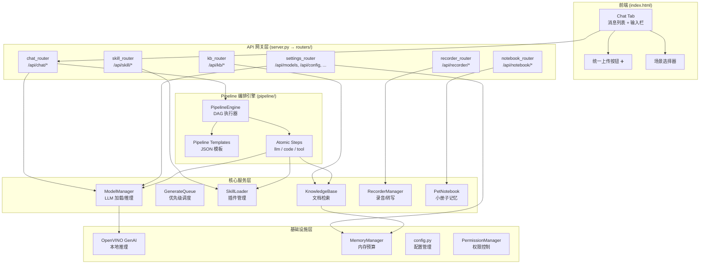
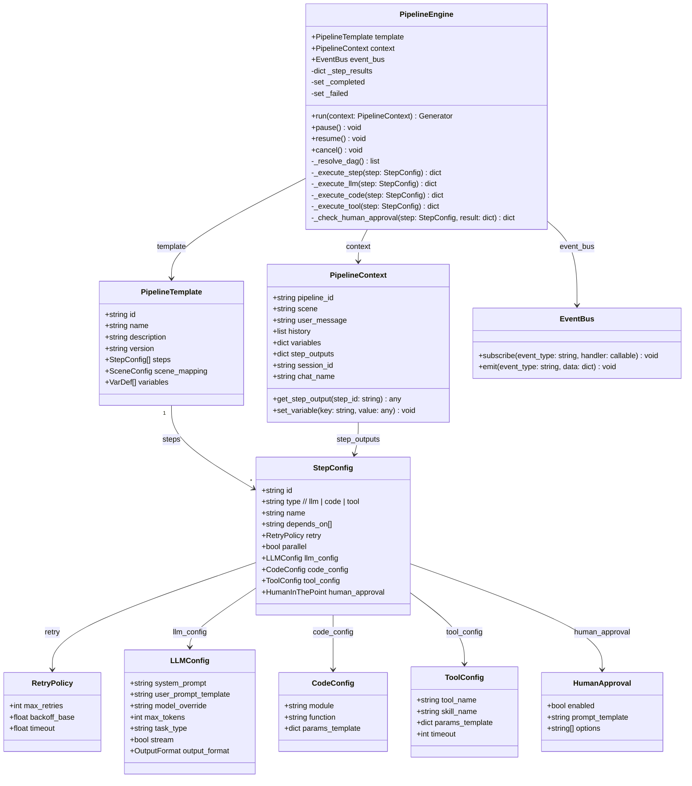
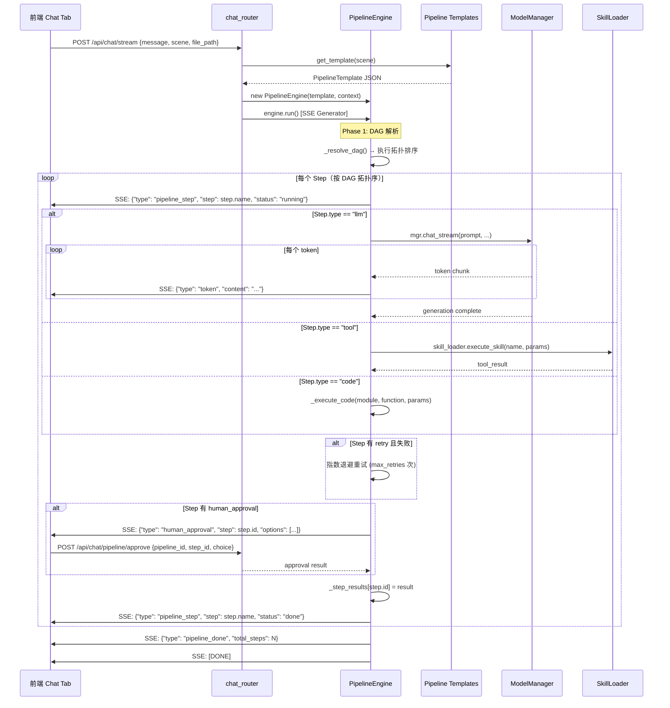
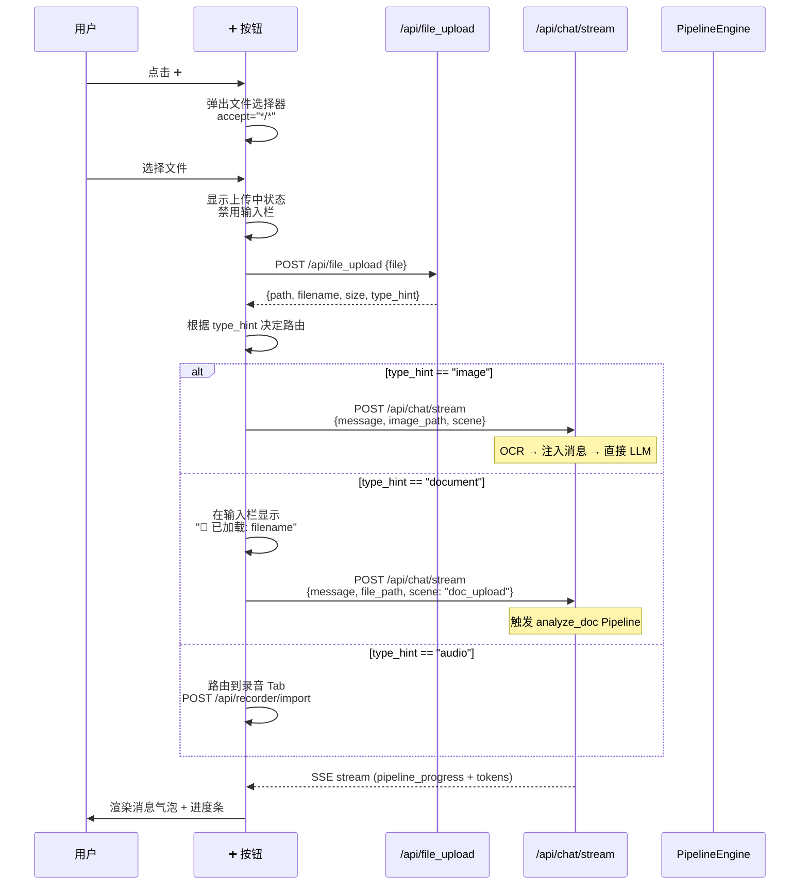
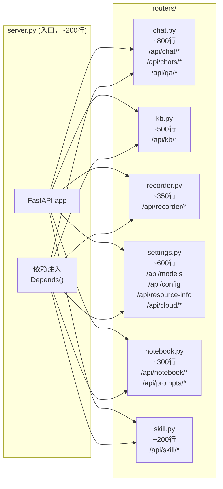
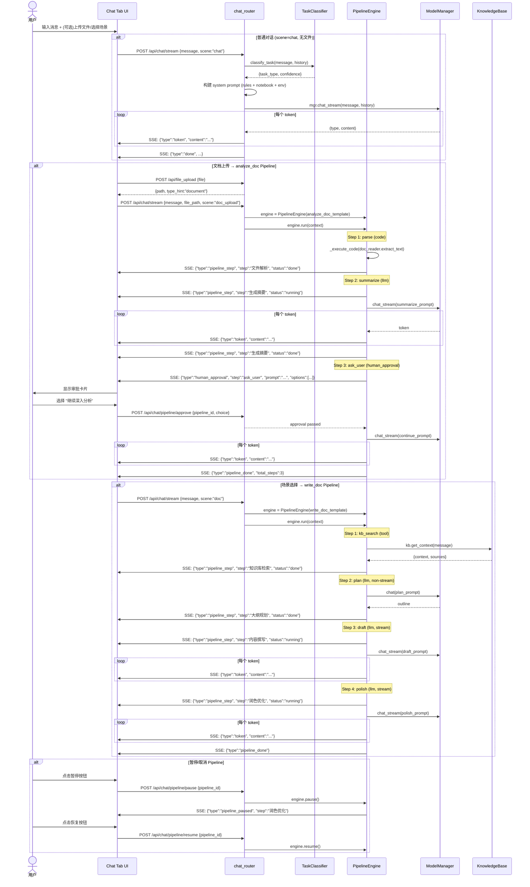
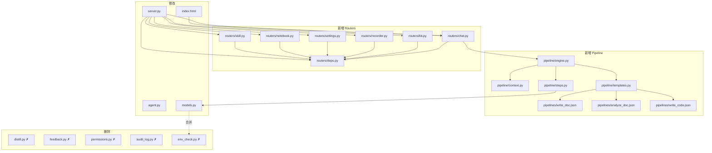
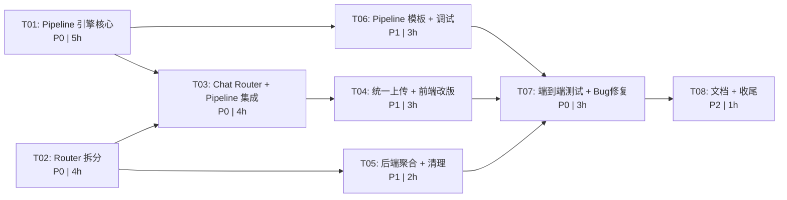

# Patch 9 — 完整架构设计文档

> **Architecture Design** | v1.0 | 2025-07-18
> 作者：高见远（Gao）· 架构师

---

## 目录

- [1. 架构总览](#1-架构总览)
- [2. Pipeline 编排引擎](#2-pipeline-编排引擎)
- [3. 统一上传按钮](#3-统一上传按钮)
- [4. server.py Router 拆分](#4-serverpy-router-拆分)
- [5. 后端低风险聚合](#5-后端低风险聚合)
- [6. Chat Tab 交互流](#6-chat-tab-交互流)
- [7. 完整文件变更清单](#7-完整文件变更清单)
- [8. 任务分解](#8-任务分解)

---

## 1. 架构总览

### 1.1 系统架构图



### 1.2 设计原则

1. **蚂蚁搬大象**：复杂任务拆解为简单原子操作，由确定性 DAG 编排
2. **渐进式改版**：Router 拆分保持 API 签名不变，前端逐步适配
3. **最小化破坏**：聚合小模块时优先内联，避免大范围重构
4. **Pipeline 可视化**：每步进度通过 SSE 推送，用户可暂停/取消

### 1.3 核心变化概览

| 变更域 | 当前状态 | Patch 9 目标 |
|--------|---------|-------------|
| agent.py | 线性循环 (while loop) | DAG Pipeline 引擎 |
| server.py | 3950 行单文件 | 6 个 Router 模块 |
| 文件上传 | 图片/文档分开上传 | 统一 ➕ 按钮 |
| 小模块 | feedback.py / permissions.py / audit_log.py 独立文件 | 内联到 router 或删除 |
| distill.py | 云端蒸馏功能 | 删除 |
| env_check.py | 独立环境检查 | 合并到 models.py |

---

## 2. Pipeline 编排引擎

### 2.1 核心概念

Pipeline 引擎将 `agent.py` 的线性循环改造为 **DAG（有向无环图）** 执行模型。每个 Pipeline 由 JSON 模板定义，由若干 **Step（原子步骤）** 组成，Step 之间通过数据流连接。

**关键抽象**：
- **Step**：原子操作，支持三种类型 `llm` / `code` / `tool`
- **Pipeline**：DAG 图，定义 Step 之间的执行顺序和数据依赖
- **PipelineEngine**：执行器，负责 DAG 解析、顺序/并行执行、重试、SSE 推送
- **PipelineContext**：运行时上下文，携带全局变量、Step 输出、用户干预点

### 2.2 数据结构



### 2.3 执行流程



### 2.4 Scene-to-Pipeline 映射

| Scene | Pipeline ID | 模板文件 | 说明 |
|-------|------------|---------|------|
| `chat` | — (直连) | — | 普通对话不经过 Pipeline，直接调 LLM |
| `doc` | `write_doc` | `pipelines/write_doc.json` | 文档写作：检索→规划→分段→润色 |
| `code` | `write_code` | `pipelines/write_code.json` | 代码编写：分析→生成→测试 |
| 文档上传 | `analyze_doc` | `pipelines/analyze_doc.json` | 文档分析：解析→提取→问答 |
| 图片上传 | — (直连 OCR) | — | 图片走 OCR 注入消息 |

### 2.5 Pipeline 模板示例

#### 模板 1: `pipelines/write_doc.json`

```json
{
  "id": "write_doc",
  "name": "文档写作",
  "version": "1.0",
  "scene_mapping": "doc",
  "variables": [
    {"name": "topic", "source": "user_message", "required": true},
    {"name": "style", "source": "user_message", "default": "专业"},
    {"name": "kb_context", "source": "kb_search", "default": ""}
  ],
  "steps": [
    {
      "id": "kb_search",
      "type": "tool",
      "name": "知识库检索",
      "tool_config": {
        "tool_name": "kb_search",
        "params_template": {
          "query": "{{user_message}}",
          "top_k": 5
        }
      },
      "retry": {"max_retries": 1, "timeout": 10}
    },
    {
      "id": "plan",
      "type": "llm",
      "name": "大纲规划",
      "depends_on": ["kb_search"],
      "llm_config": {
        "system_prompt": "你是一个文档规划专家。根据用户需求和检索到的资料，制定文档大纲。",
        "user_prompt_template": "主题：{{topic}}\n风格：{{style}}\n参考资料：{{kb_search.output}}\n\n请制定文档大纲，包含标题和各节要点。",
        "max_tokens": 800,
        "task_type": "text",
        "stream": false
      }
    },
    {
      "id": "draft",
      "type": "llm",
      "name": "内容撰写",
      "depends_on": ["plan"],
      "llm_config": {
        "system_prompt": "你是一个专业文档写手。严格按照大纲撰写完整文档。",
        "user_prompt_template": "大纲：\n{{plan.output}}\n\n请按照大纲撰写完整文档。风格：{{style}}",
        "max_tokens": 2000,
        "task_type": "doc",
        "stream": true
      }
    },
    {
      "id": "polish",
      "type": "llm",
      "name": "润色优化",
      "depends_on": ["draft"],
      "llm_config": {
        "system_prompt": "你是一个文档润色专家。优化文档的表达、逻辑和格式。",
        "user_prompt_template": "请润色以下文档：\n\n{{draft.output}}",
        "max_tokens": 2500,
        "task_type": "text",
        "stream": true
      }
    },
    {
      "id": "save",
      "type": "tool",
      "name": "保存文档",
      "depends_on": ["polish"],
      "tool_config": {
        "tool_name": "doc_writer",
        "skill_name": "word-writer",
        "params_template": {
          "content": "{{polish.output}}",
          "filename": "{{topic}}.docx"
        }
      }
    }
  ]
}
```

#### 模板 2: `pipelines/analyze_doc.json`

```json
{
  "id": "analyze_doc",
  "name": "文档分析",
  "version": "1.0",
  "scene_mapping": "doc_upload",
  "variables": [
    {"name": "file_path", "source": "upload", "required": true},
    {"name": "file_type", "source": "upload", "required": true}
  ],
  "steps": [
    {
      "id": "parse",
      "type": "code",
      "name": "文件解析",
      "code_config": {
        "module": "doc_reader",
        "function": "extract_text",
        "params_template": {
          "file_path": "{{file_path}}"
        }
      }
    },
    {
      "id": "summarize",
      "type": "llm",
      "name": "生成摘要",
      "depends_on": ["parse"],
      "llm_config": {
        "system_prompt": "你是一个文档分析专家。对文档内容进行结构化摘要。",
        "user_prompt_template": "请分析以下文档并生成结构化摘要：\n\n{{parse.output}}",
        "max_tokens": 1500,
        "task_type": "text",
        "stream": true
      }
    },
    {
      "id": "ask_user",
      "type": "llm",
      "name": "用户追问",
      "depends_on": ["summarize"],
      "human_approval": {
        "enabled": true,
        "prompt_template": "文档分析完成。摘要：\n{{summarize.output}}\n\n你希望我接下来做什么？",
        "options": ["继续深入分析", "生成报告", "提取关键信息", "结束"]
      },
      "llm_config": {
        "system_prompt": "根据用户选择继续分析文档。",
        "user_prompt_template": "文档内容：{{parse.output}}\n用户选择：{{ask_user.choice}}",
        "max_tokens": 2000,
        "task_type": "text",
        "stream": true
      }
    }
  ]
}
```

#### 模板 3: `pipelines/write_code.json`

```json
{
  "id": "write_code",
  "name": "代码编写",
  "version": "1.0",
  "scene_mapping": "code",
  "variables": [
    {"name": "requirement", "source": "user_message", "required": true}
  ],
  "steps": [
    {
      "id": "analyze",
      "type": "llm",
      "name": "需求分析",
      "llm_config": {
        "system_prompt": "你是一个资深程序员。分析用户需求，规划技术方案。",
        "user_prompt_template": "需求：{{requirement}}\n\n请分析需求并规划技术方案。",
        "max_tokens": 600,
        "task_type": "code",
        "stream": false
      }
    },
    {
      "id": "implement",
      "type": "llm",
      "name": "编码实现",
      "depends_on": ["analyze"],
      "llm_config": {
        "system_prompt": "你是一个代码生成专家。根据技术方案生成高质量代码。",
        "user_prompt_template": "技术方案：\n{{analyze.output}}\n\n请生成完整代码实现。需求：{{requirement}}",
        "max_tokens": 2000,
        "task_type": "code",
        "stream": true
      },
      "tool_config": {
        "tool_name": "code_runner",
        "skill_name": "code-runner"
      }
    },
    {
      "id": "test",
      "type": "tool",
      "name": "运行测试",
      "depends_on": ["implement"],
      "tool_config": {
        "tool_name": "code_runner",
        "skill_name": "code-runner",
        "params_template": {
          "code": "{{implement.output}}",
          "action": "run"
        },
        "timeout": 30
      },
      "retry": {"max_retries": 1, "timeout": 30}
    }
  ]
}
```

### 2.6 SSE 事件协议

Pipeline 引擎通过 SSE 推送以下事件类型（扩展现有协议）：

| 事件类型 | 字段 | 说明 |
|---------|------|------|
| `pipeline_start` | `{pipeline_id, total_steps, scene}` | Pipeline 开始执行 |
| `pipeline_step` | `{step_id, step_name, status: "running"|"done"|"failed", progress}` | 单步状态变更 |
| `pipeline_progress` | `{overall_progress: 0.0-1.0, current_step, total_steps}` | 整体进度 |
| `human_approval` | `{step_id, prompt, options}` | 请求用户介入 |
| `pipeline_paused` | `{step_id, reason}` | Pipeline 已暂停 |
| `pipeline_done` | `{total_steps, elapsed}` | Pipeline 完成 |
| `pipeline_error` | `{step_id, error}` | Pipeline 执行失败 |
| `token` | `{content}` | LLM token 流（复用现有） |
| `fold` | `{think_len}` | 思维链折叠（复用现有） |
| `task_type` | `{task_type, confidence}` | 任务分类（复用现有） |
| `done` | `{model, chars, time, speed}` | 完成（复用现有） |

### 2.7 用户干预点

Pipeline 支持以下用户干预：

1. **暂停/恢复**：任意时刻可暂停 Pipeline，当前 Step 完成后停止
2. **取消**：立即终止 Pipeline，释放资源
3. **人工审批**：Step 配置 `human_approval` 时，执行到该步暂停等待用户选择
4. **参数注入**：用户可在审批时修改变量值（如调整大纲、选择风格）

---

## 3. 统一上传按钮

### 3.1 设计目标

将现有的图片上传（📷）和文档上传（📎）合并为**一个 `➕` 按钮**，后端根据文件扩展名自动路由。

### 3.2 文件类型路由规则

```
用户点击 ➕ → 文件选择器 → 选择文件
  │
  ├─ 图片 (.png/.jpg/.jpeg/.gif/.bmp/.webp)
  │   → /api/file_upload
  │   → OCR 提取文本 → 注入 user_message
  │
  ├─ 文档 (.docx/.doc/.pdf/.xlsx/.xls/.txt/.md/.csv/.json)
  │   → /api/file_upload
  │   → 触发 analyze_doc Pipeline
  │
  ├─ 音频 (.mp3/.wav/.m4a/.webm/.ogg/.flac)
  │   → /api/recorder/import
  │   → 转写流程
  │
  └─ 其他
      → /api/file_upload
      → 作为附件处理
```

### 3.3 前端交互设计



### 3.4 后端 API 变更

**现有 `POST /api/file_upload`** 增加返回字段：

```python
# 返回值增加 type_hint 字段
{
    "path": "/workspace/tmp_upload/xxx.pdf",
    "filename": "xxx.pdf",
    "size": 12345,
    "type_hint": "document"   # 新增: "image" | "document" | "audio" | "other"
}
```

**类型判断逻辑**（在 `_safe_filename` 后添加）：

```python
def _classify_upload(filename: str) -> str:
    ext = filename.rsplit(".", 1)[-1].lower() if "." in filename else ""
    IMAGE_EXTS = {"png", "jpg", "jpeg", "gif", "bmp", "webp"}
    DOC_EXTS = {"docx", "doc", "pdf", "xlsx", "xls", "txt", "md", "csv",
                "json", "py", "js", "ts", "html", "css", "xml", "yaml", "yml"}
    AUDIO_EXTS = {"mp3", "wav", "m4a", "webm", "ogg", "flac"}
    if ext in IMAGE_EXTS:
        return "image"
    if ext in AUDIO_EXTS:
        return "audio"
    if ext in DOC_EXTS:
        return "document"
    return "other"
```

### 3.5 前端代码结构

```javascript
// 替换现有图片上传和文档上传按钮为统一 ➕ 按钮
function onPlusButtonClick() {
    const input = document.createElement('input');
    input.type = 'file';
    input.accept = '*/*';  // 接受所有文件类型
    input.onchange = async (e) => {
        const file = e.target.files[0];
        if (!file) return;

        // 1. 上传文件
        const formData = new FormData();
        formData.append('file', file);
        const uploadResult = await fetch(API + '/api/file_upload', {
            method: 'POST', body: formData
        }).then(r => r.json());

        // 2. 根据类型路由
        switch (uploadResult.type_hint) {
            case 'image':
                sendChatMessage(currentMessage, {
                    image_path: uploadResult.path
                });
                break;
            case 'document':
                sendChatMessage('分析文档: ' + uploadResult.filename, {
                    file_path: uploadResult.path,
                    scene: 'doc_upload'
                });
                break;
            case 'audio':
                importAudio(uploadResult);
                break;
            default:
                sendChatMessage('查看文件: ' + uploadResult.filename, {
                    file_path: uploadResult.path
                });
        }
    };
    input.click();
}
```

---

## 4. server.py Router 拆分

### 4.1 拆分策略

将 3950 行的 `server.py` 按 API 前缀拆分为 6 个 FastAPI Router 文件，**保持所有 API 路径签名不变**。原 `server.py` 退化为应用初始化 + Router 注册入口。

### 4.2 Router 模块划分



### 4.3 依赖注入设计

每个 Router 通过 FastAPI `Depends()` 获取共享服务实例：

```python
# deps.py — 共享依赖
from functools import lru_cache

def get_mgr() -> "ModelManager":
    """获取全局 ModelManager 实例"""
    from models import manager
    return manager

def get_kb() -> "KnowledgeBase":
    """获取全局 KnowledgeBase 实例"""
    from knowledge_base import get_knowledge_base
    return get_knowledge_base()

def get_recorder() -> "RecorderManager":
    """获取全局 RecorderManager 实例"""
    from server import recorder
    return recorder

def get_skill_loader() -> "SkillLoader":
    """获取全局 SkillLoader 实例"""
    from server import skill_loader
    return skill_loader

def get_notebook() -> "PetNotebook":
    """获取全局 PetNotebook 实例"""
    mgr = get_mgr()
    return mgr.notebook

def get_perm_mgr() -> "PermissionManager":
    """获取全局 PermissionManager 实例"""
    from server import perm_mgr
    return perm_mgr

def get_audit_logger() -> "AuditLogger":
    """获取全局 AuditLogger 实例"""
    from server import audit_logger
    return audit_logger
```

### 4.4 端点分配表

#### chat.py（ChatRouter）— `prefix="/api"`

| 方法 | 路径 | 当前行号 | 功能 |
|------|------|---------|------|
| POST | `/api/chat` | ~L800 | 非流式对话 |
| POST | `/api/chat/stream` | ~L900 | 流式对话（核心 ~700 行） |
| POST | `/api/chat/cloud/stream` | L2380 | 云端流式对话 |
| GET | `/api/chats` | ~L1600 | 会话列表 |
| POST | `/api/chats/new` | ~L1620 | 新建会话 |
| POST | `/api/chats/switch` | ~L1640 | 切换会话 |
| DELETE | `/api/chats/{chat_name}` | ~L1660 | 删除会话 |
| GET | `/api/chats/{chat_name}/messages` | ~L1680 | 获取消息历史 |
| POST | `/api/chats/{chat_name}/append` | ~L1700 | 追加消息 |
| POST | `/api/qa/upload` | L3349 | 问答Tab文件上传 |
| POST | `/api/qa/ask` | L3430 | 问答Tab提问 |
| POST | `/api/ocr` | ~L1750 | OCR 识别 |
| POST | `/api/ocr_upload` | ~L1780 | OCR 上传识别 |
| POST | `/api/ocr_batch` | ~L1810 | OCR 批量识别 |
| POST | `/api/feedback` | L2190 | 提交反馈 |
| GET | `/api/feedback/{msg_hash}` | L2222 | 获取反馈 |
| GET | `/api/feedback/stats` | L2228 | 反馈统计 |
| GET | `/api/feedback/query` | L2234 | 查询反馈 |
| POST | `/api/file_upload` | L2469 | 文件上传 |
| POST | `/api/distill` | L2443 | 蒸馏（Patch 9 删除） |
| POST | `/api/distill/compare` | L2457 | 蒸馏对比（Patch 9 删除） |

#### kb.py（KBRouter）— `prefix="/api/kb"`

| 方法 | 路径 | 当前行号 | 功能 |
|------|------|---------|------|
| GET | `/api/kb/stats` | L2487 | 知识库统计 |
| GET | `/api/kb/module-status` | L2594 | 模块安装状态 |
| GET | `/api/kb/memory-info` | L2662 | 内存信息 |
| POST | `/api/kb/install-module` | L2743 | 安装模块 |
| POST | `/api/kb/uninstall-module` | L2857 | 卸载模块 |
| POST | `/api/kb/load-models` | L2910 | 加载模型 |
| POST | `/api/kb/unload-models` | L2900 | 卸载模型 |
| GET | `/api/kb/documents` | L2934 | 文档列表 |
| POST | `/api/kb/upload` | L2939 | 上传文档 |
| GET | `/api/kb/documents/{doc_id}/status` | L3047 | 文档状态 |
| DELETE | `/api/kb/documents/{doc_id}` | L3055 | 删除文档 |
| POST | `/api/kb/documents/{doc_id}/pause` | L3063 | 暂停处理 |
| POST | `/api/kb/documents/{doc_id}/resume` | L3069 | 恢复处理 |
| POST | `/api/kb/documents/{doc_id}/cancel` | L3075 | 取消处理 |
| POST | `/api/kb/documents/{doc_id}/retry_summary` | L3081 | 重试摘要 |
| POST | `/api/kb/ask` | L3178 | KB 问答（SSE） |
| POST | `/api/kb/new_session` | L3306 | 新建KB会话 |
| POST | `/api/kb/search` | L3315 | KB 检索 |
| POST | `/api/kb/import_text` | L3325 | 导入文本 |

#### recorder.py（RecorderRouter）— `prefix="/api/recorder"`

| 方法 | 路径 | 当前行号 | 功能 |
|------|------|---------|------|
| GET | `/api/recorder/whisper/status` | L3543 | Whisper状态 |
| POST | `/api/recorder/whisper/load` | L3548 | 加载Whisper |
| POST | `/api/recorder/whisper/unload` | L3557 | 卸载Whisper |
| POST | `/api/recorder/start` | L3562 | 开始录音 |
| POST | `/api/recorder/chunk` | L3567 | 上传音频块 |
| POST | `/api/recorder/finish` | L3577 | 结束录音 |
| POST | `/api/recorder/import` | L3595 | 导入音频 |
| GET | `/api/recorder/locked` | L3619 | 是否锁定 |
| GET | `/api/recorder/sessions` | L3624 | 历史录音 |
| GET | `/api/recorder/{session_id}/status` | L3629 | 转写进度 |
| GET | `/api/recorder/{session_id}/transcript` | L3637 | 获取转写稿 |
| GET | `/api/recorder/{session_id}/rough` | L3642 | 获取粗稿 |
| GET | `/api/recorder/{session_id}/segments` | L3647 | 时间戳段落 |
| GET | `/api/recorder/{session_id}/audio` | L3656 | 播放录音 |
| PUT | `/api/recorder/{session_id}/transcript` | L3668 | 更新转写稿 |
| POST | `/api/recorder/{session_id}/summarize` | L3677 | AI纪要 |
| POST | `/api/recorder/{session_id}/import_kb` | L3685 | 导入KB |
| POST | `/api/recorder/{session_id}/pause` | L3690 | 暂停 |
| POST | `/api/recorder/{session_id}/resume` | L3695 | 恢复 |
| POST | `/api/recorder/{session_id}/cancel` | L3700 | 取消 |
| DELETE | `/api/recorder/{session_id}` | L3705 | 删除 |
| GET | `/api/recorder/storage` | L3710 | 空间统计 |
| POST | `/api/recorder/recover` | L3715 | 崩溃恢复 |
| POST | `/api/recorder/live-transcribe` | L3720 | 实时转写 |
| POST | `/api/recorder/{session_id}/refine` | L3730 | 纠错润色 |

#### settings.py（SettingsRouter）— `prefix="/api"`

| 方法 | 路径 | 当前行号 | 功能 |
|------|------|---------|------|
| GET | `/api/info` | ~L600 | 系统信息 |
| GET | `/api/status` | ~L620 | 模型状态 |
| GET | `/api/health` | ~L650 | 健康检查 |
| GET | `/api/models` | ~L670 | 模型列表 |
| POST | `/api/load/{model_name}` | ~L700 | 加载模型 |
| POST | `/api/unload/{model_name}` | ~L740 | 卸载模型 |
| GET | `/api/devices` | ~L760 | 设备列表 |
| POST | `/api/device/switch` | ~L780 | 切换设备 |
| GET | `/api/env/check` | ~L820 | 环境检查 |
| POST | `/api/stop` | ~L850 | 停止生成 |
| POST | `/api/rescan` | ~L870 | 重新扫描 |
| GET | `/api/scene_skills` | ~L890 | 场景技能 |
| POST | `/api/scene_skills` | ~L910 | 更新场景技能 |
| POST | `/api/models/import` | ~L930 | 模型导入 |
| GET | `/api/workspace/{file_path:path}` | ~L1720 | 工作区文件 |
| GET | `/api/workspace` | ~L1740 | 工作区列表 |
| GET | `/api/config` | ~L1850 | 获取配置 |
| POST | `/api/config` | ~L1870 | 保存配置 |
| GET | `/api/resource-info` | L2669 | 资源信息 |
| POST | `/api/budget` | L2728 | 设置预算 |
| GET | `/api/cloud/config` | L2340 | 云端配置 |
| POST | `/api/cloud/config` | L2354 | 保存云端配置 |
| POST | `/api/cloud/test` | L2368 | 测试云端 |
| DELETE | `/api/cloud/config` | L2374 | 删除云端配置 |
| GET | `/api/training/records` | L2251 | 训练记录 |
| POST | `/api/training/record` | L2257 | 添加训练记录 |
| DELETE | `/api/training/record/{record_id}` | L2276 | 删除训练记录 |
| GET | `/api/training/stats` | L2284 | 训练统计 |
| GET | `/api/training/templates` | L2289 | 参数模板列表 |
| GET | `/api/training/template/{model}` | L2294 | 获取参数模板 |
| POST | `/api/training/template` | L2299 | 保存参数模板 |
| DELETE | `/api/training/template/{model}` | L2308 | 删除参数模板 |
| GET | `/api/training/export` | L2316 | 导出训练记录 |
| POST | `/api/training/import` | L2326 | 导入训练记录 |
| GET | `/api/permission/status` | ~L1950 | 权限状态 |
| POST | `/api/permission/mode` | ~L1970 | 切换权限模式 |
| POST | `/api/permission/auto_allow` | ~L1990 | 自动允许 |
| GET | `/api/audit/query` | ~L2010 | 审计查询 |
| GET | `/api/audit/stats` | ~L2030 | 审计统计 |
| POST | `/api/audit/clear` | ~L2050 | 清除审计 |
| POST | `/api/extensions/upload` | L3741 | 扩展上传 |
| GET | `/api/extensions/list` | L3819 | 扩展列表 |
| DELETE | `/api/extensions/{ext_name}` | L3843 | 扩展卸载 |

#### notebook.py（NotebookRouter）— `prefix="/api/notebook"`

| 方法 | 路径 | 当前行号 | 功能 |
|------|------|---------|------|
| GET | `/api/notebook/profile` | ~L2060 | 获取档案 |
| POST | `/api/notebook/profile` | ~L2080 | 更新档案 |
| GET | `/api/notebook/facts` | ~L2100 | 事实列表 |
| POST | `/api/notebook/facts` | ~L2120 | 添加事实 |
| DELETE | `/api/notebook/facts/{index}` | ~L2140 | 删除事实 |
| GET | `/api/notebook/glossary` | ~L2160 | 术语列表 |
| POST | `/api/notebook/glossary` | ~L2180 | 添加术语 |
| DELETE | `/api/notebook/glossary/{key}` | ~L2200 | 删除术语 |
| GET | `/api/notebook/identity_card` | ~L2220 | 身份卡 |
| POST | `/api/notebook/identity_card` | ~L2240 | 更新身份卡 |
| GET | `/api/notebook/milestones` | ~L2260 | 里程碑 |
| POST | `/api/notebook/sync_skills` | ~L2280 | 同步技能 |
| GET | `/api/notebook/knowledge` | L3456 | 知识条目 |
| GET | `/api/notebook/memory` | L3478 | 记忆列表 |
| POST | `/api/notebook/memory` | L3485 | 添加记忆 |
| PUT | `/api/notebook/memory/{index}` | L3496 | 更新记忆 |
| DELETE | `/api/notebook/memory/{index}` | L3507 | 删除记忆 |
| POST | `/api/notebook/memory/import` | L3517 | 批量导入 |
| GET | `/api/notebook/preview` | L3528 | 预览 |
| GET | `/api/prompts/info` | L3535 | Prompt 模块信息 |

#### skill.py（SkillRouter）— `prefix="/api/skill"`

| 方法 | 路径 | 当前行号 | 功能 |
|------|------|---------|------|
| POST | `/api/skill/import` | skill_router.py | 导入技能 |
| GET | `/api/skill/list` | skill_router.py | 技能列表 |
| GET | `/api/skill/{name}` | skill_router.py | 技能详情 |
| POST | `/api/skill/execute` | skill_router.py | 执行技能 |
| DELETE | `/api/skill/{name}` | skill_router.py | 删除技能 |

> 注：`skill_router.py` 已使用闭包模式挂载路由，需改为标准 `APIRouter` 模式。

### 4.5 Router 注册模式

```python
# server.py — 精简后的入口
from fastapi import FastAPI
from routers import chat, kb, recorder, settings, notebook, skill

app = FastAPI(title="本地AI助手")

# 全局服务初始化
mgr = ModelManager()
skill_loader = SkillLoader()
perm_mgr = PermissionManager()  # Patch 9: 将被内联
audit_logger = AuditLogger()    # Patch 9: 将被内联
kb = get_knowledge_base()
recorder = RecorderManager()

# 注册路由
app.include_router(chat.router)
app.include_router(kb.router)
app.include_router(recorder.router)
app.include_router(settings.router)
app.include_router(notebook.router)
app.include_router(skill.router)

# 静态页面
@app.get("/", response_class=HTMLResponse)
def index():
    return open(os.path.join(WORKSPACE_DIR, "index.html"), "r", encoding="utf-8").read()
```

---

## 5. 后端低风险聚合

### 5.1 聚合操作清单

| 编号 | 操作 | 源文件 | 目标 | 风险 | 理由 |
|------|------|--------|------|------|------|
| M1 | **内联** feedback.py | `feedback.py` → | `routers/chat.py` 内联类 | 低 | FeedbackManager 仅 ~80 行，仅 chat_router 使用 |
| M2 | **内联** permissions.py | `permissions.py` → | `routers/settings.py` 内联类 | 低 | PermissionManager 仅 ~60 行，仅设置和 skill 调用 |
| M3 | **内联** audit_log.py | `audit_log.py` → | `routers/settings.py` 内联类 | 低 | AuditLogger 仅 ~70 行，仅审计查询使用 |
| M4 | **删除** distill.py | `distill.py` → 删除 | 删除文件 + 删除 `/api/distill` 端点 | 低 | 云端蒸馏功能废弃，无引用 |
| M5 | **合并** env_check.py → models.py | `env_check.py` → | `models.py` 的 `_detect_env()` 和 `detect_devices()` | 中 | 环境检测逻辑与模型管理高度耦合 |
| M6 | **保留** training.py | `training.py` | 保留独立文件 | — | 训练管理器有独立的 CRUD 逻辑，~200行，值得保留 |

### 5.2 聚合后文件结构

```
聚合前:                      聚合后:
├── feedback.py  (80行)      ├── (删除，内联到 routers/chat.py)
├── permissions.py (60行)    ├── (删除，内联到 routers/settings.py)
├── audit_log.py (70行)      ├── (删除，内联到 routers/settings.py)
├── distill.py (50行)        ├── (删除)
├── env_check.py (120行)     ├── (合并到 models.py)
├── agent.py (881行)         ├── pipeline/  (新目录)
├── server.py (3950行)       ├── server.py (~200行)
│                            ├── routers/
│                            │   ├── deps.py
│                            │   ├── chat.py (~800行)
│                            │   ├── kb.py (~500行)
│                            │   ├── recorder.py (~350行)
│                            │   ├── settings.py (~600行)
│                            │   ├── notebook.py (~300行)
│                            │   └── skill.py (~200行)
│                            └── pipelines/
│                                ├── engine.py
│                                ├── context.py
│                                ├── steps.py
│                                ├── write_doc.json
│                                ├── analyze_doc.json
│                                └── write_code.json
```

### 5.3 M5: env_check.py → models.py 合并细节

`env_check.py` 导出两个主要函数：
- `detect_env()` — 检测操作系统、Python版本、GUI库等 → 合并为 `ModelManager._detect_env()` （已存在，补充 env_check 的逻辑）
- `detect_devices()` — 通过 OpenVINO Core 检测可用设备 → 合并为 `ModelManager.get_available_devices()` （已存在）

合并策略：将 `env_check.py` 中的检测逻辑作为方法合并到 `ModelManager`，删除 `env_check.py`，所有 `from env_check import ...` 改为从 `models.py` 调用。

---

## 6. Chat Tab 交互流

### 6.1 完整交互序列图



### 6.2 前端 SSE 处理逻辑

```javascript
function handleSSEMessage(event) {
    const data = JSON.parse(event.data);
    switch (data.type) {
        // === 现有事件（保持不变）===
        case 'token':
            appendToCurrentMessage(data.content);
            break;
        case 'done':
            finalizeMessage(data);
            break;
        case 'fold':
            foldThinkContent(data.think_len);
            break;
        case 'task_type':
            showTaskBadge(data.task_type, data.confidence);
            break;

        // === Pipeline 新增事件 ===
        case 'pipeline_start':
            showPipelineProgress(data.total_steps);
            break;
        case 'pipeline_step':
            updatePipelineStep(data.step_name, data.status);
            break;
        case 'pipeline_progress':
            updateProgressBar(data.overall_progress);
            break;
        case 'human_approval':
            showApprovalCard(data.step_id, data.prompt, data.options);
            break;
        case 'pipeline_paused':
            showResumeButton();
            break;
        case 'pipeline_done':
            hidePipelineProgress();
            break;
        case 'pipeline_error':
            showErrorToast(data.step_id, data.error);
            break;
    }
}
```

### 6.3 Pipeline 控制按钮

在 Chat Tab 输入栏右侧添加控制按钮组：

```
普通对话: [输入栏] [➕] [发送▶]
Pipeline 中: [输入栏] [⏸暂停] [⏹取消] [进度: 2/5 ██████░░░░]
等待审批: [输入栏] [审批卡片: 选择 A / B / C]
```

---

## 7. 完整文件变更清单

### 7.1 新增文件

| 文件路径 | 类型 | 说明 |
|---------|------|------|
| `pipeline/__init__.py` | 新增 | Pipeline 包初始化 |
| `pipeline/engine.py` | 新增 | PipelineEngine 类（~300行） |
| `pipeline/context.py` | 新增 | PipelineContext 类（~80行） |
| `pipeline/steps.py` | 新增 | Step 执行器（llm/code/tool）（~200行） |
| `pipeline/templates.py` | 新增 | 模板加载器（~60行） |
| `pipelines/write_doc.json` | 新增 | 文档写作 Pipeline 模板 |
| `pipelines/analyze_doc.json` | 新增 | 文档分析 Pipeline 模板 |
| `pipelines/write_code.json` | 新增 | 代码编写 Pipeline 模板 |
| `routers/__init__.py` | 新增 | Router 包初始化 |
| `routers/deps.py` | 新增 | 依赖注入函数 |
| `routers/chat.py` | 新增 | Chat/会话/QA/OCR/反馈 Router |
| `routers/kb.py` | 新增 | 知识库 Router |
| `routers/recorder.py` | 新增 | 录音纪要 Router |
| `routers/settings.py` | 新增 | 模型/配置/资源/云端/训练/权限/审计 Router |
| `routers/notebook.py` | 新增 | 小册子/记忆 Router |
| `routers/skill.py` | 新增 | 技能管理 Router（替代 skill_router.py） |
| `docs/PATCH9_ARCHITECTURE.md` | 新增 | 本架构文档 |

### 7.2 修改文件

| 文件路径 | 变更说明 |
|---------|---------|
| `server.py` | **大幅精简**：从 3950 行 → ~200 行。仅保留 FastAPI app 初始化 + Router 注册 + `main()` 启动逻辑。移除所有 `@app.get/post` 端点到对应 Router |
| `agent.py` | **保留但重构**：`AgentLoop` 改为 Pipeline 步骤适配器（将现有 while-loop 逻辑映射为 Pipeline Step 执行），或作为 `chat` 场景的快速路径保留 |
| `models.py` | **增加方法**：合并 `env_check.py` 的 `detect_env()` 和 `detect_devices()` 为 `ModelManager` 方法 |
| `skill_router.py` | **迁移后保留**：逻辑迁移到 `routers/skill.py`，原文件改为空壳或直接删除 |
| `index.html` | **前端改版**：(1) 合并上传按钮为 ➕ (2) Pipeline 进度条 UI (3) SSE 事件处理扩展 (4) 审批卡片组件 |

### 7.3 删除文件

| 文件路径 | 原因 |
|---------|------|
| `distill.py` | 功能废弃（云端蒸馏不再使用） |
| `feedback.py` | 内联到 `routers/chat.py` |
| `permissions.py` | 内联到 `routers/settings.py` |
| `audit_log.py` | 内联到 `routers/settings.py` |
| `env_check.py` | 合并到 `models.py` |

### 7.4 文件依赖关系图



---

## 8. 任务分解

### 8.1 任务依赖图



### 8.2 任务列表

#### T01: Pipeline 引擎核心
- **优先级**: P0
- **预估时间**: 5h
- **依赖**: 无
- **源文件**: `pipeline/__init__.py`, `pipeline/engine.py`, `pipeline/context.py`, `pipeline/steps.py`, `pipeline/templates.py`
- **描述**:
  - 实现 `PipelineEngine` 类：DAG 解析（拓扑排序）、顺序/并行执行、暂停/恢复/取消
  - 实现 `PipelineContext` 类：变量系统、Step 输出存储、用户干预
  - 实现 Step 执行器：`_execute_llm()`, `_execute_code()`, `_execute_tool()`
  - 实现模板加载器：从 JSON 文件加载 PipelineTemplate
  - 实现重试策略：指数退避、超时控制
  - SSE 事件发射：pipeline_start/step/progress/done/error

#### T02: Router 拆分
- **优先级**: P0
- **预估时间**: 4h
- **依赖**: 无
- **源文件**: `routers/__init__.py`, `routers/deps.py`, `routers/chat.py`, `routers/kb.py`, `routers/recorder.py`, `routers/settings.py`, `routers/notebook.py`, `routers/skill.py`, `server.py`
- **描述**:
  - 创建 `routers/deps.py` 依赖注入
  - 按 4.4 端点分配表拆分 `server.py` 的所有端点到 6 个 Router 文件
  - 重构 `skill_router.py` 为标准 `APIRouter` 模式
  - 精简 `server.py` 为初始化 + Router 注册入口 (~200行)
  - 确保所有 API 路径签名不变

#### T03: Chat Router + Pipeline 集成
- **优先级**: P0
- **预估时间**: 4h
- **依赖**: T01, T02
- **源文件**: `routers/chat.py`, `agent.py`, `server.py`
- **描述**:
  - 在 `chat_router` 中集成 Pipeline 引擎
  - 实现 scene → Pipeline 映射：`doc` → write_doc, `doc_upload` → analyze_doc, `code` → write_code
  - `chat` 场景保持快速路径（直接 LLM，不经过 Pipeline）
  - 重构 `api_chat_stream`：将 ~700 行逻辑拆分为 Pipeline 模式 + 兼容模式
  - 添加 Pipeline 控制端点：`/api/chat/pipeline/approve`, `/api/chat/pipeline/pause`, `/api/chat/pipeline/resume`

#### T04: 统一上传 + 前端改版
- **优先级**: P1
- **预估时间**: 3h
- **依赖**: T03
- **源文件**: `routers/chat.py` (file_upload端点), `index.html`
- **描述**:
  - 后端：`/api/file_upload` 增加 `type_hint` 返回字段
  - 前端：合并图片/文档上传按钮为 ➕ 按钮
  - 前端：实现文件类型路由逻辑（image → OCR, document → Pipeline, audio → recorder）
  - 前端：Pipeline 进度条 UI 组件
  - 前端：审批卡片组件
  - 前端：SSE 事件处理扩展（pipeline_* 事件类型）
  - 前端：暂停/恢复/取消按钮

#### T05: 后端聚合 + 清理
- **优先级**: P1
- **预估时间**: 2h
- **依赖**: T02
- **源文件**: `routers/chat.py`, `routers/settings.py`, `models.py`, `feedback.py`, `permissions.py`, `audit_log.py`, `distill.py`, `env_check.py`
- **描述**:
  - 内联 `FeedbackManager` 到 `routers/chat.py`
  - 内联 `PermissionManager` + `AuditLogger` 到 `routers/settings.py`
  - 删除 `distill.py` 及相关端点
  - 合并 `env_check.py` 到 `models.py`
  - 删除聚合后的空文件
  - 更新所有 `import` 引用

#### T06: Pipeline 模板 + 调试
- **优先级**: P1
- **预估时间**: 3h
- **依赖**: T01
- **源文件**: `pipelines/write_doc.json`, `pipelines/analyze_doc.json`, `pipelines/write_code.json`, `pipeline/engine.py`
- **描述**:
  - 编写 `write_doc.json` 模板（5步：检索→规划→撰写→润色→保存）
  - 编写 `analyze_doc.json` 模板（3步：解析→摘要→追问）
  - 编写 `write_code.json` 模板（3步：分析→编码→测试）
  - 调试 Pipeline 执行流程：验证 DAG 拓扑、Step 输入输出传递、重试逻辑
  - 验证 SSE 事件推送顺序

#### T07: 端到端测试 + Bug 修复
- **优先级**: P0
- **预估时间**: 3h
- **依赖**: T04, T05, T06
- **源文件**: 所有修改过的文件
- **描述**:
  - 端到端测试：普通对话、文档写作 Pipeline、文档分析 Pipeline、代码编写 Pipeline
  - 测试统一上传按钮：图片、文档、音频、其他文件
  - 测试 Pipeline 暂停/恢复/取消
  - 测试人工审批流程
  - 修复 PATCH9_DESIGN.md 中的 11 个已知 Bug
  - 回归测试：确保 KB 问答、录音转写、技能系统不受影响

#### T08: 文档 + 收尾
- **优先级**: P2
- **预估时间**: 1h
- **依赖**: T07
- **源文件**: `docs/PATCH9_ARCHITECTURE.md`, `README.md` (如需)
- **描述**:
  - 更新架构文档（如有变更）
  - 编写 Patch 9 变更日志
  - 代码清理：删除注释掉的代码、统一命名

### 8.3 总工时估算

| 任务 | 优先级 | 工时 |
|------|--------|------|
| T01: Pipeline 引擎核心 | P0 | 5h |
| T02: Router 拆分 | P0 | 4h |
| T03: Chat + Pipeline 集成 | P0 | 4h |
| T04: 统一上传 + 前端 | P1 | 3h |
| T05: 后端聚合 + 清理 | P1 | 2h |
| T06: Pipeline 模板 | P1 | 3h |
| T07: 端到端测试 | P0 | 3h |
| T08: 文档收尾 | P2 | 1h |
| **合计** | | **25h** |

### 8.4 关键路径

```
T01 (5h) → T03 (4h) → T04 (3h) → T07 (3h) → T08 (1h)
                                          总计: 16h（关键路径）
T02 (4h) → T03 (4h)                     （可与 T01 并行）
T01 (5h) → T06 (3h) → T07 (3h)          （非关键路径）
T02 (4h) → T05 (2h) → T07 (3h)          （非关键路径）
```

### 8.5 共享知识（工程师须知）

```
- 所有 API 路径签名保持不变（Router 拆分是内部重构）
- Pipeline SSE 事件类型以 "pipeline_" 为前缀，与现有事件不冲突
- Pipeline 模板存放在项目根目录的 pipelines/ 目录（非 pipeline/）
- GenerateQueue 的 HIGH/LOW 优先级机制不变，Pipeline 使用 HIGH 优先级
- 思维链折叠 (fold) 逻辑保留在 chat_router 中，Pipeline 的 LLM Step 直接复用
- 统一上传按钮的 type_hint 仅作为前端路由建议，后端不做强制限制
- env_check.py 合并到 models.py 后，所有 `from env_check import` 必须替换为从 models 导入
- skill_router.py 的闭包模式需改为 APIRouter 模式，保持路由路径不变
- 所有日期使用 ISO 8601 格式
- 错误响应统一使用 JSONResponse({"error": "..."}, status_code=xxx)
```

---

## 9. UNCLEAR / 假设

1. **Pipeline 与 AgentLoop 的关系**：假设 `agent.py` 的 `AgentLoop` 在 `chat` 场景下保留作为快速路径，其他场景由 Pipeline 接管。如果后续发现 `chat` 场景也需要 Pipeline，可统一。
2. **Pipeline 暂停粒度**：假设暂停发生在 Step 边界（当前 Step 完成后暂停），不支持 Step 内部暂停。LLM 流式 Step 不支持暂停，但支持取消。
3. **人工审批阻塞**：假设同一时间只有一个 Pipeline 等待审批，多 Pipeline 并发审批暂不支持。
4. **Pipeline 持久化**：假设 Pipeline 状态仅存在于内存（进程重启后丢失），暂不做持久化。
5. **skill_router.py 改造**：假设可以安全地将闭包模式改为 APIRouter 模式，保持所有路由路径和行为不变。
6. **env_check.py 合并风险**：`detect_devices()` 被 `ModelManager.get_available_devices()` 调用，合并时需确保 import 链不产生循环依赖。
7. **distill.py 删除**：假设无其他模块 import distill（需在实施时验证 grep）。
8. **统一上传的前端实现**：假设浏览器 `<input type="file" accept="*/*">` 在所有目标浏览器上行为一致。
