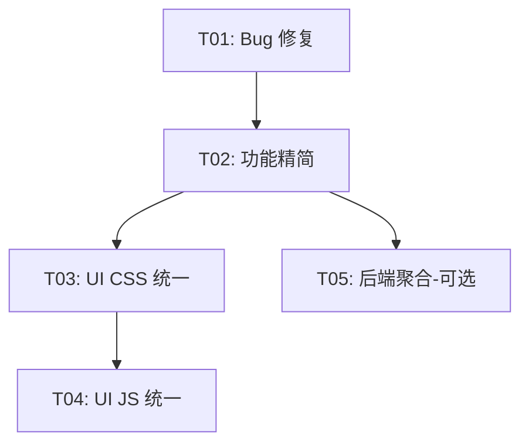

# PATCH 9 — 完整架构设计文档

> **设计文档** | 版本 2.0 | 2025-07-XX
> 包含：Bug 修复、功能精简、前端 UI 统一改版、后端模块聚合、Pipeline 引擎、统一上传、Router 拆分

---

## 目录

- [A. Bug 根因分析与修复方案（11 个）](#a-bug-根因分析与修复方案)
- [B. 功能精简方案](#b-功能精简方案)
- [C. 后端模块聚合方案](#c-后端模块聚合方案)
- [D. 前端 UI 改版方案](#d-前端-ui-改版方案)
- [E. 任务分解（旧版 5 任务）](#e-任务分解旧版-5-任务)
- [F. Pipeline 编排引擎设计（蚂蚁搬大象）](#f-pipeline-编排引擎设计蚂蚁搬大象)
- [G. 统一上传按钮设计](#g-统一上传按钮设计)
- [H. server.py Router 拆分方案](#h-serverpy-router-拆分方案)
- [I. 对话 Tab 与 Pipeline 融合设计](#i-对话-tab-与-pipeline-融合设计)
- [J. 修订后的任务分解（8 任务，三线并行）](#j-修订后的任务分解8-任务三线并行)

---

## A. Bug 根因分析与修复方案

### Bug 1: 结束录音失败 — NetworkError

**症状**: 点击停止录音后报 `NetworkError when attempting to fetch resource`

**根因**: `stopRecording()` 中，先调用 `_recMediaRecorder.stop()` 和 `stream.getTracks().forEach(t => t.stop())`，然后等待 `onstop` 事件。但 `ondataavailable` 回调中的 `await fetch()` 是异步的，`MediaRecorder` 不会等回调的 `Promise` 完成就触发 `onstop`。因此：
1. `onstop` 在最后一个 chunk 上传完成之前就 resolve 了
2. 紧接着调用 `/api/recorder/finish`，可能和最后一个 chunk 上传竞争
3. 或者 `stream.getTracks().forEach(t.stop())` 导致正在进行的 fetch 请求被浏览器取消

**涉及文件**: `index.html` (stopRecording 函数，约 L5068-5120)

**修复方案**:
```javascript
// 引入 _lastChunkPromise 追踪最后一个 chunk 上传
let _lastChunkPromise = Promise.resolve();

_recMediaRecorder.ondataavailable = async (e) => {
  if (e.data.size > 0 && _recSessionId) {
    _lastChunkPromise = fetch(API + '/api/recorder/chunk?session_id=' + _recSessionId,
      {method:'POST', body: e.data});
    await _lastChunkPromise;
  }
};

// stopRecording 中，先等待最后一个 chunk 上传完成
async function stopRecording() {
  // ... 暂停计时器/可视化 ...
  _recMediaRecorder.stop();
  _recMediaRecorder.stream.getTracks().forEach(t => t.stop());
  // 不要 stream.stop()，等 MediaRecorder 自然 stop
  // 等待最后一个 chunk 上传完成
  await _lastChunkPromise;
  // 然后再调 finish
  await fetch(API + '/api/recorder/finish', ...);
}
```

**优先级**: P0

---

### Bug 2: 转写卡在 0%

**症状**: 点击转写后一直显示 `🔄 转写中 0%` 不动

**根因**: Whisper 的 `_whisper_transcribe_ov()` 是一个阻塞调用（`pipe.generate(audio_array.tolist(), config_ov)`），没有任何中间进度回调。进度字段 `session.progress` 初始化为 `0.0`，直到 Whisper 完成后才跳到 `0.45`。对于长音频，Whisper 可能需要 30-120 秒，期间进度一直显示 0%。

**涉及文件**: `recorder.py` (`_whisper_transcribe_ov`, L457-514), `index.html` (loadMinutesHistory, L5157)

**修复方案**: 两个层面：

1. **后端**：将 Whisper 转写拆分为分段处理，每处理完一段更新进度。但这取决于 OpenVINO GenAI Whisper API 是否支持分段。如果不支持，至少在进入 Whisper 前设置 `progress = 0.05` 表示"已开始"：

```python
# recorder.py, _whisper_transcribe_ov 开头
session.progress = 0.05  # "正在转写"（非0%，暗示已开始）
self._save_sessions()
```

2. **前端**：修改状态显示，当 `progress < 0.1` 且 `status == 'transcribing'` 时，不显示百分比，改用动态提示：

```javascript
s.status === 'transcribing' ?
  (s.progress > 0.1 ? '🔄 转写中 ' + Math.round(s.progress * 100) + '%' : '🔄 转写中...')
```

**优先级**: P1

---

### Bug 3: 实时预览不到转写效果

**症状**: 录音中的实时转写区域没有输出

**根因分析**: 实时转写链路为：
1. `ScriptProcessorNode.onaudioprocess` 捕获 PCM → `_vadBuffer`
2. `_startVADMonitor()` 用 `requestAnimationFrame` 轮询 `_recAnalyser` 的 RMS 能量
3. 当检测到语音停顿 → `_sendLiveSegment()` → 封装 WAV → POST `/api/recorder/live-transcribe`

可能的问题点：
- `_vadBuffer` 的数据来自 `scriptNode`，而 `scriptNode` 连接到 `_recGainNode`。但 `_recGainNode` 同时连接到 `_recAnalyser` 和 `gainDest`（MediaRecorder 的源）。**如果增益为默认值 1.0，音频链路应该是通的**。
- VAD 阈值 `VAD_THRESHOLD = 0.015` 可能对某些麦克风/环境过高或过低
- `live-transcribe` 端点要求 `session_id` 作为 query 参数，但前端使用 `?session_id=` — **这个应该没问题**
- 后端 `live_transcribe()` 中 `if len(audio_blob) < 500: return {"ok": True, "text": ""}` — 如果 PCM 太短会跳过
- 前端 `if (blob.size < 2000) return;` — WAV 封装后 < 2000 字节也跳过

**最可能的根因**: VAD 的 RMS 计算基于 `_recAnalyser.getFloatTimeDomainData()`，但 `_recAnalyser` 连接在 `_recGainNode` 之后。如果增益设置得较低，RMS 可能始终低于阈值 `0.015`，导致 VAD 不触发。

**涉及文件**: `index.html` (VAD 相关函数，L4896-4998)

**修复方案**:
1. 添加 VAD 调试日志，在录音时显示当前 RMS 值
2. 降低 `VAD_THRESHOLD` 到 `0.008`
3. 在录音区域添加 "实时转写" 状态指示（是否检测到语音）
4. 考虑使用 `MediaRecorder` 的短 chunk 模式作为备选实时转写方案

```javascript
const VAD_THRESHOLD = 0.008; // 降低阈值
// vadTick 中添加 RMS 显示
const rmsEl = document.getElementById('rmsDisplay');
if (rmsEl) rmsEl.textContent = rms.toFixed(4);
```

**优先级**: P1

---

### Bug 4: 播放器时间显示 NaN / Infinity

**症状**: 播放器显示 `00:00 Infinity:NaN`

**根因**: `formatTime()` 函数（L5424）只检查 `!seconds || isNaN(seconds)`，但 webm 格式的 `audio.duration` 可能是 `Infinity`（流式音频）。`Infinity` 不触发 `isNaN()` 检查，`!Infinity` 是 `false`，所以函数会尝试 `Math.floor(Infinity / 60)` = Infinity。

另外 L5448：`progress.max = audio.duration || 100` — `Infinity` 是 truthy，所以 `progress.max = Infinity`，导致滑块异常。

**涉及文件**: `index.html` (formatTime, initPlayerForSession, L5424-5467)

**修复方案**:
```javascript
function formatTime(seconds) {
  if (!seconds || isNaN(seconds) || !isFinite(seconds)) return '00:00';
  const m = Math.floor(seconds / 60);
  const s = Math.floor(seconds % 60);
  return String(m).padStart(2, '0') + ':' + String(s).padStart(2, '0');
}

// initPlayerForSession 中:
audio.addEventListener('loadedmetadata', () => {
  const dur = isFinite(audio.duration) ? audio.duration : 0;
  durationEl.textContent = formatTime(dur);
  progress.max = dur || 100;
});
```

**优先级**: P0

---

### Bug 5: 生成纪要提示"加载模型"（模型已加载）

**症状**: 模型已加载，但点击"生成纪要"仍提示"请先在设置页面加载 AI 模型"

**根因**: `summarizeSession()` (L5375-5377) 检查模型加载状态时使用了错误的字段：

```javascript
const modelResp = await fetch(API + '/api/models');
const modelData = await modelResp.json();
const llmLoaded = modelData.models && modelData.models.some(m => m.loaded);
```

但 `/api/models` 返回的格式是：
```json
{
  "available": [...],
  "loaded": ["qwen3-8b"],   // ← 直接是字符串数组
  "current": "qwen3-8b",
  "device": "CPU"
}
```

没有 `models` 字段，所以 `modelData.models` 始终为 `undefined`，`llmLoaded` 始终为 `false`。

**涉及文件**: `index.html` (summarizeSession, L5375-5381)

**修复方案**:
```javascript
const modelData = await modelResp.json();
const llmLoaded = modelData.loaded && modelData.loaded.length > 0;
```

**优先级**: P0

---

### Bug 6: 纠错提示"加载模型"（同 Bug 5）

**根因**: 与 Bug 5 完全相同。`refineSession()` (L5528-5532) 同样检查 `modelData.models`：

```javascript
const llmLoaded = modelData.models && modelData.models.some(m => m.loaded);
```

**涉及文件**: `index.html` (refineSession, L5528-5534)

**修复方案**: 同 Bug 5，改为 `modelData.loaded && modelData.loaded.length > 0`

**优先级**: P0

---

### Bug 7: 高级设置展开后不能滚动

**症状**: 展开设置 Tab 的"高级设置"折叠区后，内容掉出窗口，无法向下滚动

**根因**: 设置 Tab 结构：
```html
<div id="tab-settings" class="tab-content">  <!-- flex:1, overflow:hidden -->
  <div class="panel" style="overflow:visible">  <!-- 资源调度 -->
  <div class="panel">                           <!-- 模型管理, overflow-y:auto -->
  <details>                                     <!-- 高级设置 -->
    <div class="panel" style="margin-top:4px">  <!-- 内部内容 -->
```

`tab-settings` 的 `overflow:hidden` 限制了可视区域。但区块 1 的 `overflow:visible` 让资源调度中心的内容可以溢出。区块 2 的 `.panel` 有 `overflow-y:auto;flex:1`。问题在于 `details` 展开后，其内容超出了 `.panel` 的滚动区域——因为 `<details>` 元素本身不在任何 `overflow-y:auto` 的容器中（区块 2 的 `.panel` 只包含到模型管理/设备/内存部分，`<details>` 是区块 2 之后的新元素）。

实际上，设置 Tab 有 3 个并列的区块，但没有一个统一的滚动容器包裹它们。区块 2 是 `flex:1` 占满剩余空间，`<details>` 在区块 2 之外。

**涉及文件**: `index.html` (tab-settings HTML 结构, L815-1000; CSS .panel)

**修复方案**: 将设置 Tab 的所有区块包在一个统一的滚动容器中：

```html
<div id="tab-settings" class="tab-content">
  <div class="panel" style="flex:1;overflow-y:auto">
    <!-- 区块 1: 资源调度 -->
    <!-- 区块 2: 模型管理 -->
    <!-- 区块 3: 高级设置 (details) -->
  </div>
</div>
```

或者更精确：给 `tab-settings` 添加 `overflow-y:auto`，去掉 `overflow:hidden`。

**优先级**: P1

---

### Bug 8: 模型队列机制有问题 — 30s 无响应

**症状**: 发送对话后约 30 秒无响应，输入不进去

**根因分析**:

`chat_stream()` 中（models.py L1546-1551）：
```python
def _generate():
    ticket = self.generate_queue.submit(priority=queue_priority, timeout=60)
    # 这里可能阻塞最多 60 秒等待队列
    ...
```

主线程在 L1610 等待 token：
```python
token = q.get(timeout=30)
```

**竞态条件**：如果 `_generate` 线程在等待队列（最多 60 秒），而主线程的 `q.get(timeout=30)` 先超时了，就会 yield `[TIMEOUT: 30s无响应]`。

触发场景：当一个 LOW 优先级任务（如摘要）正在占用队列时，HIGH 优先级请求到达。LOW 被取消，但如果 cancel 和 submit 之间有时序问题，HIGH 仍可能等待。

另一个场景：`_stopping` 标志为 `True`（刚 stop 完但 `stop_generation` 还没完全结束），新请求被拒绝。

**涉及文件**: `models.py` (chat_stream, GenerateQueue)

**修复方案**:
1. 在 `_generate` 线程获取队列票据后，往 `q` 放一个特殊标记表示"已获取设备"，主线程收到后才启动 30s 超时
2. 或者增加 `q.get(timeout=30)` 到 90s（简单但不优雅）
3. 在等待队列期间，通过 SSE 发送 "排队中" 状态，让前端知道不是卡死了

```python
# 方案1：队列票据获取后通知主线程
def _generate():
    ticket = self.generate_queue.submit(...)
    if ticket is None:
        err[0] = "..."
        q.put(None)
        return
    q.put("__QUEUE_ACQUIRED__")  # 通知主线程
    pipe.generate(...)
```

**优先级**: P0

---

### Bug 9: 停止按钮无效

**症状**: 按了停止按钮，生成没有真正停止

**根因分析**:

前端 `stopGeneration()` (L3785):
```javascript
function stopGeneration() {
  if (abortCtrl) abortCtrl.abort();   // 中断前端 fetch
  fetch(API + '/api/stop', {method:'POST'}).catch(() => {});  // 通知后端
}
```

后端 `/api/stop` (server.py L827-837):
```python
async def api_stop():
    with mgr._stop_lock:
        mgr._stop_generation = True
    await loop.run_in_executor(None, mgr.stop_generation)  # 等待最多 8s
    return {"ok": True}
```

后端 `stop_generation()` (models.py L647-692):
1. 设 `_stop_generation = True` → generate callback 返回 True → openvino 停止
2. 等 `_gen_done` 最多 8s
3. 强制释放 `_gen_lock`（如果卡死）

**问题链**:
1. 前端 `abortCtrl.abort()` 确实中断了 SSE 读取，但前端的 `reader.read()` 被 `Promise.race` 包裹了 60s 超时。`abort` 应该能立即中断这个 race。
2. 后端的 `_stop_generation = True` 应该让 generate callback 在下一个 token 时返回 True
3. 但如果 generate 正在执行推理（无法中断的 C++ 调用），要等到当前推理步完成后才能检查标志

**最可能的问题**: 前端 abort 后，`reader.read()` 抛出 `AbortError`，被 `catch` 捕获并 `throw e`。然后 `finally` 块恢复 UI。但 `fetch(API + '/api/stop')` 是异步的，如果后端 stop 还没完成，用户已经可以发新消息了。新消息到达时 `_stopping` 仍为 True，请求会被拒绝（表现为 30s 无响应 — 这就是 Bug 8 的触发原因）。

**涉及文件**: `index.html` (stopGeneration, sendMessage finally), `models.py` (stop_generation)

**修复方案**:
1. `stopGeneration()` 改为 `await` 后端 stop 完成后再恢复 UI
2. 在 `finally` 块中等待 stop 完成后再 `generating = false`
3. 前端发送 stop 后加 loading 状态

```javascript
async function stopGeneration() {
  if (abortCtrl) abortCtrl.abort();
  try {
    await fetch(API + '/api/stop', {method:'POST'});
  } catch(e) {}
}
```

**优先级**: P0

---

### Bug 10: KB 加载流程 UX 问题

**症状**: 点击"加载知识库模块"后应显示加载中，实际只改了按钮文字

**根因**: `kbActivate()` (L2628-2668) 只修改了按钮文字为 "⏳ 正在激活（加载模型中）..."，没有全局 loading 指示。如果加载时间长（数秒），用户可能不知道在做什么。

**涉及文件**: `index.html` (kbActivate)

**修复方案**:
1. 显示全局 loading overlay（`showLoading('正在加载知识库模型...')`）
2. 加载完成后隐藏 overlay 并刷新路由

```javascript
async function kbActivate() {
  showLoading('正在加载知识库模型...');
  try {
    const resp = await fetch('/api/kb/load-models', { method: 'POST' });
    hideLoading();
    // ... 后续逻辑
  } catch(e) {
    hideLoading();
    // ... 错误处理
  }
}
```

**优先级**: P1

---

### Bug 11: 摘要依旧有问题

**症状**: 文档摘要无法完成

**根因**: 两层问题：

1. **前端层面（主因）**：与 Bug 5 相同。摘要生成需要检查模型是否加载，但前端（如果有检查的话）或后端的摘要触发流程中，可能存在类似的字段名错误。实际上，KB 的摘要是后端自动触发的（`knowledge_base.py` 的 `process_document` → `_generate_doc_summary`），不需要前端检查模型。但后端摘要生成使用 `LOW` 优先级（L1142），容易被用户对话的 `HIGH` 优先级抢占取消。

2. **后端层面**：摘要生成在 `_generate_doc_summary` 中最多重试 3 次，每次被抢占后等待 8/16 秒。但如果用户一直在对话，摘要可能永远无法完成。被取消后重试，又再次被取消，最终 3 次用尽，回退到"前 200 字"。

**涉及文件**: `knowledge_base.py` (_generate_doc_summary, L1093-1190), `models.py` (GenerateQueue)

**修复方案**:
1. 增加摘要重试次数（3 → 5）
2. 增加每次重试的等待时间
3. 在文档列表中显示"摘要生成中（后台重试中）"状态，让用户知道
4. 提供"手动重新生成摘要"按钮

**优先级**: P1

---

## B. 功能精简方案

### B1. 蒸馏功能删除

**删除范围**:

| 位置 | 内容 | 操作 |
|------|------|------|
| `index.html` L4523-4560 | `distillMsg()` 函数 | 删除 |
| `index.html` L1195 | 蒸馏按钮 UI (`📥 蒸馏`) | 删除 |
| `index.html` L4414 | 蒸馏相关常量/翻译 | 删除 |
| `index.html` L2025 | 蒸馏相关映射 | 删除 |
| `server.py` | `/api/distill` 和 `/api/distill-compare` 端点 | 删除或注释 |
| `distill.py` | 整个文件 | **保留但不在 UI 暴露**（可选：完全删除） |

**建议**: 保留 `distill.py` 文件，只删除前端 UI 和 API 端点。这样如果以后需要恢复，后端逻辑还在。

### B2. 对话 Tab 文件聊天功能删除

**删除范围**:

| 位置 | 内容 | 操作 |
|------|------|------|
| `index.html` L322 | 📎 文件上传按钮 | 删除 |
| `index.html` L323 | `fileInput` 隐藏 input | 删除 |
| `index.html` | `pickFile()`, `onFilePicked()` 函数 | 删除 |
| `index.html` | `pendingFile`, `_refFilePath`, `clearFileRef()` 等 | 删除 |
| `index.html` | 文件卡片渲染逻辑 (`.file-card`) | 删除 |
| `index.html` L3296-3310 | sendMessage 中的文件上传逻辑 | 删除 |
| `index.html` L3424 | `file_path` 参数 | 删除 |
| `server.py` | `/api/file_upload` 端点 | 保留（KB 仍在用） |

**注意**: `📷` 图片上传（OCR）**保留**，只删除 `📎` 文件上传。文件管理统一走知识库 Tab。

### B3. 问答 Tab 模式标签删除

**删除范围**:

| 位置 | 内容 | 操作 |
|------|------|------|
| `index.html` L487 | `<span id="kbModeTag">TF-IDF</span>` | 删除整个元素 |
| `index.html` | `kbModeTag.textContent = '语义检索'` 相关代码 | 删除 |
| `index.html` | 任何 `modeTag` 更新逻辑 | 删除 |

**说明**: Patch 8 已删除 ST/TF-IDF 回退，只剩 OV 一个模式，模式标签没有意义。

---

## C. 后端模块聚合方案

### C1. 现状统计

**核心大模块**（6 个，共 10,913 行）:

| 模块 | 行数 | 职责 |
|------|------|------|
| server.py | 3,949 | API 路由（~50 个端点） |
| models.py | 2,130 | 模型管理 + GenerateQueue + 流式生成 |
| knowledge_base.py | 1,877 | KB 管理 + MemoryManager |
| agent.py | 881 | Agent 逻辑 |
| recorder.py | 1,058 | 录音/转写 |
| response_filter.py | 1,018 | 响应过滤/清理 |

**小模块**（15 个非测试非脚本，约 5,006 行）:

| 模块 | 行数 | 被引用 | 聚合建议 |
|------|------|--------|----------|
| task_classifier.py | 876 | 6处 | **保留** — 独立领域逻辑，耦合低 |
| chunking_orchestrator.py | 417 | 1处 | → 合入 `agent.py` |
| doc_reader.py | 428 | 2处 | → 合并 doc_reader+doc_writer → `documents.py` |
| doc_writer.py | 355 | 1处 | → 同上 |
| prompts.py | 368 | 5处 | **保留** — 提示词集中管理 |
| skill_fileops.py | 402 | 1处 | → 合入 `skill_loader.py` |
| chunker.py | 364 | 2处 | → 合入 `knowledge_base.py` 或保留 |
| cloud_provider.py | 326 | 4处 | **保留** — 独立的云端对接 |
| context_compressor.py | 465 | 3处 | → 合入 `models.py`（仅 models/server 引用） |
| skill_loader.py | 427 | 1处 | **保留**（吸收 skill_fileops） |
| skill_router.py | 175 | 1处 | → 合入 `skill_loader.py` |
| feedback.py | 203 | 1处 | → 内联到 `server.py` |
| permissions.py | 221 | 1处 | → 内联到 `server.py` |
| audit_log.py | 211 | 1处 | → 内联到 `server.py` |
| distill.py | 191 | 2处 | → 删除（功能取消） |
| env_check.py | 179 | 2处 | → 合入 `models.py` |

### C2. 目标模块结构

```
C:\tmp\_local-ai\
├── server.py              # 3,949 → ~4,000行（内联 feedback/permissions/audit_log +603行）
│   ├── 原有 API 路由
│   ├── feedback 逻辑（从 feedback.py 内联）
│   ├── permissions 逻辑（从 permissions.py 内联）
│   └── audit_log 逻辑（从 audit_log.py 内联）
├── models.py              # 2,130 → ~2,800行（吸收 context_compressor + env_check）
│   ├── ModelManager
│   ├── GenerateQueue
│   ├── context_compressor（从 context_compressor.py 移入）
│   └── env_check（从 env_check.py 移入）
├── knowledge_base.py      # 1,877 → ~2,240行（吸收 chunker）
│   ├── KnowledgeBase
│   ├── MemoryManager
│   └── chunker（从 chunker.py 移入）
├── agent.py               # 881 → ~1,300行（吸收 chunking_orchestrator）
│   ├── Agent 逻辑
│   └── chunking_orchestrator（从 chunking_orchestrator.py 移入）
├── recorder.py            # 1,058行（不变）
├── response_filter.py     # 1,018行（不变）
├── documents.py           # NEW ~783行（doc_reader + doc_writer）
├── skill_loader.py        # 427 → ~1,004行（吸收 skill_fileops + skill_router）
├── task_classifier.py     # 876行（不变）
├── prompts.py             # 368行（不变）
├── cloud_provider.py      # 326行（不变）
├── config.py              # 不变
└── [已删除] distill.py
```

### C3. 聚合操作清单

| 操作 | 源 | 目标 | 新增行数 | 风险 |
|------|-----|------|----------|------|
| 内联 | feedback.py → server.py | server.py | +203 | 低 |
| 内联 | permissions.py → server.py | server.py | +221 | 低 |
| 内联 | audit_log.py → server.py | server.py | +211 | 低 |
| 合并 | context_compressor.py → models.py | models.py | +465 | 中（import 路径变更） |
| 合并 | env_check.py → models.py | models.py | +179 | 低 |
| 合并 | chunker.py → knowledge_base.py | knowledge_base.py | +364 | 中（import 路径） |
| 合并 | chunking_orchestrator.py → agent.py | agent.py | +417 | 中（import 路径） |
| 合并 | doc_reader.py + doc_writer.py → documents.py | 新文件 | +783 | 中（2处引用需更新） |
| 合并 | skill_fileops.py → skill_loader.py | skill_loader.py | +402 | 低（1处引用） |
| 合并 | skill_router.py → skill_loader.py | skill_loader.py | +175 | 低 |
| 删除 | distill.py | 删除 | -191 | 低（功能已取消） |

### C4. 风险评估

**循环依赖风险**:
- `context_compressor.py` 引用 `models.py` 的 `mgr` → 移入 `models.py` 时需注意循环
- 解决：`context_compressor` 作为 `models.py` 内部函数，直接访问 `self`

**Import 路径变更**:
- `from chunker import ...` → `from knowledge_base import ...`（2处）
- `from context_compressor import ...` → 从 models 内部调用（3处）
- `from chunking_orchestrator import ...` → `from agent import ...`（1处）
- `from doc_reader import ...` → `from documents import ...`（2处）

**结论**: 聚合风险**中等偏低**。最大的风险是 `server.py` 本身已经 3949 行，内联 600 行后达到 ~4600 行。但 server.py 的拆分（按 Router）可以留到后续 Patch。

### C5. server.py Router 拆分建议（可选）

如果要做 server.py 拆分，建议使用 FastAPI Router：

```
server.py                # 主入口 + 公共中间件
routers/
  chat.py                # 对话相关 (约15个端点)
  kb.py                  # 知识库相关 (约16个端点)
  recorder.py            # 录音/转写相关 (约18个端点)
  settings.py            # 设置/模型/设备 (约20个端点)
  notebook.py            # 记忆/小册子 (约10个端点)
  skills.py              # 技能/审计 (约6个端点)
```

**风险评估**: 高。涉及所有 API 端点的 import 路径变更，且需要在每个 Router 中正确注入依赖（`mgr`, `kb`, `recorder` 等）。建议作为独立 Patch。

---

## D. 前端 UI 改版方案

### D1. 设计原则

基于已有的 `PATCH9_UI_REDESIGN.md`，结合功能精简调整：

1. **简洁优先**: 删除蒸馏、文件上传、模式标签后，对话 Tab 更简洁
2. **统一设计系统**: 全局 CSS 变量 + 统一组件 class
3. **代码复用**: 提取公共 JS 函数（Toast、Modal、DropZone、SSE、Progress）
4. **保持单文件**: 仍然是 index.html

### D2. CSS 变量系统

沿用 PATCH9_UI_REDESIGN.md 的 B1-B5 节设计，核心变量：

```css
:root {
  --color-primary: #4f46e5;
  --color-primary-hover: #4338ca;
  --color-primary-light: #eef2ff;
  --color-success: #16a34a;
  --color-warning: #f59e0b;
  --color-danger: #ef4444;
  --color-bg: #ffffff;
  --color-bg-soft: #f8f9fa;
  --color-border: #e5e7eb;
  --color-text: #1f2937;
  --color-text-secondary: #6b7280;
  --color-text-muted: #9ca3af;
}
```

### D3. 统一组件清单

| 组件 | Class | 替换范围 |
|------|-------|---------|
| 按钮 | `.btn`, `.btn-primary`, `.btn-secondary`, `.btn-danger`, `.btn-ghost` | 所有 Tab 按钮 |
| 卡片 | `.card` | 文档列表、技能卡片、录音历史 |
| Toast | `.toast`, `showToast()` | 替换所有 `alert()` |
| Modal | `.modal`, `showModal()` | 替换小册子预览、转写稿弹窗 |
| 进度条 | `.progress`, `.progress-fill` | 统一所有进度条 |
| 空状态 | `.empty-state` | 统一所有空列表 |
| 上传区 | `.upload-zone` | KB 安装、Whisper 安装、文档上传 |
| 确认框 | `showConfirm()` | 替换所有 `confirm()` |
| Thinking | `.thinking-indicator` | 统一对话/问答 Tab |

### D4. Tab 布局调整

**对话 Tab（精简后）**:
```
┌─────────────────────────────────────────────────────┐
│  [模型标签] [场景▾] ──────────── [会话▾] [+新建] [🗑] │
├─────────────────────────────────────────────────────┤
│                                                      │
│  用户消息 (右对齐)                                    │
│  AI 回复 (左对齐, Markdown)                           │
│    [思考过程 ▼]                                       │
│    [📊 统计]  [👍 👎]                                 │
│                                                      │
├─────────────────────────────────────────────────────┤
│  [📷] [场景▾] [________输入________] [发送/停止]     │
└─────────────────────────────────────────────────────┘
```

变化：删除 📎 按钮、删除蒸馏按钮、简化输入区。

**问答 Tab（精简后）**:
```
┌─────────────────────────────────────────────────────┐
│  📚 知识库问答 [占用 645MB] [退出]                    │
├──────────────┬──────────────────────────────────────┤
│ 📂 文档管理   │ 💬 问答区                             │
│              │                                       │
│ [📤 上传区]   │  (统一消息气泡)                        │
│ 📄 doc1 ✅   │                                       │
│              │ [______输入______] [提问]              │
└──────────────┴──────────────────────────────────────┘
```

变化：删除模式标签、使用统一 `renderMessage()` 渲染。

### D5. 代码去重

| 重复代码 | 当前次数 | 统一方案 |
|----------|----------|---------|
| 拖拽上传 | 3（KB/Whisper/文档） | `setupDropZone()` |
| SSE 解析 | 2（对话/问答） | `readSSE()` |
| 消息渲染 | 2（renderMsg/kbAddMsg） | `renderMessage()` |
| 状态路由 | 2（kbRoute/minutesRoute） | `createStateRouter()` |
| 确认弹窗 | 5+ | `showConfirm()` |
| 进度条 | 4 | `.progress` + `updateProgress()` |

---

## E. 任务分解（旧版 5 任务）

### 任务优先级原则

1. **P9-A: Bug 修复** — 优先级最高，先修好再说
2. **P9-B: 功能精简** — 删除不需要的功能，减少改版范围
3. **P9-C: 前端 UI 统一** — 视觉改版 + 组件复用
4. **P9-D: 后端聚合** — 如果评估后决定做

### 任务列表

---

#### T01: 项目基础设施 — Bug 修复

**优先级**: P0 | **依赖**: 无

**源文件**:
- `index.html` — Bug 1/3/4/5/6/7/9/10 修复
- `models.py` — Bug 8 修复（队列超时竞态）
- `recorder.py` — Bug 2 修复（进度更新）

**修复内容**:

| Bug | 修复文件 | 修复描述 |
|-----|---------|---------|
| Bug 1 | index.html | stopRecording 添加 _lastChunkPromise 追踪 |
| Bug 2 | recorder.py + index.html | Whisper 转写进度更新 + 前端不显示 0% |
| Bug 3 | index.html | 降低 VAD 阈值 + 添加 RMS 调试显示 |
| Bug 4 | index.html | formatTime 添加 isFinite 检查 |
| Bug 5 | index.html | summarizeSession: modelData.loaded 替换 modelData.models |
| Bug 6 | index.html | refineSession: 同 Bug 5 |
| Bug 7 | index.html | 设置 Tab 滚动容器修复 |
| Bug 8 | models.py | chat_stream 中增加队列等待通知机制 |
| Bug 9 | index.html | stopGeneration 改为 await 等后端完成 |
| Bug 10 | index.html | kbActivate 添加 showLoading |
| Bug 11 | knowledge_base.py + index.html | 摘要重试增强 + 状态显示 |

**工作量估算**: 4-5 小时

---

#### T02: 功能精简

**优先级**: P1 | **依赖**: T01

**源文件**:
- `index.html` — 删除蒸馏 UI + 文件上传 + 模式标签
- `server.py` — 删除/注释蒸馏端点

**删除内容**:

| 删除项 | 位置 | 说明 |
|--------|------|------|
| 蒸馏按钮 | index.html L1195 | 📥 蒸馏 按钮 HTML |
| distillMsg() | index.html L4523-4560 | 蒸馏函数 |
| 📎 文件上传按钮 | index.html L322-323 | 按钮和隐藏 input |
| pickFile(), onFilePicked() | index.html | 文件选择函数 |
| 文件上传逻辑 | index.html sendMessage | L3296-3310 等 |
| kbModeTag | index.html L487 | 模式标签元素 |
| /api/distill 端点 | server.py | 注释掉 |
| distill.py | 项目根目录 | 保留文件但从 server.py 删除 import |

**工作量估算**: 1-2 小时

---

#### T03: 前端 UI 统一改版 — CSS 变量 + 统一组件

**优先级**: P1 | **依赖**: T02

**源文件**:
- `index.html` — CSS 区域（style 标签内）+ 所有 Tab 的 HTML/JS

**改动内容**:

1. **CSS 变量系统**: 在 `:root` 中添加设计系统变量（颜色、字体、间距、圆角、动画）
2. **统一按钮**: 替换所有内联 style 按钮为 `.btn-*` class
3. **统一进度条**: 替换所有内联 style 进度条为 `.progress` class
4. **统一上传区**: 替换 3 处拖拽上传为 `.upload-zone` class
5. **统一 Toast/Modal**: 添加 `showToast()` 和 `showModal()` 函数
6. **统一 Thinking 动画**: 对话/问答 Tab 使用相同的 `.thinking-indicator`
7. **统一空状态**: 所有空列表使用 `.empty-state`
8. **统一消息气泡**: 问答 Tab 使用 `renderMessage()` + `md()` 渲染

**工作量估算**: 6-8 小时

---

#### T04: 前端 UI 统一改版 — JS 公共函数 + 交互统一

**优先级**: P2 | **依赖**: T03

**源文件**:
- `index.html` — JavaScript 区域

**改动内容**:

1. **提取公共函数**: `setupDropZone()`, `readSSE()`, `renderMessage()`, `updateProgress()`, `renderEmpty()`
2. **替换 confirm()**: 所有 `confirm()` 改为 `showConfirm()`
3. **替换 alert()**: 所有 `alert()` 改为 `showToast()`
4. **替换 prompt()**: 训练记录的 `prompt()` 改为 `showModal()`
5. **问答 Tab 消息统一**: 用 `renderMessage()` 替代 `kbAddMsg()`
6. **三阶段路由工厂**: 提取 `createStateRouter()` 供 KB 和纪要 Tab 共用

**工作量估算**: 4-5 小时

---

#### T05: 后端模块聚合（可选）

**优先级**: P2 | **依赖**: T02

**源文件**:
- 多个 .py 文件

**操作清单**:

| 步骤 | 操作 | 风险 |
|------|------|------|
| 1 | 删除 distill.py + server.py 中的 import | 低 |
| 2 | feedback.py + permissions.py + audit_log.py → 内联到 server.py | 低 |
| 3 | env_check.py → 合入 models.py | 低 |
| 4 | context_compressor.py → 合入 models.py | 中 |
| 5 | chunker.py → 合入 knowledge_base.py | 中 |
| 6 | chunking_orchestrator.py → 合入 agent.py | 中 |
| 7 | doc_reader.py + doc_writer.py → 新建 documents.py | 中 |
| 8 | skill_fileops.py + skill_router.py → 合入 skill_loader.py | 低 |

**如果聚合风险太高，可以只做步骤 1-2（低风险部分），其余留到后续 Patch。**

**工作量估算**: 4-6 小时（完整聚合） / 1-2 小时（仅低风险部分）

---

### 任务依赖图



### 总工时估算

| 任务 | 工时 | 说明 |
|------|------|------|
| T01: Bug 修复 | 5h | 11 个 Bug |
| T02: 功能精简 | 1.5h | 删除蒸馏/文件/模式标签 |
| T03: UI CSS 统一 | 7h | 视觉改版 |
| T04: UI JS 统一 | 5h | 代码复用 |
| T05: 后端聚合 | 5h | 可选，风险中等 |
| **总计** | **23.5h** | 约 3 个工作日（不含 T05） |

---

## F. 任何不清楚的地方（旧版）

1. **Bug 3 的精确根因**: 需要在实际环境中测试 VAD 音频链路，确认 RMS 值和阈值匹配
2. **后端聚合的循环依赖**: `context_compressor` 移入 `models.py` 后，`server.py` 中对 `context_compressor` 的 import 需要改为 `from models import ...`，需确认无循环
3. **distill.py 是否完全删除**: 用户说"可选：保留 distill.py 但不在 UI 暴露"，建议保留文件

---

## F. Pipeline 编排引擎设计（蚂蚁搬大象）

### F1. 设计理念

**核心思想**：8B 模型不擅长复杂多步推理，但擅长简单原子操作。Python 代码负责编排逻辑、状态管理、错误处理。每一步 LLM 调用都是"蚂蚁级"的——简单、可靠、成功率高。

**与现有 Agent Loop 的关系**：

| 维度 | Agent Loop (agent.py) | Pipeline Engine (新) |
|------|----------------------|---------------------|
| 编排方式 | LLM 自主决策下一步 | Python DAG 预定义步骤 |
| 工具调用 | `[TOOL_CALL:xxx\|{...}]` 文本解析 | `step.fn` 直接调用函数 |
| 上下文管理 | scratchpad（多轮累积） | 每步独立上下文（PipelineContext） |
| 可靠性 | 依赖 LLM 输出格式 | Python 确定性执行 |
| 适用场景 | chat 场景（灵活性优先） | doc/code 场景（可靠性优先） |

**融合策略**：Pipeline Engine **不替换** Agent Loop，而是并行存在：
- `chat` 场景 → 保持现有 Agent Loop（灵活 tool calling）
- `doc` / `code` 场景 → 使用 Pipeline Engine（确定性步骤编排）
- Pipeline 中某个步骤仍可调用 LLM（简单原子任务）

### F2. Pipeline 数据结构 (JSON Schema)

```json
{
  "$schema": "http://json-schema.org/draft-07/schema#",
  "title": "PipelineTemplate",
  "type": "object",
  "required": ["name", "scene", "steps"],
  "properties": {
    "name": {
      "type": "string",
      "description": "Pipeline 唯一标识，如 write_doc / analyze_doc / write_code"
    },
    "scene": {
      "type": "string",
      "enum": ["chat", "doc", "code"],
      "description": "适用场景"
    },
    "trigger": {
      "type": "object",
      "description": "触发条件",
      "properties": {
        "type": { "type": "string", "enum": ["keyword", "upload", "manual"] },
        "pattern": { "type": "string", "description": "关键词正则（type=keyword 时）" },
        "file_types": { "type": "array", "items": { "type": "string" }, "description": "文件扩展名（type=upload 时）" }
      }
    },
    "steps": {
      "type": "array",
      "items": {
        "type": "object",
        "required": ["id", "type", "output"],
        "properties": {
          "id": { "type": "string", "description": "步骤唯一 ID" },
          "label": { "type": "string", "description": "用户可见的步骤描述" },
          "type": {
            "type": "string",
            "enum": ["llm", "code", "tool"],
            "description": "llm=调用LLM, code=Python函数, tool=调用技能"
          },
          "fn": {
            "type": "string",
            "description": "type=code/tool 时为函数名，type=llm 时为 prompt 模板键名"
          },
          "input": {
            "type": "object",
            "description": "输入映射：键为函数参数名，值为引用表达式（如 steps.0.output）",
            "additionalProperties": { "type": "string" }
          },
          "output": { "type": "string", "description": "输出键名（存入 PipelineContext）" },
          "parallel": {
            "description": "并行策略",
            "oneOf": [
              { "type": "boolean" },
              { "type": "string", "description": "fan_out 表达式，如 steps.2.output.chunks" }
            ]
          },
          "retry": { "type": "integer", "default": 0, "description": "重试次数" },
          "timeout": { "type": "integer", "default": 120, "description": "超时秒数" },
          "pause_for_user": { "type": "boolean", "default": false, "description": "是否暂停等用户确认" }
        }
      }
    },
    "max_total_timeout": { "type": "integer", "default": 600, "description": "Pipeline 总超时秒数" }
  }
}
```

### F3. 核心类设计

```
classDiagram
    class PipelineEngine {
        -model_manager: ModelManager
        -skill_loader: SkillLoader
        -kb: KnowledgeBase
        -pipeline_templates: Dict
        +__init__(model_manager, skill_loader, kb)
        +register_pipeline(template: Dict)
        +list_pipelines() List~Dict~
        +execute(name: str, user_input: str, context: PipelineContext) Generator~PipelineEvent~
        -_resolve_step(step, ctx) Dict
        -_run_llm_step(step, ctx) str
        -_run_code_step(step, ctx) Any
        -_run_tool_step(step, ctx) Dict
        -_run_parallel_steps(steps, ctx) List
        +cancel(pipeline_id: str)
    }

    class PipelineContext {
        +pipeline_id: str
        +user_input: str
        +step_outputs: Dict~str, Any~
        +metadata: Dict
        +history: List~Dict~
        +cancelled: bool
        +get(path: str) Any
        +set(key: str, value: Any)
        +is_cancelled() bool
    }

    class PipelineEvent {
        +type: str        // step_start | step_complete | step_error | step_progress | pipeline_complete | pipeline_cancelled | pause_request
        +pipeline_id: str
        +step_id: str
        +data: Dict
        +timestamp: float
        +to_sse() str
    }

    class PipelineTemplate {
        +name: str
        +scene: str
        +trigger: Dict
        +steps: List~Dict~
        +max_total_timeout: int
    }

    PipelineEngine --> PipelineContext : creates
    PipelineEngine --> PipelineEvent : yields
    PipelineEngine --> PipelineTemplate : loads
    PipelineEngine --> ModelManager : uses
    PipelineEngine --> SkillLoader : uses
```

### F4. PipelineEngine 核心实现

```python
# pipeline_engine.py（新文件）

class PipelineEngine:
    def __init__(self, model_manager, skill_loader, kb=None, recorder=None):
        self.mgr = model_manager
        self.skill_loader = skill_loader
        self.kb = kb
        self.recorder = recorder
        self._templates = {}  # name -> PipelineTemplate
        self._active = {}     # pipeline_id -> PipelineContext（用于取消）
        self._load_builtin_templates()

    def execute(self, name: str, user_input: str,
                extra_context: dict = None) -> Generator:
        """主执行入口，yield PipelineEvent SSE 字符串"""
        template = self._templates.get(name)
        if not template:
            yield PipelineEvent("pipeline_error", data={"error": f"未知 Pipeline: {name}"}).to_sse()
            return

        ctx = PipelineContext(
            pipeline_id=f"{name}_{int(time.time())}",
            user_input=user_input,
            metadata=extra_context or {},
        )
        self._active[ctx.pipeline_id] = ctx

        t_start = time.time()
        yield PipelineEvent("pipeline_start", pipeline_id=ctx.pipeline_id,
                           data={"name": name, "steps": len(template.steps)}).to_sse()

        try:
            for step in template.steps:
                if ctx.is_cancelled():
                    yield PipelineEvent("pipeline_cancelled", pipeline_id=ctx.pipeline_id).to_sse()
                    return

                # 超时检查
                if time.time() - t_start > template.max_total_timeout:
                    yield PipelineEvent("pipeline_error", data={"error": "Pipeline 总超时"}).to_sse()
                    return

                # 暂停等待用户确认
                if step.get("pause_for_user"):
                    yield PipelineEvent("pause_request", pipeline_id=ctx.pipeline_id,
                                       step_id=step["id"],
                                       data={"step": step}).to_sse()
                    # 等待前端通过 /api/pipeline/resume 确认
                    # 实现细节见 I 节

                # 并行步骤处理
                parallel = step.get("parallel")
                if parallel:
                    yield from self._run_parallel(step, ctx)
                else:
                    yield from self._run_single_step(step, ctx)

            yield PipelineEvent("pipeline_complete", pipeline_id=ctx.pipeline_id,
                               data={"outputs": ctx.step_outputs}).to_sse()

        except Exception as e:
            yield PipelineEvent("pipeline_error", pipeline_id=ctx.pipeline_id,
                               data={"error": str(e)[:200]}).to_sse()
        finally:
            self._active.pop(ctx.pipeline_id, None)

    def _run_single_step(self, step: dict, ctx: PipelineContext) -> Generator:
        """执行单个步骤"""
        step_id = step["id"]
        yield PipelineEvent("step_start", pipeline_id=ctx.pipeline_id,
                           step_id=step_id,
                           data={"label": step.get("label", step_id)}).to_sse()

        retry_count = step.get("retry", 0)
        result = None
        last_error = None

        for attempt in range(retry_count + 1):
            try:
                # 解析输入映射
                params = self._resolve_input(step, ctx)

                if step["type"] == "llm":
                    result = self._run_llm_step(step, params, ctx)
                elif step["type"] == "code":
                    result = self._run_code_step(step, params, ctx)
                elif step["type"] == "tool":
                    result = self._run_tool_step(step, params, ctx)

                ctx.set(step["output"], result)
                break

            except Exception as e:
                last_error = e
                if attempt < retry_count:
                    log.warning("[PIPELINE] 步骤 %s 第 %d 次重试: %s",
                               step_id, attempt + 1, str(e)[:100])
                    time.sleep(2 ** attempt)  # 指数退避
                else:
                    yield PipelineEvent("step_error", pipeline_id=ctx.pipeline_id,
                                       step_id=step_id,
                                       data={"error": str(last_error)[:200]}).to_sse()
                    raise

        yield PipelineEvent("step_complete", pipeline_id=ctx.pipeline_id,
                           step_id=step_id,
                           data={"output_key": step["output"],
                                 "preview": str(result)[:200] if result else None}).to_sse()

    def _run_llm_step(self, step: dict, params: dict, ctx: PipelineContext) -> str:
        """调用 LLM 执行简单原子任务"""
        # 通过 GenerateQueue 提交 HIGH 优先级
        ticket = self.mgr.generate_queue.submit(priority="high", timeout=step.get("timeout", 120))
        if ticket is None:
            raise RuntimeError("LLM 队列超时或被取消")

        try:
            model_name = self.mgr._get_default_llm()
            prompt = step["fn"]  # prompt 模板键名或直接文本
            # 替换模板变量
            for key, val in params.items():
                prompt = prompt.replace(f"{{{{{key}}}}}", str(val))

            # 非流式调用（原子任务，不需要流式）
            result = self.mgr.chat(message=prompt, max_tokens=1500)
            response = result.get("response", "") if isinstance(result, dict) else str(result)
            return self.mgr._strip_think(response)
        finally:
            self.mgr.generate_queue.release(ticket)

    def _run_code_step(self, step: dict, params: dict, ctx: PipelineContext) -> Any:
        """调用 Python 内置函数"""
        fn_name = step["fn"]
        fn = _CODE_FUNCTIONS.get(fn_name)
        if not fn:
            raise RuntimeError(f"未知代码函数: {fn_name}")
        return fn(**params)

    def _run_tool_step(self, step: dict, params: dict, ctx: PipelineContext) -> dict:
        """调用技能"""
        skill_name = step["fn"]
        params["_sandbox_dir"] = os.path.join(ctx.metadata.get("workspace_dir", ""), "workspace")
        params["_workspace_dir"] = ctx.metadata.get("workspace_dir", "")
        return self.skill_loader.execute_skill(skill_name, params)

    def cancel(self, pipeline_id: str):
        """取消正在运行的 Pipeline"""
        ctx = self._active.get(pipeline_id)
        if ctx:
            ctx.cancelled = True
            log.info("[PIPELINE] 已取消: %s", pipeline_id)
```

### F5. 内置代码函数注册

```python
# Pipeline 内置的 code 类型步骤函数
_CODE_FUNCTIONS = {}

def register_code_fn(name):
    """装饰器：注册 code 函数"""
    def decorator(fn):
        _CODE_FUNCTIONS[name] = fn
        return fn
    return decorator

@register_code_fn("kb_search")
def _kb_search(query: str, top_k: int = 5, **kwargs):
    """知识库搜索"""
    kb = kwargs.get("_kb")
    if not kb:
        return {"error": "知识库未初始化"}
    results = kb.search(query, top_k=top_k)
    return {"results": results, "count": len(results)}

@register_code_fn("extract_text")
def _extract_text(file_path: str, **kwargs):
    """从文件提取文本"""
    from doc_reader import DocReader
    reader = DocReader()
    return {"text": reader.extract_text(file_path)}

@register_code_fn("split_chunks")
def _split_chunks(text: str, max_chars: int = 2000, **kwargs):
    """文本分块"""
    from chunker import chunk_text
    plan = chunk_text(text, max_chars=max_chars)
    return {"chunks": [c.text for c in plan.chunks], "total": plan.total_chunks}

@register_code_fn("assemble_sections")
def _assemble_sections(sections: list, **kwargs):
    """组装章节"""
    assembled = ""
    for s in sections:
        assembled += f"\n\n## {s.get('heading', '')}\n\n{s.get('content', '')}"
    return {"text": assembled.strip(), "total_sections": len(sections)}

@register_code_fn("parse_intent")
def _parse_intent(user_message: str, **kwargs):
    """解析用户意图（简单规则，不调 LLM）"""
    # 基于关键词的意图解析
    intent = {"action": "unknown", "topic": "", "details": ""}
    doc_keywords = ["写", "文档", "报告", "方案", "总结", "起草", "生成"]
    code_keywords = ["代码", "函数", "脚本", "程序", "开发", "实现"]

    for kw in doc_keywords:
        if kw in user_message:
            intent["action"] = "write_doc"
            intent["topic"] = user_message
            break
    for kw in code_keywords:
        if kw in user_message:
            intent["action"] = "write_code"
            intent["topic"] = user_message
            break

    return intent
```

### F6. 三个 Pipeline 模板

#### 6.1 write_doc — 文档写作

```json
{
  "name": "write_doc",
  "scene": "doc",
  "trigger": { "type": "keyword", "pattern": "(写|生成|起草|创建).*(文档|报告|方案|总结)" },
  "steps": [
    {
      "id": "parse_intent",
      "label": "解析写作意图",
      "type": "llm",
      "fn": "请分析用户的写作需求，输出 JSON：{\"title\":\"标题\",\"topic\":\"主题\",\"outline\":[\"第一章标题\",\"第二章标题\",\"第三章标题\"],\"style\":\"正式/轻松/技术\"}\n用户需求：{{user_input}}",
      "input": { "user_input": "context.user_input" },
      "output": "intent",
      "retry": 1,
      "timeout": 30
    },
    {
      "id": "kb_search",
      "label": "搜索参考资料",
      "type": "code",
      "fn": "kb_search",
      "input": { "query": "steps.parse_intent.output.topic" },
      "output": "references",
      "retry": 1
    },
    {
      "id": "generate_outline",
      "label": "生成大纲",
      "type": "llm",
      "fn": "根据以下信息生成详细的文档大纲（每章包含 2-4 个小节）：\n标题：{{title}}\n主题：{{topic}}\n初步大纲：{{outline}}\n参考资料摘要：{{ref_summary}}\n\n输出格式：JSON 数组 [{\"chapter\":\"章名\",\"sections\":[{\"heading\":\"小节名\",\"points\":[\"要点1\"]}]}]",
      "input": {
        "title": "steps.parse_intent.output.title",
        "topic": "steps.parse_intent.output.topic",
        "outline": "steps.parse_intent.output.outline",
        "ref_summary": "steps.kb_search.output.results[:3].text_snippet"
      },
      "output": "outline_detail",
      "pause_for_user": true,
      "retry": 1
    },
    {
      "id": "write_sections",
      "label": "并行撰写各章节",
      "type": "llm",
      "fn": "请撰写以下章节的详细内容（800-1200字，专业正式风格）：\n章节标题：{{heading}}\n要点：{{points}}\n参考资料：{{references}}\n\n要求：内容充实、逻辑清晰、有数据支撑",
      "input": {
        "heading": "item.heading",
        "points": "item.points",
        "references": "steps.kb_search.output.results[:2].text_snippet"
      },
      "output": "sections",
      "parallel": "steps.generate_outline.output",
      "retry": 1,
      "timeout": 60
    },
    {
      "id": "assemble",
      "label": "组装文档",
      "type": "code",
      "fn": "assemble_sections",
      "input": { "sections": "steps.write_sections.output" },
      "output": "document"
    },
    {
      "id": "review",
      "label": "审阅检查",
      "type": "llm",
      "fn": "请审阅以下文档，检查逻辑一致性、错别字、格式问题，输出修改建议（JSON数组，每项含 location/suggestion/reason）。如果没有问题返回空数组 []：\n{{document_text}}",
      "input": { "document_text": "steps.assemble.output.text" },
      "output": "review_result",
      "retry": 0,
      "timeout": 30
    }
  ],
  "max_total_timeout": 600
}
```

#### 6.2 analyze_doc — 文档分析

```json
{
  "name": "analyze_doc",
  "scene": "doc",
  "trigger": { "type": "upload", "file_types": ["pdf", "docx", "txt", "md", "xlsx", "csv"] },
  "steps": [
    {
      "id": "extract_text",
      "label": "提取文本",
      "type": "code",
      "fn": "extract_text",
      "input": { "file_path": "context.upload_path" },
      "output": "raw_text",
      "timeout": 30
    },
    {
      "id": "split_chunks",
      "label": "文本分块",
      "type": "code",
      "fn": "split_chunks",
      "input": { "text": "steps.extract_text.output.text", "max_chars": 2000 },
      "output": "chunks"
    },
    {
      "id": "extract_keypoints",
      "label": "并行提取要点",
      "type": "llm",
      "fn": "请从以下文本片段中提取 3-5 个关键要点，每个要点一行，以 • 开头：\n\n{{chunk_text}}",
      "input": { "chunk_text": "item" },
      "output": "chunk_points",
      "parallel": "steps.split_chunks.output.chunks",
      "retry": 1,
      "timeout": 30
    },
    {
      "id": "merge_deduplicate",
      "label": "合并去重",
      "type": "code",
      "fn": "deduplicate_points",
      "input": { "points_list": "steps.extract_keypoints.output" },
      "output": "merged_points"
    },
    {
      "id": "generate_summary",
      "label": "生成摘要",
      "type": "llm",
      "fn": "基于以下关键要点，生成一份结构化的文档摘要（300-500字）：\n\n{{key_points}}\n\n文件名：{{filename}}",
      "input": {
        "key_points": "steps.merge_deduplicate.output.merged",
        "filename": "context.upload_filename"
      },
      "output": "summary",
      "retry": 1
    }
  ],
  "max_total_timeout": 300
}
```

#### 6.3 write_code — 代码生成

```json
{
  "name": "write_code",
  "scene": "code",
  "trigger": { "type": "keyword", "pattern": "(写|实现|开发|创建).*(代码|函数|脚本|程序|功能|工具)" },
  "steps": [
    {
      "id": "parse_requirement",
      "label": "解析需求",
      "type": "llm",
      "fn": "分析以下编程需求，输出 JSON：{\"task\":\"任务描述\",\"language\":\"语言\",\"dependencies\":[\"依赖\"],\"interface\":[{\"name\":\"函数名\",\"params\":[{\"name\":\"参数名\",\"type\":\"类型\"}],\"returns\":\"返回值类型\"}],\"test_cases\":[\"测试用例1\"]}\n\n需求：{{user_input}}",
      "input": { "user_input": "context.user_input" },
      "output": "requirement",
      "retry": 1
    },
    {
      "id": "design_interface",
      "label": "设计接口",
      "type": "llm",
      "fn": "基于需求设计代码架构，输出：\n1. 模块划分\n2. 核心类/函数签名\n3. 数据流向\n4. 错误处理策略\n\n需求分析：{{requirement_text}}",
      "input": { "requirement_text": "steps.parse_requirement.output.task" },
      "output": "design",
      "pause_for_user": true,
      "retry": 1
    },
    {
      "id": "generate_code",
      "label": "生成代码",
      "type": "llm",
      "fn": "根据设计文档生成完整的 Python 代码实现：\n\n设计：{{design_text}}\n接口定义：{{interface_text}}\n\n要求：\n1. 包含类型注解和 docstring\n2. 包含错误处理\n3. 包含 __main__ 测试入口",
      "input": {
        "design_text": "steps.design.output",
        "interface_text": "steps.parse_requirement.output.interface"
      },
      "output": "code",
      "retry": 1,
      "timeout": 60
    },
    {
      "id": "code_review",
      "label": "代码审查",
      "type": "llm",
      "fn": "审查以下代码，检查：\n1. 语法错误\n2. 逻辑 bug\n3. 安全漏洞\n4. 性能问题\n5. 代码风格\n\n输出 JSON 数组 [{\"severity\":\"high/medium/low\",\"location\":\"行号或函数\",\"issue\":\"问题描述\",\"fix\":\"修复建议\"}]\n\n代码：\n{{code_text}}",
      "input": { "code_text": "steps.generate_code.output" },
      "output": "review",
      "retry": 0
    }
  ],
  "max_total_timeout": 300
}
```

### F7. SSE 事件协议

Pipeline 事件通过 SSE `type` 字段区分，前端监听 `pipeline` 前缀：

```javascript
// SSE 事件类型
{
  type: "pipeline_start",        // Pipeline 开始
    // data: { name, steps, pipeline_id }
  type: "step_start",            // 步骤开始
    // data: { step_id, label }
  type: "step_progress",         // 步骤进度（可选，用于并行步骤）
    // data: { step_id, completed, total }
  type: "step_complete",         // 步骤完成
    // data: { step_id, output_key, preview }
  type: "step_error",            // 步骤失败
    // data: { step_id, error }
  type: "pause_request",         // 暂停等用户确认
    // data: { step_id, step_detail }
  type: "pipeline_complete",     // Pipeline 完成
    // data: { outputs }
  type: "pipeline_cancelled",    // 用户取消
  type: "pipeline_error"         // Pipeline 异常
}
```

### F8. 与 GenerateQueue 的集成

Pipeline 中 `type=llm` 的步骤通过 `GenerateQueue` 提交：

```
sequenceDiagram
    participant PE as PipelineEngine
    participant GQ as GenerateQueue
    participant LLM as ModelManager

    PE->>GQ: submit(priority="high", timeout=120)
    GQ-->>PE: GenerateTicket
    PE->>LLM: chat(message=prompt, max_tokens=1500)
    LLM-->>PE: response
    PE->>GQ: release(ticket)
```

**优先级策略**：
- Pipeline 的 LLM 步骤使用 `HIGH` 优先级（用户主动触发）
- KB 摘要/纠错等后台任务使用 `LOW` 优先级
- Pipeline 中的并行 LLM 步骤**串行执行**（共享同一个 LLM 设备），但 Python 并发准备 prompt

### F9. 超时和取消

```
sequenceDiagram
    participant User as 用户
    participant FE as 前端
    participant API as /api/pipeline
    participant PE as PipelineEngine
    participant Ctx as PipelineContext

    User->>FE: 点击"取消"
    FE->>API: POST /api/pipeline/{id}/cancel
    API->>Ctx: ctx.cancelled = True
    PE->>Ctx: is_cancelled() 检查（每步之间）
    Ctx-->>PE: True
    PE->>FE: pipeline_cancelled event
```

---

## G. 统一上传按钮设计

### G1. 设计概述

将图片上传（📷 OCR）和文档上传合并为一个 `➕` 按钮，位于输入框左侧。支持点击选择和拖拽。

### G2. 文件类型自动路由

```
graph TD
    A[用户选择/拖拽文件] --> B{文件类型判断}
    B -->|jpg/jpeg/png/bmp/gif/webp| C[图片路由]
    B -->|pdf/docx/txt/md/xlsx/csv| D[文档路由]
    B -->|其他| E[Toast: 不支持的格式]

    C --> C1[调用 /api/chat/upload]
    C1 --> C2[后端 OCR 提取文字]
    C2 --> C3[注入对话上下文]

    D --> D1{Pipeline 可用?}
    D1 -->|是| D2[触发 analyze_doc Pipeline]
    D1 -->|否| D3[调用 doc_reader 提取文字]
    D3 --> D4[注入对话上下文]
    D2 --> D5[显示 Pipeline 进度]
```

### G3. 前端实现

```javascript
// 统一上传按钮 HTML
<button class="btn-ghost" id="btnUpload" title="上传文件" onclick="triggerUpload()">
  ➕
</button>
<input type="file" id="unifiedUpload" hidden
       accept=".jpg,.jpeg,.png,.bmp,.gif,.webp,.pdf,.docx,.doc,.txt,.md,.xlsx,.xls,.csv"
       onchange="handleUpload(this.files)" />

// 拖拽支持
chatInput.addEventListener('dragover', (e) => {
  e.preventDefault();
  chatInput.classList.add('drag-over');
});
chatInput.addEventListener('drop', (e) => {
  e.preventDefault();
  chatInput.classList.remove('drag-over');
  handleUpload(e.dataTransfer.files);
});

async function handleUpload(files) {
  if (!files || files.length === 0) return;
  const file = files[0];

  const ext = file.name.split('.').pop().toLowerCase();
  const imageExts = ['jpg', 'jpeg', 'png', 'bmp', 'gif', 'webp'];
  const docExts = ['pdf', 'docx', 'doc', 'txt', 'md', 'xlsx', 'xls', 'csv'];

  if (imageExts.includes(ext)) {
    await uploadAndOCR(file);
  } else if (docExts.includes(ext)) {
    await uploadDocument(file);
  } else {
    showToast('不支持的文件格式: .' + ext, 'error');
  }
}

async function uploadDocument(file) {
  showLoading('正在处理文档...');

  const formData = new FormData();
  formData.append('file', file);

  try {
    const resp = await fetch(API + '/api/chat/upload', { method: 'POST', body: formData });
    const data = await resp.json();

    if (data.error) {
      showToast(data.error, 'error');
      return;
    }

    if (data.pipeline_id) {
      // Pipeline 已启动，显示进度
      showPipelineProgress(data.pipeline_id, data.filename);
    } else {
      // 直接注入上下文
      _pendingFileContext = data.text;
      _pendingFileName = data.filename;
      showToast('文件已加载: ' + data.filename, 'success');
      updateFileIndicator(data.filename);
    }
  } catch (e) {
    showToast('上传失败: ' + e.message, 'error');
  } finally {
    hideLoading();
  }
}
```

### G4. 后端 API

**新端点：`POST /api/chat/upload`**

```python
@app.post("/api/chat/upload")
async def api_chat_upload(file: UploadFile = File(...)):
    """统一上传：根据文件类型自动路由"""
    if not file.filename:
        return JSONResponse({"error": "未选择文件"}, status_code=400)

    content = await file.read()
    if len(content) > _UPLOAD_MAX_SIZE:
        return JSONResponse({"error": "文件过大（最大50MB）"}, status_code=400)

    ext = (file.filename or "").rsplit(".", 1)[-1].lower()
    image_exts = {"jpg", "jpeg", "png", "bmp", "gif", "webp"}
    doc_exts = {"pdf", "docx", "doc", "txt", "md", "xlsx", "xls", "csv"}

    if ext in image_exts:
        # 图片 → OCR 提取文字
        save_path = _save_upload(file.filename, content)
        ocr_text = _do_ocr_file(save_path)
        return {
            "type": "image",
            "text": ocr_text,
            "filename": file.filename,
        }

    elif ext in doc_exts:
        # 文档 → 检查 Pipeline 可用性
        text = _extract_text_from_bytes(content, ext, file.filename)

        if _pipeline_engine and _pipeline_engine.has_pipeline("analyze_doc"):
            # 触发 Pipeline
            save_path = _save_upload(file.filename, content)
            pipeline_id = _start_pipeline_background(
                "analyze_doc",
                user_input="分析文档: " + file.filename,
                extra_context={
                    "upload_path": save_path,
                    "upload_filename": file.filename,
                }
            )
            return {
                "type": "document",
                "pipeline_id": pipeline_id,
                "filename": file.filename,
            }
        else:
            # 直接提取文字注入上下文
            return {
                "type": "document",
                "text": text[:50000],  # 限制长度
                "filename": file.filename,
            }
    else:
        return JSONResponse({"error": "不支持的文件格式: ." + ext}, status_code=400)
```

### G5. 与 B2 节的关系

B2 节原计划"删除对话 Tab 文件聊天功能"，现在改为"用统一上传按钮替代"：
- 删除旧的 `📎` 按钮
- 删除 `pickFile()`, `onFilePicked()` 等旧函数
- 新增 `➕` 统一上传按钮 + `handleUpload()` 路由函数
- **保留** `/api/file_upload` 端点（KB 仍在用）
- **新增** `/api/chat/upload` 端点

---

## H. server.py Router 拆分方案

### H1. 现状：server.py 端点清单（约 50 个）

经过逐行审阅 `server.py`（3950行），现有端点归属如下：

| 分类 | 端点 | 行数范围 | 数量 |
|------|------|----------|------|
| **对话/聊天** | `/api/status`, `/api/info`, `/api/models`, `/api/models/{name}/load`, `/api/models/{name}/unload`, `/api/models/default`, `/api/devices`, `/api/device`, `/api/chat/stream`, `/api/chat/cloud/stream`, `/api/stop`, `/api/chat/upload`(新), `/api/chat/sessions`(新), `/api/feedback`(CRUD), `/api/training`(CRUD), `/api/distill` | L600-2466 | ~20 |
| **知识库** | `/api/kb/stats`, `/api/kb/module-status`, `/api/kb/memory-info`, `/api/kb/install-module`, `/api/kb/uninstall-module`, `/api/kb/load-models`, `/api/kb/unload-models`, `/api/kb/documents`, `/api/kb/upload`, `/api/kb/documents/{id}/status`, `/api/kb/documents/{id}`(DELETE), `/api/kb/documents/{id}/pause`, `/api/kb/documents/{id}/resume`, `/api/kb/documents/{id}/cancel`, `/api/kb/documents/{id}/retry_summary`, `/api/kb/ask`, `/api/kb/new_session`, `/api/kb/search`, `/api/kb/import_text` | L2486-3345 | ~19 |
| **录音纪要** | `/api/recorder/whisper/status`, `/api/recorder/whisper/load`, `/api/recorder/whisper/unload`, `/api/recorder/start`, `/api/recorder/chunk`, `/api/recorder/finish`, `/api/recorder/import`, `/api/recorder/locked`, `/api/recorder/sessions`, `/api/recorder/{id}/status`, `/api/recorder/{id}/transcript`, `/api/recorder/{id}/rough`, `/api/recorder/{id}/segments`, `/api/recorder/{id}/audio`, `/api/recorder/{id}/transcript`(PUT), `/api/recorder/{id}/summarize`, `/api/recorder/{id}/import_kb`, `/api/recorder/{id}/pause`, `/api/recorder/{id}/resume`, `/api/recorder/{id}/cancel`, `/api/recorder/{id}`(DELETE), `/api/recorder/storage`, `/api/recorder/recover`, `/api/recorder/live-transcribe`, `/api/recorder/{id}/refine` | L3543-3738 | ~24 |
| **设置/资源** | `/api/resource-info`, `/api/budget`, `/api/cloud/config`(GET/POST/DELETE), `/api/cloud/test`, `/api/prompts/info` | L2667-2378 | ~7 |
| **小册子** | `/api/notebook/knowledge`, `/api/notebook/memory`(GET/POST/PUT/DELETE), `/api/notebook/memory/import`, `/api/notebook/preview` | L3456-3539 | ~6 |
| **问答Tab(旧)** | `/api/qa/upload`, `/api/qa/ask` | L3349-3454 | ~2 |
| **扩展** | `/api/extensions/upload`, `/api/extensions/list`, `/api/extensions/{name}`(DELETE) | L3742-3858 | ~3 |
| **Pipeline(新)** | `/api/pipeline/start`, `/api/pipeline/{id}/cancel`, `/api/pipeline/{id}/resume`, `/api/pipeline/list` | 新增 | ~4 |
| **静态/根** | `GET /` | L3860-3862 | 1 |

### H2. Router 文件划分

```
routers/
  __init__.py            # 空
  chat.py                # 对话/模型/反馈/训练/云模型/Pipeline
  kb.py                  # 知识库全部端点 + 资源管理
  recorder.py            # 录音/转写/纪要
  settings.py            # 设置/设备/预算/云配置/扩展
  notebook.py            # 小册子/记忆
```

**端点归属明细**：

#### routers/chat.py（~15 端点）

```
GET    /api/status
GET    /api/info
GET    /api/models
POST   /api/models/{name}/load
POST   /api/models/{name}/unload
GET    /api/models/default
GET    /api/devices
POST   /api/device
POST   /api/chat/stream
POST   /api/chat/cloud/stream
POST   /api/stop
POST   /api/chat/upload（新）
POST   /api/pipeline/start（新）
POST   /api/pipeline/{id}/cancel（新）
POST   /api/pipeline/{id}/resume（新）
GET    /api/pipeline/list（新）
```

#### routers/kb.py（~19 端点）

```
GET    /api/kb/stats
GET    /api/kb/module-status
GET    /api/kb/memory-info
POST   /api/kb/install-module
POST   /api/kb/uninstall-module
POST   /api/kb/load-models
POST   /api/kb/unload-models
GET    /api/kb/documents
POST   /api/kb/upload
GET    /api/kb/documents/{doc_id}/status
DELETE /api/kb/documents/{doc_id}
POST   /api/kb/documents/{doc_id}/pause
POST   /api/kb/documents/{doc_id}/resume
POST   /api/kb/documents/{doc_id}/cancel
POST   /api/kb/documents/{doc_id}/retry_summary
POST   /api/kb/ask
POST   /api/kb/new_session
POST   /api/kb/search
POST   /api/kb/import_text
GET    /api/resource-info
POST   /api/budget
```

#### routers/recorder.py（~24 端点）

```
GET    /api/recorder/whisper/status
POST   /api/recorder/whisper/load
POST   /api/recorder/whisper/unload
POST   /api/recorder/start
POST   /api/recorder/chunk
POST   /api/recorder/finish
POST   /api/recorder/import
GET    /api/recorder/locked
GET    /api/recorder/sessions
GET    /api/recorder/{session_id}/status
GET    /api/recorder/{session_id}/transcript
GET    /api/recorder/{session_id}/rough
GET    /api/recorder/{session_id}/segments
GET    /api/recorder/{session_id}/audio
PUT    /api/recorder/{session_id}/transcript
POST   /api/recorder/{session_id}/summarize
POST   /api/recorder/{session_id}/import_kb
POST   /api/recorder/{session_id}/pause
POST   /api/recorder/{session_id}/resume
POST   /api/recorder/{session_id}/cancel
DELETE /api/recorder/{session_id}
GET    /api/recorder/storage
POST   /api/recorder/recover
POST   /api/recorder/live-transcribe
POST   /api/recorder/{session_id}/refine
```

#### routers/settings.py（~10 端点）

```
GET    /api/cloud/config
POST   /api/cloud/config
DELETE /api/cloud/config
POST   /api/cloud/test
GET    /api/prompts/info
POST   /api/extensions/upload
GET    /api/extensions/list
DELETE /api/extensions/{ext_name}
GET    /api/feedback/stats
GET    /api/feedback/query
POST   /api/feedback
GET    /api/feedback/{msg_hash}
POST   /api/training/record
DELETE /api/training/record/{record_id}
GET    /api/training/records
GET    /api/training/stats
GET    /api/training/templates
GET    /api/training/template/{model}
POST   /api/training/template
DELETE /api/training/template/{model}
GET    /api/training/export
POST   /api/training/import
```

#### routers/notebook.py（~6 端点）

```
GET    /api/notebook/knowledge
GET    /api/notebook/memory
POST   /api/notebook/memory
PUT    /api/notebook/memory/{index}
DELETE /api/notebook/memory/{index}
POST   /api/notebook/memory/import
GET    /api/notebook/preview
```

### H3. 依赖注入方案

采用 FastAPI 的 `Depends` 模式，通过工厂函数传入共享对象：

```python
# routers/deps.py（依赖注入容器）
from functools import lru_cache

class AppDependencies:
    """全局共享依赖（由 server.py 在启动时注入）"""
    def __init__(self):
        self.mgr = None           # ModelManager
        self.kb = None            # KnowledgeBase
        self.recorder = None      # RecorderManager
        self.skill_loader = None  # SkillLoader
        self.pipeline_engine = None  # PipelineEngine
        self.perm_mgr = None      # PermissionManager
        self.audit_logger = None  # AuditLogger
        self.workspace_dir = ""

_deps = AppDependencies()

def init_deps(mgr, kb, recorder, skill_loader, pipeline_engine,
              perm_mgr, audit_logger, workspace_dir):
    """由 server.py 调用，注入所有依赖"""
    _deps.mgr = mgr
    _deps.kb = kb
    _deps.recorder = recorder
    _deps.skill_loader = skill_loader
    _deps.pipeline_engine = pipeline_engine
    _deps.perm_mgr = perm_mgr
    _deps.audit_logger = audit_logger
    _deps.workspace_dir = workspace_dir

def get_deps() -> AppDependencies:
    return _deps
```

**Router 文件使用方式**：

```python
# routers/chat.py
from fastapi import APIRouter, Depends
from routers.deps import get_deps, AppDependencies

router = APIRouter(prefix="/api")

@router.get("/status")
def api_status(deps: AppDependencies = Depends(get_deps)):
    mgr = deps.mgr
    return {"status": "running", ...}

@router.post("/chat/stream")
async def api_chat_stream(request: Request, deps: AppDependencies = Depends(get_deps)):
    mgr = deps.mgr
    kb = deps.kb
    ...
```

**server.py 主文件保留**：

```python
# server.py（重构后，约 300 行）
from fastapi import FastAPI
from fastapi.middleware.cors import CORSMiddleware

app = FastAPI(title="local-ai", version="0.9.0")
app.add_middleware(CORSMiddleware, ...)

# 初始化所有模块
mgr = ModelManager()
kb = get_knowledge_base()
recorder = RecorderManager()
skill_loader = SkillLoader(WORKSPACE_DIR)
pipeline_engine = PipelineEngine(mgr, skill_loader, kb, recorder)

# 注入依赖
from routers.deps import init_deps
init_deps(mgr, kb, recorder, skill_loader, pipeline_engine,
          perm_mgr, audit_logger, WORKSPACE_DIR)

# 挂载路由
from routers.chat import router as chat_router
from routers.kb import router as kb_router
from routers.recorder import router as recorder_router
from routers.settings import router as settings_router
from routers.notebook import router as notebook_router
from skill_router import mount_skill_routes

app.include_router(chat_router)
app.include_router(kb_router)
app.include_router(recorder_router)
app.include_router(settings_router)
app.include_router(notebook_router)
mount_skill_routes(app, skill_loader, perm_mgr, audit_logger)

# 静态文件和首页
@app.get("/")
def index():
    return open(os.path.join(WORKSPACE_DIR, "index.html"), "r", encoding="utf-8").read()

# 启动
if __name__ == "__main__":
    uvicorn.run(app, host=HOST, port=PORT, log_level="warning")
```

### H4. 迁移注意事项

1. **全局变量迁移**：server.py 中的 `_kb_sessions`, `_current_chat_file` 等全局状态需迁移到对应 Router 或 deps
2. **辅助函数**：`_safe_filename`, `_get_memory_info`, `_check_memory_budget` 等提取为 `utils.py` 或保留在对应 Router 中
3. **循环依赖**：Router 文件不能 import server.py，所有依赖通过 deps 获取
4. **测试**：每个 Router 文件可独立测试（mock deps）

---

## I. 对话 Tab 与 Pipeline 融合设计

### I1. 交互流程总览

```
graph TD
    A[用户输入/操作] --> B{判断场景}

    B -->|普通聊天| C[直接对话]
    C --> C1[task_classifier 分类]
    C1 --> C2[chat_stream 流式输出]

    B -->|上传文档 ➕| D[统一上传]
    D --> D1{Pipeline 可用?}
    D1 -->|是| D2[触发 analyze_doc Pipeline]
    D1 -->|否| D3[直接 doc_reader 提取文字]
    D3 --> D4[注入对话上下文]

    B -->|doc/code 场景| E[触发 Pipeline]
    E --> E1{匹配 Pipeline 模板}
    E1 -->|write_doc| E2[write_doc Pipeline]
    E1 -->|write_code| E3[write_code Pipeline]

    D2 --> F[Pipeline 进度 UI]
    E2 --> F
    E3 --> F

    F --> F1[步骤进度条]
    F --> F2[当前步骤描述]
    F --> F3[中间结果预览]
    F --> F4{暂停等待?}
    F4 -->|是| F5[用户确认弹窗]
    F5 -->|确认| F6[继续执行]
    F5 -->|修改| F7[用户编辑后继续]
    F4 -->|否| F8[自动继续]
    F6 --> F9[Pipeline 完成]
    F8 --> F9
    F9 --> F10[结果注入对话]
```

### I2. 场景判断与 Pipeline 路由

```javascript
// 前端场景判断逻辑
async function handleUserMessage(message) {
  const scene = currentScene; // chat / doc / code

  if (scene === 'chat') {
    // 普通聊天：走现有 chat_stream 流程
    await sendChatMessage(message);
    return;
  }

  // doc/code 场景：检查是否匹配 Pipeline
  if (scene === 'doc' || scene === 'code') {
    const pipelineName = matchPipeline(scene, message);
    if (pipelineName) {
      await startPipeline(pipelineName, message);
      return;
    }
    // 没有匹配的 Pipeline，降级为普通对话
    await sendChatMessage(message);
  }
}

function matchPipeline(scene, message) {
  // 基于关键词的简单匹配（可后续用 LLM 增强）
  const docKeywords = /(写|生成|起草|创建).*(文档|报告|方案|总结|文章)/;
  const codeKeywords = /(写|实现|开发|创建).*(代码|函数|脚本|程序|功能|工具)/;

  if (scene === 'doc' && docKeywords.test(message)) return 'write_doc';
  if (scene === 'code' && codeKeywords.test(message)) return 'write_code';
  return null;
}
```

### I3. Pipeline 执行中的 UI

```
┌────────────────────────────────────────────────────────┐
│  Pipeline 进度                                           │
│  ┌──────────────────────────────────────────────────┐  │
│  │ ✅ 1. 解析写作意图                                │  │
│  │ ✅ 2. 搜索参考资料                                │  │
│  │ ⏳ 3. 生成大纲        ← 当前步骤                  │  │
│  │ ○  4. 并行撰写各章节                              │  │
│  │ ○  5. 组装文档                                    │  │
│  │ ○  6. 审阅检查                                    │  │
│  └──────────────────────────────────────────────────┘  │
│                                                          │
│  📝 正在生成大纲...                                      │
│  [──────────────░░░░░░░░░░░░] 40%  预计还需 30秒         │
│                                                          │
│  [⏸ 暂停]  [❌ 取消]                                    │
└────────────────────────────────────────────────────────┘
```

**关键 UI 组件**：

```javascript
// Pipeline 进度组件
class PipelineProgress {
  constructor(containerId) {
    this.container = document.getElementById(containerId);
    this.steps = [];
    this.currentStep = -1;
  }

  render(template) {
    this.steps = template.steps;
    this.container.innerHTML = `
      <div class="pipeline-progress">
        <div class="pipeline-header">
          <span class="pipeline-title">${template.name}</span>
          <button class="btn-ghost" onclick="cancelPipeline()">❌ 取消</button>
        </div>
        <div class="pipeline-steps">
          ${template.steps.map((s, i) => `
            <div class="pipeline-step" id="pstep-${s.id}" data-index="${i}">
              <span class="step-icon">○</span>
              <span class="step-label">${s.label || s.id}</span>
            </div>
          `).join('')}
        </div>
        <div class="pipeline-detail" id="pipelineDetail"></div>
        <div class="pipeline-bar">
          <div class="progress">
            <div class="progress-fill" id="pipelineBar" style="width:0%"></div>
          </div>
          <span id="pipelinePercent">0%</span>
        </div>
      </div>
    `;
  }

  updateStep(stepId, status, detail) {
    const el = document.getElementById('pstep-' + stepId);
    if (!el) return;

    const icons = {
      'pending': '○',
      'running': '⏳',
      'complete': '✅',
      'error': '❌',
      'paused': '⏸',
    };
    el.querySelector('.step-icon').textContent = icons[status] || '○';
    el.className = 'pipeline-step step-' + status;

    if (status === 'running' && detail) {
      document.getElementById('pipelineDetail').textContent = detail;
    }

    // 更新进度条
    const completed = this.steps.filter((_, i) => {
      const stepEl = document.getElementById('pstep-' + this.steps[i].id);
      return stepEl && stepEl.querySelector('.step-icon').textContent === '✅';
    }).length;
    const pct = Math.round(completed / this.steps.length * 100);
    document.getElementById('pipelineBar').style.width = pct + '%';
    document.getElementById('pipelinePercent').textContent = pct + '%';
  }
}
```

### I4. 暂停等待用户确认

当 Pipeline 步骤设置了 `pause_for_user: true` 时：

```javascript
// SSE 收到 pause_request 事件
function handlePipelinePause(event) {
  const { step_id, step_detail } = event.data;

  // 显示确认弹窗，预览步骤输出
  showModal({
    title: '请确认：' + step_detail.label,
    content: `<pre>${formatStepOutput(event.data.preview)}</pre>`,
    confirmText: '确认继续',
    cancelText: '取消 Pipeline',
    onConfirm: () => {
      // 调用 resume 端点
      fetch(API + `/api/pipeline/${currentPipelineId}/resume`, {
        method: 'POST',
        headers: {'Content-Type': 'application/json'},
        body: JSON.stringify({ step_id, action: 'confirm' })
      });
    },
    onCancel: () => {
      cancelPipeline();
    }
  });
}
```

### I5. Pipeline 结果注入对话

Pipeline 完成后，结果作为 AI 回复注入对话流：

```javascript
function handlePipelineComplete(event) {
  const { outputs } = event.data;

  // 根据 Pipeline 类型处理输出
  if (currentPipelineName === 'write_doc') {
    const doc = outputs.document;
    // 在对话中显示文档内容
    appendAssistantMessage(doc.text, {
      type: 'document',
      filename: outputs.intent?.title || '未命名文档',
      actions: [
        { label: '📥 下载', fn: () => downloadDocument(doc) },
        { label: '📝 编辑', fn: () => editDocument(doc) },
      ]
    });
  } else if (currentPipelineName === 'analyze_doc') {
    const summary = outputs.summary;
    appendAssistantMessage(summary, { type: 'analysis' });
  } else if (currentPipelineName === 'write_code') {
    const code = outputs.code;
    appendAssistantMessage(code, {
      type: 'code',
      language: 'python',
      actions: [
        { label: '📋 复制', fn: () => copyCode(code) },
        { label: '▶️ 运行', fn: () => runCode(code) },
      ]
    });
  }

  // 隐藏进度 UI
  hidePipelineProgress();
}
```

### I6. 后端 Pipeline API 端点

```python
# routers/chat.py 中新增

@router.post("/pipeline/start")
async def api_pipeline_start(request: Request, deps=Depends(get_deps)):
    """启动 Pipeline"""
    body = await request.json()
    name = body.get("pipeline", "")
    user_input = body.get("user_input", "")
    extra = body.get("context", {})

    if not name or not deps.pipeline_engine.has_pipeline(name):
        return JSONResponse({"error": f"未知 Pipeline: {name}"}, status_code=400)

    def sse_gen():
        for event in deps.pipeline_engine.execute(name, user_input, extra):
            yield event  # PipelineEvent.to_sse() 字符串

    return StreamingResponse(sse_gen(), media_type="text/event-stream")

@router.post("/pipeline/{pipeline_id}/cancel")
async def api_pipeline_cancel(pipeline_id: str, deps=Depends(get_deps)):
    """取消 Pipeline"""
    deps.pipeline_engine.cancel(pipeline_id)
    return {"ok": True}

@router.post("/pipeline/{pipeline_id}/resume")
async def api_pipeline_resume(pipeline_id: str, request: Request, deps=Depends(get_deps)):
    """恢复暂停的 Pipeline"""
    body = await request.json()
    step_id = body.get("step_id")
    action = body.get("action", "confirm")
    deps.pipeline_engine.resume(pipeline_id, step_id, action)
    return {"ok": True}

@router.get("/pipeline/list")
def api_pipeline_list(deps=Depends(get_deps)):
    """列出可用 Pipeline"""
    return {"pipelines": deps.pipeline_engine.list_pipelines()}
```

---

## J. 修订后的任务分解（8 任务，三线并行）

### J1. 任务总览

```
graph TD
    T01[T01: Bug 修复] --> T03[T03: 功能精简+统一上传]

    T02[T02: Pipeline 引擎后端] --> T05[T05: Router 拆分]
    T02 --> T06[T06: 对话Tab+Pipeline融合]

    T03 --> T04[T04: 前端UI统一改版]
    T06 --> T04

    T07[T07: 后端模块聚合] --> T05
    T03 --> T07

    T08[T08: 集成测试+回归]

    T01 -.-> T08
    T04 -.-> T08
    T05 -.-> T08
```

**三线并行**：
- **A 线（前端）**：T01 → T03 → T04
- **B 线（Pipeline）**：T02 → T06
- **C 线（后端重构）**：T07 → T05 → T08

### J2. 任务详细列表

---

#### T01: Bug 修复（P0）

**优先级**: P0 | **依赖**: 无 | **线索**: A 线

**源文件**:
- `index.html` — Bug 1/3/4/5/6/7/9/10
- `models.py` — Bug 8（队列超时竞态）
- `recorder.py` — Bug 2（进度更新）
- `knowledge_base.py` — Bug 11（摘要重试增强）

**修复内容**: 同原 E 节 T01，11 个 Bug 修复。

**工作量估算**: 5 小时

---

#### T02: Pipeline 编排引擎（P0）

**优先级**: P0 | **依赖**: 无 | **线索**: B 线

**源文件**:
- `pipeline_engine.py` — 新文件，PipelineEngine + PipelineContext + PipelineEvent + 内置函数
- `pipelines/` — 新目录，存放 Pipeline 模板 JSON
  - `pipelines/write_doc.json`
  - `pipelines/analyze_doc.json`
  - `pipelines/write_code.json`

**实现内容**:

| 组件 | 说明 |
|------|------|
| PipelineEngine | 核心执行引擎，接收模板+输入，按 DAG 执行 |
| PipelineContext | 运行时上下文，存储每步输出 |
| PipelineEvent | SSE 事件封装 |
| _CODE_FUNCTIONS | 内置代码函数注册表（kb_search, extract_text, split_chunks 等） |
| 3 个模板 JSON | write_doc / analyze_doc / write_code |
| GenerateQueue 集成 | LLM 步骤通过队列 HIGH 优先级提交 |
| 超时/取消 | pipeline_id → PipelineContext.cancelled |

**工作量估算**: 8-10 小时

---

#### T03: 功能精简 + 统一上传按钮（P1）

**优先级**: P1 | **依赖**: T01 | **线索**: A 线

**源文件**:
- `index.html` — 删除蒸馏 UI + 旧文件上传 + 新增 ➕ 统一上传
- `server.py` — 新增 `/api/chat/upload` 端点

**实现内容**:

| 操作 | 说明 |
|------|------|
| 删除蒸馏 UI | 同原 B1 节 |
| 删除旧 📎 文件上传 | 同原 B2 节 |
| 删除模式标签 | 同原 B3 节 |
| 新增 ➕ 统一上传按钮 | 见 G 节设计 |
| 新增 handleUpload() | 图片→OCR / 文档→Pipeline 或 doc_reader |
| 新增 /api/chat/upload | 见 G4 节 |

**工作量估算**: 3-4 小时

---

#### T04: 前端 UI 统一改版（P1）

**优先级**: P1 | **依赖**: T03, T06 | **线索**: A 线

**源文件**:
- `index.html` — CSS 变量 + 统一组件 + Pipeline 进度 UI

**实现内容**:

| 组件 | 说明 |
|------|------|
| CSS 变量系统 | 颜色/字体/间距/圆角/动画 |
| 统一按钮 .btn-* | 替换所有内联 style |
| 统一 Toast/Modal | 替换所有 alert()/confirm() |
| 统一进度条 | 替换所有内联 style 进度条 |
| Pipeline 进度 UI | PipelineProgress 类（见 I3 节） |
| Pipeline 暂停确认 | pause_request 处理（见 I4 节） |
| Pipeline 结果渲染 | 结果注入对话（见 I5 节） |
| 统一空状态 | .empty-state |
| 统一消息气泡 | renderMessage() 复用 |

**工作量估算**: 8-10 小时

---

#### T05: server.py Router 拆分（P1）

**优先级**: P1 | **依赖**: T07 | **线索**: C 线

**源文件**:
- `server.py` — 精简为 ~300 行主入口
- `routers/__init__.py` — 新文件
- `routers/deps.py` — 依赖注入容器
- `routers/chat.py` — 对话/模型/Pipeline 端点
- `routers/kb.py` — 知识库端点
- `routers/recorder.py` — 录音/转写端点
- `routers/settings.py` — 设置/设备/云配置端点
- `routers/notebook.py` — 小册子端点

**实现内容**: 见 H 节完整方案。将 server.py 的 ~50 个端点拆分到 5 个 Router 文件，使用 FastAPI `Depends` 注入依赖。

**工作量估算**: 6-8 小时

---

#### T06: 对话 Tab 与 Pipeline 融合（P1）

**优先级**: P1 | **依赖**: T02 | **线索**: B 线

**源文件**:
- `index.html` — 场景判断逻辑 + Pipeline SSE 处理 + 结果注入
- `routers/chat.py`（或 `server.py`） — Pipeline API 端点

**实现内容**: 见 I 节完整设计。

| 组件 | 说明 |
|------|------|
| matchPipeline() | 场景 → Pipeline 模板匹配 |
| startPipeline() | SSE 连接 Pipeline 执行流 |
| PipelineProgress | 进度条 UI 组件 |
| handlePipelinePause() | 暂停确认处理 |
| handlePipelineComplete() | 结果注入对话 |
| Pipeline API | start / cancel / resume / list |

**工作量估算**: 5-6 小时

---

#### T07: 后端模块聚合（P2）

**优先级**: P2 | **依赖**: T03 | **线索**: C 线

**源文件**: 同原 T05，多个 .py 文件合并。

**实现内容**: 同原 C 节方案。

| 步骤 | 操作 | 风险 |
|------|------|------|
| 1 | 删除 distill.py + server.py 中的 import | 低 |
| 2 | feedback.py + permissions.py + audit_log.py → 内联到 server.py | 低 |
| 3 | env_check.py → 合入 models.py | 低 |
| 4 | context_compressor.py → 合入 models.py | 中 |
| 5 | chunker.py → 合入 knowledge_base.py | 中 |
| 6 | chunking_orchestrator.py → 合入 agent.py | 中 |
| 7 | doc_reader.py + doc_writer.py → 新建 documents.py | 中 |
| 8 | skill_fileops.py + skill_router.py → 合入 skill_loader.py | 低 |

**注意**: 如果时间不够，可只做步骤 1-3（低风险），步骤 4-8 留后续 Patch。

**工作量估算**: 5 小时（完整）/ 1.5 小时（仅低风险）

---

#### T08: 集成测试与回归（P1）

**优先级**: P1 | **依赖**: T04, T05 | **线索**: C 线

**源文件**: 所有改动文件

**测试内容**:

| 测试项 | 说明 |
|--------|------|
| API 端点回归 | 所有 ~50 个端点仍正常工作 |
| Pipeline 执行 | write_doc / analyze_doc / write_code 端到端 |
| 统一上传 | 图片 OCR + 文档分析 |
| Bug 回归 | 11 个 Bug 修复验证 |
| Router 路由 | 拆分后所有 API 路径正确 |
| 内存管理 | Pipeline + LLM + KB 共存不 OOM |
| 取消/暂停 | Pipeline 中途取消、暂停恢复 |

**工作量估算**: 3-4 小时

---

### J3. 工时估算

| 任务 | 工时 | 线索 |
|------|------|------|
| T01: Bug 修复 | 5h | A |
| T02: Pipeline 引擎 | 9h | B |
| T03: 功能精简+统一上传 | 3.5h | A |
| T04: 前端 UI 统一改版 | 9h | A |
| T05: Router 拆分 | 7h | C |
| T06: 对话Tab+Pipeline融合 | 5.5h | B |
| T07: 后端模块聚合 | 5h | C |
| T08: 集成测试 | 3.5h | C |
| **总计** | **47.5h** | **约 6 个工作日** |

**并行后关键路径**：T01→T03→T04 + T02→T06（最长约 23h ≈ 3 个工作日）

### J4. 任何不清楚的地方（v2）

1. **Pipeline LLM 步骤的 prompt 模板**：当前设计中 `fn` 字段直接包含 prompt 文本，但长 prompt 内嵌 JSON 不优雅。可以考虑 prompt 存在 `prompts.py` 中，`fn` 引用 key。
2. **并行步骤的 fan_out 实现**：并行 LLM 步骤串行执行（共享 LLM 设备），但 `code` 类型步骤可以真正并行（threading）。需要在 `_run_parallel` 中区分。
3. **Pipeline 暂停恢复的实现**：当前设计用 `threading.Event` 阻塞 Pipeline 执行线程等待前端确认。在异步环境中需要用 `asyncio.Event` 或在同步线程中用 `threading.Event`。
4. **Router 拆分后的测试策略**：每个 Router 文件需要独立的单元测试，mock deps 对象。
