# 桌伴 Sidemate 后端架构重构方案

> **架构师**: Gao · 架构师  
> **日期**: 2025-07-14  
> **目标版本**: Patch 12  
> **项目规模**: 20 个 Python 文件, 14,606 行代码

---

## 目录

1. [现有架构全面分析](#1-现有架构全面分析)
2. [三大 Action 数据流追踪](#2-三大-action-数据流追踪)
3. [核心问题诊断](#3-核心问题诊断)
4. [新架构设计](#4-新架构设计)
5. [迁移路径](#5-迁移路径)
6. [扩展包兼容性](#6-扩展包兼容性)
7. [风险评估](#7-风险评估)

---

## 1. 现有架构全面分析

### 1.1 文件清单总览

| 文件 | 行数 | 主要职责 | 对外暴露 | 被谁依赖 |
|------|------|---------|---------|----------|
| `models.py` | **2431** | 模型管理+LLM生成+流式推理+Prompt构建+Think处理+队列调度 | `ModelManager` 单例, `GenerateQueue`, `GenerateTicket` | 几乎所有模块 |
| `knowledge_base.py` | **2007** | 文库文档管理+分块索引+语义检索+向量存储+嵌入引擎+重排序+内存管理 | `KnowledgeBase` 单例, `EmbeddingEngine`, `RerankerEngine`, `MemoryManager` | `routers/kb.py`, `routers/chat.py` |
| `routers/chat.py` | **1234** | SSE流式对话+会话管理+QA+文件上传+自动续写+响应过滤+缓存压缩 | 6 个 HTTP 端点 + SSE 生成器 | 前端 |
| `routers/settings.py` | **895** | 模型加载/卸载+设备切换+配置管理+扩展包安装+工作区管理+资源监控 | 15+ 个 HTTP 端点 | 前端 |
| `routers/kb.py` | **905** | 文库文档管理+检索+模块安装+问答+搜索+会话 | 15+ 个 HTTP 端点 | 前端 |
| `response_filter.py` | **1032** | 幻觉检测+结构完整性+思维链泄露+重复检测+前缀累积+响应清洗 | `filter_response()`, `strip_think_tags()`, `clean_prefix_accumulation()` | `routers/chat.py`, `models.py` |
| `recorder.py` | **1147** | 录音会话管理+音频拼接+转写调度+崩溃恢复 | `RecorderManager`, `RecordingSession` | `routers/recorder.py` |
| `context_compressor.py` | **465** | 对话历史压缩（规则+LLM辅助） | `compress_messages()`, `offline_compress_with_model()` | `models.py`, `routers/chat.py` |
| `doc_reader.py` | **462** | docx 文档读取+预览+分段+表格提取 | `DocReader`, CLI `main()` | 扩展包 |
| `skill_fileops.py` | **402** | 沙盒文件操作（列表/搜索/读取/创建） | `op_list()`, `op_search()`, `op_read()`, `op_create()` | 扩展包 |
| `prompts.py` | **376** | 系统提示词+策略配置+KB prompt+场景模板 | `SYSTEM_PROMPT_RULES`, `STRATEGY_CONFIG`, `KB_SYSTEM_PROMPT` | `models.py` |
| `chunking_orchestrator.py` | **416** | 长文本分段编排+滚动记忆 | 内部使用 | `knowledge_base.py` |
| `doc_writer.py` | **355** | docx 文档生成（报告/摘要/信件） | `main()`, `_build_*()` | 扩展包 |
| `chunker.py` | **364** | 文本分块策略（固定/递归/语义） | 内部使用 | `chunking_orchestrator.py` |
| `server.py` | **279** | FastAPI 应用入口+全局实例化+Router注册+看门狗 | `app`, `mgr`, `kb`, `recorder` | 所有 router |
| `config.py` | **246** | 全局配置中心+TTL缓存+目录常量 | `get()`, `set_value()`, `WORKSPACE_DIR` 等 | 几乎所有模块 |
| `sidemate_validator.py` | **222** | .sidemate 包签名校验+元数据验证 | 内部使用 | `routers/settings.py` |
| `task_classifier.py` | **194** | 任务分类+策略路由+话题漂移+模式提示+关键词提取 | `classify_task()`, `resolve_strategy()`, `check_topic_drift()` | `models.py`, `routers/chat.py` |
| `doc_action.py` | **118** | 文档生成 Action Pipeline | `run_doc_action()`, `cancel_doc_action()` | `routers/chat.py` |
| `packager.py` | **122** | .sidemate 打包工具 | CLI | 构建 |
| `action_router.py` | **100** | /xx 指令解析+Action/Strategy分发 | `resolve_action()`, `get_slash_hints()` | `routers/chat.py` |
| `action_registry.py` | **73** | Action 扩展注册表 | `register_action()`, `get_available_actions()` | `routers/skill.py` |
| `file_extractor.py` | **232** | 文件文本提取+三级策略 | `extract_text()`, `smart_extract()`, `process_uploaded_file()` | `routers/chat.py` |
| `routers/recorder.py` | **300** | 录音纪要 HTTP 端点 | 15+ 个 HTTP 端点 | 前端 |
| `routers/deps.py` | **64** | FastAPI 依赖注入桥接 | `get_mgr()`, `get_kb()` 等 | 所有 router |
| `routers/files.py` | **89** | 缓存文件管理 | 3 个 HTTP 端点 | 前端 |
| `routers/skill.py` | **60** | Action 管理 HTTP 端点 | 2 个 HTTP 端点 | 前端 |

### 1.2 依赖关系矩阵

```
server.py
├── models.py (ModelManager) ← 被 6 个 router 直接依赖
│   ├── config.py
│   ├── prompts.py
│   ├── response_filter.py
│   ├── context_compressor.py
│   ├── task_classifier.py
│   └── knowledge_base.py (内存管理)
├── knowledge_base.py (KnowledgeBase) ← 被 2 个 router 依赖
│   ├── config.py
│   ├── chunker.py
│   ├── chunking_orchestrator.py
│   └── (延迟引用 models.py)
├── recorder.py (RecorderManager) ← 被 1 个 router 依赖
├── config.py ← 全局
└── routers/
    ├── chat.py ← 最重的 router, 依赖 7 个模块
    │   ├── deps.py
    │   ├── action_router.py
    │   ├── action_registry.py (间接)
    │   ├── task_classifier.py
    │   ├── response_filter.py
    │   ├── context_compressor.py
    │   └── file_extractor.py
    ├── kb.py ← 依赖 knowledge_base.py
    ├── recorder.py ← 依赖 recorder.py
    ├── settings.py ← 依赖 models.py, sidemate_validator.py
    ├── skill.py ← 依赖 action_registry.py
    ├── files.py ← 独立
    └── deps.py ← 桥接层
```

### 1.3 模块级问题诊断

#### 🔴 models.py (2431 行) — **严重**

| 子系统 | 行数范围 | 问题描述 |
|--------|---------|---------|
| `GenerateQueue` | 26-151 | 职责清晰，可独立 |
| `GenerateTicket` | 153-173 | 职责清晰，可独立 |
| `ModelManager.__init__` | 175-272 | 97 行巨型初始化，混合了设备检测、配置加载、队列创建、统计初始化 |
| `ModelManager._detect_*` | 295-364 | 环境检测逻辑，与模型管理无关 |
| `ModelManager._scan_models` | 366-409 | 模型发现逻辑，可独立 |
| `ModelManager._build_prompt` | 1070-1302 | **232 行**巨型方法！混合了 system prompt 构建、历史压缩、token 安全检查、二分法截断、NPU 适配 |
| `ModelManager.chat` | 1304-1375 | 非流式生成，清晰 |
| `ModelManager.chat_stream` | 1539-2306 | **767 行**巨型方法！混合了任务分类、策略路由、Think 标签解析、流式 token 处理、前缀累积检测、重复检测、自动重试、空输出恢复、pipe 损坏重载、dangling think 处理、启发式正文分离 |
| `ModelManager._check_stall` | 1445-1537 | 异常检测逻辑，可独立 |
| `ModelManager._extract_accumulation_delta` | 1377-1423 | 前缀累积检测，可独立 |
| Think 标签处理 | 1820-1919, 2058-2287 | 分布在 chat_stream 内部的多个 if/elif 分支中，逻辑极难追踪 |

**核心问题**：
1. `chat_stream` 是整个项目最复杂的方法（767行），包含至少 8 种不同职责
2. `_build_prompt` 是第二大方法（232行），Prompt 构建与 Token 管理深度耦合
3. Think 标签处理分散在流式循环的 3 个不同位置
4. ModelManager 同时承担了「模型生命周期管理」「生成调度」「Prompt 工程」「流式输出处理」「异常检测」5 个角色

#### 🔴 routers/chat.py (1234 行) — **严重**

| 子系统 | 行数范围 | 问题描述 |
|--------|---------|---------|
| 辅助函数 | 68-505 | 文件读取(_read_excel/_read_doc/_read_csv)、安全校验、缓存压缩(_update_session_cache, 98行)、输出完整性检测(_is_output_incomplete, 56行) |
| `api_chat_stream` | 531-982 | **451 行**的 SSE 生成器，混合了 Action 路由、KB 检索、SSE 协议、续写逻辑、响应过滤、对话保存 |
| 对话管理 API | 988-1234 | 相对清晰的 CRUD 端点 |

**核心问题**：
1. `api_chat_stream` 是路由层最复杂的方法，但它做了大量不属于路由层的事（KB检索、缓存压缩、响应过滤、续写）
2. 文件读取函数(_read_excel/_read_doc/_read_csv) 应在 file_extractor.py 中
3. _update_session_cache (98行) 是业务逻辑，不应在路由层
4. _is_output_incomplete (56行) 应在 response_filter.py 或独立模块中

#### 🔴 knowledge_base.py (2007 行) — **严重**

| 子系统 | 行数范围 | 问题描述 |
|--------|---------|---------|
| `CancellationToken` / `TaskCancelledError` | 38-91 | 通用取消机制，可独立 |
| `KBDocument` / `KBChunk` | 93-123 | 数据模型，应独立 |
| `EmbeddingEngine` | 125-320 | 嵌入引擎，应独立 |
| `RerankerEngine` | 322-450 | 重排序引擎，应独立 |
| `MemoryManager` | 452-600 | 内存预算管理，应独立 |
| `KnowledgeBase` | 600-1992 | **1392 行**巨型类，混合了文档管理、分块、索引、检索、BM25、问答、统计 |

**核心问题**：
1. 7 个不同概念挤在同一个文件中
2. KnowledgeBase 类本身 1392 行，职责过多
3. EmbeddingEngine + RerankerEngine 是 AI 模型管理，与文档管理无关
4. MemoryManager 是跨模块的资源管理器

#### 🟡 response_filter.py (1032 行) — **中等**

职责清晰（响应质量过滤），但文件较大。内部函数组织合理，主要问题是缺少类抽象，全是散落的函数。

#### 🟡 recorder.py (1147 行) — **中等**

结构比 models.py 好得多：`RecordingSession` + `RecorderManager`，职责相对清晰。但 RecorderManager 内部仍有录音管理和转写调度两个职责的混合。

---

## 2. 三大 Action 数据流追踪

### 2.1 💬 直接对话 (action_mode=chat)

```
前端 POST /api/chat/stream
    │ body: { message, model, action_mode: "chat", history }
    ▼
routers/chat.py :: api_chat_stream()
    │
    ├─ action_router.resolve_action(message, "chat")
    │   └─ 解析 /xx 指令，确定 action + strategy_override
    │
    ├─ task_classifier.resolve_strategy(message)
    │   └─ 确定策略类型 + system_enhancement
    │
    ├─ task_classifier.check_topic_drift(message, history)
    │   └─ 检测话题漂移
    │
    ├─ _load_chat_cache(chat_file)
    │   └─ 加载 session 级压缩摘要
    │
    ├─ _clean_history_for_model(history)
    │   └─ 清理历史（去除 ERROR、HTML 标签、保留最近 N 轮）
    │
    ├─ mgr.chat_stream(prompt, model, max_tokens, history,
    │                   context_cache, drift_hint,
    │                   strategy_enhancement, kb_mode=False)
    │   │
    │   ├─ classify_task(message) → yield ("task_type", ...)
    │   ├─ resolve_strategy(message) → 确定 think_mode
    │   ├─ _build_prompt(pipe, message, history, ...)
    │   │   ├─ 构建 messages 列表 (system + history + user)
    │   │   ├─ 注入 system_prompt_rules + context_cache + drift_hint
    │   │   ├─ 历史压缩（context_compressor）
    │   │   ├─ 二分法 token 安全截断
    │   │   └─ apply_chat_template
    │   │
    │   ├─ generate_queue.submit(priority="high")
    │   ├─ pipe.generate(prompt, streamer=on_token, ...)
    │   │
    │   └─ 流式 token 处理循环：
    │       ├─ Think 标签检测 + fold
    │       ├─ 前缀累积检测
    │       ├─ 异常检测 (stall/repeat)
    │       └─ yield (phase, content)
    │
    ├─ SSE 格式化 → 前端
    │
    ├─ 正文缺失续写（如果 think 吃掉了全部输出）
    ├─ 自动续写（如果输出不完整）
    ├─ response_filter.filter_response() → 质量过滤
    ├─ clean_prefix_accumulation() → 前缀累积清理
    ├─ _update_session_cache() → 缓存压缩
    └─ _save_chat() → 持久化对话
```

### 2.2 📚 检索文库 (action_mode=kb)

```
前端 POST /api/chat/stream
    │ body: { message, action_mode: "kb" }
    ▼
routers/chat.py :: api_chat_stream()
    │
    ├─ action_router.resolve_action(message, "kb")
    │   └─ action = "kb"
    │
    ├─ [KB 分支] action_mode == "kb":
    │   ├─ mgr.calc_kb_context_budget()
    │   │   └─ 根据设备 token 上限 + KB prompt overhead 计算 safe_chars
    │   │
    │   └─ kb.get_context(message, max_chars=safe_chars)
    │       ├─ kb.query(message, top_k) → 语义检索
    │       │   ├─ embedder.encode(query) → 查询向量
    │       │   ├─ cosine_similarity(query_vec, doc_vecs) → 粗排
    │       │   ├─ BM25 精排（如果可用）
    │       │   └─ reranker.rerank(query, candidates) → 精排
    │       │
    │       └─ 拼接 context 字符串
    │
    ├─ prompts.KB_USER_PROMPT_TEMPLATE.format(context=kb_context, question=message)
    │   └─ 替换 prompt 为 KB 模板
    │
    ├─ mgr.chat_stream(kb_prompt, ..., kb_mode=True)
    │   ├─ kb_mode=True → 跳过分类/策略, think_mode="off"
    │   ├─ _build_prompt(kb_mode=True) → 使用 KB_SYSTEM_PROMPT
    │   └─ 流式生成（同 chat 但无 think）
    │
    └─ [后续同 chat：SSE → 过滤 → 保存]
```

### 2.3 📄 文档生成 (action_mode=doc)

```
前端 POST /api/chat/stream
    │ body: { message, action_mode: "doc", file_path }
    ▼
routers/chat.py :: api_chat_stream()
    │
    ├─ action_router.resolve_action(message, "doc")
    │   └─ action = "doc"
    │
    ├─ [Doc 分支] action_mode == "doc":
    │   └─ 调用 doc_action.run_doc_action()
    │       ├─ Step 1: kb.query(message, top_k=3) → KB 自动搜索
    │       ├─ Step 2: 5 秒确认暂停（可取消）
    │       ├─ Step 3: 构造增强 prompt（message + KB context）
    │       ├─ Step 4: mgr.chat_stream(enhanced_message, ...)
    │       └─ yield (phase, content) 透传
    │
    └─ [后续同 chat：SSE → 过滤 → 保存]
```

### 2.4 数据流关键发现

1. **三条路径共享 90% 的代码**：三种 Action 最终都汇聚到 `mgr.chat_stream()`，区别仅在 prompt 构建和前置处理
2. **SSE 协议与业务逻辑深度耦合**：`api_chat_stream` 内的 `sse_gen()` 生成器同时负责 SSE 格式化、续写逻辑、响应过滤、对话保存
3. **续写是隐藏的第四条路径**：Think 正文缺失续写 + 输出截断续写，都嵌在 `sse_gen()` 内部，相当于在 SSE 循环内又发起了新的 `mgr.chat_stream()` 调用
4. **`mgr.chat_stream()` 不是纯生成器**：它内部调用了 `classify_task`、`resolve_strategy`、`_build_prompt` 等多个"决策"方法，不仅仅是生成

---

## 3. 核心问题诊断

### 3.1 架构级问题

| ID | 问题 | 严重度 | 影响 |
|----|------|--------|------|
| A1 | **models.py 的 God Object**：ModelManager 承担了 5 种完全不同的职责 | 🔴 | 任何修改都可能破坏不相关的功能 |
| A2 | **路由层承担业务逻辑**：chat.py 内有缓存压缩、文件读取、响应过滤等业务逻辑 | 🔴 | 无法单独测试，修改路由可能破坏业务 |
| A3 | **流式处理逻辑嵌套过深**：chat_stream 内部有 3 层循环（retry → token → think） | 🔴 | 极难理解和调试，新功能无处插入 |
| A4 | **模块间循环依赖风险**：deps.py 用延迟导入绕过循环依赖，但掩盖了设计问题 | 🟡 | 增加新模块时容易出现导入错误 |
| A5 | **Think 标签处理分散**：分布在 models.py 和 routers/chat.py 两处 | 🟡 | 修改 Think 处理逻辑需要在两处同步 |

### 3.2 代码级问题

| ID | 问题 | 位置 | 描述 |
|----|------|------|------|
| C1 | `_read_excel/_read_doc/_read_csv` 在 chat.py 中 | chat.py:256-335 | 应在 file_extractor.py |
| C2 | `_update_session_cache` (98行) 在路由层 | chat.py:338-437 | 是核心业务逻辑，不应在 router |
| C3 | `_is_output_incomplete` (56行) 在路由层 | chat.py:448-504 | 应在 response_filter.py |
| C4 | `_clean_history_for_model` 在路由层 | chat.py:203-240 | 是模型层逻辑 |
| C5 | `EmbeddingEngine` 在 knowledge_base.py 中 | kb.py:125-320 | 应独立为引擎模块 |
| C6 | `MemoryManager` 在 knowledge_base.py 中 | kb.py:452-600 | 跨模块资源管理器，不应在 KB 内 |
| C7 | `CancellationToken` 在 knowledge_base.py 中 | kb.py:38-91 | 通用工具，不应在 KB 内 |

---

## 4. 新架构设计

### 4.1 设计原则

1. **单一职责**：每个模块只做一件事
2. **依赖向下**：高层模块不依赖低层实现细节
3. **流式管道**：生成 → 过滤 → SSE 格式化，三层分离
4. **可独立测试**：每个模块可独立单元测试
5. **渐进迁移**：新架构与旧架构可共存

### 4.2 新目录结构

```
sidemate/
├── server.py                      # 入口（不变，但大幅瘦身）
├── config.py                      # 配置中心（不变）
├── prompts.py                     # Prompt 工程（不变）
│
├── core/                          # 核心引擎层
│   ├── __init__.py
│   ├── model_manager.py           # 模型生命周期管理（加载/卸载/扫描/设备切换）
│   ├── generate_queue.py          # 生成队列（优先级调度 + 抢占）
│   ├── generate_ticket.py         # 生成票据（持有者模式）
│   ├── prompt_builder.py          # Prompt 构建（system + history + template + token 安全）
│   ├── stream_engine.py           # 流式生成引擎（token 循环 + 重试 + pipe 管理）
│   └── think_processor.py         # Think 标签处理（检测/折叠/分离/正文恢复）
│
├── intelligence/                  # 智能分析层
│   ├── __init__.py
│   ├── task_classifier.py         # 任务分类（不变，从根目录迁入）
│   ├── action_router.py           # Action 路由（不变，从根目录迁入）
│   ├── action_registry.py         # Action 注册表（不变，从根目录迁入）
│   ├── response_filter.py         # 响应过滤（不变，从根目录迁入）
│   ├── stall_detector.py          # 生成异常检测（从 models.py 提取）
│   └── accumulation_filter.py     # 前缀累积过滤器（从 models.py 提取）
│
├── knowledge/                     # 知识库层
│   ├── __init__.py
│   ├── knowledge_base.py          # 文库核心（瘦身后的版本）
│   ├── embedding_engine.py        # 嵌入引擎（从 knowledge_base.py 提取）
│   ├── reranker_engine.py         # 重排序引擎（从 knowledge_base.py 提取）
│   ├── memory_manager.py          # 内存预算管理（从 knowledge_base.py 提取）
│   ├── chunker.py                 # 文本分块（不变，从根目录迁入）
│   └── chunking_orchestrator.py   # 分块编排（不变，从根目录迁入）
│
├── session/                       # 会话管理层
│   ├── __init__.py
│   ├── chat_store.py              # 对话存储（加载/保存/列表/切换）
│   ├── context_cache.py           # 会话缓存压缩（从 chat.py 提取）
│   ├── history_cleaner.py         # 历史清理（从 chat.py 提取）
│   └── continuation.py            # 续写逻辑（正文缺失续写 + 截断续写）
│
├── recorder/                      # 录音纪要层
│   ├── __init__.py
│   ├── recorder_manager.py        # 录音管理（从 recorder.py 迁入）
│   └── recording_session.py       # 会话数据结构
│
├── actions/                       # Action 实现层
│   ├── __init__.py
│   ├── chat_action.py             # Chat Action（直接对话的编排逻辑）
│   ├── kb_action.py               # KB Action（检索 → prompt → 生成的编排）
│   └── doc_action.py              # Doc Action（文档生成 pipeline）
│
├── files/                         # 文件处理层
│   ├── __init__.py
│   ├── file_extractor.py          # 文件文本提取（不变）
│   ├── file_reader.py             # Excel/CSV/Doc 读取（从 chat.py 提取）
│   ├── doc_reader.py              # docx 预览/分段（不变）
│   └── doc_writer.py              # docx 生成（不变）
│
├── common/                        # 通用工具层
│   ├── __init__.py
│   ├── cancellation.py            # CancellationToken + TaskCancelledError（从 kb.py 提取）
│   ├── safe_filename.py           # 文件名安全处理（多处重复，统一）
│   └── context_compressor.py      # 上下文压缩（不变）
│
├── routers/                       # HTTP 路由层（瘦身后）
│   ├── __init__.py
│   ├── deps.py                    # 依赖注入（不变）
│   ├── chat.py                    # 瘦身：只做 HTTP → Action → SSE 桥接
│   ├── kb.py                      # 文库管理路由（不变）
│   ├── recorder.py                # 录音路由（不变）
│   ├── settings.py                # 设置路由（不变）
│   ├── skill.py                   # Action 管理路由（不变）
│   └── files.py                   # 文件路由（不变）
│
├── validators/                    # 校验工具
│   └── sidemate_validator.py      # 包签名校验（不变）
│
├── pipeline/                      # Pipeline 包（不变）
│   └── __init__.py
│
└── [原有根目录文件保留，作为兼容层]
```

### 4.3 各模块职责描述

#### core/ — 核心引擎层

**core/model_manager.py (~300 行)**
- 模型加载/卸载/扫描/设备切换
- 模型配置管理（model_configs, _MODEL_PROFILES）
- 设备 token 上限探测与缓存
- 统计计数器
- 不包含任何生成逻辑

**core/generate_queue.py (~120 行)**
- 从 models.py 提取，不修改
- 优先级队列（HIGH/LOW）+ 抢占 + 僵尸检测
- GenerateQueue + GenerateTicket

**core/prompt_builder.py (~250 行)**
- 从 models.py 提取 `_build_prompt` 方法
- 构建 messages 列表（system + history + user）
- 注入 system_prompt_rules / context_cache / drift_hint
- 历史压缩（调用 context_compressor）
- Token 安全检查 + 二分法截断
- apply_chat_template 调用
- KB 模式 prompt 构建

**core/stream_engine.py (~200 行)**
- 从 models.py 提取 chat/chat_stream 的核心生成循环
- 管理 generate_queue 获取/释放
- 启动 pipe.generate + streamer 回调
- Token 收集 + 哨兵处理
- 重试逻辑（空输出重载 pipe）
- 不包含 Think 处理和异常检测

**core/think_processor.py (~200 行)**
- 从 models.py 提取所有 Think 相关逻辑
- Think 标签检测（_detect_think_tags）
- Think 内容折叠
- Dangling think 处理（未闭合标签）
- 启发式正文分离（_looks_like_reasoning）
- Think 标签 strip（委托 response_filter）
- yield (phase, content) 统一接口

#### intelligence/ — 智能分析层

**intelligence/stall_detector.py (~100 行)**
- 从 models.py 提取 `_check_stall` 方法
- 速度检测、重复检测、渐进重复检测、前缀累积检测
- full_output 级别大窗口重复检测

**intelligence/accumulation_filter.py (~80 行)**
- 从 models.py 提取 `_extract_accumulation_delta`
- 前缀累积增量过滤
- 累积 token 历史追踪

#### session/ — 会话管理层

**session/chat_store.py (~150 行)**
- 从 routers/chat.py 提取所有对话 CRUD
- _new_chat_file, _save_chat, _load_chat, _list_chats
- 当前对话文件管理
- 线程安全的保存锁

**session/context_cache.py (~100 行)**
- 从 routers/chat.py 提取 _update_session_cache
- session 缓存压缩 + 离线模型增强压缩
- cache 阈值计算

**session/continuation.py (~150 行)**
- 从 routers/chat.py 提取续写逻辑
- 正文缺失续写（think 吃掉全部输出后自动请求正文）
- 输出截断续写（_is_output_incomplete → 自动续写）

#### actions/ — Action 实现层

**actions/chat_action.py (~100 行)**
- 直接对话的编排逻辑
- 整合 task_classifier + resolve_strategy + stream_engine
- yield (phase, content) 给 SSE 层

**actions/kb_action.py (~100 行)**
- KB 检索 → prompt → 生成的编排
- 调用 knowledge_base.get_context + prompt_builder.build_kb_prompt
- yield (phase, content)

**actions/doc_action.py (~120 行)**
- 已有，但接口调整以适配新架构
- KB 自动搜索 → 确认 → 生成

### 4.4 新模块依赖关系图

```mermaid
graph TB
    subgraph routers ["routers/ (HTTP 层)"]
        R_CHAT[chat.py]
        R_KB[kb.py]
        R_REC[recorder.py]
        R_SET[settings.py]
        R_SKILL[skill.py]
        R_FILES[files.py]
    end

    subgraph actions ["actions/ (Action 编排)"]
        A_CHAT[chat_action.py]
        A_KB[kb_action.py]
        A_DOC[doc_action.py]
    end

    subgraph session ["session/ (会话管理)"]
        S_STORE[chat_store.py]
        S_CACHE[context_cache.py]
        S_CONT[continuation.py]
    end

    subgraph core ["core/ (核心引擎)"]
        C_MGR[model_manager.py]
        C_QUEUE[generate_queue.py]
        C_PROMPT[prompt_builder.py]
        C_STREAM[stream_engine.py]
        C_THINK[think_processor.py]
    end

    subgraph intelligence ["intelligence/ (智能分析)"]
        I_CLASS[task_classifier.py]
        I_FILTER[response_filter.py]
        I_STALL[stall_detector.py]
        I_ACCUM[accumulation_filter.py]
        I_ROUTE[action_router.py]
        I_REG[action_registry.py]
    end

    subgraph knowledge ["knowledge/ (知识库)"]
        K_KB[knowledge_base.py]
        K_EMB[embedding_engine.py]
        K_RER[reranker_engine.py]
        K_MEM[memory_manager.py]
    end

    subgraph common ["common/"]
        CM_CANCEL[cancellation.py]
        CM_COMP[context_compressor.py]
    end

    R_CHAT --> A_CHAT
    R_CHAT --> A_KB
    R_CHAT --> A_DOC
    R_CHAT --> S_STORE
    R_KB --> K_KB
    R_SET --> C_MGR
    R_SKILL --> I_REG

    A_CHAT --> C_STREAM
    A_CHAT --> I_CLASS
    A_CHAT --> I_ROUTE
    A_KB --> K_KB
    A_KB --> C_STREAM
    A_DOC --> K_KB
    A_DOC --> C_STREAM

    S_STORE --> S_CACHE
    S_CONT --> C_STREAM

    C_STREAM --> C_QUEUE
    C_STREAM --> C_PROMPT
    C_STREAM --> C_THINK
    C_STREAM --> I_STALL
    C_STREAM --> I_ACCUM
    C_MGR --> C_QUEUE

    C_PROMPT --> CM_COMP
    C_THINK --> I_FILTER

    K_KB --> K_EMB
    K_KB --> K_RER
    K_KB --> K_MEM
    K_KB --> CM_CANCEL

    C_MGR --> K_MEM

    style routers fill:#E3F2FD
    style actions fill:#FFF3E0
    style session fill:#F3E5F5
    style core fill:#E8F5E9
    style intelligence fill:#FFF8E1
    style knowledge fill:#FCE4EC
    style common fill:#F5F5F5
```



### 4.5 核心类接口设计

#### core/stream_engine.py — StreamEngine

```python
class StreamEngine:
    """流式生成引擎 — 管理从 prompt 到 token 流的完整生命周期"""

    def __init__(self, model_manager, prompt_builder, think_processor,
                 stall_detector, accumulation_filter):
        ...

    def generate_stream(self, request: StreamRequest) -> Generator[tuple, None, None]:
        """
        核心生成方法。

        Args:
            request: 包含 message, model, history, max_tokens 等参数

        Yields:
            (phase, content) 元组
            phase: "task_type" | "raw" | "fold" | "text" | "reload" | "mode_hint"
        """
        ...

    def generate_sync(self, message, model, max_tokens, history, **kwargs) -> dict:
        """非流式生成（用于后台任务）"""
        ...
```

#### core/prompt_builder.py — PromptBuilder

```python
class PromptBuilder:
    """Prompt 构建器 — 管理 system prompt + history + template"""

    def build(self, pipe, message, history=None, model_name=None,
              context_cache=None, kb_mode=False, think_mode=None,
              strategy_enhancement="", drift_hint="",
              kb_history_turns=0, task_type=None, signals=None) -> str:
        """构建完整的 prompt"""
        ...

    def build_kb_prompt(self, context, question) -> str:
        """KB 模式专用 prompt 构建"""
        ...
```

#### actions/chat_action.py — ChatAction

```python
class ChatAction:
    """直接对话 Action — 编排 分类 → 策略 → 生成 的完整流程"""

    def execute(self, message, model_name, max_tokens,
                history, context_cache, drift_hint,
                strategy_override=None, override_task_type=None,
                kb_mode=False) -> Generator[tuple, None, None]:
        """执行 Chat Action"""
        ...
```

### 4.6 新架构下的 api_chat_stream（瘦身版）

```python
# routers/chat.py (新版本, ~200 行)

@router.post("/api/chat/stream")
async def api_chat_stream(request: Request):
    """SSE 流式对话 — 只做 HTTP → Action → SSE 桥接"""
    mgr = get_mgr()
    req = parse_chat_request(request)

    # 确定使用的 Action
    action = resolve_action_from_mode(req.action_mode)

    def sse_gen():
        # 1. Action 执行
        for phase, content in action.execute(req):
            sse_event = format_sse_event(phase, content)
            yield sse_event

        # 2. 续写（如果需要）
        continuation = ContinuationHandler(mgr, req)
        for phase, content in continuation.run_if_needed():
            yield format_sse_event(phase, content)

        # 3. 响应过滤
        filter_result = apply_response_filters(final_text, req.message)
        if filter_result:
            yield format_sse_event("filter", filter_result)

        # 4. 保存对话
        save_chat_with_cache(req.chat_file, messages, final_text)
        yield format_sse_event("done", stats)

    return StreamingResponse(sse_gen(), media_type="text/event-stream")
```

---

## 5. 迁移路径

### 阶段 0：准备（1 天）

- [ ] 创建 `sidemate/` 包目录结构
- [ ] 创建所有 `__init__.py`
- [ ] 在 `sidemate/` 内创建兼容导入桥（re-export 旧接口）
- [ ] 验证所有现有测试通过

### 阶段 1：提取通用工具（2 天，风险最低）

**目标**：将无依赖的通用模块独立出来

- [ ] 从 `knowledge_base.py` 提取 `CancellationToken` + `TaskCancelledError` → `common/cancellation.py`
- [ ] 统一 `_safe_filename` 函数（chat.py, kb.py, skill_fileops.py 各有一份）→ `common/safe_filename.py`
- [ ] 从 `chat.py` 提取 `_read_excel/_read_doc/_read_csv` → `files/file_reader.py`
- [ ] 从 `models.py` 提取 `GenerateQueue` + `GenerateTicket` → `core/generate_queue.py`
- [ ] 更新所有导入路径，验证兼容

### 阶段 2：拆分 knowledge_base.py（3 天）

**目标**：将 2007 行的 KB 文件拆分为 4-5 个模块

- [ ] 提取 `EmbeddingEngine` → `knowledge/embedding_engine.py`
- [ ] 提取 `RerankerEngine` → `knowledge/reranker_engine.py`
- [ ] 提取 `MemoryManager` → `knowledge/memory_manager.py`
- [ ] 迁移 `chunker.py` + `chunking_orchestrator.py` → `knowledge/`
- [ ] `knowledge_base.py` 瘦身到 ~800 行（仅文档管理 + 检索 + 问答）
- [ ] `knowledge_base.py` 顶部添加 re-import 以保持 `from knowledge_base import X` 的兼容性

### 阶段 3：拆分 models.py（5 天，最核心）

**目标**：将 2431 行的 God Object 拆分为 5 个模块

- [ ] 提取 `_build_prompt` → `core/prompt_builder.py` (~250 行)
  - 移植 system prompt 构建、历史压缩、token 安全检查
  - 创建 `PromptBuilder` 类，提供 `build()` 方法
- [ ] 提取 Think 处理逻辑 → `core/think_processor.py` (~200 行)
  - `_detect_think_tags`, `_looks_like_reasoning`, `_strip_think`
  - Think 折叠、Dangling think 处理
- [ ] 提取异常检测 → `intelligence/stall_detector.py` (~100 行)
  - `_check_stall` 及其所有辅助逻辑
- [ ] 提取前缀累积 → `intelligence/accumulation_filter.py` (~80 行)
  - `_extract_accumulation_delta`, `_find_accum_overlap`
- [ ] 创建 `core/stream_engine.py` (~200 行)
  - 从 `chat_stream` 中提取纯生成循环
  - 组合 PromptBuilder + ThinkProcessor + StallDetector
- [ ] 瘦身 `ModelManager` → `core/model_manager.py` (~300 行)
  - 只保留加载/卸载/扫描/设备切换/统计
- [ ] 创建 `core/__init__.py` 导出统一的 `ModelManager`（包含 stream_engine）

**关键兼容策略**：
```python
# models.py (兼容层)
from core.model_manager import ModelManager
from core.generate_queue import GenerateQueue, GenerateTicket
# 旧代码 `from models import ModelManager` 仍然可用
```

### 阶段 4：拆分 routers/chat.py（3 天）

**目标**：将 1234 行的路由瘦身到 ~300 行

- [ ] 提取对话存储 → `session/chat_store.py` (~150 行)
- [ ] 提取缓存压缩 → `session/context_cache.py` (~100 行)
- [ ] 提取续写逻辑 → `session/continuation.py` (~150 行)
- [ ] 创建 Action 编排层 `actions/`
- [ ] 瘦身 `routers/chat.py` 为纯 SSE 桥接

### 阶段 5：重组目录结构（2 天）

**目标**：将根目录散落的文件按包组织

- [ ] 迁移 `task_classifier.py` → `intelligence/task_classifier.py`
- [ ] 迁移 `action_router.py` → `intelligence/action_router.py`
- [ ] 迁移 `action_registry.py` → `intelligence/action_registry.py`
- [ ] 迁移 `response_filter.py` → `intelligence/response_filter.py`
- [ ] 迁移 `recorder.py` → `recorder/`
- [ ] 迁移文件相关模块 → `files/`
- [ ] 在根目录保留 re-import 桥接文件

### 阶段 6：验证 + 清理（2 天）

- [ ] 全面功能测试（三种 Action × 两种模型 × 三种设备）
- [ ] 性能回归测试（确保流式延迟不增加）
- [ ] 删除所有 `# TODO: 迁移后删除` 标记的兼容代码
- [ ] 更新 `server.py` 的导入路径
- [ ] 最终代码行数验证

### 迁移时间线

```
Week 1: 阶段 0-1 (准备 + 通用工具提取)
Week 2: 阶段 2 (KB 拆分)
Week 3: 阶段 3 (models.py 拆分，最核心)
Week 4: 阶段 3 续 + 阶段 4 (chat.py 拆分)
Week 5: 阶段 5-6 (重组 + 验证)
```

---

## 6. 扩展包兼容性

### 6.1 .sidemate 包

当前机制：
- `sidemate_validator.py` 验证包签名和元数据
- `action_registry.py` 注册扩展 Action
- `routers/settings.py` 中的 `_install_worker` 处理安装

**重构后影响**：
- `sidemate_validator.py` 迁移到 `validators/`，接口不变
- `action_registry.py` 迁移到 `intelligence/`，接口不变
- `routers/settings.py` 不变（安装逻辑在路由层是合理的）
- **兼容性**：✅ 完全兼容

### 6.2 AI 模型包

当前机制：
- `models.py` 的 `_scan_models()` 扫描 `models/` 目录
- `ModelManager.load()` 加载 OpenVINO 模型

**重构后影响**：
- `_scan_models()` 仍在 `core/model_manager.py` 中
- 模型目录和加载逻辑不变
- **兼容性**：✅ 完全兼容

### 6.3 文库扩展包

当前机制：
- `routers/kb.py` 的 `api_kb_install_module` 处理安装
- `knowledge_base.py` 的 `EmbeddingEngine` 加载嵌入模型

**重构后影响**：
- 安装逻辑不变（在路由层）
- `EmbeddingEngine` 独立为 `knowledge/embedding_engine.py`，但 KnowledgeBase 仍通过它创建和使用
- **兼容性**：✅ 完全兼容（内部重组，外部接口不变）

### 6.4 纪要扩展包

当前机制：
- `recorder.py` 的 `RecorderManager` 管理 Whisper 模型
- `routers/recorder.py` 处理 HTTP 端点

**重构后影响**：
- `RecorderManager` 迁移到 `recorder/recorder_manager.py`，接口不变
- 路由不变
- **兼容性**：✅ 完全兼容

### 6.5 兼容导入桥

在迁移期间，所有根目录的原文件保留，顶部添加 re-import：

```python
# models.py (根目录, 兼容层)
"""兼容导入桥 — 实际实现在 core/ 中"""
from core.model_manager import ModelManager
from core.generate_queue import GenerateQueue, GenerateTicket

__all__ = ["ModelManager", "GenerateQueue", "GenerateTicket"]
```

这确保所有 `from models import ModelManager` 的旧代码继续工作。

---

## 7. 风险评估

### 7.1 高风险项

| 风险 | 概率 | 影响 | 缓解措施 |
|------|------|------|---------|
| models.py 拆分引入回归 bug | 中 | 高 | 拆分前写好 `chat_stream` 的集成测试；每步都跑现有测试 |
| `chat_stream` 的 Think 处理拆分后性能下降 | 低 | 中 | 性能基准测试；保持 `yield` 生成器接口不变 |
| 循环依赖在重组后暴露 | 中 | 中 | 依赖分析工具；明确的依赖方向规则 |

### 7.2 中风险项

| 风险 | 概率 | 影响 | 缓解措施 |
|------|------|------|---------|
| SSE 协议细微差异导致前端异常 | 低 | 高 | 保持 SSE event 格式完全不变；端到端测试 |
| 迁移期间新旧代码混用 | 中 | 中 | 每个阶段完整迁移一个模块，不跨阶段混合 |
| 续写逻辑提取后行为变化 | 中 | 中 | 续写是纯逻辑提取，不改变算法 |

### 7.3 低风险项

| 风险 | 概率 | 影响 | 缓解措施 |
|------|------|------|---------|
| knowledge_base.py 拆分 | 低 | 低 | 内聚性好，依赖清晰 |
| 通用工具提取 | 低 | 低 | 无外部依赖 |
| 目录重组 | 低 | 低 | re-import 桥确保兼容 |

### 7.4 回滚策略

每个阶段都有独立的回滚点：
- **阶段 1-2**：直接 revert，无破坏性
- **阶段 3**：保留旧 `models.py` 的完整副本，新模块通过 feature flag 切换
- **阶段 4**：保留旧 `routers/chat.py`，新旧版本可快速切换
- **阶段 5**：根目录保留 re-import 桥，随时可回退

### 7.5 成功标准

| 指标 | 现状 | 目标 |
|------|------|------|
| 最大文件行数 | 2431 (models.py) | < 400 |
| 最大方法行数 | 767 (chat_stream) | < 100 |
| 路由层业务逻辑 | ~600 行 | < 100 行 |
| 模块数 | 20 个（全在根目录） | 30+ 个（分 7 个包） |
| 可独立测试的模块 | 5 个 | 20+ 个 |
| 循环依赖 | 3 处（通过 deps.py 绕过） | 0 处 |

---

## 附录 A：现有代码行数分布图

```
models.py          ████████████████████████████████████████████ 2431
knowledge_base.py  ███████████████████████████████████████     2007
routers/chat.py    ███████████████████████████                 1234
response_filter.py ██████████████████████                      1032
recorder.py        ██████████████████████                      1147
routers/settings   █████████████████                           895
routers/kb.py      ███████████████████                         905
context_compressor █████████                                    465
doc_reader.py      █████████                                    462
chunking_orch.py   ████████                                     416
skill_fileops.py   ████████                                     402
prompts.py         ███████                                      376
chunker.py         ███████                                      364
doc_writer.py      ███████                                      355
server.py          █████                                        279
config.py          █████                                        246
sidemate_valid.py  ████                                         222
task_classifier.py ████                                         194
doc_action.py      ███                                          118
packager.py        ███                                          122
action_router.py   ██                                           100
file_extractor.py  ████                                         232
routers/recorder   ██████                                       300
routers/deps.py    █                                             64
routers/files.py   ██                                            89
routers/skill.py   █                                             60
```

## 附录 B：新架构代码行数预估

```
core/model_manager.py      ████████████   ~300
core/stream_engine.py      ████████       ~200
core/prompt_builder.py     ██████████     ~250
core/think_processor.py    ████████       ~200
core/generate_queue.py     ████           ~120
knowledge/knowledge_base.py ████████████████  ~800
knowledge/embedding_engine.py ██████        ~200
knowledge/reranker_engine.py  ████          ~130
knowledge/memory_manager.py   ███           ~150
session/chat_store.py       ██████         ~150
session/context_cache.py    ████           ~100
session/continuation.py     ██████         ~150
routers/chat.py             ████████       ~200 (瘦身后)
actions/chat_action.py      ████           ~100
actions/kb_action.py        ████           ~100
actions/doc_action.py       ████           ~120
```

---

> **架构师注**：本方案遵循"大胆设计，稳慎迁移"的原则。新架构的目标结构是理想的，但迁移路径是渐进的——每个阶段都可以独立完成和验证。最核心的 models.py 拆分（阶段 3）预留了 5 天，其中前 2 天用于写集成测试，确保拆分不引入回归。
