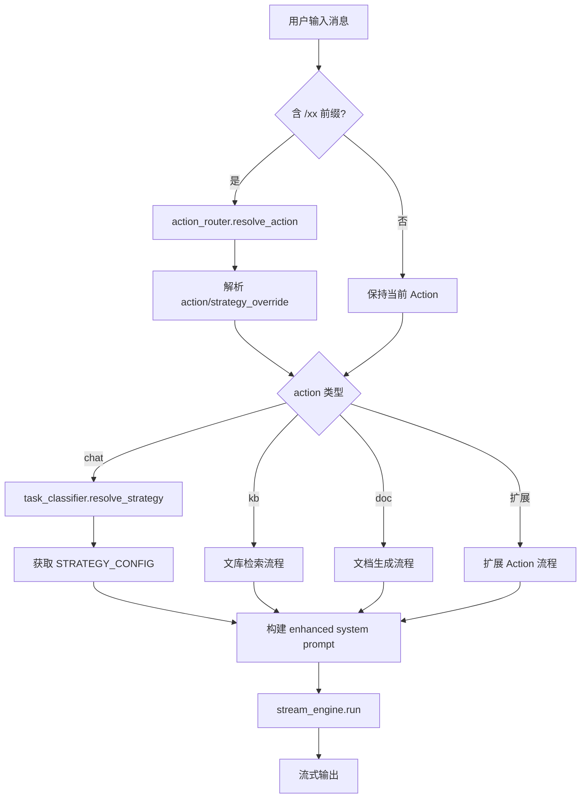
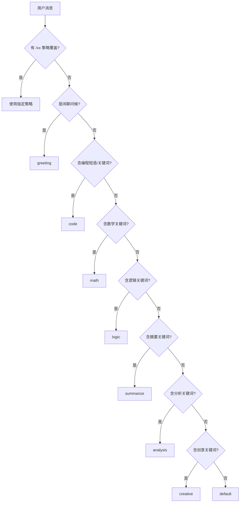
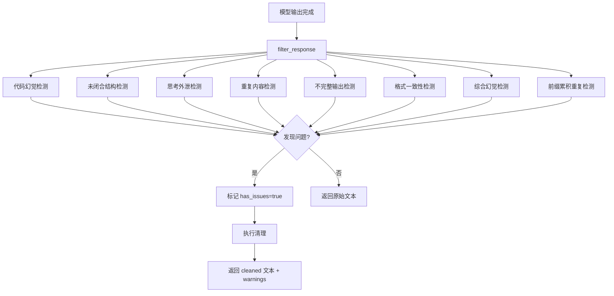

# Action Router + 策略系统设计

> 模块：`intelligence/` 目录
> 版本：Patch 12
> 关联文件：`action_registry.py`、`action_router.py`、`task_classifier.py`、`stall_detector.py`、`response_filter.py`

---

## 1. 模块概览

Action 系统是桌伴 Sidemate 的智能路由层，负责将用户输入分类到合适的处理流程（Action）和生成策略（Strategy），并完成从用户消息到增强 system prompt 的完整构建链。

### 架构分层

```
用户输入 → Action Router → Task Classifier → Strategy 配置 → Enhanced Prompt → StreamEngine
              ↓                  ↓                  ↓
         action_registry    STRATEGY_CONFIG    prompts.py
```

### 模块职责

| 模块 | 文件 | 职责 |
|------|------|------|
| Action 注册表 | `intelligence/action_registry.py` | 管理内置 Action（chat/kb/doc）和运行时扩展 |
| Action 路由器 | `intelligence/action_router.py` | 解析 `/xx` 指令，确定 Action 和 Strategy |
| 任务分类器 | `intelligence/task_classifier.py` | 关键词优先级链匹配，确定任务类型 |
| 停滞检测器 | `intelligence/stall_detector.py` | 生成异常检测（速度、重复、累积） |
| 响应过滤器 | `intelligence/response_filter.py` | 后处理检测（幻觉、重复、不完整） |

---

## 2. 核心设计

### 2.1 Action 注册表（action_registry.py）

Action 是用户选择的功能入口。系统提供 3 个内置 Action，并支持运行时扩展。

**内置 Action：**

| ID | 标签 | 名称 | 占位符 |
|----|------|------|--------|
| `chat` | 💬 | 直接对话 | "说点什么..." |
| `kb` | 📚 | 检索文库 | "输入问题，自动检索文库…" |
| `doc` | 📄 | 文档生成 | "描述要生成的文档..." |

**扩展机制：**

```python
def register_action(meta: dict):
    """安装 .sidemate action 扩展"""
    # 校验 action_id 不为空
    # 校验 action_id 不与内置 Action 冲突
    # 注册到 _installed_actions 字典

def unregister_action(action_id: str):
    """卸载扩展 Action（不可卸载内置）"""

def get_available_actions() -> list:
    """返回所有可用 Action（前端调用）"""

def get_action_config(action_id: str) -> dict:
    """获取指定 Action 的配置"""
```

### 2.2 Action 路由器（action_router.py）

解析用户输入中的 `/xx` 前缀指令，确定 Action 和 Strategy 覆盖。

**指令映射：**

| /指令 | 效果 | 类型 |
|-------|------|------|
| `/kb` | 切换到文库 Action | Action 切换 |
| `/doc` | 切换到文档生成 Action | Action 切换 |
| `/fast` | 使用 greeting 策略 | Strategy 覆盖 |
| `/qa` | 使用 qa 策略 | Strategy 覆盖 |
| `/code` | 使用 code 策略 | Strategy 覆盖 |
| `/math` | 使用 math 策略 | Strategy 覆盖 |
| `/logic` | 使用 logic 策略 | Strategy 覆盖 |
| `/deep` | 使用 analysis 策略 | Strategy 覆盖 |
| `/write` | 使用 creative 策略 | Strategy 覆盖 |
| `/sum` | 使用 summarize 策略 | Strategy 覆盖 |

**resolve_action() 返回结构：**

```python
{
    "action": "chat",              # 最终 action
    "strategy_override": "code",   # 策略覆盖（如有 /xx）
    "clean_message": "写个排序",   # 去掉 /xx 前缀的消息
    "slash_hint": "💻 编程策略（本次）",  # 提示文本
    "slash_key": "code",           # /xx 原始 key
}
```

### 2.3 任务分类器（task_classifier.py）

基于关键词优先级链的零成本分类器，不消耗 LLM token。

**分类优先级（从高到低）：**

| 优先级 | 策略 | 匹配方式 |
|--------|------|----------|
| 0 | 指令覆盖 | `/xx` 指令直接指定 |
| 1 | greeting | 精确正则匹配（你好/hi/谢谢等） |
| 2 | code | 编程短语（"写个"/"帮我写"）或编程关键词 |
| 3 | math | 数学关键词（计算/方程/积分等） |
| 4 | logic | 逻辑关键词（推理/逻辑/假设等） |
| 5 | summarize | 摘要关键词（总结/概括/要点等） |
| 6 | analysis | 分析关键词（分析/对比/评估等） |
| 7 | creative | 创意关键词（创作/故事/诗歌等） |
| 8 | default | 兜底策略 |

**关键设计：**
- "写个函数"走 code（编程短语优先）
- "写个故事"走 creative（creative 关键词命中）
- "帮我写周报"走 default（无 code/creative 信号）

---

## 3. 九种策略（STRATEGY_CONFIG）

定义在 `prompts.py` 中，每种策略包含 4 个维度：

| 策略 | system_enhancement | temperature_offset | think_mode | 说明 |
|------|-------------------|-------------------|------------|------|
| **greeting** | 简短友好回复，1-2句话 | +0.1 | off | 打招呼不需要思考 |
| **qa** | 直接准确回答，不需要展开 | 0.0 | off | 简单问答 |
| **math** | 分步计算，展示过程，可用 LaTeX | -0.3 | free | 数学需要推理 |
| **logic** | 列出条件和推理步骤，逐步推导 | -0.3 | free | 逻辑需要推理 |
| **code** | 先分析需求，再写代码，最后解释 | -0.2 | free | 代码需要推理 |
| **analysis** | 多角度分析，给出过程和结论 | -0.1 | free | 分析需要推理 |
| **creative** | 结构清晰，有文采，内容丰富 | +0.3 | off | 创意写作不需要深度推理 |
| **summarize** | 提炼要点，简洁准确 | -0.1 | off | 摘要不需要推理 |
| **default** | （空） | 0.0 | off | 兜底 |

### 策略字段说明

| 字段 | 类型 | 说明 |
|------|------|------|
| `system_enhancement` | str | 追加到 system prompt 的策略增强文本 |
| `temperature_offset` | float | 相对于模型默认 temperature 的偏移量 |
| `think_instruction` | str | 思考指令（当前版本未使用，预留） |
| `think_mode` | str | `"off"` 禁用思考 / `"free"` 允许思考 |

### think_mode 控制机制

- **off**：不启用思考。如果模型自行输出了 `<think...>` 标签，ThinkProcessor 会静默提取正文
- **free**：启用思考。think 内容通过 fold 事件推送到前端，展示为可折叠区域
- think_mode 通过 OpenVINO GenAI 的 `extra_context` 参数注入，影响模型的 `<think_no_think>` 标记

---

## 4. 关键流程

### 4.1 Action 完整工作流



### 4.2 策略选择流程



### 4.3 响应过滤流程



---

## 5. 响应过滤器（response_filter.py）

### 5.1 检测器列表

| 检测器 | 函数 | 检测内容 |
|--------|------|---------|
| 代码幻觉 | `_detect_code_hallucination` | 代码块中的中文标识符 |
| 未闭合结构 | `_detect_unclosed_structures` | 未闭合代码块、括号、粗体标记 |
| 思考外泄 | `_detect_thinking_leak` | 正文中的"让我分析"等自言自语 |
| 重复内容 | `_detect_repetition` | 连续行重复、N-gram 语义重复 |
| 不完整输出 | `_detect_incomplete` | 空回复、截断、半截句子 |
| 格式一致性 | `_detect_format_consistency` | Markdown 列表格式不一致 |
| 综合幻觉 | `_detect_hallucination` | 指令偏离、内容空洞、模板套用、数值矛盾 |
| 前缀累积 | `detect_prefix_accumulation` | Qwen3-8B 特有递增长重复 |

### 5.2 清理器列表

| 清理器 | 函数 | 说明 |
|--------|------|------|
| 思维链标签剥离 | `strip_think_tags` | 统一处理 think/thinking/reason 等标签 |
| 思考内容清理 | `clean_think_content` | 清理前缀累积和重复段落 |
| 前缀累积清理 | `clean_prefix_accumulation` | 从最后一次完整表达截取 |
| 废话前缀清理 | `_clean_thinking_prefix` | 去掉"好的，让我来分析"等 |

### 5.3 filter_response() 返回结构

```python
{
    "text": "原始文本",
    "warnings": ["警告1", "警告2"],
    "corrections": ["纠正建议1"],
    "has_issues": True/False,
    "cleaned": "清理后文本",
}
```

---

## 6. 停滞检测器（stall_detector.py）

### 6.1 五层检测机制

| 层级 | 检测方式 | 触发条件 |
|------|---------|---------|
| 1. 速度检测 | 最近 N 个 token 的字符数 / 耗时 | speed < stall_speed |
| 2. 重复检测 | 最近 M 个 token 的唯一比率 | unique_ratio < (1 - repeat_threshold) |
| 3. 渐进式重复 | bigram 频率分析 | top bigram >= 6 次 |
| 4. 前缀累积 | 检测 token 间前缀扩展关系 | 前缀扩展 >= 3 个 token |
| 5. 大窗口重复 | full_output 末尾 300 字的 6-gram 分析 | top 6-gram >= 5 次 |

### 6.2 extract_accumulation_delta()

前缀累积增量过滤器的核心方法，检测并提取增量部分：

```
输入: token 序列 ["我", "我叫", "我叫AI", "我叫AI小助手"]
增量转换后: ["我", "叫", "AI", "小助手"]
```

---

## 7. 配置参数

异常检测相关参数（定义在 `config.py`）：

| 参数 | 默认值 | 说明 |
|------|--------|------|
| `stall_check_tokens` | 15 | 每次检查的最近 token 数 |
| `repeat_window` | 12 | 重复检测窗口大小 |
| `repeat_threshold` | 0.5 | 重复率判定阈值 |
| `max_retry` | 1 | 异常中断后自动重试次数 |

响应过滤器内部参数（定义在 `response_filter.py`）：

| 参数 | 默认值 | 说明 |
|------|--------|------|
| `_THINK_STRONG_SHORT_THRESHOLD` | 1 | 短文本强信号触发阈值 |
| `_REPEAT_MIN_CONSECUTIVE` | 3 | 连续行完全重复触发 |
| `_NGRAM_SIMILARITY_THRESHOLD` | 0.6 | N-gram 相似度触发 |
| `_PREFIX_ACCUM_4GRAM_THRESHOLD` | 8 | 前缀累积 4-gram 频率阈值 |

---

## 8. 注意事项

### 8.1 策略分类的边界情况

- "写个函数"走 code（编程短语优先于所有关键词）
- "写个故事"走 creative（creative 关键词命中）
- "帮我写周报"走 default（无 code/creative 信号）
- 数学公式中的高频 4-gram 不会触发前缀累积检测（有 LaTeX 排除机制）

### 8.2 向后兼容函数

`task_classifier.py` 保留了一组向后兼容函数（`classify_task`、`get_temperature_offset` 等），供 `models.py` 等旧代码逐步迁移。这些函数简化实现但保持接口不变。

### 8.3 扩展 Action 注册时机

Action 扩展通过 `.sidemate` 包安装时调用 `register_action()` 注册。注册信息存储在模块级变量 `_installed_actions` 中（非持久化），重启后需要重新安装。

### 8.4 响应过滤器安全考虑

- 文件类型白名单限制可处理的文件扩展名
- 路径遍历检查防止 ZIP Slip 攻击
- HMAC-SHA256 签名验证确保包完整性
- 单文件大小限制 5GB，总包大小限制 10GB
