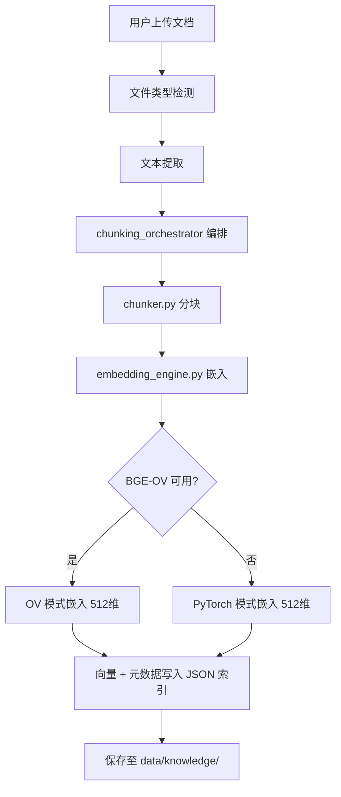
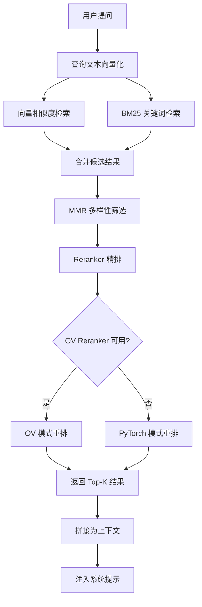
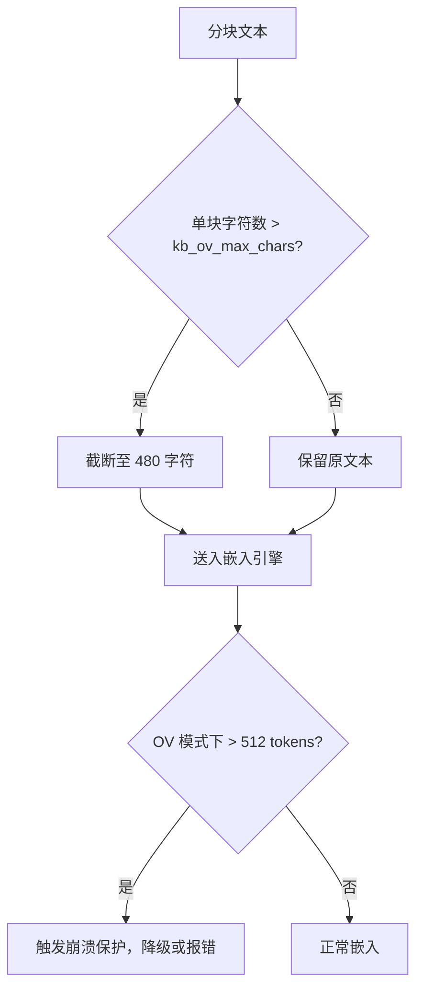

# P12 - 知识管道设计文档

> 模块路径：`knowledge/`
> 涉及文件：`embedding_engine.py`、`reranker_engine.py`、`memory_manager.py`、`chunker.py`、`chunking_orchestrator.py`

---

## 1. 模块概览

`knowledge/` 包实现了桌伴助手的**本地知识库（RAG）管道**，覆盖从文档上传到检索注入的完整数据流。共 5 个核心文件：

| 文件 | 职责 | 行数（约） |
|---|---|---|
| `embedding_engine.py` | 向量嵌入引擎，支持 BGE-OV 和 PyTorch 两种模式 | 200 |
| `reranker_engine.py` | 重排引擎，支持 OV 和 PyTorch 两种模式 | 180 |
| `memory_manager.py` | 知识库生命周期管理（创建/删除/查询/索引维护） | 350 |
| `chunker.py` | 文本分块器（按段落/句子/固定长度） | 150 |
| `chunking_orchestrator.py` | 分块编排器，协调文件提取→分块→嵌入的完整流程 | 250 |

---

## 2. 完整数据流

```
文档上传（PDF/DOCX/TXT/MD）
    │
    ▼
文件提取（文本抽取）
    │
    ▼
文本分块（chunker.py + chunking_orchestrator.py）
    │
    ▼
向量嵌入（embedding_engine.py → BGE 512维）
    │
    ▼
JSON 索引持久化（memory_manager.py）
    │
    ▼  ───── 用户提问 ─────
    │                         │
    ▼                         ▼
检索（向量 + BM25 混合搜索）◄── 查询向量化
    │
    ▼
重排（MMR 多样性 + Reranker 精排）
    │
    ▼
上下文注入（拼接到系统提示）
```

---

## 3. 核心设计

### 3.1 嵌入引擎（embedding_engine.py）

支持两种推理后端：

| 模式 | 说明 | 适用场景 |
|---|---|---|
| **BGE-OV** | BGE 模型经 OpenVINO 优化，INT4 量化推理 | 默认模式，速度更快 |
| **PyTorch** | 原生 PyTorch 推理 | OpenVINO 不可用时的 fallback |

**嵌入维度**：BGE-base → **512 维**

### 3.2 重排引擎（reranker_engine.py）

支持两种推理后端：

| 模式 | 说明 |
|---|---|
| **OV Reranker** | OpenVINO 加速的重排模型 |
| **PyTorch Reranker** | 原生 PyTorch 重排模型 |

**重排策略**：两阶段重排
1. **MMR（Maximal Marginal Relevance）**：从候选结果中选取多样性子集
2. **Reranker 精排**：对 MMR 子集进行语义相关性精排

### 3.3 文本分块（chunker.py + chunking_orchestrator.py）

- **分块策略**：按段落边界切分，超长段落按句子/固定长度二次切分
- **分块参数**：块大小、重叠字符数等可通过配置调整
- **编排流程**：`chunking_orchestrator.py` 协调 文件提取 → 分块 → 嵌入 的完整链路

### 3.4 知识库管理（memory_manager.py）

- **索引格式**：JSON 文件（包含文档元数据 + 分块向量）
- **存储路径**：`data/knowledge/`
- **操作**：创建知识库、添加文档、删除文档、查询检索

---

## 4. Mermaid 流程图

### 4.1 知识库构建流程



### 4.2 检索重排流程



### 4.3 kb_ov_max_chars 保护机制



---

## 5. 配置参数说明

### 5.1 知识库通用参数

| 参数 | 默认值 | 说明 |
|---|---|---|
| `kb_storage_dir` | `data/knowledge/` | 知识库索引存储目录 |
| `kb_ov_max_chars` | `480` | OpenVINO 模式下单块最大字符数（>512 tokens 会崩溃） |
| `kb_embedding_dim` | `512` | 嵌入向量维度（BGE-base） |
| `kb_top_k` | `5` | 检索返回的 Top-K 结果数 |
| `kb_chunk_size` | `512` | 分块最大字符数 |
| `kb_chunk_overlap` | `50` | 分块重叠字符数 |

### 5.2 检索参数

| 参数 | 默认值 | 说明 |
|---|---|---|
| `kb_retrieval_mode` | `hybrid` | 检索模式（vector/bm25/hybrid） |
| `kb_mmr_lambda` | `0.7` | MMR 多样性权重（0=最大多样性，1=最大相关性） |
| `kb_rerank_enabled` | `true` | 是否启用 Reranker 重排 |

### 5.3 模型参数

| 参数 | 默认值 | 说明 |
|---|---|---|
| `kb_embedding_model` | `bge-base-ov` | 嵌入模型名称 |
| `kb_reranker_model` | `bge-reranker-ov` | 重排模型名称 |
| `kb_device` | `auto` | 推理设备（auto/cpu/gpu） |

---

## 6. 已知限制

1. **512 tokens 硬限制**：`kb_ov_max_chars` 设为 480，因为超过 512 tokens 会导致 OpenVINO 嵌入引擎崩溃。这个限制无法绕过，只能通过截断保证安全。
2. **JSON 索引性能**：知识库索引使用 JSON 文件存储，当文档数量或分块数量增大时，查询和写入性能会下降。大规模知识库应考虑向量数据库。
3. **无增量索引**：添加新文档时，需要重新计算受影响分块的嵌入向量，但不影响已有索引。删除文档时需重建索引。
4. **BM25 与向量融合权重固定**：混合检索中向量相似度和 BM25 的融合权重为硬编码，未暴露为可配置参数。
5. **重排模型内存占用**：同时加载嵌入模型和重排模型会占用较多内存，在低配设备上可能出现 OOM。
6. **文件格式支持有限**：文本提取目前支持 PDF/DOCX/TXT/MD，不支持 PPTX/XLSX/图片 OCR 等。

---

> 文档版本：v1.0 | 最后更新：2026-05-29
