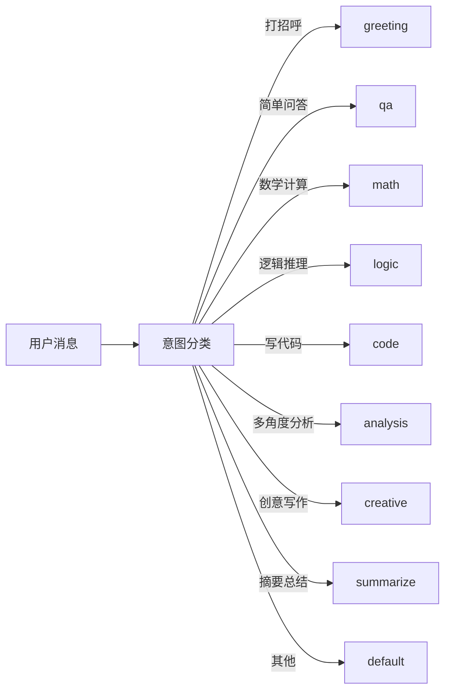
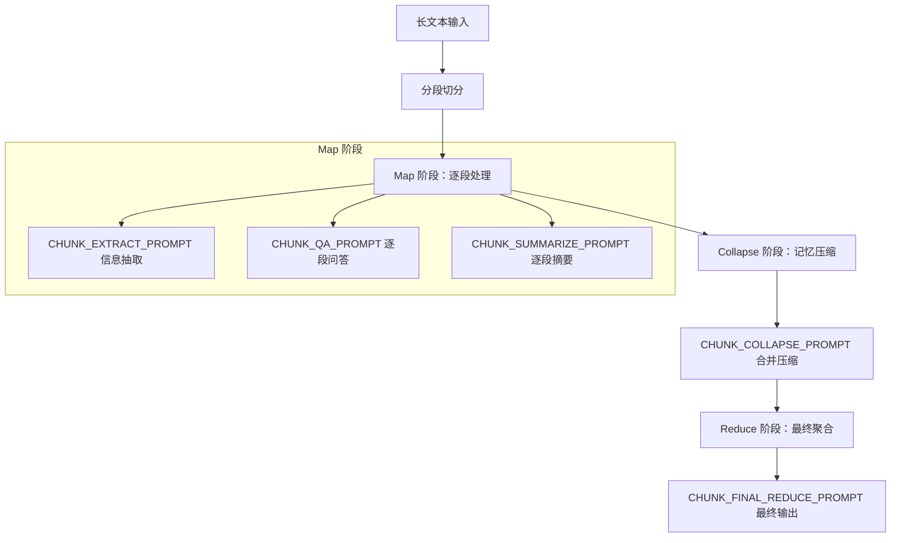

# 桌伴 Sidemate — Prompt 系统设计文档

> 本文档描述桌伴 Sidemate 的完整 Prompt 架构、各场景 Prompt 设计理由、策略路由机制、动态构建流程及调优建议。

---

## 目录

1. [全景架构图](#1-全景架构图)
2. [双层 Prompt 系统](#2-双层-prompt-系统)
3. [通用对话 Prompt（QA System Prompt）](#3-通用对话-promptqa-system-prompt)
4. [场景 Prompt 详解](#4-场景-prompt-详解)
5. [执行模式 Prompt（EXEC_SYSTEM_PROMPT）](#5-执行模式-promptexec-system-prompt)
6. [策略路由与策略配置](#6-策略路由与策略配置)
7. [知识库 Prompt 设计](#7-知识库-prompt-设计)
8. [长文本分段处理 Prompt](#8-长文本分段处理-prompt)
9. [Prompt 动态构建流程（prompt_builder.py）](#9-prompt-动态构建流程prompt_builderpy)
10. [调优建议](#10-调优建议)

---

## 1. 全景架构图

```mermaid
flowchart TB
    subgraph 用户输入
        MSG[用户消息]
    end

    subgraph 分类与路由
        CLS[意图分类器]
        CLS -->|greeting / qa / math / logic / code / analysis / creative / summarize / default| STRAT[策略选择]
        CLS -->|需要执行任务| EXEC[执行模式]
        CLS -->|文档/研究/代码场景| SCENE[场景路由]
        CLS -->|知识库相关| KB[KB 模式]
        CLS -->|长文本处理| LONGTEXT[Map-Collapse-Reduce]
    end

    subgraph 策略配置
        STRAT --> SC[STRATEGY_CONFIG]
        SC --> SE[system_enhancement]
        SC --> TO[temperature_offset]
        SC --> TM[think_mode: off | free]
    end

    subgraph 场景 Prompts
        SCENE --> DOC[doc — 文档生成]
        SCENE --> RESEARCH[research — 研究助手]
        SCENE --> CODE[code — 代码助手]
        SCENE --> SEARCH[search — 已废弃]
    end

    subgraph Prompt 构建 prompt_builder.py
        BUILD[build 方法]
        BUILD --> STEP1[1. 获取模型 profile 与设备限制]
        BUILD --> STEP2[2. NPU 特殊处理]
        BUILD --> STEP3[3. 选择 System Prompt]
        BUILD --> STEP4[4. 拼接 system_parts]
        BUILD --> STEP5[5. 历史压缩]
        BUILD --> STEP6[6. 二分法 token 截断]
        BUILD --> STEP7[7. 最终兜底]
    end

    subgraph 输出
        BUILD --> FINAL[最终消息列表 → 模型推理]
    end

    MSG --> CLS
    EXEC --> BUILD
    SCENE --> BUILD
    KB --> BUILD
    STRAT --> BUILD
```

---

## 2. 双层 Prompt 系统

Prompt 系统采用**静态模板 + 动态构建**的双层架构：

| 层次 | 文件 | 职责 |
|------|------|------|
| **静态模板层** | `prompts.py` | 定义所有 Prompt 常量、场景映射、策略配置。运行时不可变，是 Prompt 设计的"数据源"。 |
| **动态构建层** | `core/prompt_builder.py` | 根据运行时状态（策略、历史、设备、模式）组装最终消息列表，处理 token 截断、历史压缩、think_mode 控制。 |

**设计理由**：将 Prompt 文本与构建逻辑分离，便于独立迭代。修改 Prompt 措辞只需改 `prompts.py`；修改组装逻辑只需改 `prompt_builder.py`。

---

## 3. 通用对话 Prompt（QA System Prompt）

### 完整文本

```
你是桌伴，一个有用的 AI 助手。请遵循以下规则：

1. 全部使用中文回答。
2. 直接回答问题，不要重复问题。
3. 输出连贯完整的内容，不要分段或使用列表。
4. 不要主动编写代码，除非用户明确要求。
5. 回答完毕后立即停止，不要添加总结或结尾语。
6. 如果不确定答案，直接说"我不确定"。
```

### 设计理由

| 规则 | 解决的问题 | 针对 8B 小模型的考量 |
|------|-----------|---------------------|
| 全中文 | 防止小模型中英混杂 | INT4 量化后中文能力更稳定 |
| 直接答 | 消除"好的，让我来回答"等废话 | 减少 token 浪费，提升推理速度 |
| 连贯输出 | 防止列表化、碎片化输出 | 小模型列表格式容易出错 |
| 不主动写代码 | 避免用户聊天时突然输出代码块 | 小模型代码质量不稳定，需用户明确触发 |
| 回答完就停 | 防止重复或追加废话 | 减少无效输出 token |
| 不确定就说不确定 | 防止幻觉 | 8B 模型知识面有限，显式承认更安全 |

---

## 4. 场景 Prompt 详解

场景 Prompt 通过 `SCENE_PROMPTS` 字典映射，根据识别到的场景选择对应的 System Prompt。

### 4.1 doc — 文档生成助手

**用途**：辅助用户生成各类文档。

**核心设计**：
- 包含 `TOOL_CALL` 格式说明，允许模型调用文档写入工具
- 工具调用格式：`[TOOL_CALL:工具名|JSON参数]`
- 明确文档结构化输出的要求

**设计理由**：文档生成需要结构化输出和工具调用能力，与通用对话的"连贯输出、不分段"规则相反，因此需要独立的场景 Prompt 覆盖默认规则。

### 4.2 research — 研究助手

**用途**：先检索知识库，再基于检索结果生成研究报告。

**核心设计**：
- 明确要求"先检索知识库"
- 基于检索结果生成报告，避免凭空编造
- 输出格式偏向结构化报告

**设计理由**：研究场景强调**事实性**和**来源可追溯**，与通用对话的"直接答"模式不同，需要检索-生成两步流程。

### 4.3 code — 代码助手

**用途**：编写、运行、验证代码。

**核心设计**：
- 允许编写代码（覆盖 QA 中的"不主动写代码"规则）
- 包含运行验证的要求
- 工具调用支持 `code_runner`

**设计理由**：代码场景与通用对话规则冲突最大（"不主动写代码"），必须有独立 Prompt 覆盖。

### 4.4 search — 已废弃

**状态**：已废弃，保留在映射表中但不再使用。

---

## 5. 执行模式 Prompt（EXEC_SYSTEM_PROMPT）

### 完整文本（核心逻辑）

```
你是一个智能助手，能够自主完成用户任务。请按以下流程执行：

1. 分析用户的任务需求
2. 选择合适的工具执行
3. 执行工具并验证结果
4. 根据结果决定下一步

可用工具：
- file_ops：文件操作（读取、写入、搜索）
- code_runner：代码执行
- doc_writer：文档生成
- kb_search：知识库搜索

工具调用格式：
[TOOL_CALL:工具名|JSON参数]
```

### Agent 执行循环


### 设计理由

- **自主循环**：允许模型多轮调用工具，适用于复杂任务
- **4 种工具**：覆盖文件、代码、文档、知识库四大操作域
- **文本格式工具调用**：使用 `[TOOL_CALL:...]` 而非 JSON function calling，因为 Qwen3-8B INT4 对结构化 JSON 输出的稳定性不如文本格式
- **显式验证步骤**：强制模型在执行后验证，减少错误传播

---

## 6. 策略路由与策略配置

### 6.1 策略路由流程



### 6.2 完整策略配置表

每种策略包含四个维度：

| 策略 | think_mode | temperature_offset | 场景说明 | 设计理由 |
|------|-----------|-------------------|---------|---------|
| **greeting** | `off` | +0.1 | 打招呼，1-2 句话 | 不需要深度思考，稍微提高温度增加自然感 |
| **qa** | `off` | 0.0 | 简单问答 | 基准配置，平衡准确性与流畅性 |
| **math** | `free` | -0.3 | 数学计算 | 需要思考链展示过程，低温提高数值准确性 |
| **logic** | `free` | -0.3 | 逻辑推理 | 需要推理链，低温减少逻辑跳跃 |
| **code** | `free` | -0.2 | 编写代码 | 需要思考设计，低温提高代码正确率 |
| **analysis** | `free` | -0.1 | 多角度分析 | 需要综合思考，温度适中保持广度 |
| **creative** | `off` | +0.3 | 创意写作 | 不需要逻辑链，高温增加多样性 |
| **summarize** | `off` | -0.1 | 摘要总结 | 忠实原文，低温减少信息增编 |
| **default** | `off` | 0.0 | 兜底策略 | 基准配置 |

### 6.3 策略注入流程

```
用户消息 → 分类器判定策略
         → 读取 STRATEGY_CONFIG[strategy_name]
         → system_enhancement 注入到 system_parts
         → temperature_offset 叠加到基础温度
         → think_mode 控制 apply_template() 行为
```

### 6.4 think_mode 控制机制

| think_mode | apply_template() 行为 | 适用场景 |
|------------|----------------------|---------|
| `off` | 传入 `extra_context={"enable_thinking": False}`，模型不输出思考过程 | 问答、打招呼、创意、摘要 |
| `free` | 不传 `enable_thinking: False`，模型自由决定是否思考 | 数学、逻辑、代码、分析 |

**设计理由**：8B INT4 模型的思考能力有限。在简单场景下强制关闭思考，节省 token 并提高响应速度；在需要推理的场景下放开限制，让模型自主决定是否展示思考过程。

---

## 7. 知识库 Prompt 设计

### 7.1 KB System Prompt

```
你是文库问答助手。严格基于检索到的参考资料回答问题。全中文输出。答完即停。禁止使用think标签思考。
```

### 7.2 KB User Prompt Template

```
请先给出结论，然后引用相关资料支持你的回答，并标注来源编号。完整复述资料中的数字和专有名词。

参考资料：
{context}
```

### 7.3 设计理由

#### 为什么禁止思考？

1. **token 成本**：KB 场景的输入已包含大量检索上下文，模型再输出思考链会严重挤占输出空间
2. **一致性**：8B 模型的思考链可能产生与检索资料矛盾的中间结论，导致最终回答偏离参考资料
3. **速度**：KB 问答强调快速响应，省略思考链显著减少首 token 延迟
4. **准确性**：强制模型直接基于参考资料回答，避免"先思考再找资料"的反向合理化

#### 为什么要求"先结论后引用"？

- 用户体验：用户首先看到答案，再看到依据
- 减少幻觉：先下结论再找证据，比边想边答更可控
- 来源标注：强制引用编号，让用户可验证

---

## 8. 长文本分段处理 Prompt

采用 **Map-Collapse-Reduce** 三阶段流程处理超长文本。

### 8.1 流程图



### 8.2 各阶段 Prompt

#### Map 阶段

| Prompt | 用途 | 设计要点 |
|--------|------|---------|
| `CHUNK_EXTRACT_PROMPT` | 从分段中抽取关键信息 | 明确抽取目标，避免模型"总结"而非"抽取" |
| `CHUNK_QA_PROMPT` | 对分段进行问答 | 将问题与分段内容配对，缩小上下文窗口 |
| `CHUNK_SUMMARIZE_PROMPT` | 对分段生成摘要 | 保留核心信息，丢弃冗余 |

#### Collapse 阶段

| Prompt | 用途 | 设计要点 |
|--------|------|---------|
| `CHUNK_COLLAPSE_PROMPT` | 将多个 Map 结果压缩为更紧凑的表示 | 类似"记忆压缩"，合并重复信息，保留不重叠的关键点 |

#### Reduce 阶段

| Prompt | 用途 | 设计要点 |
|--------|------|---------|
| `CHUNK_FINAL_REDUCE_PROMPT` | 将 Collapse 结果聚合为最终输出 | 全局视角整合，输出连贯的最终回答 |

### 8.3 设计理由

- **分段处理**：8B 模型上下文窗口有限，无法一次处理超长文本
- **三阶段而非两阶段**：增加 Collapse 阶段是因为 Map 结果可能有大量重复信息，直接 Reduce 会超出 token 限制
- **多种 Map Prompt**：不同任务（抽取/问答/摘要）需要不同的分段处理策略

---

## 9. Prompt 动态构建流程（prompt_builder.py）

### 9.1 核心方法调用链

```
用户消息 → build() → apply_template() → 最终消息列表
```

### 9.2 apply_template() 伪代码

```python
def apply_template(system_prompt, messages, think_mode):
    if think_mode == "off":
        extra_context = {"enable_thinking": False}
    else:
        extra_context = {}

    try:
        # 新版 tokenizer：支持 extra_context 控制 thinking
        tokenized = tokenizer.apply_chat_template(
            system_prompt, messages,
            extra_context=extra_context
        )
    except TypeError:
        # 旧版 tokenizer fallback：不支持 extra_context
        tokenized = tokenizer.apply_chat_template(
            system_prompt, messages
        )

    return tokenized
```

### 9.3 build() 伪代码

```python
def build(self, user_message, history, strategy, mode, kb_context=None):
    # ── 第 1 步：获取模型 profile 与设备限制 ──
    profile = model_profile.get(self.model_id)
    max_history_chars = profile["max_history_chars"]
    device_token_limit = get_device_token_limit()

    # ── 第 2 步：NPU 特殊处理 ──
    if is_npu_device():
        # NPU 推理速度慢，更激进地限制历史长度
        max_history_chars = min(max_history_chars, NPU_HISTORY_LIMIT)

    # ── 第 3 步：选择 System Prompt ──
    if mode == "kb":
        system_prompt = KB_SYSTEM_PROMPT
        user_prompt = KB_USER_PROMPT_TEMPLATE.format(context=kb_context)
    else:
        system_prompt = QA_SYSTEM_PROMPT

    # ── 第 4 步：拼接 system_parts（通用模式） ──
    system_parts = []
    system_parts.append(system_prompt)           # 基础规则
    system_parts.append(context_cache)           # 上下文缓存
    system_parts.append(strategy_config["system_enhancement"])  # 策略增强
    system_parts.append(drift_hint)              # 漂移提示

    # ── 第 5 步：历史压缩 ──
    if len(history) > max_history:
        history = compressor.compress(history, max_history_chars)

    # ── 第 6 步：二分法 token 截断 ──
    messages = build_messages(system_parts, history, user_message)
    while estimate_tokens(messages) > device_token_limit:
        # 从最早的历史消息开始删除
        messages = truncate_from_head(messages)

    # ── 第 7 步：最终兜底 ──
    # 确保至少包含 system + user message
    if not has_system(messages):
        messages.insert(0, {"role": "system", "content": system_prompt})
    if not has_user(messages):
        messages.append({"role": "user", "content": user_message})

    return messages
```

### 9.4 关键设计决策

| 决策 | 理由 |
|------|------|
| **NPU 更激进的限制** | NPU 推理速度显著慢于 GPU，减少上下文长度能大幅提升用户体验 |
| **二分法 token 截断** | 精确控制 token 数，避免"估算不准导致截断失败"的问题；从最新消息往前保留，确保最近的上下文不丢失 |
| **system_parts 拼接** | 将多个维度（规则、缓存、策略、漂移提示）统一拼接到一个 system prompt 中，减少消息轮次 |
| **TypeError fallback** | 兼容不同版本的 tokenizer API，避免运行时崩溃 |
| **最终兜底** | 极端情况下（如历史全部被截断），保证 system + user 消息存在 |

### 9.5 Token 截断策略示意

```
历史消息（从旧到新）：
[msg1] [msg2] [msg3] [msg4] [msg5] [msg6] [msg7]

截断后（从旧到新删除）：
                                [msg5] [msg6] [msg7] ← 保留最近的

始终保留：
[system] + [msg5] [msg6] [msg7] + [user_message]
```

---

## 10. 调优建议

### 10.1 Prompt 文本调优

| 方向 | 建议 | 预期效果 |
|------|------|---------|
| **规则精简** | QA System Prompt 的 6 条规则可尝试合并为 4 条 | 减少 system prompt token 占用，留给历史和用户输入更多空间 |
| **负面指令** | 避免使用"不要做 X"，改为"只做 Y" | 8B 模型对负面指令的理解不如正面指令 |
| **示例注入** | 在策略的 `system_enhancement` 中加入 1-2 个示例 | 小模型 few-shot 效果显著，但注意 token 开销 |
| **中文措辞** | 使用口语化指令而非书面语 | 小模型对口语化指令的遵循度更高 |

### 10.2 策略参数调优

| 参数 | 当前值 | 调优方向 |
|------|--------|---------|
| `math` temperature_offset | -0.3 | 如果数值计算仍有错误，可尝试 -0.4；如果答案过于保守，回调到 -0.2 |
| `creative` temperature_offset | +0.3 | 如果输出不稳定，降至 +0.2；如果不够多样，提升到 +0.4 |
| `code` think_mode | `free` | 如果代码质量不稳定，可测试强制 `off` 但加上"逐步分析"的 system_enhancement |
| `greeting` temperature_offset | +0.1 | 几乎无需调整，1-2 句话的输出范围已经很窄 |

### 10.3 KB 模式调优

| 方向 | 建议 |
|------|------|
| **检索质量** | KB 回答质量上限取决于检索质量，优先优化 embedding 模型和 chunk 策略 |
| **context 长度** | 控制注入的参考资料 token 数，建议不超过总 token 限制的 40% |
| **来源标注** | 如果模型经常遗漏来源编号，在 Prompt 中加入示例 |

### 10.4 长文本处理调优

| 方向 | 建议 |
|------|------|
| **分段大小** | 根据 8B 模型的有效上下文窗口调整，建议每段 500-800 token |
| **Collapse 阈值** | Map 结果超过 N 段时触发 Collapse，N 值需根据 Reduce 阶段的 token 限制反推 |
| **并行 Map** | Map 阶段各段独立，可并行处理提升速度 |

### 10.5 构建流程调优

| 方向 | 建议 |
|------|------|
| **历史压缩算法** | 当前使用 compressor，可考虑基于语义相似度合并，而非简单截断 |
| **NPU 自适应** | 根据实际 NPU 推理速度动态调整限制，而非固定值 |
| **token 估算** | 如果二分法截断耗时过长，可改用字符数近似估算（中文约 1 字 ≈ 1.5 token） |

---

## 附录：术语表

| 术语 | 含义 |
|------|------|
| `system_enhancement` | 策略注入到 system prompt 的增强指令文本 |
| `temperature_offset` | 叠加到基础温度的偏移量（可正可负） |
| `think_mode` | 控制模型是否输出思考过程，`off` 为禁止，`free` 为自由 |
| `drift_hint` | 漂移提示，用于防止模型在长对话中偏离主题 |
| `context_cache` | 上下文缓存，携带对话中的关键实体和状态信息 |
| `max_history_chars` | 历史消息的最大字符数限制 |
| `TOOL_CALL` | Agent 模式下的工具调用文本格式标记 |

---

*文档版本：v1.0 | 适用模型：Qwen3-8B INT4 | 最后更新：2026-05-29*
