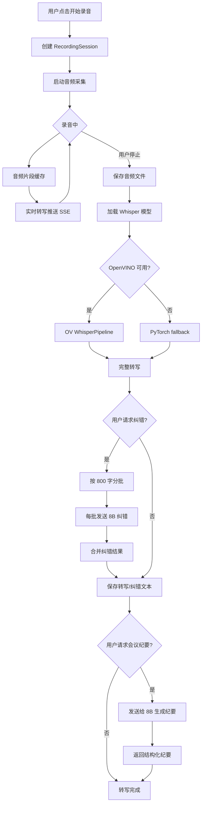
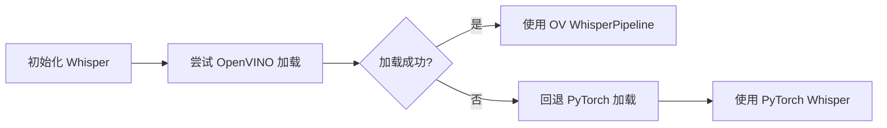
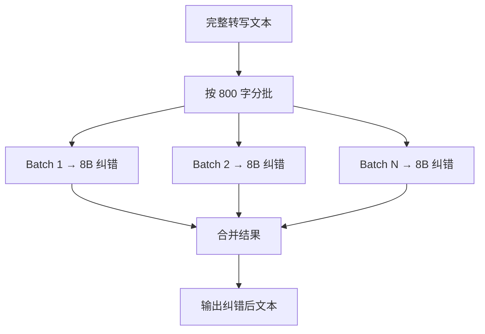

# P12 - 录音器设计文档

> 模块路径：`recorder_pkg/recorder_manager.py`
> 行数：约 1147 行

---

## 1. 模块概览

`recorder_pkg/recorder_manager.py` 是桌伴助手的**录音与转写核心模块**，以单一文件承载了录音会话管理的全部功能。该模块集成了音频录制、Whisper 转写、AI 纠错、会议纪要生成等 9 大功能：

| # | 功能 | 说明 |
|---|---|---|
| 1 | 录音会话管理 | 开始/暂停/恢复/停止录音，音频文件保存 |
| 2 | 音频导入 | 导入外部音频文件（mp3/wav/m4a 等）进行转写 |
| 3 | Whisper 转写 | 离线语音转文字，支持 OpenVINO 加速 |
| 4 | 实时转写 | 录音过程中实时输出转写结果 |
| 5 | 8B 纠错（refine） | 利用 Qwen3-8B 对转写文本进行纠错和润色 |
| 6 | AI 会议纪要 | 基于转写/纠错结果生成结构化会议纪要 |
| 7 | 导入文库 | 将转写结果导入知识库 |
| 8 | 崩溃恢复 | 录音中断后恢复未完成的转写任务 |
| 9 | 前端锁定 | 录音/转写过程中锁定前端操作防止冲突 |

---

## 2. 核心数据结构

### 2.1 录音会话

```python
@dataclass
class RecordingSession:
    """录音会话"""
    session_id: str              # 会话 UUID
    file_path: str               # 音频文件保存路径
    status: str                  # recording | paused | stopped | transcribing | done
    started_at: datetime         # 开始时间
    duration: float              # 录音时长（秒）
    sample_rate: int             # 采样率
    channels: int                # 声道数
    segments: list[TranscribeSegment]  # 转写片段（实时转写时逐步填充）
```

### 2.2 转写片段

```python
@dataclass
class TranscribeSegment:
    """转写片段"""
    index: int                   # 片段序号
    start_time: float            # 开始时间（秒）
    end_time: float              # 结束时间（秒）
    text: str                    # 转写文本
    refined_text: str | None     # 纠错后文本（可选）
    confidence: float            # 置信度
```

---

## 3. 核心流程

### 3.1 Whisper 模型加载

系统支持两种 Whisper 推理后端：

1. **OpenVINO WhisperPipeline**（优先）：利用 OpenVINO 对 Whisper 模型进行 INT4 量化推理，速度更快
2. **PyTorch fallback**：当 OpenVINO 不可用时，回退到原生 PyTorch 推理

加载顺序：先尝试 OpenVINO → 失败则回退 PyTorch。

### 3.2 转写纠错（refine）流程

转写完成后，可选择性触发 8B 纠错：

1. 将完整转写文本按 **800 字/批**（`whisper_refine_batch_chars`）分批
2. 每批文本发送给 Qwen3-8B 进行纠错
3. 纠错 prompt 要求模型修正语音转写中的错别字、标点、语序问题
4. 合并所有批次的纠错结果

### 3.3 实时转写流程

1. 录音过程中，每隔固定时长（如 5 秒）截取音频片段
2. 将片段送入 Whisper 进行转写
3. 转写结果通过 SSE 实时推送至前端
4. 录音结束后合并所有片段为完整转写

### 3.4 崩溃恢复

1. 每个录音会话在 `data/recordings/` 下维护状态文件
2. 录音过程中定期写入进度快照
3. 应用重启后扫描未完成会话，提示用户恢复

---

## 4. Mermaid 流程图

### 4.1 录音转写完整流程



### 4.2 Whisper 模型加载策略



### 4.3 纠错分批处理



---

## 5. 配置参数说明

### 5.1 录音相关（`recorder_*`）

| 参数 | 默认值 | 说明 |
|---|---|---|
| `recorder_sample_rate` | `16000` | 录音采样率（Hz） |
| `recorder_channels` | `1` | 录音声道数（单声道） |
| `recorder_save_dir` | `data/recordings/` | 录音文件保存目录 |
| `recorder_realtime_interval` | `5` | 实时转写间隔（秒） |

### 5.2 Whisper 相关（`whisper_*`）

| 参数 | 默认值 | 说明 |
|---|---|---|
| `whisper_model` | `whisper-small` | Whisper 模型名称 |
| `whisper_refine_batch_chars` | `800` | 纠错分批字符数 |
| `whisper_refine_enabled` | `true` | 是否启用纠错 |
| `whisper_language` | `zh` | 转写语言 |
| `whisper_device` | `auto` | 推理设备（auto/cpu/gpu） |

---

## 6. 已知限制

1. **单文件架构**：1147 行代码集中在单一文件中，功能耦合度高，后续维护和测试难度较大。
2. **纠错批次为串行处理**：分批纠错目前为串行执行，对于长录音（>30 分钟），纠错耗时可能较长。
3. **OpenVINO Whisper 兼容性**：部分 Whisper 模型变体可能不支持 OpenVINO 优化，fallback 机制虽可兜底但性能降级明显。
4. **实时转写精度**：短片段实时转写的精度低于完整音频离线转写，可能出现上下文断裂或重复。
5. **崩溃恢复粒度**：恢复粒度为"会话级"，若转写已完成但纠错未完成，需要重新执行全部纠错流程。
6. **前端锁定范围**：录音/转写期间的全局锁定可能过于激进，用户无法同时进行其他操作。

---

> 文档版本：v1.0 | 最后更新：2026-05-29
