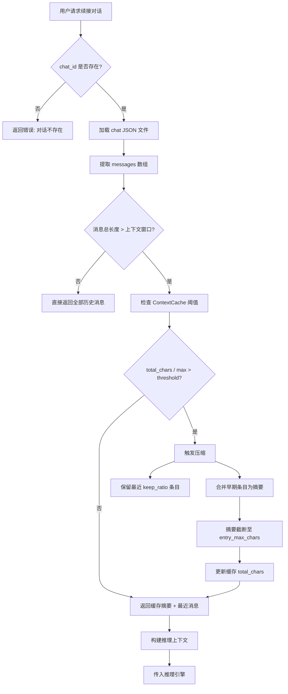
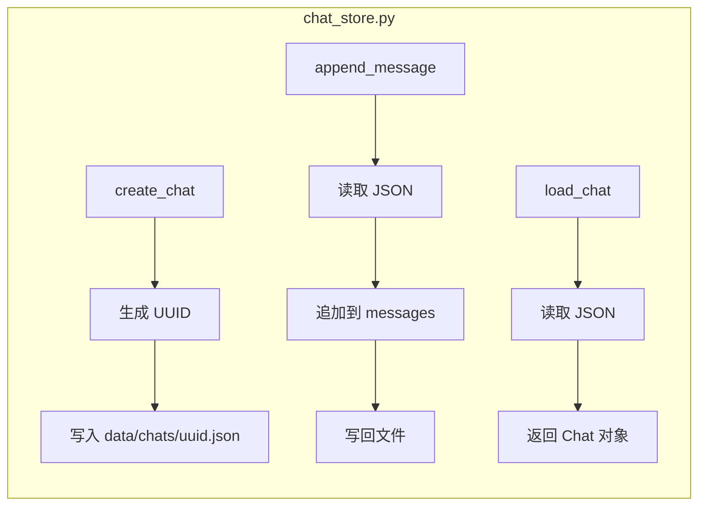

# P12 - 会话管理设计文档

> 模块路径：`session/`
> 涉及文件：`chat_store.py`、`continuation.py`、`context_cache.py`

---

## 1. 模块概览

`session/` 包负责桌伴助手的**对话生命周期管理**，涵盖对话文件的创建/加载/保存、对话续接（加载历史消息并恢复上下文）、以及上下文压缩缓存（Session 级 Layer 2 记忆）。三个文件各司其职：

| 文件 | 职责 | 行数（约） |
|---|---|---|
| `chat_store.py` | 对话文件的 CRUD，JSON 持久化至 `data/chats/` | 300 |
| `continuation.py` | 对话续接，加载历史消息、重建上下文窗口 | 200 |
| `context_cache.py` | 上下文压缩缓存，Session 级 Layer 2 记忆 | 250 |

---

## 2. 核心数据结构

### 2.1 对话文件（Chat File）

每个对话以一个 JSON 文件存储在 `data/chats/` 目录下：

```json
{
  "chat_id": "uuid-string",
  "title": "用户第一次消息的摘要",
  "created_at": "2026-05-29T10:00:00",
  "updated_at": "2026-05-29T10:30:00",
  "messages": [
    {
      "role": "user",
      "content": "用户消息文本",
      "timestamp": "2026-05-29T10:00:00"
    },
    {
      "role": "assistant",
      "content": "助手回复文本",
      "timestamp": "2026-05-29T10:00:05",
      "think_content": "思考内容（可选）"
    }
  ],
  "metadata": {
    "model": "qwen3-8b-int4",
    "total_tokens": 12345,
    "knowledge_refs": ["doc_id_1"]
  }
}
```

### 2.2 上下文缓存条目（Cache Entry）

```python
@dataclass
class CacheEntry:
    """单条压缩缓存"""
    summary: str          # 压缩后的摘要文本
    token_count: int      # 摘要 token 数
    source_msg_range: tuple[int, int]  # 原始消息范围 (start, end)
    created_at: datetime
```

### 2.3 上下文缓存（ContextCache）

```python
class ContextCache:
    """Session 级 Layer 2 记忆"""
    entries: list[CacheEntry]       # 缓存条目列表
    total_chars: int                # 当前总字符数
    max_total_chars: int            # 最大总字符数 (500)
    entry_max_chars: int            # 单条最大字符数 (80)
    keep_ratio: float               # 保留比例 (0.4)
    threshold_ratio: float          # 触发压缩阈值 (0.8)
```

---

## 3. 核心流程

### 3.1 对话文件管理流程

1. **新建对话**：生成 UUID，创建空 JSON 文件到 `data/chats/`
2. **追加消息**：读取 JSON → 追加消息到 `messages` 数组 → 写回文件
3. **加载对话**：按 `chat_id` 读取对应 JSON 文件
4. **删除对话**：删除 JSON 文件
5. **列表查询**：扫描 `data/chats/` 目录，按 `updated_at` 降序排列

### 3.2 对话续接流程

1. 加载目标对话的 JSON 文件
2. 从 `messages` 中提取历史消息
3. 根据 `continuation.py` 的策略截取最近的 N 条消息（受模型上下文窗口限制）
4. 如果历史消息过长，触发上下文压缩（调用 `context_cache.py`）
5. 将截取后的消息列表作为上下文传给推理引擎

### 3.3 上下文压缩缓存流程

1. 检查 `total_chars / max_total_chars` 是否超过 `threshold_ratio`（0.8）
2. 若超过，触发压缩：
   - 保留最近 `keep_ratio`（40%）的条目
   - 对较早条目进行合并摘要，压缩至 `entry_max_chars`（80字）以内
   - 压缩后总字符数不超过 `max_total_chars`（500字）
3. 压缩结果作为系统提示的一部分注入后续推理

---

## 4. Mermaid 流程图

### 4.1 对话续接与上下文压缩



### 4.2 对话文件读写



---

## 5. 配置参数说明

| 参数 | 默认值 | 说明 |
|---|---|---|
| `cache_keep_ratio` | `0.4` | 上下文压缩时保留最近条目的比例 |
| `cache_entry_max_chars` | `80` | 单条缓存摘要最大字符数 |
| `cache_max_total_chars` | `500` | 缓存总字符数上限 |
| `cache_threshold_ratio` | `0.8` | 触发压缩的阈值（当前字符数/上限的比值） |

---

## 6. 已知限制

1. **文件 I/O 瓶颈**：每次追加消息都涉及完整的 JSON 读-改-写，高频率对话时可能产生性能问题。当前设计未引入增量写入或消息追加日志。
2. **无并发控制**：JSON 文件无锁机制，若多个进程同时写入同一对话文件可能导致数据损坏。桌伴作为单实例桌面应用，此风险较低。
3. **压缩精度有限**：上下文压缩依赖简单的字符截断策略，非 LLM 摘要，可能丢失关键语义信息。
4. **缓存容量偏小**：`cache_max_total_chars` 为 500 字，对于长对话场景可能不足以保留足够的上下文信息。
5. **无对话归档**：所有对话文件平铺在 `data/chats/` 目录，无子目录分类或归档机制，对话数量增多后可能影响文件扫描性能。

---

> 文档版本：v1.0 | 最后更新：2026-05-29
