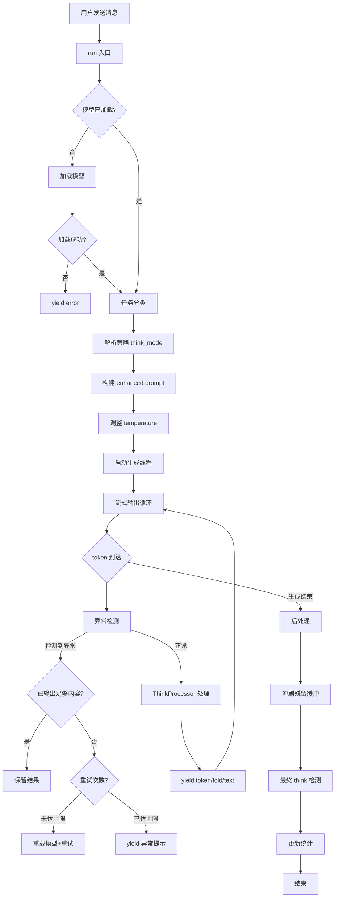
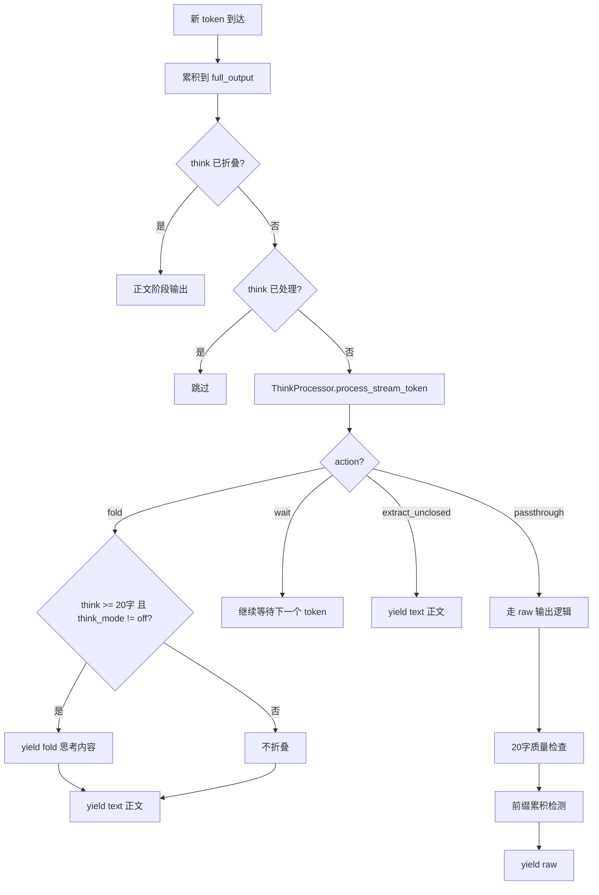
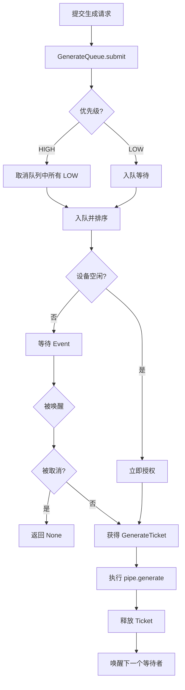
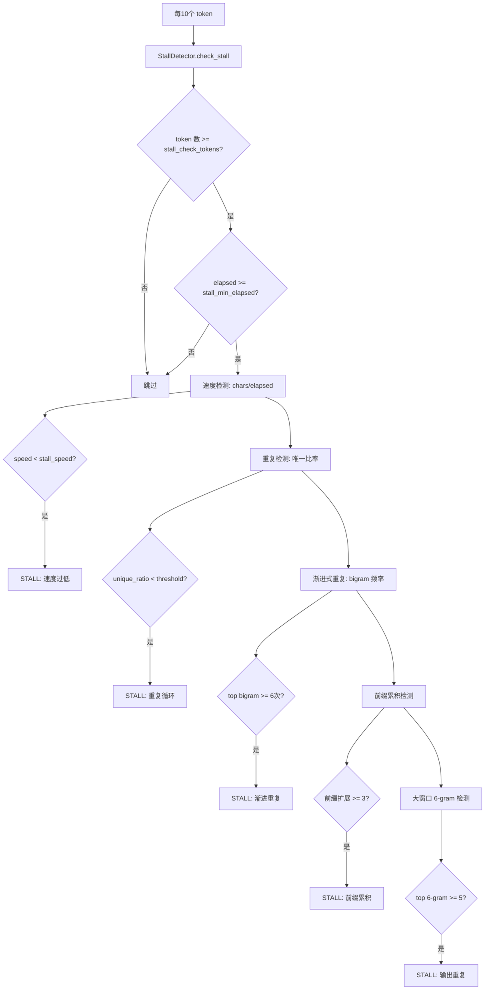

# SSE 流式输出核心引擎设计

> 模块：`core/stream_engine.py`
> 版本：Patch 12
> 关联模块：`core/think_processor.py`、`core/generate_queue.py`、`intelligence/stall_detector.py`

---

## 1. 模块概览

StreamEngine 是桌伴 Sidemate 的流式生成核心，负责将 LLM 的 token 流实时转换为前端可消费的 SSE（Server-Sent Events）事件流。它统一管理生成队列调度、思维链（think）标签实时检测与折叠、异常检测与自动重试，是整个对话系统的数据流中枢。

### 核心职责

| 职责 | 说明 |
|------|------|
| SSE 流式输出管理 | 以 EventSource 格式向前端推送 token 级增量 |
| Think 标签处理 | 与 ThinkProcessor 协作，实时检测/折叠思维链标签 |
| 生成队列调度 | 通过 GenerateQueue 管理 HIGH/LOW 优先级请求 |
| 取消机制 | 支持用户中断正在进行的生成 |
| 折叠通知 | think 过程完成后向前端发送 fold 事件 |
| 异常检测 | 停滞检测、重复循环检测、前缀累积检测 |
| 自动重试 | 模型输出异常时自动重新加载并重试 |

### 文件依赖关系

```
stream_engine.py
├── core/generate_queue.py    — 优先级生成队列
├── core/think_processor.py   — 思维链标签处理
├── intelligence/task_classifier.py — 任务分类
├── intelligence/stall_detector.py  — 异常检测器
└── intelligence/response_filter.py — 响应过滤（前缀累积清理）
```

---

## 2. 核心架构

### 2.1 StreamEngine 类

```python
class StreamEngine:
    """流式生成引擎：负责 LLM 流式对话的核心循环"""

    def __init__(self, model_manager):
        self._mm = model_manager  # ModelManager 实例
```

StreamEngine 持有一个 ModelManager 引用，通过它获取模型配置、加载模型、构建 prompt、获取 ThinkProcessor 和 StallDetector 实例。

### 2.2 run() 生成器方法

`run()` 是核心入口，是一个 Python generator，yield `(phase, content)` 元组。

**参数列表：**

| 参数 | 类型 | 说明 |
|------|------|------|
| `message` | str | 用户消息 |
| `model` | str | 模型名（None 自动选择） |
| `max_tokens` | int | 最大生成 token 数 |
| `history` | list | 对话历史 |
| `context_cache` | str | session 级压缩摘要 |
| `drift_hint` | str | 话题漂移纠正提示 |
| `_agent_mode` | bool | agent 模式标志 |
| `override_task_type` | str | 前端覆盖的任务类型 |
| `strategy_enhancement` | str | 策略增强文本 |
| `kb_mode` | bool | 文库问答模式 |
| `kb_history_turns` | int | KB 问答历史轮数 |
| `_priority` | str | 队列优先级 |

**输出 phase 类型：**

| phase | 说明 | content 类型 |
|-------|------|-------------|
| `task_type` | 任务分类结果 | `(task_type, confidence)` 元组 |
| `raw` | 原始 token 流 / 错误信息 | str |
| `fold` | 思考过程完成，折叠通知 | str（思考内容） |
| `text` | 正文 token 流 | str |
| `mode_hint` | 模式切换建议 | str |
| `reload` | 模型正在重载 | str（模型名） |
| `think_open` | think 标签未关闭 | int（输出长度） |

### 2.3 SSE 事件类型映射

前端通过 Router 层将 phase 转换为标准 SSE 事件：

| SSE 事件 | 对应 phase | 说明 |
|----------|-----------|------|
| `token` | raw / text | 生成的 token |
| `think` | — | 思考内容片段（fold 前的中间推送） |
| `fold` | fold | 思考过程折叠（附带思考内容） |
| `done` | 生成结束 | 完成信号 |
| `error` | raw（含 ERROR） | 错误信号 |
| `topic_drift` | — | 话题漂移通知 |
| `kb_sources` | — | 文库检索来源 |
| `filter` | — | 响应过滤结果 |
| `compress` | — | 上下文压缩通知 |
| `model_reload` | reload | 模型重新加载通知 |
| `truncate` | — | 历史截断通知 |
| `slash_hint` | — | 斜杠命令提示 |

---

## 3. 关键流程

### 3.1 整体流式生成流程



### 3.2 Think 标签处理流程



### 3.3 生成队列调度流程



### 3.4 异常检测流程



---

## 4. 配置参数

以下参数定义在 `config.py` 的 `DEFAULTS` 中：

### 4.1 异常检测参数

| 参数 | 默认值 | 说明 |
|------|--------|------|
| `stall_check_tokens` | 15 | 检查最近 N 个 token 的平均速度 |
| `repeat_window` | 12 | 检查最近 N 个 token 的重复率 |
| `repeat_threshold` | 0.5 | 重复率超过此值判定为循环 |
| `max_retry` | 1 | 异常中断后自动重试次数 |

### 4.2 设备参数

| 参数 | 默认值 | 说明 |
|------|--------|------|
| `device` | "" | 推理设备（空=自动检测） |
| `npu_default_prompt_tokens` | 2400 | NPU 默认 prompt token 上限 |
| `gpu_default_prompt_tokens` | 32000 | GPU 默认 prompt token 上限 |
| `cpu_default_prompt_tokens` | 32000 | CPU 默认 prompt token 上限 |
| `token_safety_margin` | 0.95 | 探测值的 95% 作为安全上限 |

### 4.3 StallDetector 内部参数

| 参数 | 默认值 | 说明 |
|------|--------|------|
| `stall_check_tokens` | 15 | 触发检测的最少 token 数 |
| `repeat_window` | 12 | 重复检测滑动窗口大小 |
| `repeat_threshold` | 0.5 | 重复判定阈值 |

### 4.4 ThinkProcessor 标签对

StreamEngine 支持以下思维链标签格式：

| 开始标记 | 结束标记 |
|----------|----------|
| `<think` | `</think` |
| `<thinking>` | `</thinking>` |
| `<reason>` | `</reason>` |
| `<reasoning>` | `</reasoning>` |
| `<thought>` | `</thought>` |

---

## 5. 注意事项

### 5.1 前缀累积问题

Qwen3-8B INT4 存在特有的前缀累积病态输出模式：每个 token 包含之前所有内容加新增字符（如"我"→"我叫"→"我叫AI"）。StreamEngine 在两个层面处理：

1. **流式层面**：实时检测相邻 token 的前缀包含关系，提取增量 delta
2. **后处理层面**：通过 `response_filter.clean_prefix_accumulation` 做全文 4-gram 分析

### 5.2 生成线程安全

`pipe.generate()` 在独立线程中执行，通过 `queue.Queue` 传递 token。`mm._stop_generation` 标志用于用户取消，由 `mm._stop_lock` 保护。

### 5.3 空输出恢复

当 pipe 输出 0 个 token 时，StreamEngine 会：
1. 检测是否为 context overflow（`max_prompt_len` 错误）
2. 自动截断历史（保留最近 2 轮）
3. 重新加载 pipe 并重试

### 5.4 20 字质量检查

生成开始后，前 20 个字符会进行唯一字符比率检查。如果比率低于 30%，说明模型输出高度重复，立即切换到清理模式（strip_think + clean_prefix_accumulation），避免后续全部是垃圾输出。

### 5.5 Think 模式控制

通过 `STRATEGY_CONFIG` 中的 `think_mode` 字段控制：

| think_mode | 行为 |
|-----------|------|
| `off` | 禁用思考，如果模型输出了 think 标签则静默提取正文 |
| `free` | 允许思考，think 内容会通过 fold 事件展示给用户 |

---

## 6. 关键代码位置

| 功能 | 文件 | 行号范围 |
|------|------|---------|
| StreamEngine.run() | `core/stream_engine.py` | 34-661 |
| 任务分类集成 | `core/stream_engine.py` | 83-117 |
| think_mode 解析 | `core/stream_engine.py` | 119-134 |
| max_tokens 调整 | `core/stream_engine.py` | 136-159 |
| 生成线程启动 | `core/stream_engine.py` | 188-231 |
| 流式输出循环 | `core/stream_engine.py` | 233-454 |
| 异常检测调用 | `core/stream_engine.py` | 288-294 |
| ThinkProcessor 集成 | `core/stream_engine.py` | 300-334 |
| 前缀累积检测 | `core/stream_engine.py` | 358-409 |
| 空输出恢复 | `core/stream_engine.py` | 479-537 |
| 后处理 think 检测 | `core/stream_engine.py` | 560-653 |
