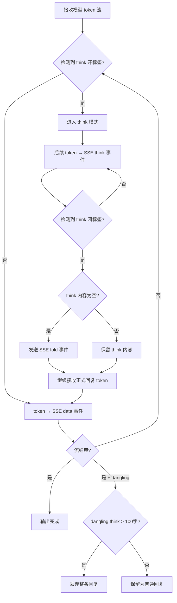
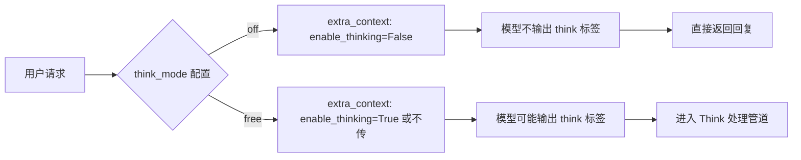

# P12 - Think 管道设计文档

> 模块路径：`core/think_processor.py`、`core/stream_engine.py`
> 相关配置：`think_mode`、`extra_context`

---

## 1. 模块概览

Think 管道负责处理 Qwen3-8B 模型推理输出中的 `<think ...>...</think}` 标签，包括标签剥离、空 think 检测、折叠通知以及空回复保护。该管道涉及两个核心文件：

| 文件 | 职责 | 行数（约） |
|---|---|---|
| `think_processor.py` | Think 处理器主逻辑：标签剥离、空 think 检测、折叠处理 | 150 |
| `stream_engine.py` | SSE 流式引擎，内含 80+ 行 think 处理 fallback 逻辑 | 800 |

---

## 2. 核心设计

### 2.1 Think 模式控制

系统通过 `think_mode` 参数控制模型是否启用思考能力：

| 模式 | 行为 | 传参 |
|---|---|---|
| `"off"` | 禁用思考 | 传入 `extra_context={"enable_thinking": False}` |
| `"free"` | 允许自由思考 | 不传或传 `extra_context={"enable_thinking": True}` |

当 `think_mode="off"` 时，推理请求会额外携带 `enable_thinking: False`，模型将直接生成回复而不产生 think 标签。

### 2.2 Think 标签处理

模型输出的原始文本可能包含 `<think ...>` 标签。处理逻辑如下：

1. **标签剥离**：检测并移除 `<think ...>` 和 `</think}` 标签对
2. **内容提取**：标签内的文本作为"思考内容"，标签外的文本作为"正式回复"
3. **空 think 处理**：若标签对内无实质内容（仅空白），视为空 think，静默丢弃

### 2.3 SSE 事件设计

Think 管道在 SSE（Server-Sent Events）流中定义了两种专用事件：

| 事件类型 | 格式 | 说明 |
|---|---|---|
| `think` | `event: think\ndata: {"content": "片段文本"}\n\n` | 思考内容片段，前端实时显示思考过程 |
| `fold` | `event: fold\ndata: {"reason": "empty"}\n\n` | 折叠通知，告知前端思考过程已被折叠/隐藏 |

### 2.4 空回复保护

当模型只输出了 `<think ...>` 开标签但未输出闭标签和实际回复时，会产生"悬挂 think"（dangling think）：

- **判定规则**：若悬挂 think 内容超过 100 字，视为无效输出，整条回复被丢弃
- **处理方式**：不向用户展示任何内容，返回空回复或提示重试
- **设计意图**：防止将模型"卡在思考中"的碎片文本误当作正式回复展示

---

## 3. 数据流

### 3.1 完整 Think 处理管道

```
模型输出（token 流）
    │
    ▼
stream_engine.py（SSE 流式输出）
    │
    ├─ 检测到 <think ...> 开标签
    │   ├─ 进入 think 模式
    │   ├─ 后续 token → SSE think 事件
    │   └─ 检测到 </think} 闭标签
    │       ├─ 退出 think 模式
    │       └─ 发送 SSE fold 事件（若 think 为空）
    │
    ├─ 未检测到 think 标签
    │   └─ 直接作为正式回复 → SSE data 事件
    │
    └─ 流结束后
        ├─ think_processor.py 后处理
        ├─ 检查 dangling think > 100字 → 丢弃
        └─ 返回最终回复
```

---

## 4. Mermaid 流程图

### 4.1 Think 处理主流程



### 4.2 think_mode 控制流程



---

## 5. 配置参数说明

| 参数 | 可选值 | 说明 |
|---|---|---|
| `think_mode` | `"off"`, `"free"` | 控制模型是否启用思考模式 |
| `extra_context.enable_thinking` | `True`, `False` | 实际传递给模型的思考控制参数 |

> 注：`think_mode` 是用户级配置概念，最终通过 `extra_context` 传递给推理引擎。

---

## 6. 已知限制

1. **stream_engine fallback 逻辑冗余**：`stream_engine.py` 中存在 80+ 行的 think 处理 fallback 逻辑，与 `think_processor.py` 存在功能重叠。这部分代码的保留是因为流式场景下需要逐 token 检测，而 `think_processor.py` 主要用于后处理阶段。
2. **标签匹配脆弱性**：当前依赖简单的字符串匹配检测 `<think ...>` 和 `</think}` 标签，若模型输出格式略有偏差（如多余空格、换行），可能导致匹配失败。
3. **100 字阈值硬编码**：dangling think 的丢弃阈值 100 字为硬编码值，未暴露为可配置参数，在不同场景下可能需要调整。
4. **无 think 内容摘要**：对于很长的 think 内容，系统仅做原样透传或丢弃，不提供摘要或截断功能。前端需要自行处理长 think 内容的展示。
5. **SSE 事件顺序保证**：think → fold → data 的事件顺序依赖流式输出逻辑，在异常中断情况下可能出现事件顺序错乱。

---

> 文档版本：v1.0 | 最后更新：2026-05-29
