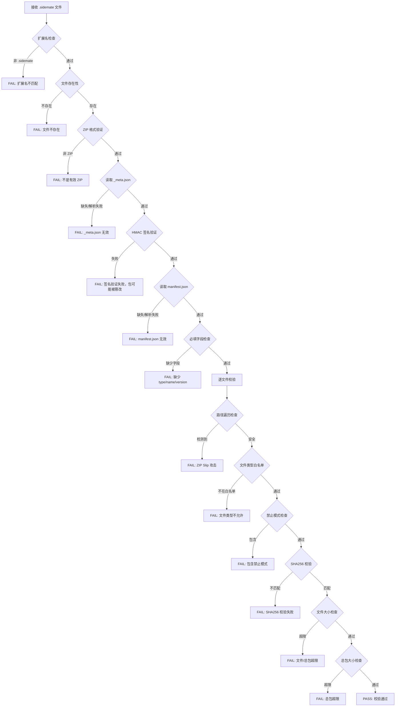
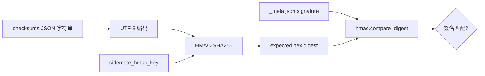
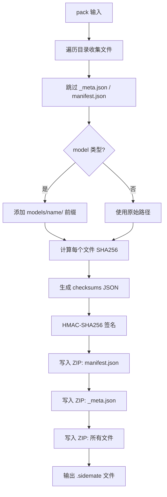
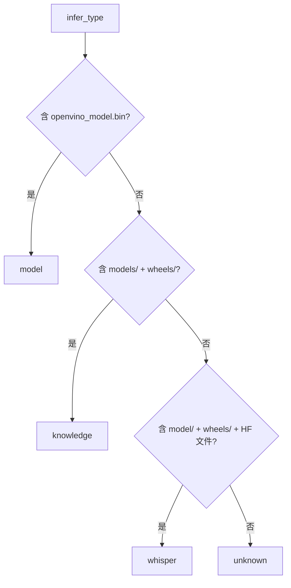

# .sidemate 包验证系统设计

> 模块：`validators/sidemate_validator.py` + `packager.py`
> 版本：Patch 12

---

## 1. 模块概览

.sidemate 包是桌伴 Sidemate 的扩展分发格式，用于分发模型、文库、语音识别模型和 Action 扩展。验证系统确保包的完整性、来源可信和安全性。

### 核心组件

| 组件 | 文件 | 职责 |
|------|------|------|
| 验证器 | `validators/sidemate_validator.py` | 校验包完整性、签名和安全性 |
| 打包器 | `packager.py` | 将目录打包为 .sidemate 格式 |

### 支持的包类型

| 类型 | 说明 | 典型内容 |
|------|------|---------|
| `model` | LLM 模型 | OpenVINO IR 格式模型文件 |
| `knowledge` | 文库扩展 | 嵌入模型 + 向量数据 |
| `whisper` | 语音识别模型 | Whisper 模型 + 分词器 |
| `action` | Action 扩展 | Action 配置 + 资源文件 |

---

## 2. .sidemate 包格式

### 2.1 格式定义

.sidemate 包本质是 ZIP 格式文件，内部结构如下：

```
example.sidemate (ZIP)
├── manifest.json          — 包元数据
├── _meta.json             — 校验信息 + HMAC 签名
├── file1.bin              — 包内文件
├── file2.json
└── subdir/
    └── file3.txt
```

### 2.2 manifest.json 格式

```json
{
  "type": "model",
  "name": "qwen3-8b-int4",
  "version": "1.0.0",
  "files": ["openvino_model.bin", "config.json"]
}
```

**必填字段：**

| 字段 | 类型 | 说明 |
|------|------|------|
| `type` | string | 包类型：model/knowledge/whisper/action |
| `name` | string | 包名称 |
| `version` | string | 版本号 |

### 2.3 _meta.json 格式

```json
{
  "checksums": "{\"file1.bin\":\"sha256hash...\",\"file2.json\":\"sha256hash...\"}",
  "signature": "hmac-sha256-hex-string"
}
```

| 字段 | 类型 | 说明 |
|------|------|------|
| `checksums` | string | JSON 字符串，每个文件的 SHA256 校验值 |
| `signature` | string | HMAC-SHA256 签名（对 checksums 字符串计算） |

### 2.4 model 类型的特殊处理

model 类型包在打包时会自动添加 `models/<name>/` 前缀：

```python
if pkg_type == "model" and pkg_name:
    zip_prefix = "models/%s/" % pkg_name
```

例如 `qwen3-8b-int4` 模型的包内路径为 `models/qwen3-8b-int4/openvino_model.bin`。

---

## 3. 验证流程

### 3.1 完整验证流程



### 3.2 HMAC-SHA256 签名验证



**签名密钥来源：**

1. 环境变量 `SIDEMATE_HMAC_KEY`（优先）
2. `config.py` 默认值 `zhuoban-sidemate-default-key-v1`

---

## 4. 安全机制

### 4.1 文件类型白名单

```python
ALLOWED_EXTENSIONS = {
    '.bin', '.xml', '.json', '.whl', '.tar', '.gz', '.txt', '.md',
    '.safetensors', '.vocab', '.model', '.onnx', '.idx', '.flac',
    '.wav', '.mp3', '.ogg', '.png', '.jpg', '.jpeg', '.svg',
    '.ttf', '.otf', '.woff', '.woff2', '.css', '.js', '.html',
    '.py', '.cfg', '.ini', '.toml', '.yaml', '.yml', '.csv',
    '.tsv', '.pdf', '.docx', '.xlsx', '.pptx', '.lock',
    # HF / OV 扩展
    '.gitattributes', '.jinja', '.msc', '.mv', '.metadata',
}
```

- 无扩展名文件直接放行（HF metadata 等常有此类文件）
- 不在白名单中的扩展名将导致验证失败

### 4.2 禁止模式

| 模式 | 说明 |
|------|------|
| `__pycache__` | Python 缓存目录 |
| `.git/` | Git 版本控制目录 |
| `.DS_Store` | macOS 系统文件 |
| `Thumbs.db` | Windows 缩略图缓存 |
| `desktop.ini` | Windows 桌面配置 |

### 4.3 路径遍历防护（ZIP Slip）

```python
def _check_path_traversal(self, filepath: str) -> bool:
    # 检查 .. 组件
    parts = filepath.replace('\\', '/').split('/')
    for part in parts:
        if part == '..':
            return True  # 检测到危险路径
    # 检查绝对路径
    if filepath.startswith('/') or (len(filepath) > 1 and filepath[1] == ':'):
        return True
    return False
```

### 4.4 大小限制

| 限制 | 值 | 说明 |
|------|-----|------|
| 单文件最大 | 5 GB | `MAX_FILE_SIZE` |
| 总包最大 | 10 GB | `MAX_TOTAL_SIZE` |

---

## 5. 打包流程

### 5.1 打包器（packager.py）



### 5.2 命令行使用

```bash
python packager.py \
  --input /path/to/model_dir \
  --type model \
  --name qwen3-8b-int4 \
  --version 1.0.0 \
  --key your-hmac-key \
  --output qwen3-8b-int4-1.0.0.sidemate
```

---

## 6. 包类型自动推断

当 manifest.json 缺失或无 type 字段时，验证器可自动推断包类型：



---

## 7. 配置参数

| 参数 | 位置 | 默认值 | 说明 |
|------|------|--------|------|
| `SIDEMATE_HMAC_KEY` | 环境变量 | — | HMAC 签名密钥（优先） |
| `sidemate_hmac_key` | config.py | `zhuoban-sidemate-default-key-v1` | 默认签名密钥 |
| `MAX_FILE_SIZE` | sidemate_validator.py | 5 GB | 单文件大小上限 |
| `MAX_TOTAL_SIZE` | sidemate_validator.py | 10 GB | 总包大小上限 |

---

## 8. 注意事项

### 8.1 签名密钥管理

生产环境必须通过环境变量 `SIDEMATE_HMAC_KEY` 设置独立的签名密钥，不应使用默认密钥。默认密钥仅供开发测试使用。

### 8.2 manifest.json 多版本处理

ZIP 中可能存在多个 manifest.json（原始目录中的 + 打包器写入的）。验证器遍历所有条目，优先使用包含 `type` 字段的版本（打包器生成的）。

### 8.3 无扩展名文件

HuggingFace 模型仓库中常有 `.gitattributes` 等无扩展名或特殊扩展名文件。验证器对无扩展名文件直接放行，同时将 HF/OV 相关扩展名加入白名单。

### 8.4 验证器使用示例

```python
from validators.sidemate_validator import SidemateValidator
from config import get

validator = SidemateValidator(hmac_key=get("sidemate_hmac_key"))
is_valid, message, manifest = validator.validate_sidemate("/path/to/package.sidemate")

if is_valid:
    print("包类型:", manifest["type"])
    print("包名称:", manifest["name"])
    print("版本:", manifest["version"])
else:
    print("验证失败:", message)
```
