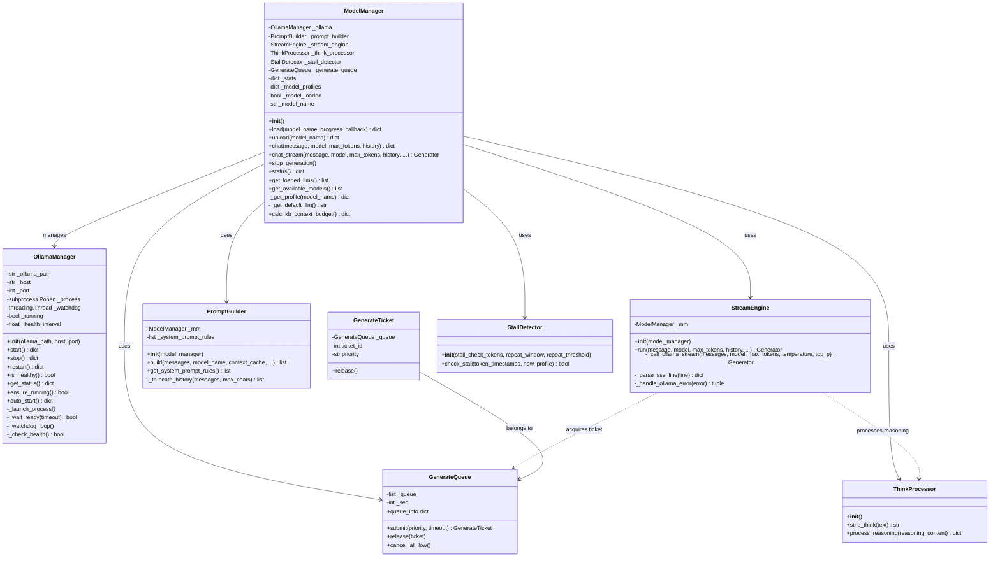
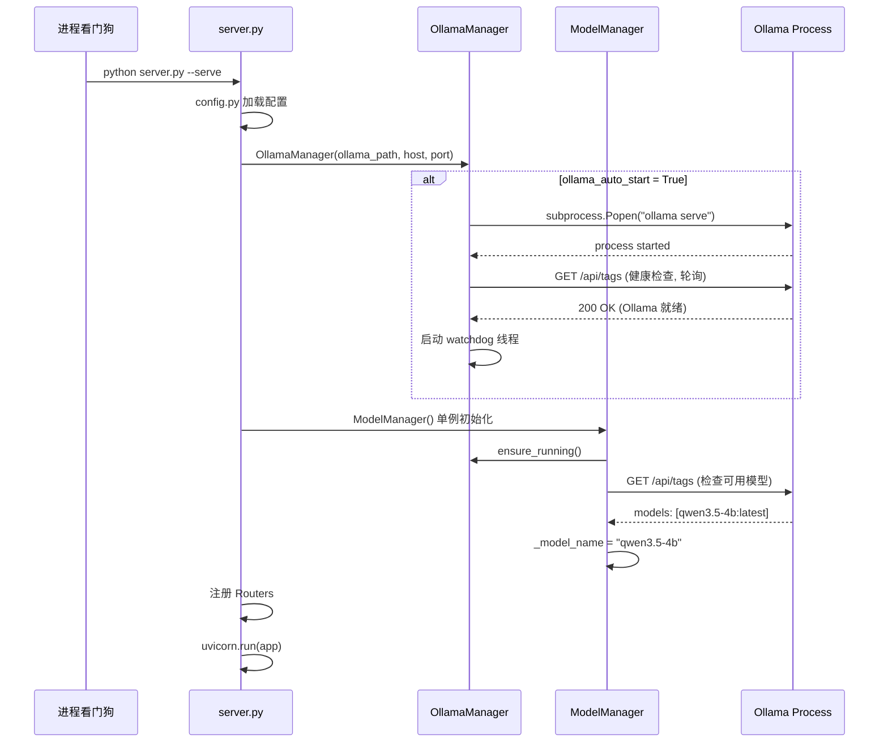
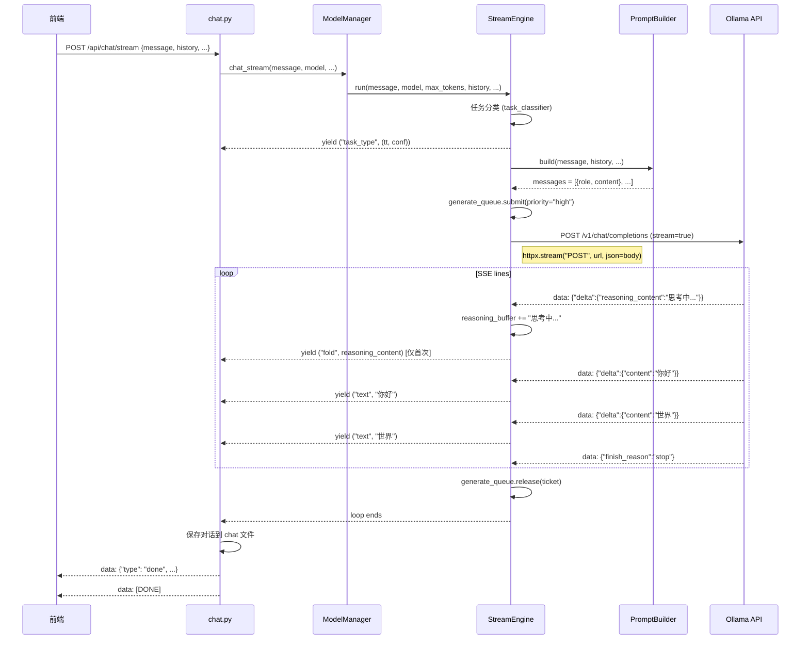
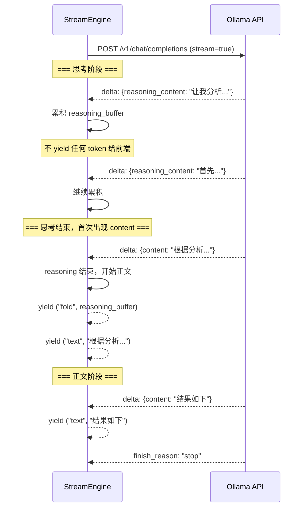
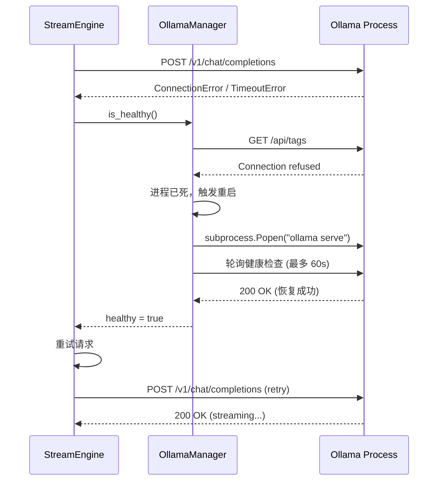

# Sidemate v0.9 系统架构设计

> **版本**: v0.9 — 推理底座迁移  
> **迁移路径**: OpenVINO GenAI + Qwen3-8B INT4 → Ollama + Intel SYCL + Qwen3.5-4B GGUF Q5_K_M  
> **源代码**: `C:\tmp\_local_ai_patch12\` (Patch12)  
> **目标代码**: `C:\tmp\_Sidemate_0.9\`  
> **日期**: 2025-07-27

---

## 1. 实现方案 + 框架选型

### 1.1 核心技术挑战

| 挑战 | Patch12 现状 | v0.9 方案 |
|------|------------|----------|
| **推理引擎** | `openvino_genai.LLMPipeline` 直接加载模型文件 | Ollama 独立进程，通过 HTTP API 调用 |
| **流式输出** | Lambda streamer + Queue + 手动 token 解析 | Ollama SSE `/v1/chat/completions` 原生流式 |
| **思考分离** | 文本匹配 `<think/>` 标签 + 启发式推理检测 | Ollama 原生 `reasoning_content` 字段 |
| **KV cache** | `start_chat()` / `finish_chat()` 手动管理 | Ollama 自行管理，无需干预 |
| **Prompt 构建** | `apply_chat_template()` + tokenizer 编码 | 标准 OpenAI messages 数组，Ollama 内部处理 |
| **进程管理** | 无（模型加载到进程内） | 新增 OllamaManager 管理子进程生命周期 |
| **并发控制** | GenerateQueue 串行排队（GPU 独占） | Ollama 自身支持并发，保留队列做限流 |
| **设备管理** | OpenVINO 设备检测 (NPU/GPU/CPU) | Ollama + Intel SYCL 自动选择，无需手动检测 |
| **停止生成** | 设置 flag → lambda streamer 返回 True | 关闭 httpx 流连接（或发中断信号） |

### 1.2 框架选型

| 组件 | 选型 | 理由 |
|------|------|------|
| HTTP 客户端 | **httpx** (同步模式) | 支持 SSE 流式读取、超时控制、连接管理；FastAPI 已是同步路由（sse_gen 是普通生成器函数），无需 async |
| SSE 解析 | 手动解析 `data: {...}\n\n` | Ollama OpenAI 兼容 API 的 SSE 格式固定，无需引入额外库 |
| 进程管理 | `subprocess.Popen` | 跨平台、可监控 PID、可捕获 stdout/stderr |
| 后端框架 | FastAPI（保持不变） | 前端零改动要求 |
| Python | 3.14（保持不变） | 与 Patch12 一致 |

### 1.3 为什么选择 httpx 同步而非异步？

1. **`sse_gen()` 是同步生成器**：`api_chat_stream` 返回 `StreamingResponse(sse_gen())`，`sse_gen` 是普通 Python 生成器，不是 async generator
2. **Ollama HTTP 调用在生成器内部**：`stream_engine.run()` 也是同步生成器，yield `(phase, content)` 给 `sse_gen`
3. **httpx 同步模式支持流式迭代**：`httpx.stream("POST", ...)` 返回的 `response.iter_lines()` 可在同步生成器中使用
4. **避免 async 改造连锁反应**：改成 async 需要改 `sse_gen` → `async sse_gen`，`StreamingResponse` 需要用 `async_generator`，影响范围过大

### 1.4 Ollama HTTP API 调用方式

```
POST http://localhost:11434/v1/chat/completions
Content-Type: application/json

{
  "model": "qwen3.5-4b",
  "messages": [
    {"role": "system", "content": "..."},
    {"role": "user", "content": "..."}
  ],
  "max_tokens": 2048,
  "temperature": 0.6,
  "top_p": 0.9,
  "stream": true,
  "stream_options": {"include_usage": true}
}
```

SSE 响应格式（标准 OpenAI 兼容）：
```
data: {"id":"chatcmpl-xxx","object":"chat.completion.chunk","choices":[{"index":0,"delta":{"role":"assistant"},"finish_reason":null}]}
data: {"id":"chatcmpl-xxx","choices":[{"index":0,"delta":{"reasoning_content":"让我思考..."},"finish_reason":null}]}
data: {"id":"chatcmpl-xxx","choices":[{"index":0,"delta":{"content":"你好"},"finish_reason":null}]}
data: {"id":"chatcmpl-xxx","choices":[{"index":0,"delta":{"content":"！"},"finish_reason":null}]}
data: {"id":"chatcmpl-xxx","choices":[{"index":0,"delta":{},"finish_reason":"stop"}]}
data: [DONE]
```

**关键字段**：
- `delta.content`：正文 token
- `delta.reasoning_content`：思考过程 token（Ollama 原生支持，无需文本匹配）
- `finish_reason`：`"stop"` / `"length"` / `null`

### 1.5 错误处理策略

| 错误场景 | 处理方式 |
|----------|---------|
| Ollama 进程未启动 | `OllamaManager.auto_start()` 自动拉起 |
| Ollama 进程崩溃 | 健康检查失败 → 自动重启 → 重试当前请求 |
| HTTP 连接超时 | 30s 连接超时 + 60s 读取超时 |
| 请求被 Ollama 拒绝 | 返回错误 SSE 事件 `{"type": "error"}` |
| 模型未加载 | 通过 `/api/tags` 检查，自动 `ollama pull` 或提示用户 |
| GPU OOM | 捕获 Ollama 错误，降级到 CPU 或提示 |
| 空回复 | 保持 Patch12 的自动续写逻辑 |

---

## 2. 文件列表及相对路径

### 2.1 新增文件

| 文件路径 | 说明 |
|---------|------|
| `core/ollama_manager.py` | **新增**：Ollama 进程管理器（启动/停止/健康检查/自动恢复） |

### 2.2 重写文件

| 文件路径 | 说明 |
|---------|------|
| `core/model_manager.py` | **重写**：从 OpenVINO LLMPipeline → Ollama HTTP API |
| `core/stream_engine.py` | **重写**：从 lambda streamer + Queue → Ollama SSE 流式 |
| `core/prompt_builder.py` | **重写**：从 apply_chat_template + tokenizer → OpenAI messages 数组 |
| `core/think_processor.py` | **大幅简化**：从文本匹配 + 启发式推理检测 → 直接读取 `reasoning_content` |

### 2.3 修改文件

| 文件路径 | 说明 |
|---------|------|
| `config.py` | 新增 Ollama 配置项，移除 OpenVINO 配置项 |
| `core/generate_queue.py` | 适配：Ollama 支持并发但保留限流能力 |
| `server.py` | 集成 OllamaManager 启动/停止，移除 OpenVINO 环境变量 |
| `routers/settings.py` | 适配新的 load/unload/status/device 逻辑 |
| `routers/deps.py` | 新增 `get_ollama()` 依赖注入 |
| `routers/chat.py` | 微调：适配新的 StreamEngine 输出（phase 格式不变） |
| `intelligence/stall_detector.py` | 简化或移除：Ollama 不需要前缀累积检测（OpenVINO bug 特有） |
| `requirements.txt` | 删除 openvino 依赖，新增 httpx |

### 2.4 可删除文件

| 文件路径 | 说明 |
|---------|------|
| 无 | 所有核心文件保留，内容重写 |

### 2.5 不变文件

| 文件路径 | 说明 |
|---------|------|
| `index.html` | 前端零改动 |
| `static/**` | 前端零改动 |
| `session/**` | 会话管理不变 |
| `knowledge/**` | 知识库嵌入引擎不变 |
| `knowledge_base.py` | 文库不变 |
| `files/**` | 文件操作不变 |
| `common/**` | 通用工具不变 |
| `recorder_pkg/**` | 录音纪要不变 |
| `intelligence/task_classifier.py` | 任务分类不变 |
| `intelligence/action_router.py` | Action 路由不变 |
| `prompts.py` | 提示词不变 |
| `routers/files.py` | 文件路由不变 |
| `routers/recorder.py` | 录音路由不变 |
| `routers/skill.py` | Skill 路由不变 |
| `routers/kb.py` | 文库路由不变 |

---

## 3. 数据结构和接口（类图）



### 3.1 OllamaManager 类设计

```python
class OllamaManager:
    """Ollama 进程生命周期管理"""
    
    def __init__(self, ollama_path: str = "ollama", 
                 host: str = "127.0.0.1", port: int = 11434):
        """
        Args:
            ollama_path: ollama 可执行文件路径（默认从 PATH 查找）
            host: Ollama 监听地址
            port: Ollama 监听端口
        """
    
    def start(self) -> dict:
        """启动 Ollama 进程（ollama serve）
        Returns: {"status": "started"} 或 {"error": "..."}
        """
    
    def stop(self) -> dict:
        """停止 Ollama 进程"""
    
    def restart(self) -> dict:
        """重启 Ollama 进程"""
    
    def is_healthy(self) -> bool:
        """健康检查：GET http://localhost:11434/api/tags"""
    
    def get_status(self) -> dict:
        """返回 Ollama 状态（运行中/已停止/模型列表/版本等）"""
    
    def ensure_running(self) -> bool:
        """确保 Ollama 在运行，否则自动启动"""
    
    def auto_start(self) -> dict:
        """自动启动 Ollama（首次调用 start() + 等待就绪）"""
```

### 3.2 ModelManager 新接口（重点变化）

```python
class ModelManager:
    """单例模型管理器（Ollama 版本）"""
    
    # 移除的属性/方法：
    # - _loaded: dict        → 不再加载模型到进程内
    # - _load_times: dict    → 不适用
    # - model_configs: dict  → 改为从 Ollama API 获取
    # - _scan_models()       → 改为 Ollama model list
    # - _detect_device()     → Ollama + SYCL 自动管理
    # - _probe_device_token_limit() → 使用模型配置默认值
    # - switch_device()      → Ollama 自动管理设备
    # - detect_devices()     → 不再需要
    
    # 新增的属性：
    # - _ollama: OllamaManager  → Ollama 进程管理器
    # - _model_name: str        → 当前使用的模型名（如 "qwen3.5-4b"）
    # - _model_loaded: bool     → 模型是否已确认可用
    
    # load() 变化：
    def load(self, model_name: str, progress_callback=None) -> dict:
        """加载模型 → 检查 Ollama 中模型是否存在（ollama list）
        若不存在，可以尝试 ollama pull 或报错提示用户手动拉取
        不再需要将模型加载到内存（Ollama 懒加载）
        """
    
    def unload(self, model_name: str) -> dict:
        """卸载模型 → 通知 Ollama 释放模型内存
        POST http://localhost:11434/api/generate with keep_alive: 0
        """
    
    def chat_stream(self, message, model=None, max_tokens=None, 
                    history=None, ...) -> Generator:
        """签名不变，内部委托给 StreamEngine"""
    
    def get_available_models(self) -> list:
        """从 Ollama API 获取可用模型列表
        GET http://localhost:11434/api/tags
        Returns: [{"name": "qwen3.5-4b:latest", "size": 3200000000}, ...]
        """
```

### 3.3 StreamEngine 新接口

```python
class StreamEngine:
    """流式生成引擎（Ollama 版本）"""
    
    def run(self, message: str, model: str = None, 
            max_tokens: int = None, history: list = None,
            context_cache: str = None, drift_hint: str = None,
            _agent_mode: bool = False, override_task_type: str = None,
            strategy_enhancement: str = "", kb_mode: bool = False,
            kb_history_turns: int = 0, _priority: str = None):
        """LLM 流式对话生成器，yield (phase, content) 元组
        
        phase 保持不变：
          "task_type" - 任务分类结果
          "raw"       - 原始 token 流（当 reasoning_content 未提供时的 fallback）
          "fold"      - 思考过程完成
          "text"      - 正文 token 流
          "mode_hint" - 模式切换建议
          "reload"    - 模型正在重载
          "think_open"- think 标签未关闭（Ollama 版本不太可能触发）
        
        核心变化：
        - 不再使用 Queue + threading + lambda streamer
        - 直接同步迭代 httpx.StreamResponse.iter_lines()
        - reasoning_content → phase="fold"
        - content → phase="text"
        - 前缀累积检测：移除（OpenVINO bug，Ollama 不需要）
        """
    
    def _call_ollama_stream(self, messages: list, model: str, 
                            max_tokens: int, temperature: float, 
                            top_p: float) -> Generator:
        """调用 Ollama SSE 流式 API
        Yields: {"type": "reasoning"|"content"|"done"|"error", "text": "..."}
        """
```

### 3.4 PromptBuilder 新接口

```python
class PromptBuilder:
    """Prompt 构建器（Ollama 版本）"""
    
    def build(self, message: str, history: list = None,
              model_name: str = None, context_cache: str = None,
              task_type: str = None, drift_hint: str = None,
              signals: dict = None, kb_mode: bool = False,
              strategy_enhancement: str = "",
              kb_history_turns: int = 0,
              think_mode: str = None) -> list:
        """构建 OpenAI 格式的 messages 数组
        
        Returns: [
            {"role": "system", "content": "..."},
            {"role": "user", "content": "..."},
            {"role": "assistant", "content": "..."},
            ...
        ]
        
        不再返回 token ID 列表或 prompt 字符串。
        不再需要 pipe/tok 参数（Ollama 自己处理 tokenization）。
        Token 数安全检查改为基于字符数估算。
        """
```

### 3.5 ThinkProcessor 简化

```python
class ThinkProcessor:
    """思维链处理（Ollama 版本 — 大幅简化）"""
    
    # Ollama 原生提供 reasoning_content，不再需要：
    # - detect_think_tags()     → 不再需要
    # - looks_like_reasoning()  → 不再需要
    # - process_stream_token()  → 不再需要
    # - extract_body_from_raw() → 不再需要
    
    # 保留：
    def strip_think(self, text: str) -> str:
        """清理残留的 think 标签（兼容旧对话历史）"""
    
    def process_reasoning(self, reasoning_content: str) -> dict:
        """处理 Ollama 返回的 reasoning_content
        Returns: {"fold": bool, "content": str, "len": int}
        决定是否折叠显示、内容清理等
        """
```

### 3.6 配置数据结构

```python
# config.py 新增 Ollama 配置
DEFAULTS = {
    # ... 保留原有通用配置 ...
    
    # ----- Ollama 配置（新增）-----
    "ollama_host": "127.0.0.1",         # Ollama 监听地址
    "ollama_port": 11434,               # Ollama 监听端口
    "ollama_model": "qwen3.5-4b",       # 默认模型名
    "ollama_auto_start": True,           # 服务启动时自动启动 Ollama
    "ollama_health_interval": 30,        # 健康检查间隔（秒）
    "ollama_connect_timeout": 30,        # HTTP 连接超时（秒）
    "ollama_read_timeout": 120,          # HTTP 读取超时（秒）
    "ollama_max_concurrent": 1,          # 最大并发请求数（GPU 限制）
    "ollama_keep_alive": "5m",           # 模型保活时间
    
    # 移除的配置：
    # - device: NPU/GPU/CPU 选择
    # - npu_default_prompt_tokens
    # - gpu_default_prompt_tokens
    # - cpu_default_prompt_tokens
    # - token_safety_margin（Ollama 自动管理）
    # - npu_history_token_ratio
    # - npu_history_max_chars
    # - stall_check_tokens（Ollama 无 stall 问题）
    # - repeat_window（Ollama 无前缀累积 bug）
    # - repeat_threshold
    # - max_retry（简化重试逻辑）
}
```

---

## 4. 程序调用流程（时序图）

### 4.1 服务启动流程



### 4.2 对话请求流程（含 SSE streaming）



### 4.3 思考/回答分离流程



### 4.4 Ollama 异常恢复流程



---

## 5. 任务列表（有序、含依赖关系、按实现顺序排列）

### T01: 项目基础设施 — 配置 + 依赖 + 入口适配
- **改动文件**:
  - `config.py` — 新增 Ollama 配置项，移除 OpenVINO 配置项
  - `requirements.txt` — 删除 openvino 依赖，新增 httpx
  - `server.py` — 集成 OllamaManager 启动逻辑，移除 OpenVINO 环境变量
  - `routers/deps.py` — 新增 `get_ollama()` 依赖注入
- **依赖**: 无
- **优先级**: P0
- **复杂度**: M

### T02: Ollama 进程管理 + 模型管理器重写
- **改动文件**:
  - `core/ollama_manager.py` — **新增**：Ollama 进程管理器
  - `core/model_manager.py` — **重写**：从 OpenVINO → Ollama HTTP API
  - `core/think_processor.py` — **简化**：移除文本匹配逻辑，改为处理 reasoning_content
  - `intelligence/stall_detector.py` — **简化**：移除前缀累积检测（Ollama 无此 bug）
- **依赖**: T01
- **优先级**: P0
- **复杂度**: L

### T03: Prompt 构建 + 流式引擎重写
- **改动文件**:
  - `core/prompt_builder.py` — **重写**：输出 OpenAI messages 数组而非 token IDs
  - `core/stream_engine.py` — **重写**：Ollama SSE 流式解析 + 逐 token yield
  - `core/generate_queue.py` — **适配**：保留但简化（Ollama 支持并发但做限流）
- **依赖**: T02
- **优先级**: P0
- **复杂度**: L

### T04: 路由层适配 + 设置页 API
- **改动文件**:
  - `routers/chat.py` — 微调：适配 StreamEngine 新输出（phase 格式保持兼容）
  - `routers/settings.py` — 重写 load/unload/status/devices 端点
  - `core/__init__.py` — 更新导出
- **依赖**: T03
- **优先级**: P0
- **复杂度**: M

### T05: 集成测试 + 边界处理
- **改动文件**:
  - `test_smoke.py` — 更新冒烟测试
  - 所有 v0.9 文件 — 修复集成问题
  - `routers/chat.py` — 完善续写/空回复/fallback 逻辑
- **依赖**: T04
- **优先级**: P1
- **复杂度**: M

---

## 6. 依赖包列表

### requirements.txt 变更清单

```diff
# 删除（OpenVINO 相关）
- openvino==2026.1.0
- openvino-genai==2026.1.0.0
- openvino-telemetry==2025.2.0
- openvino-tokenizers==2026.1.0.0
- nncf==3.1.0
- optimum==2.1.0
- optimum-intel==1.27.0
- optimum-onnx==0.1.0
- onnxruntime==1.26.0
- onnx==1.21.0
- torch==2.11.0

# 新增（Ollama 通信）
+ httpx==0.28.1

# 保留不变
  fastapi==0.136.1
  uvicorn==0.46.0
  sse-starlette==3.4.1
  starlette==1.0.0
  python-multipart==0.0.27
  pydantic==2.13.3
  sentence-transformers==5.5.0
  transformers==4.57.6
  tokenizers==0.22.2
  huggingface_hub==0.36.2
  safetensors==0.7.0
  accelerate==1.13.0
  scikit-learn==1.8.0
  scipy==1.17.1
  rank-bm25==0.42.1
  jieba==0.42.1
  pdfplumber==0.11.9
  pypdf==6.10.2
  python-docx==1.2.0
  python-pptx==1.0.2
  openpyxl==3.1.5
  numpy==2.4.6
  pandas==3.0.0
  pillow==12.2.0
  psutil==7.2.2
  requests==2.33.1
  beautifulsoup4==4.14.3
  lxml==6.0.2
  Markdown==3.10.2
  colorama==0.4.6
  tqdm==4.67.3
  pywin32==311
  pydantic-settings==2.14.0
  pydantic_core==2.46.3
  mammoth==1.11.0
  PyPDF2==3.0.1
```

**关键变化**：
- 删除 11 个 OpenVINO 相关包（大幅减小依赖体积）
- 新增 1 个 httpx 包
- torch 也被移除（Ollama 自带运行时）

---

## 7. 共享知识（跨文件约定）

### 7.1 SSE 事件格式（前端兼容，不可变更）

```python
# 前端期望的 SSE 事件类型（chat.js 监听）
'token'    → '{"type": "token", "content": "文本片段"}'
'fold'     → '{"type": "fold", "think_len": 1234}'
'done'     → '{"type": "done", "model": "...", "chars": 0, "think_chars": 0, "time": 0.0, "speed": 0, "task_type": "..."}'
'error'    → '{"type": "error", "content": "错误信息"}'
'task_type'→ '{"type": "task_type", "task_type": "text", "confidence": 0.9}'
'mode_hint'→ '{"type": "mode_hint", "message": "提示信息"}'
'reload'   → '{"type": "model_reload", "model": "模型名"}'
'filter'   → '{"type": "filter", "warnings": [], "corrections": []}'
'truncate' → '{"type": "truncate", "content": "截断后内容"}'
'[DONE]'   → 流结束标记
```

### 7.2 StreamEngine yield 格式（内部约定）

```python
# StreamEngine.run() yield 的 (phase, content) 元组
("task_type", (task_type: str, confidence: float))
("raw", str)           # 保留用于 fallback
("fold", str)          # 思考内容（完整文本）
("text", str)          # 正文 token
("mode_hint", str)     # 模式提示
("reload", str)        # 模型正在重载
("think_open", int)    # think 未闭合的长度
```

### 7.3 Ollama HTTP 端点

```
基础 URL: http://{ollama_host}:{ollama_port}

GET  /api/tags                     → 模型列表
POST /api/generate                 → 非流式生成（可用于 unload）
POST /v1/chat/completions          → OpenAI 兼容流式/非流式
GET  /api/version                  → 版本信息
```

### 7.4 日志格式

```python
# 统一使用 logging.getLogger
log = logging.getLogger(__name__)        # 模块级日志
log_scan = logging.getLogger("local-ai") # 全局扫描日志

# 日志前缀约定
[OLLAMA]   — Ollama 进程管理相关
[MODEL]    — 模型管理器
[STREAM]   — 流式引擎
[THINK]    — 思考处理
[CHAT]     — 聊天路由
[CONFIG]   — 配置管理
```

### 7.5 错误处理约定

```python
# Ollama 连接失败的统一处理
def _handle_ollama_unavailable(self):
    """Ollama 不可用时的统一降级"""
    yield ("raw", "[ERROR] Ollama 服务不可用，正在尝试恢复...")
    # 触发 OllamaManager 重启
    # 重试一次
    # 仍然失败则 yield error
```

### 7.6 变量命名约定

```python
# Ollama 相关
_ollama_host: str       # Ollama 地址
_ollama_port: int       # Ollama 端口
_ollama_base_url: str   # 完整 base URL
_model_name: str        # 当前模型名（如 "qwen3.5-4b"）

# SSE 解析
_reasoning_buffer: str  # 思考内容缓冲
_content_buffer: str    # 正文内容缓冲
_reasoning_done: bool   # 思考阶段是否结束
```

---

## 8. 待明确事项

### 8.1 架构层面待确认

| # | 问题 | 影响 | 建议 |
|---|------|------|------|
| 1 | **Ollama 是否已预装？** | 影响 OllamaManager 的 auto_start 逻辑和错误提示 | 假设已预装在 PATH 中，启动脚本自动安装 |
| 2 | **模型是否已预拉取？** | 影响 ModelManager.load() 的实现 | 假设 `ollama pull qwen3.5-4b` 已在安装脚本中执行 |
| 3 | **GPU 并发限制** | Ollama 默认允许并发但 GPU 显存可能只够一个请求 | 保留 GenerateQueue 做串行限流，`ollama_max_concurrent=1` |
| 4 | **reasoning_content 行为** | Qwen3.5-4B 在 GGUF 格式下是否稳定输出 reasoning_content？ | 需实测。如果不支持，fallback 到 strip_think 文本处理 |
| 5 | **stop_generation 实现** | Ollama 流式请求如何中断？ | 方案：关闭 httpx response 连接（`response.close()`），Ollama 会自动终止生成 |
| 6 | **Ollama 端口冲突** | 用户可能已有 Ollama 实例在运行 | OllamaManager 启动前先检查端口是否已占用，已占用则复用 |
| 7 | **token 数估算** | 不再有 tokenizer，如何估算 prompt 长度做历史截断？ | 使用字符数 / 1.5 估算（中文约 1.5 字/token），Ollama 会自动截断超长输入 |
| 8 | **SYCL 设备选择** | Intel SYCL 是否需要环境变量配置？ | Ollama 通常通过 `ONEAPI_DEVICE_SELECTOR` 环境变量控制 |
| 9 | **内存占用报告** | `/api/health` 中的 LLM 内存占用如何获取？ | 通过 Ollama API 获取或使用 psutil 读取 ollama 进程 RSS |

### 8.2 假设

1. Ollama 使用 OpenAI 兼容 API（`/v1/chat/completions`），流式响应遵循标准 SSE 格式
2. `reasoning_content` 字段在 `delta` 中自动携带思考内容（Qwen3.5 的 thinking 模式）
3. 前端 SSE 事件格式不变，所有 API 端点签名不变
4. Ollama 服务与 Sidemate 在同一台机器上运行（localhost）
5. Python 3.14 兼容 httpx
