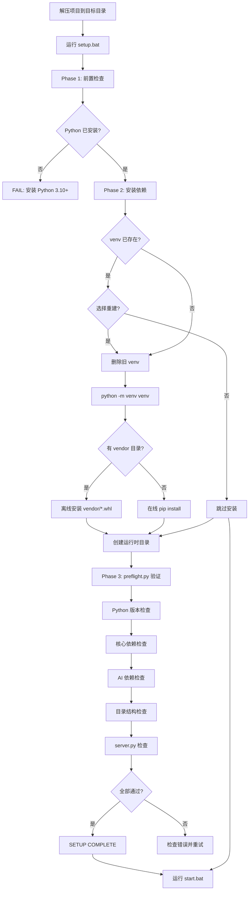
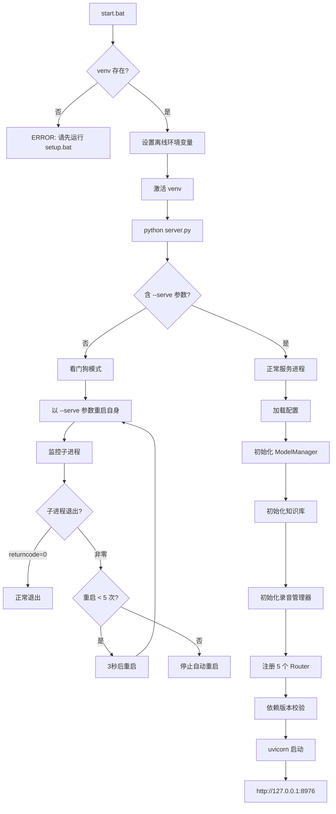

# 部署指南

> 适用版本：Patch 12
> 运行环境：Windows 10/11
> 核心技术：FastAPI + OpenVINO GenAI + Qwen3-8B INT4

---

## 1. 部署概览

桌伴 Sidemate 是纯离线本地 AI 助手，所有推理在本地完成，无需联网。部署过程分为安装和启动两个阶段，均通过批处理脚本一键完成。

### 系统要求

| 项目 | 最低要求 | 推荐 |
|------|---------|------|
| 操作系统 | Windows 10 64-bit | Windows 11 |
| Python | 3.10 | 3.14 |
| 内存 | 8 GB | 16 GB |
| 存储空间 | 10 GB | 20 GB+（含模型） |
| 推理设备 | CPU | Intel NPU / 独立 GPU |

### 推理设备支持

| 设备 | 说明 | prompt token 上限 |
|------|------|------------------|
| Intel NPU | 低功耗，适合轻量对话 | 2400 |
| GPU（Intel/AMD/NVIDIA） | 高性能，支持长上下文 | 32000 |
| CPU | 通用兼容 | 32000 |

---

## 2. 项目结构

### 2.1 后端架构

```
C:\tmp\_local_ai_patch12\
├── server.py              — FastAPI 入口（看门狗 + 主服务）
├── config.py              — 全局配置管理（唯一配置中心）
├── prompts.py             — 系统提示词 + STRATEGY_CONFIG
├── packager.py            — .sidemate 包打包工具
├── preflight.py           — 启动前环境检查
├── requirements.txt       — Python 依赖
├── start.bat              — Windows 启动脚本
├── setup.bat              — 首次安装脚本
│
├── core/                  — 核心包（7 模块）
│   ├── model_manager.py   — 模型管理器（加载/卸载/调度）
│   ├── stream_engine.py   — SSE 流式生成引擎
│   ├── generate_queue.py  — 优先级生成队列
│   └── think_processor.py — 思维链标签处理器
│
├── intelligence/          — 智能层（5 模块）
│   ├── action_registry.py — Action 扩展注册表
│   ├── action_router.py   — Action 路由器
│   ├── task_classifier.py — 任务分类器
│   ├── stall_detector.py  — 停滞检测器
│   └── response_filter.py — 响应过滤器
│
├── validators/            — 验证层
│   └── sidemate_validator.py — .sidemate 包校验器
│
├── routers/               — API 路由层（5 Router）
│   ├── chat.py            — 对话 API
│   ├── kb.py              — 文库 API
│   ├── recorder.py        — 录音纪要 API
│   ├── settings.py        — 设置 API
│   ├── skill.py           — 技能 API
│   └── files.py           — 文件操作 API
│
├── knowledge_base/        — 文库模块
├── recorder_pkg/          — 录音纪要模块
│
├── static/                — 前端静态资源
├── index.html             — 前端入口页面
│
└── data/                  — 运行时数据目录
    ├── chats/             — 对话历史
    ├── logs/              — 日志文件
    ├── tmp_upload/        — 临时上传
    ├── files/             — 用户文件
    └── kb/                — 文库数据
```

### 2.2 9 包 28 模块 + 5 Router

| 包 | 模块数 | 说明 |
|----|--------|------|
| `core/` | 4+ | 模型管理、流式引擎、生成队列、思考处理 |
| `intelligence/` | 5 | Action 系统、任务分类、异常检测、响应过滤 |
| `routers/` | 5-6 | FastAPI Router：chat/kb/recorder/settings/skill/files |
| `validators/` | 1 | .sidemate 包验证 |
| `knowledge_base/` | 多模块 | 向量检索、嵌入、文档管理 |
| `recorder_pkg/` | 多模块 | Whisper 转写、录音管理 |
| 根目录 | 多模块 | server/config/prompts/packager/preflight |
| `static/` | 前端 | HTML/JS/CSS |
| `data/` | 运行时 | 对话/日志/上传/文件/文库 |

---

## 3. 部署流程

### 3.1 完整部署流程



### 3.2 启动流程



### 3.3 看门狗机制

server.py 内置进程级看门狗，在非 `--serve` 模式下自动启动：

```python
if '--serve' not in sys.argv:
    MAX_RESTART = 5
    for _i in range(MAX_RESTART):
        _proc = _sp.run([sys.executable, _script, '--serve'], timeout=None)
        if _proc.returncode == 0:
            break  # 正常退出
        if _i < MAX_RESTART - 1:
            time.sleep(3)  # 3秒后重启
```

- 最大自动重启次数：5 次
- 重启间隔：3 秒
- 正常退出（returncode=0）不触发重启

---

## 4. 环境配置

### 4.1 离线环境保护

server.py 启动时设置以下环境变量确保完全离线运行：

```python
os.environ.setdefault("HF_HUB_OFFLINE", "1")
os.environ.setdefault("TRANSFORMERS_OFFLINE", "1")
os.environ.setdefault("OPENVINO_TELEMETRY", "0")
os.environ.setdefault("HF_HUB_DISABLE_TELEMETRY", "1")
os.environ.setdefault("HF_HUB_DISABLE_PROGRESS_BARS", "1")
os.environ.setdefault("HF_HUB_DISABLE_SYMLINKS_WARNING", "1")
os.environ.setdefault("TQDM_DISABLE", "1")
os.environ.setdefault("no_proxy", "*")
os.environ.setdefault("NO_PROXY", "*")
```

start.bat 同样设置这些变量，在 Python 进程启动前即生效。

### 4.2 网络配置

| 环境变量 | 默认值 | 说明 |
|----------|--------|------|
| `LOCAL_AI_HOST` | `127.0.0.1` | 监听地址 |
| `LOCAL_AI_PORT` | `8976` | 监听端口 |
| `LOCAL_AI_LOG_LEVEL` | `INFO` | 日志级别 |
| `LOCAL_AI_CORS` | `http://localhost:8976,http://127.0.0.1:8976` | CORS 允许源 |

### 4.3 配置管理

配置通过 `config.py` 统一管理：

- **默认值**：`DEFAULTS` 字典（代码内定义）
- **用户配置**：`settings.json`（运行时修改）
- **读取**：`config.get(key)` — 带 5 秒 TTL 缓存
- **写入**：`config.set_value(key, value)` — 合并写入 settings.json

### 4.4 运行时目录

| 目录 | 路径 | 说明 |
|------|------|------|
| 数据根目录 | `data/` | 所有运行时数据 |
| 对话历史 | `data/chats/` | JSON 格式对话文件 |
| 日志 | `data/logs/` | server.log 等 |
| 临时上传 | `data/tmp_upload/` | 文件上传临时存储 |
| 用户文件 | `data/files/` | 用户持久化文件 |
| 文库数据 | `data/kb/` | 向量库、文档索引 |

目录在启动时由 `config.ensure_dirs()` 自动创建。

---

## 5. Preflight 检查

`preflight.py` 在 setup.bat Phase 3 调用，执行 5 项检查：

### 5.1 检查项目

| 步骤 | 检查内容 | 是否必须通过 |
|------|---------|-------------|
| 1/5 | Python >= 3.10 | 是 |
| 2/5 | 核心依赖（fastapi/uvicorn/pydantic/sse-starlette） | 是 |
| 3/5 | AI 依赖（openvino/transformers/sentence-transformers） | 否（可选） |
| 4/5 | 运行时目录结构 | 否（首次启动自动创建） |
| 5/5 | server.py 存在性 | 是 |

### 5.2 检查结果

- **ALL CHECKS PASSED**：可以运行 `start.bat`
- **SOME CHECKS FAILED**：查看具体错误，重新运行 `setup.bat`

---

## 6. 关键依赖

### 6.1 核心运行时

| 包 | 版本 | 说明 |
|----|------|------|
| fastapi | 0.136.1 | Web 框架 |
| uvicorn | 0.46.0 | ASGI 服务器 |
| sse-starlette | 3.4.1 | SSE 支持 |
| pydantic | 2.13.3 | 数据校验 |

### 6.2 AI 引擎

| 包 | 版本 | 说明 |
|----|------|------|
| openvino | 2026.1.0 | 推理引擎 |
| openvino-genai | 2026.1.0.0 | 生成式 AI |
| transformers | 4.57.6 | Tokenizer/模型加载 |
| sentence-transformers | 5.5.0 | 文本嵌入 |
| torch | 2.11.0 | PyTorch（后端依赖） |

### 6.3 关键依赖版本校验

server.py 启动时检查关键依赖版本范围：

```python
_CRITICAL_DEPS = {
    "huggingface_hub": ("0.34.0", "0.99.9"),
    "transformers": ("4.57.0", "4.99.9"),
}
```

版本不在范围内的依赖会输出警告，建议重建 venv。

---

## 7. 首次使用引导

### 7.1 模型加载

首次启动后，系统会检测 `models/` 目录下的模型文件：

1. 自动扫描 `models/` 目录中的模型配置
2. 前端展示可用模型列表
3. 用户选择模型后触发加载
4. 加载完成后即可开始对话

### 7.2 模型放置

将 OpenVINO IR 格式的模型文件放入 `models/<模型名>/` 目录：

```
models/
└── qwen3-8b-int4/
    ├── openvino_model.bin
    ├── config.json
    ├── tokenizer.json
    └── ...
```

或通过 .sidemate 包安装模型：

```
1. 获取 .sidemate 模型包
2. 通过前端安装或手动放置
3. 验证器校验包完整性
4. 解压到 models/ 目录
```

---

## 8. 注意事项

### 8.1 离线安装

如果目标机器无网络连接，可通过 `vendor/` 目录进行离线安装：

1. 在有网络的机器上下载所有依赖的 .whl 文件到 `vendor/` 目录
2. 将整个项目目录（含 vendor/）拷贝到目标机器
3. 运行 `setup.bat`，自动从 `vendor/` 目录安装

```batch
:: setup.bat 自动检测 vendor/ 目录
if exist "vendor\" (
    venv\Scripts\pip.exe install --no-index --find-links=vendor/ -r requirements.txt
) else (
    venv\Scripts\pip.exe install -r requirements.txt
)
```

### 8.2 内存预算

系统通过 `config.py` 的 `memory_budget_mb` 参数管理内存使用：

- 默认预算：8000 MB
- 滑块范围：8192 - 12288 MB
- 超出预算时，后台模型（Reranker、Whisper）会自动卸载

### 8.3 日志位置

- 服务日志：`data/logs/server.log`
- 控制台输出：同步输出到 stderr
- 日志级别：通过 `LOCAL_AI_LOG_LEVEL` 环境变量控制

### 8.4 端口冲突

默认端口 `8976`，如遇冲突可通过环境变量修改：

```batch
set LOCAL_AI_PORT=9090
python server.py
```

### 8.5 对话文件

对话以 JSON 格式存储在 `data/chats/` 目录，命名格式 `YYYY-MM-DD_NNN.json`。每天自动创建新文件，复用空文件避免碎片。

### 8.6 CORS 配置

默认仅允许 `localhost:8976` 和 `127.0.0.1:8976` 访问。如需外部访问（如局域网），修改 `LOCAL_AI_CORS` 环境变量并设置 `LOCAL_AI_HOST=0.0.0.0`。
