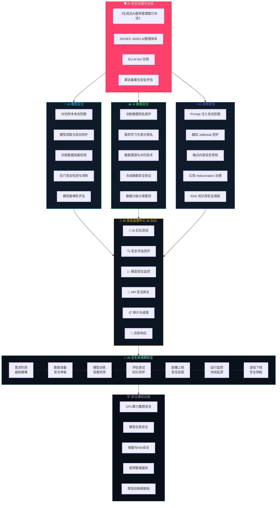

```mermaid
graph TB
    subgraph GOV["🛡️ AI 安全治理与合规"]
        direction LR
        G1["《生成式AI服务管理暂行办法》"]
        G2["ISO/IEC 42001 AI管理体系"]
        G3["EU AI Act 合规"]
        G4["算法备案与安全评估"]
    end

    subgraph MODEL["🧠 AI 模型安全"]
        M1["对抗样本攻击防御"]
        M2["模型窃取与逆向防护"]
        M3["训练数据投毒检测"]
        M4["后门攻击检测与消除"]
        M5["模型鲁棒性评估"]
    end

    subgraph DATA["📊 AI 数据安全"]
        D1["训练数据隐私保护"]
        D2["联邦学习与差分隐私"]
        D3["数据溯源与水印技术"]
        D4["合成数据安全验证"]
        D5["数据分级分类管控"]
    end

    subgraph APP["⚡ AI 应用安全"]
        A1["Prompt 注入攻击防御"]
        A2["越狱 Jailbreak 防护"]
        A3["输出内容安全审核"]
        A4["幻觉 Hallucination 治理"]
        A5["RAG 知识库安全隔离"]
    end

    subgraph SOC["🔄 AI 安全运营中心 AI-SOC"]
        direction LR
        S1["🤖 AI 红队测试"]
        S2["🔍 安全评估测评"]
        S3["📈 模型安全监控"]
        S4["🔐 API 安全网关"]
        S5["📋 审计与追溯"]
        S6["🚨 应急响应"]
    end

    subgraph LIFECYCLE["🔄 AI 全生命周期安全"]
        direction LR
        L1["需求阶段<br/>威胁建模"] --> L2["数据准备<br/>安全审查"]
        L2 --> L3["模型训练<br/>投毒检测"]
        L3 --> L4["评估测试<br/>红队测评"]
        L4 --> L5["部署上线<br/>安全加固"]
        L5 --> L6["运行监控<br/>持续监测"]
        L6 --> L7["退役下线<br/>安全销毁"]
    end

    subgraph INFRA["🏗️ 安全基础设施"]
        direction LR
        I1["GPU算力集群安全"]
        I2["模型仓库安全"]
        I3["容器与K8s安全"]
        I4["密钥管理服务"]
        I5["零信任网络架构"]
    end

    GOV --> MODEL
    GOV --> DATA
    GOV --> APP
    MODEL --> SOC
    DATA --> SOC
    APP --> SOC
    SOC --> LIFECYCLE
    LIFECYCLE --> INFRA

    style GOV fill:#ff416c,stroke:#ff4b2b,color:#fff
    style MODEL fill:#0d1b2a,stroke:#00d2ff,color:#00d2ff
    style DATA fill:#0d1b2a,stroke:#38ef7d,color:#38ef7d
    style APP fill:#0d1b2a,stroke:#647dee,color:#647dee
    style SOC fill:#0d1520,stroke:#ffd200,color:#ffd200
    style LIFECYCLE fill:#0a1018,stroke:#64ffda,color:#64ffda
    style INFRA fill:#0a0e18,stroke:#4a5568,color:#94a3b8
```
