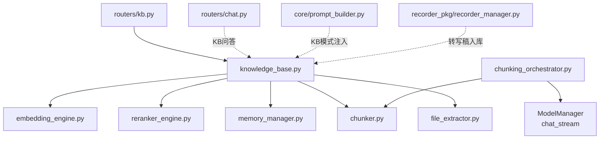
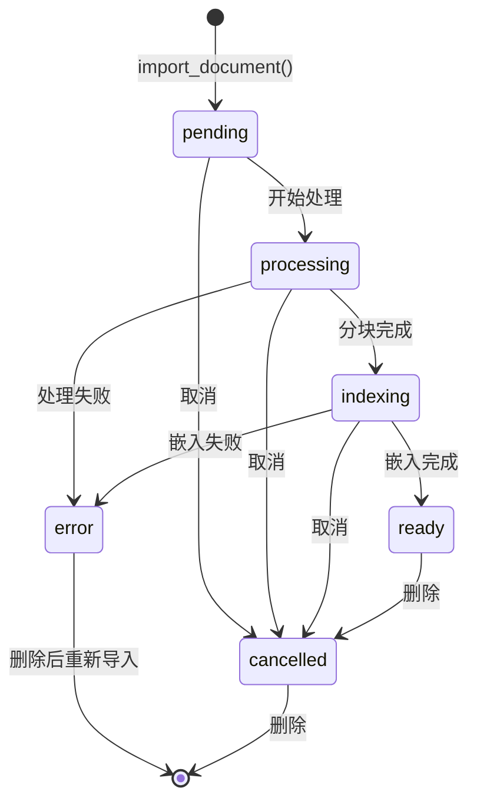
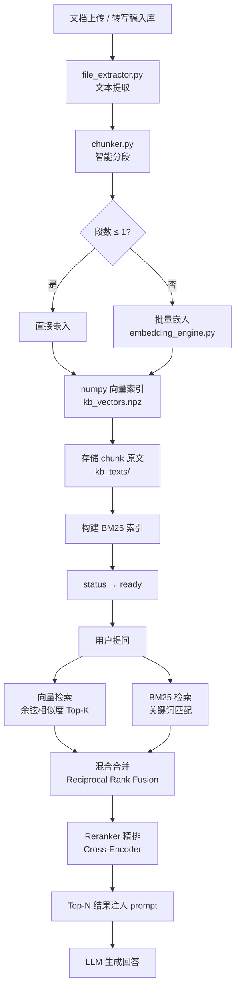
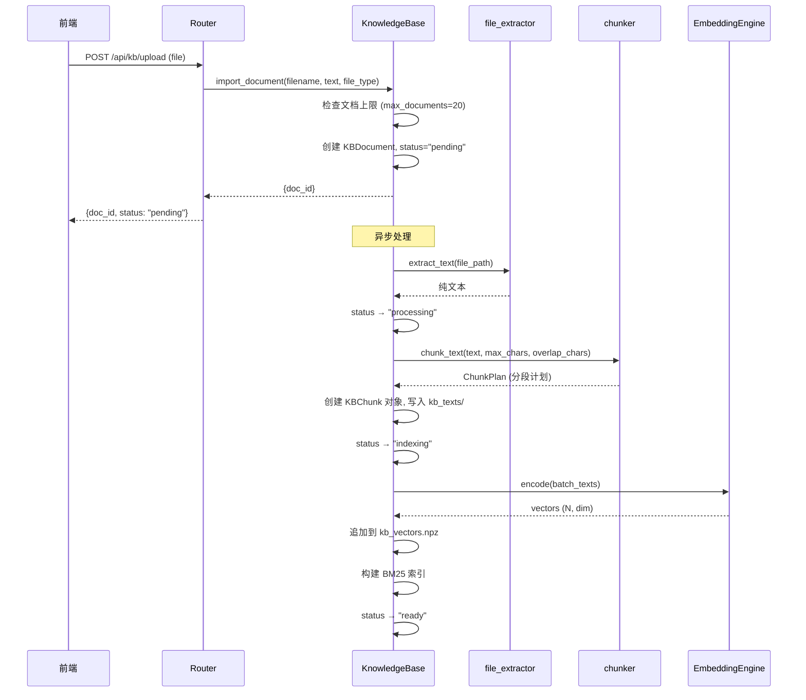
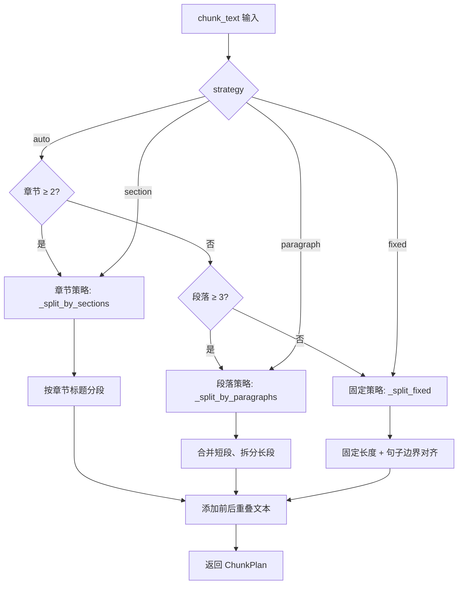
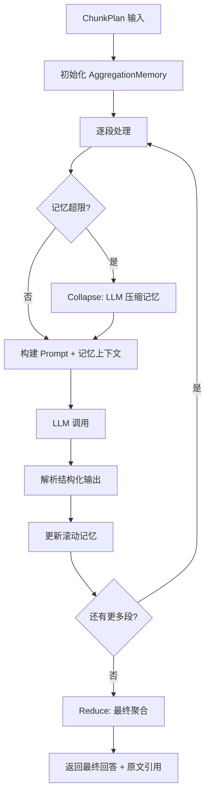

# KNOWLEDGE_PIPELINE — 文库数据流完整设计

> 桌伴 Sidemate 后端设计文档
> 模块路径：`knowledge/` 包 + `knowledge_base.py` + `file_extractor.py`
> 版本：v1.0（Patch 12 重构后）

---

## 1. 模块概览

文库系统（Knowledge Pipeline）实现从文档上传到语义检索的完整数据流，支持向量嵌入 + BM25 混合检索、Reranker 精排和内存预算管理。

### 1.1 模块职责

| 模块 | 文件 | 职责 |
|------|------|------|
| 文库核心 | `knowledge_base.py` | 文档管理、分块索引、语义检索、状态机、BM25 混合检索 |
| 嵌入引擎 | `knowledge/embedding_engine.py` | 文本向量嵌入（BGE-OV 优先） |
| 重排引擎 | `knowledge/reranker_engine.py` | Cross-Encoder 精排（Reranker） |
| 内存管理 | `knowledge/memory_manager.py` | 模型内存预算管理（注册/卸载/预算检查） |
| 文本分块 | `knowledge/chunker.py` | 智能文本分段（章节/段落/固定三种策略） |
| 分块编排 | `knowledge/chunking_orchestrator.py` | 长文本多轮处理编排（MapReduce + 滚动记忆） |
| 文件提取 | `file_extractor.py` | 多格式文件文本提取（txt/docx/xlsx/csv/pdf） |

### 1.2 依赖关系



### 1.3 存储结构

```
data/kb/
├── kb_meta.json              # 文档元信息 + chunk 索引
├── kb_vectors.npz            # 向量索引（numpy 压缩格式）
└── kb_texts/                 # chunk 原文
    ├── {chunk_id_1}.txt
    ├── {chunk_id_2}.txt
    └── ...
```

---

## 2. 核心数据结构

### 2.1 KBDocument

```python
@dataclass
class KBDocument:
    doc_id: str                 # UUID
    filename: str               # 文件名
    file_type: str              # 扩展名 (txt/docx/xlsx/csv/pdf)
    file_size: int              # 文件大小（字节）
    imported_at: str            # 导入时间（ISO）
    status: str                 # 状态（见状态机）
    chunk_count: int            # 分块数量
    total_chars: int            # 总字符数
    progress: float             # 处理进度 0.0-1.0
    source: str                 # "upload" | "transcript"
    metadata: Dict              # 扩展元数据
    error_msg: str              # 错误信息
    summary: str                # 文档前 200 字预览
```

### 2.2 KBChunk

```python
@dataclass
class KBChunk:
    chunk_id: str               # UUID
    doc_id: str                 # 所属文档
    index: int                  # 分块序号（0-based）
    text: str                   # 分块文本（从 kb_texts/ 文件加载）
    char_count: int             # 字符数
    heading: str                # 章节标题
    source_label: str           # 来源标注（如 "报告.pdf §第一章"）
```

### 2.3 向量索引

```python
vectors: np.ndarray     # shape (N, dim), dtype float32
chunk_order: List[str]  # chunk_id 有序列表，与 vectors 行对齐
```

- 存储格式：`numpy.savez_compressed` → `kb_vectors.npz`
- 向量维度：512（bge-small-zh-v1.5）或 768（bge-base-zh-v1.5）
- 所有向量经 L2 归一化

### 2.4 文档状态机



---

## 3. 关键流程

### 3.1 完整数据流



### 3.2 文档导入流程



### 3.3 检索流程

```mermaid
flowchart TD
    A[用户查询 query] --> B[向量检索]
    A --> C[BM25 检索]
    B --> D[余弦相似度计算]
    C --> E[BM25Okapi 评分]
    D --> F[Top-K 候选 (score ≥ threshold)]
    E --> G[Top-K 候选]
    F --> H[Reciprocal Rank Fusion 合并]
    G --> H
    H --> I[Reranker 精排]
    I --> J[Cross-Encoder 打分]
    J --> K[自适应融合: 向量分 × α + Reranker 分 × β]
    K --> L[最终 Top-N 结果]
```

### 3.4 文本分块策略



**分块策略选择逻辑**（auto 模式）：

| 条件 | 策略 | 说明 |
|------|------|------|
| 检测到 ≥2 个章节标题 | 章节 | 按标题分段，过长章节再细分 |
| 无章节但有 ≥3 个段落 | 段落 | 合并短段，拆分长段 |
| 无章节且段落少 | 固定 | 按字符数分段，对齐句子边界 |

### 3.5 长文本编排流程（chunking_orchestrator）



**4 种处理模式**：

| 模式 | 说明 |
|------|------|
| `extract` | 通用知识提取 |
| `qa` | 回答具体问题（反幻觉，原文引用） |
| `summarize` | 全文摘要 |
| `analyze` | 深度分析 |

---

## 4. API 接口列表

### 4.1 KnowledgeBase（knowledge_base.py）

| 方法 | 签名 | 说明 |
|------|------|------|
| `import_document` | `(filename, text, file_type, source) -> Dict` | 导入文档，返回 `{doc_id}` |
| `process_document` | `(doc_id, text) -> None` | 异步处理文档（分块+嵌入） |
| `delete_document` | `(doc_id) -> Dict` | 删除文档及其所有 chunk |
| `search` | `(query, top_k) -> List[Dict]` | 混合检索（向量+BM25+Reranker） |
| `list_documents` | `() -> List[Dict]` | 列出所有文档 |
| `get_document` | `(doc_id) -> Optional[Dict]` | 获取文档详情 |
| `init_embedder` | `() -> bool` | 初始化嵌入引擎 |
| `init_reranker` | `() -> bool` | 初始化 Reranker |

### 4.2 EmbeddingEngine（embedding_engine.py）

| 方法 | 签名 | 说明 |
|------|------|------|
| `load` | `() -> bool` | 加载嵌入模型（OV 优先，PyTorch fallback） |
| `encode` | `(texts: List[str]) -> np.ndarray` | 批量编码文本为向量 (N, dim) |
| `encode_query` | `(query: str) -> np.ndarray` | 编码查询文本 (1, dim) |
| `mode` | `@property -> str` | 当前引擎模式 `"bge-ov"` \| `"none"` |

### 4.3 RerankerEngine（reranker_engine.py）

| 方法 | 签名 | 说明 |
|------|------|------|
| `load` | `() -> bool` | 加载 Reranker 模型 |
| `rerank` | `(query, candidates, top_k, max_length) -> List[Dict]` | 精排候选结果 |
| `available` | `@property -> bool` | 模型是否已加载 |

### 4.4 MemoryManager（memory_manager.py）

| 方法 | 签名 | 说明 |
|------|------|------|
| `register` | `(module_name, mb, category)` | 注册模块占用 |
| `unregister` | `(module_name)` | 注销模块 |
| `can_allocate` | `(estimated_mb) -> bool` | 检查预算（保留 10% 安全余量） |
| `get_report` | `() -> dict` | 返回预算报告 |
| `set_budget` | `(new_mb) -> bool` | 更新预算上限 |
| `measure` | `() -> int` | psutil 进程 RSS（仅供参考） |
| `recommended_budget` | `@staticmethod -> dict` | 基于系统内存建议预算范围 |

### 4.5 chunker.py

| 函数 | 签名 | 说明 |
|------|------|------|
| `chunk_text` | `(text, max_chars, overlap_chars, max_chunks, strategy) -> ChunkPlan` | 智能文本分段 |

### 4.6 ChunkingOrchestrator（chunking_orchestrator.py）

| 方法 | 签名 | 说明 |
|------|------|------|
| `process` | `(chunk_plan, user_question, yield_callback, stop_check) -> dict` | 逐段处理主循环 |

### 4.7 file_extractor.py

| 函数 | 签名 | 说明 |
|------|------|------|
| `extract_text` | `(file_path) -> str` | 根据扩展名提取文本 |
| `smart_extract` | `(file_text, user_message, max_chars) -> str` | 按相关性截取长文本 |
| `process_uploaded_file` | `(file_path, user_message) -> dict` | 处理上传文件（三级策略） |

---

## 5. 配置参数说明

### 5.1 文库参数（kb_* 系列）

| 参数 | 默认值 | 说明 |
|------|--------|------|
| `kb_max_documents` | `20` | 最大文档数 |
| `kb_max_total_chunks` | `1000` | 最大 chunk 总数 |
| `kb_chunk_max_chars` | `2500` | 每块最大字符数 |
| `kb_chunk_overlap_chars` | `200` | 重叠字符数 |
| `kb_search_top_k` | `5` | 检索返回 Top-K |
| `kb_embedding_model` | `"BAAI/bge-small-zh-v1.5"` | 嵌入模型名称 |
| `kb_vector_dim` | `512` | 向量维度 |
| `kb_embed_batch_size` | `50` | 嵌入批处理大小 |
| `kb_async` | `True` | 异步处理开关 |

### 5.2 检索参数

| 参数 | 默认值 | 说明 |
|------|--------|------|
| `kb_ov_max_chars` | `480` | OV pipeline 输入截断字符数（>512 tokens 会崩溃） |
| `kb_vector_score_threshold` | `0.28` | 向量检索最低余弦相似度 |
| `kb_relevance_floor` | `0.25` | MMR 重排序相关性地板 |
| `kb_reranker_top_k` | `5` | Reranker 精排返回数量 |

### 5.3 内存预算参数

| 参数 | 默认值 | 说明 |
|------|--------|------|
| `memory_budget_mb` | `8000` | 内存预算上限（MB） |
| `memory_budget_min_mb` | `8192` | 预算滑块最小值 |
| `memory_budget_max_mb` | `12288` | 预算滑块最大值 |
| `reranker_idle_timeout_sec` | `300` | Reranker 空闲超时（秒） |
| `reranker_resident` | `False` | Reranker 是否常驻 |

### 5.4 分块参数

| 参数 | 默认值 | 说明 |
|------|--------|------|
| `chunk_threshold_chars` | `8000` | 超过此值触发分段 |
| `chunk_max_chars` | `2500` | 每段目标字数 |
| `chunk_overlap_chars` | `200` | 段间重叠 |
| `chunk_memory_max_chars` | `800` | 滚动记忆上限 |
| `chunk_max_chunks` | `30` | 最大分段数 |
| `chunk_per_chunk_timeout` | `30` | 每段处理超时（秒） |
| `chunk_npu_max_chars` | `1200` | NPU 下每段目标字数 |

---

## 6. 已知限制和注意事项

### 6.1 向量引擎限制

- **仅支持 OpenVINO 模式**：`EmbeddingEngine` 优先加载 OV IR，PyTorch `sentence-transformers` 作为 fallback
- **输入截断**：OV pipeline 对超长输入（>512 tokens）会崩溃，硬编码 480 字符截断
- **L2 归一化**：所有嵌入向量在 encode 后做 L2 归一化，确保余弦相似度计算正确

### 6.2 存储限制

- 向量索引使用 `numpy.savez_compressed`，全量读写，无增量更新能力
- 最大 1000 个 chunk 的硬上限，超出后新文档无法索引
- `kb_meta.json` 包含所有文档和 chunk 的元信息，大量 chunk 时文件体积增长

### 6.3 BM25 混合检索

- 使用 `rank_bm25.BM25Okapi` 实现，分词采用 2-gram 中文滑动窗口 + 英文空格分词
- BM25 索引在每次文档处理完成后全量重建，不支持增量更新
- 混合合并使用 Reciprocal Rank Fusion (RRF) 算法

### 6.4 Reranker 生命周期

- Reranker 延迟加载：首次检索时触发 `_ensure_reranker()`
- 空闲超时自动卸载（默认 300 秒），受 30 秒冷却期保护
- 常驻模式（`reranker_resident=True`）跳过自动卸载
- 线程安全：通过 `_reranker_lock` 保护加载/卸载操作

### 6.5 内存预算管理

- `MemoryManager` 基于"可卸载模块"追踪，不依赖进程总 RSS
- 预算检查公式：`(已注册模块总和 + 新请求) ≤ 预算 × 90%`
- 模块分类：`llm` / `kb` / `other`，用于区分不同类型模块
- `recommended_budget()` 根据系统物理内存动态建议：32G→12G, 16G→10G, <16G→8G

### 6.6 文件提取

- 支持格式：txt/md、docx（python-docx）、xlsx（openpyxl）、csv、pdf（PyMuPDF/pdfplumber）
- 三级策略：短文件直接注入（≤1500字）、中等文件智能截取（≤5000字）、超长文件引导文库
- 智能截取基于 2-gram 关键词匹配排序段落

### 6.7 长文本编排

- NPU 模式自动降级段大小到 1200 字（vs CPU 2500 字）
- 滚动记忆超限时通过 LLM 压缩（Collapse），保留最近引用和部分回答
- `max_chunks = 30` 安全上限，防止超大文档产生过多分段
- 结构化输出解析依赖正则匹配 `【section】` 格式，模型输出不规范时可能丢失信息
