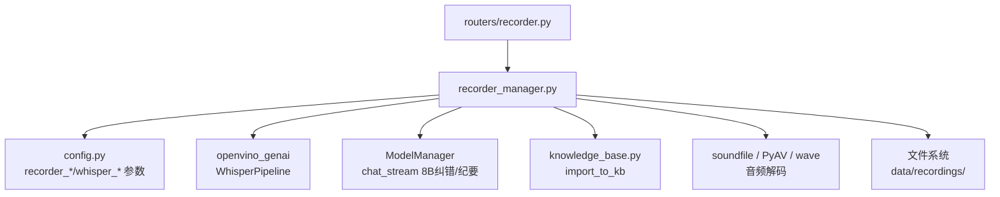
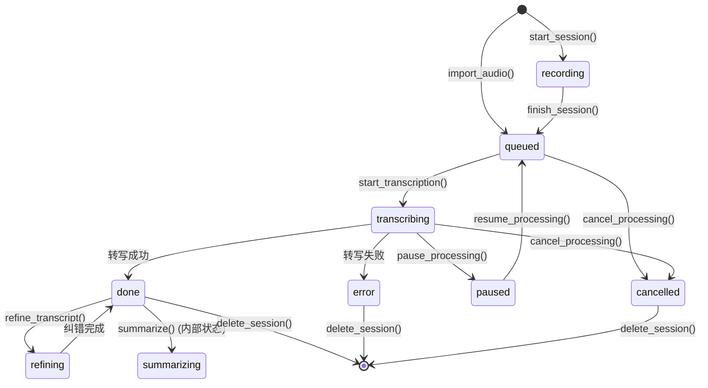
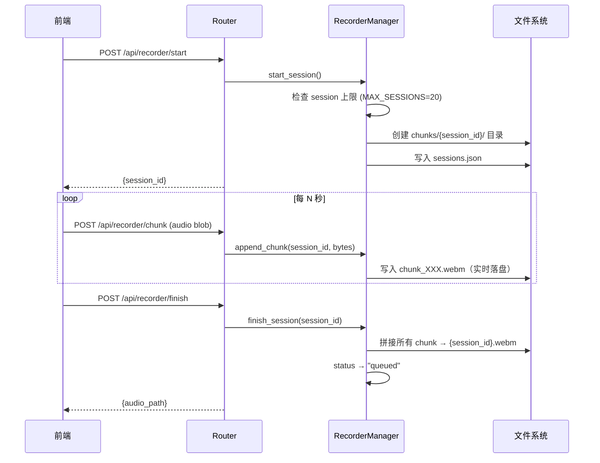
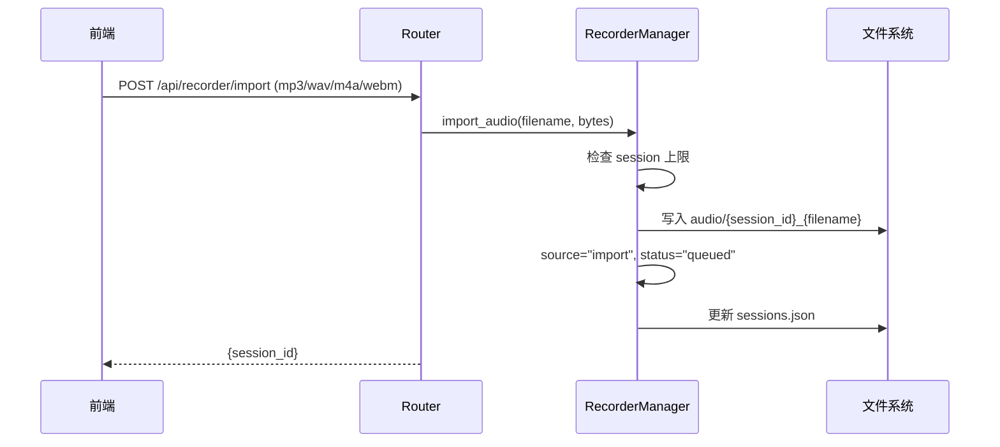
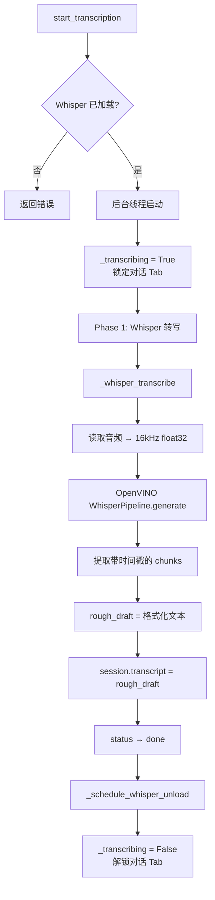
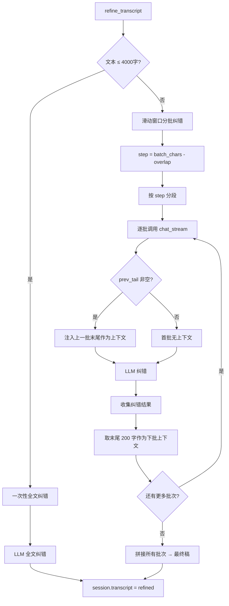
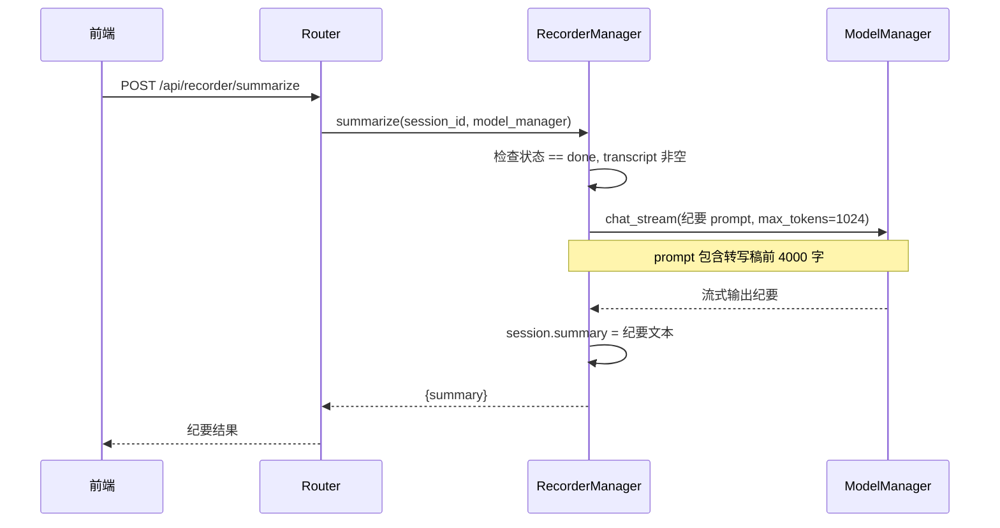
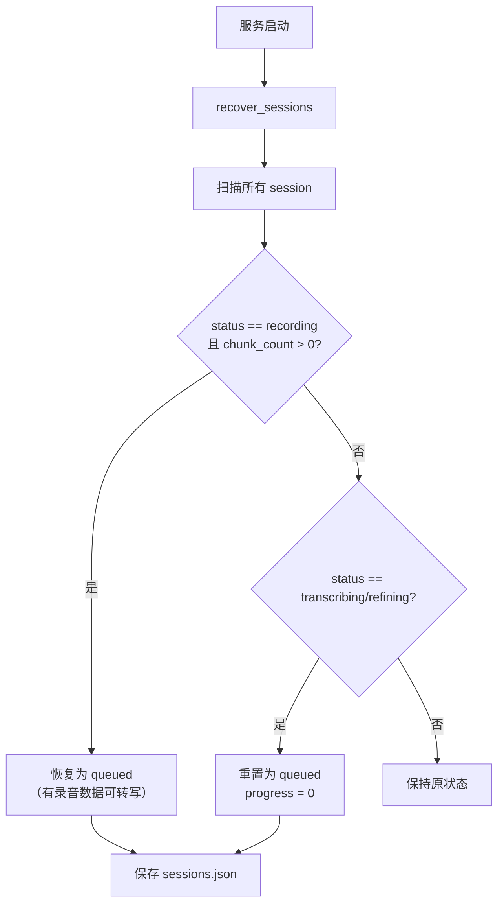

# RECORDER_DESIGN — 录音纪要系统完整设计

> 桌伴 Sidemate 后端设计文档
> 模块路径：`recorder_pkg/recorder_manager.py`
> 版本：v1.0（Patch 12 重构后）

---

## 1. 模块概览

录音纪要系统提供从录音到 AI 纪要的完整闭环，包括实时录音、音频导入、Whisper 转写、8B 纠错润色、AI 会议纪要生成和转写稿入库。

### 1.1 模块职责

| 模块 | 文件 | 职责 |
|------|------|------|
| 录音管理器 | `recorder_pkg/recorder_manager.py` | 录音会话生命周期管理、Whisper 引擎调度、LLM 纠错/纪要、崩溃恢复 |

### 1.2 依赖关系



### 1.3 存储结构

```
data/recordings/
├── sessions.json              # 录音会话元信息（全局状态）
├── chunks/                    # 实时录音块（临时）
│   └── {session_id}/
│       ├── chunk_001.webm
│       ├── chunk_002.webm
│       └── ...
└── audio/                     # 完整音频文件
    └── {session_id}.webm
```

---

## 2. 核心数据结构

### 2.1 RecordingSession

```python
@dataclass
class RecordingSession:
    session_id: str                    # UUID 前 8 位
    started_at: str                    # ISO 时间戳
    finished_at: Optional[str]         # 完成时间
    duration_seconds: float            # 时长（秒）
    chunk_count: int                   # 录音块数量
    source: str                        # "recording" | "import"
    audio_path: Optional[str]          # 音频文件路径
    import_filename: Optional[str]     # 导入文件的原始文件名
    realtime_text: str                 # 实时转写预览文本
    rough_draft: Optional[str]         # Phase 1: Whisper 粗稿
    transcript: Optional[str]          # Phase 2: 8B 纠错后最终稿
    summary: Optional[str]             # AI 会议纪要
    status: str                        # 会话状态（见状态机）
    progress: float                    # 总进度 0.0-1.0
    phase: Optional[str]               # 当前阶段: "realtime"|"whisper"|"refine"|None
    whisper_progress: int              # Whisper 转写进度 0-100
    refine_progress: int               # 8B 纠错进度 0-100
    disk_size_bytes: int               # 音频文件占用空间
    error_msg: str                     # 错误信息
    kb_doc_id: Optional[str]           # 入库后的文库文档 ID
    refined: bool                      # 是否经过 8B 纠错润色
    segments: Optional[List[Dict]]     # 转写时间戳段落
```

### 2.2 会话状态机



**状态说明**：

| 状态 | 含义 |
|------|------|
| `recording` | 正在录音中 |
| `queued` | 排队等待转写 |
| `transcribing` | Whisper 正在转写 |
| `refining` | 8B 正在纠错润色 |
| `paused` | 处理已暂停 |
| `done` | 转写完成（可查看/纠错/纪要/入库） |
| `cancelled` | 已取消 |
| `error` | 处理出错 |

---

## 3. 关键流程

### 3.1 实时录音流程



### 3.2 音频导入流程



### 3.3 两阶段转写流程



### 3.4 8B 纠错润色流程（滑动窗口）



### 3.5 AI 会议纪要生成流程



### 3.6 崩溃恢复流程



---

## 4. API 接口列表

### 4.1 录音会话管理

| 方法 | 签名 | 说明 |
|------|------|------|
| `start_session` | `() -> Dict` | 创建录音会话，返回 `{session_id}` |
| `append_chunk` | `(session_id, audio_bytes) -> Dict` | 追加音频块（实时落盘） |
| `finish_session` | `(session_id) -> Dict` | 结束录音，拼接音频块 |
| `import_audio` | `(filename, audio_bytes) -> Dict` | 导入已有音频文件 |
| `delete_session` | `(session_id) -> Dict` | 删除录音（文件+数据），返回释放空间 |

### 4.2 查询接口

| 方法 | 签名 | 说明 |
|------|------|------|
| `get_session` | `(session_id) -> Optional[Dict]` | 获取单个会话详情 |
| `get_sessions` | `() -> List[Dict]` | 获取所有会话（按时间倒序） |
| `get_transcript` | `(session_id) -> Dict` | 获取最终转写稿 |
| `get_rough_draft` | `(session_id) -> Dict` | 获取 Whisper 原始粗稿 |
| `get_storage_usage` | `() -> Dict` | 录音空间占用统计 |
| `is_transcribing` | `() -> bool` | 当前是否正在转写（对话 Tab 锁定判断） |

### 4.3 转写与处理

| 方法 | 签名 | 说明 |
|------|------|------|
| `start_transcription` | `(session_id, model_manager) -> Dict` | 启动 Whisper 转写（后台线程） |
| `refine_transcript` | `(session_id, model_manager) -> Dict` | 手动触发 8B 纠错润色 |
| `summarize` | `(session_id, model_manager) -> Dict` | 生成 AI 会议纪要 |
| `update_transcript` | `(session_id, text) -> Dict` | 用户手动编辑转写稿 |
| `live_transcribe` | `(audio_blob) -> Dict` | 实时转写（前端 VAD 音频段） |

### 4.4 队列控制

| 方法 | 签名 | 说明 |
|------|------|------|
| `pause_processing` | `(session_id) -> Dict` | 暂停当前处理 |
| `resume_processing` | `(session_id, model_manager) -> Dict` | 恢复/重试 |
| `cancel_processing` | `(session_id) -> Dict` | 取消处理 |

### 4.5 文库导入

| 方法 | 签名 | 说明 |
|------|------|------|
| `import_to_kb` | `(session_id, kb_manager) -> Dict` | 转写稿导入文库（异步分块+嵌入） |

### 4.6 Whisper 管理

| 方法 | 签名 | 说明 |
|------|------|------|
| `get_whisper_status` | `() -> Dict` | 检查 Whisper 扩展状态 |
| `load_whisper` | `() -> Dict` | 加载 Whisper 模型（OpenVINO） |
| `unload_whisper` | `() -> Dict` | 释放 Whisper 模型内存 |

---

## 5. 配置参数说明

### 5.1 录音参数

| 参数 | 默认值 | 说明 |
|------|--------|------|
| `recorder_chunk_seconds` | `10` | 录音分块秒数 |
| `recorder_max_duration` | `3600` | 最长录音时长（秒） |
| `recorder_sample_rate` | `16000` | 采样率 |
| `recorder_format` | `"webm/opus"` | 音频格式 |
| `recorder_max_file_size` | `52428800` | 导入音频最大 50MB |
| `recorder_max_sessions` | `20` | 录音 session 上限 |
| `recorder_keep_audio` | `True` | 默认长期保留音频 |
| `recorder_crash_recovery` | `True` | 崩溃恢复开关 |

### 5.2 Whisper 参数

| 参数 | 默认值 | 说明 |
|------|--------|------|
| `whisper_model` | `"small"` | Whisper 模型大小 |
| `whisper_language` | `"zh"` | 默认转写语言 |
| `whisper_device` | `"cpu"` | 固定 CPU 推理（不抢 NPU） |
| `whisper_keep_loaded` | `True` | 模型常驻内存 |
| `whisper_enable_refine` | `True` | 启用 8B 辅助纠错 |
| `whisper_realtime_chunk_sec` | `10` | 实时转写每 chunk 秒数 |
| `whisper_lock_on_transcribe` | `True` | 转写期间锁定对话 Tab |
| `whisper_refine_batch_chars` | `800` | 8B 纠错批次大小 |

### 5.3 内存管理参数

| 参数 | 默认值 | 说明 |
|------|--------|------|
| `recorder_resident` | `False` | Whisper 是否常驻（`True` 不自动卸载） |
| `whisper_idle_timeout_sec` | `300` | Whisper 空闲超时自动卸载（秒） |

---

## 6. 已知限制和注意事项

### 6.1 并发限制

- **同一时间只能有一个转写任务**：`_transcribing` 标志保证互斥，新转写请求在已有任务进行中会返回错误
- **录音块写入无锁**：每个 session 有独立的 chunk 目录，不同 session 可同时录音

### 6.2 音频格式兼容性

- 音频解码按优先级尝试：`soundfile` → `PyAV` → `wave`
- WebM/Opus 格式依赖 PyAV（FFmpeg Python 绑定）
- WAV 格式最为兼容，所有路径均支持

### 6.3 8B 纠错的限制

- 滑动窗口批次间通过 `prev_tail`（200 字）传递上下文，跨批次长距离依赖可能丢失
- 纠错使用 `_priority="low"`，不阻塞用户正常对话
- 纠错失败时静默回退到原始粗稿，不报错

### 6.4 Whisper 模型管理

- 仅支持 OpenVINO 模式（`_whisper_mode = "ov"`），不支持 PyTorch fallback
- 空闲卸载有 30 秒冷却期，防止频繁加载/卸载
- 模型目录固定在 `recorder_pkg/extensions/whisper/model-ov/`

### 6.5 崩溃恢复

- 录音块实时落盘（`append_chunk`），即使进程崩溃音频数据不丢失
- 转写中的 session 恢复后重置为 `queued`，需手动重新触发转写
- `MAX_SESSIONS = 20` 硬编码上限，不读取 config

### 6.6 纪要生成

- 纪要 prompt 截断到 4000 字，超长录音可能丢失尾部内容
- 纪要生成使用 `_priority="high"`，因为是用户主动请求
- 纪要结果直接覆盖 `session.summary`，无版本管理

### 6.7 前端锁定

- `whisper_lock_on_transcribe = True` 时，转写期间前端对话 Tab 被锁定
- 判断依据：`is_transcribing()` 返回 `True`
- 锁定粒度为全局（非 session 级），转写期间不能进行任何对话
