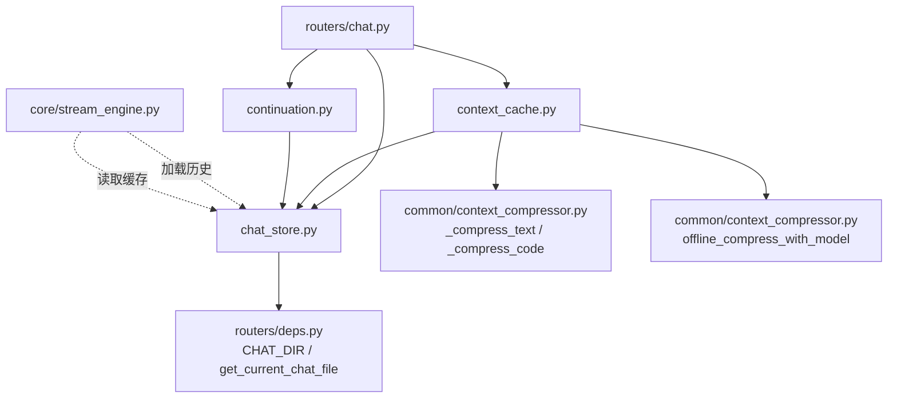
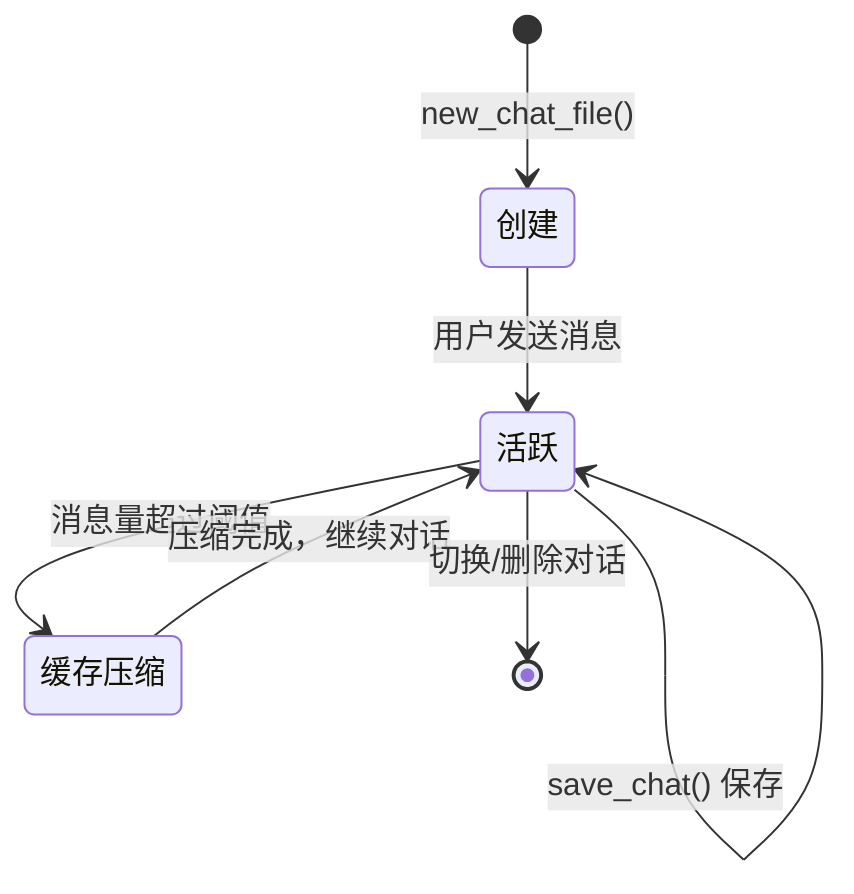
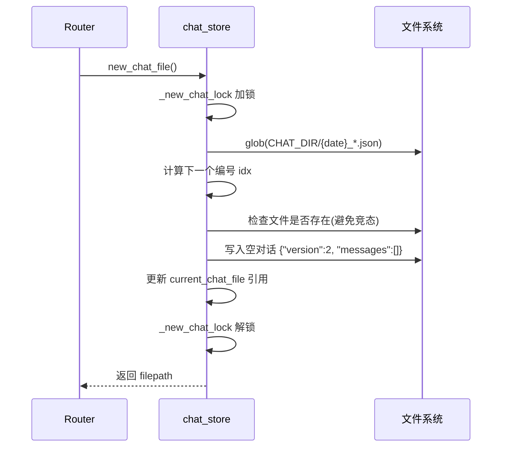
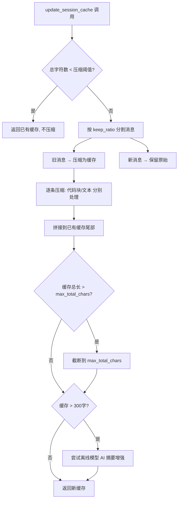
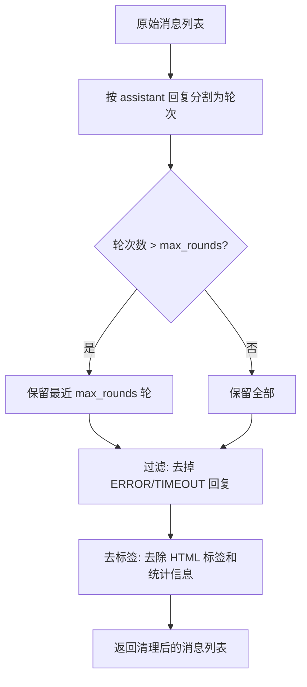

# SESSION_MANAGEMENT — 对话历史与上下文缓存设计

> 桌伴 Sidemate 后端设计文档
> 模块路径：`session/` 包
> 版本：v2.0（Patch 12 重构后）

---

## 1. 模块概览

`session/` 包负责对话持久化、续接检测和上下文缓存压缩，是 StreamEngine 和 Router 之间的对话管理层。

### 1.1 模块职责

| 模块 | 文件 | 职责 |
|------|------|------|
| 对话文件管理 | `chat_store.py` | 对话 JSON 文件的创建、切换、列出、删除，线程安全写操作 |
| 对话续接 | `continuation.py` | 获取当天最新对话、检测输出截断 |
| 上下文缓存 | `context_cache.py` | Session 级 Layer 2 记忆——压缩旧消息、清理历史给模型使用 |

### 1.2 依赖关系



### 1.3 与其他模块的交互

- **routers/chat.py**：调用 `new_chat_file()` 创建对话，`save_chat()` 保存消息，`update_session_cache()` 压缩历史
- **core/stream_engine.py**：通过 `load_chat()` 加载历史消息，`load_chat_cache()` 读取上下文缓存
- **core/prompt_builder.py**：将 `context_cache` 文本注入到 system prompt 中

---

## 2. 核心数据结构

### 2.1 对话文件格式（JSON v2）

```json
{
  "version": 2,
  "context_cache": "用户: 今天天气怎么样 | 助手: 今天晴天...",
  "updated_at": "2025-05-29 14:30:00",
  "messages": [
    {"role": "user", "content": "..."},
    {"role": "assistant", "content": "..."}
  ]
}
```

**字段说明**：

| 字段 | 类型 | 说明 |
|------|------|------|
| `version` | int | 格式版本号，当前固定为 2 |
| `context_cache` | string \| null | Session 级压缩缓存（Layer 2 记忆），可能为 null |
| `updated_at` | string | 最后更新时间（`YYYY-MM-DD HH:MM:SS`） |
| `messages` | array | 消息列表，每条包含 `role` 和 `content` |

**兼容性**：`load_chat()` 同时支持 v1（纯数组格式）和 v2（对象格式）。

### 2.2 文件命名规范

```
data/chats/{YYYY-MM-DD}_{NNN}.json
```

- `YYYY-MM-DD`：创建日期
- `NNN`：当天递增编号（三位数字，从 001 开始）
- 示例：`2025-05-29_001.json`

### 2.3 消息格式

```python
{
    "role": "user" | "assistant",   # 消息角色
    "content": str                   # 消息内容（纯文本）
}
```

---

## 3. 关键流程

### 3.1 对话生命周期



### 3.2 新建对话流程



### 3.3 上下文缓存压缩流程

这是 `context_cache.py` 的核心逻辑，在对话消息总量超过阈值时触发。



### 3.4 历史清理流程（clean_history_for_model）



---

## 4. API 接口列表

### 4.1 chat_store.py

| 函数 | 签名 | 说明 |
|------|------|------|
| `safe_chat_name` | `(chat_name: str) -> str \| None` | 对话名称安全校验，防止路径遍历和 null byte 注入 |
| `today_str` | `() -> str` | 获取当天日期字符串 `YYYY-MM-DD` |
| `new_chat_file` | `() -> str` | 创建新对话文件（线程安全），返回文件路径 |
| `save_chat` | `(filepath, messages, context_cache=None)` | 保存对话到文件（线程安全），保留已有 context_cache |
| `load_chat` | `(filepath) -> list` | 加载对话消息列表，兼容 v1/v2 格式 |
| `load_chat_cache` | `(filepath) -> str \| None` | 加载 context_cache 字段 |
| `list_chats` | `() -> list[dict]` | 列出所有对话，按修改时间倒序 |

### 4.2 continuation.py

| 函数 | 签名 | 说明 |
|------|------|------|
| `get_latest_chat` | `() -> str \| None` | 获取当天最新的对话文件路径 |
| `is_output_incomplete` | `(text: str) -> bool` | 检测模型输出是否被截断（代码块未闭合、括号不平衡等） |

### 4.3 context_cache.py

| 函数 | 签名 | 说明 |
|------|------|------|
| `clean_history_for_model` | `(messages, max_rounds=None) -> list` | 清理历史消息给模型使用，限制轮数、过滤错误、去标签 |
| `clean_think_content` | `(text, max_len=2000) -> str` | 清理思考内容中的重复段落 |
| `update_session_cache` | `(chat_file, messages, model_name=None) -> tuple[str, bool]` | Session 缓存压缩，返回 `(cache_text, was_updated)` |

---

## 5. 配置参数说明

### 5.1 会话缓存参数（config.py）

| 参数 | 默认值 | 说明 |
|------|--------|------|
| `cache_keep_ratio` | `0.4` | 压缩时保留最近 40% 的原始消息不压缩 |
| `cache_entry_max_chars` | `80` | 每条缓存条目的最大字符数（单条消息压缩后截断） |
| `cache_max_total_chars` | `500` | 缓存总字符数上限（超出后从头部截断） |
| `cache_threshold_ratio` | `0.8` | 触发压缩的阈值比例（消息总量占 `max_history_chars` 的 80%） |

### 5.2 存储路径

| 路径 | 来源 | 说明 |
|------|------|------|
| `data/chats/` | `routers/deps.CHAT_DIR` | 对话 JSON 文件存储目录 |

---

## 6. 已知限制和注意事项

### 6.1 并发安全

- `new_chat_file()` 和 `save_chat()` 使用独立的 `threading.Lock` 保护，两者互不阻塞
- `new_chat_file()` 内部使用 `while os.path.exists()` 循环处理极端竞态场景

### 6.2 缓存压缩的限制

- **离线模型压缩依赖模型加载状态**：如果 8B 模型未加载，`offline_compress_with_model` 会静默失败，退回文本压缩
- **缓存不保证跨版本兼容**：`context_cache` 是自由文本格式，不同版本可能产生不同压缩结果
- **截断精度**：`cache_max_total_chars` 截断时会在最近的换行符处切分，避免截断到半行

### 6.3 续接检测的局限

- `is_output_incomplete()` 基于启发式规则（代码块未闭合、括号不平衡、中文截断标记），无法覆盖所有截断场景
- 检测阈值为 30 字符以下不检测，避免误判

### 6.4 存储空间

- 对话文件无自动清理机制，需配合 `sandbox_cleanup` 策略（`on_start`/`24h`/`7d`/`never`）
- `list_chats()` 读取每个文件的元信息，大量对话文件时可能产生 IO 延迟

### 6.5 v1/v2 格式兼容

- `load_chat()` 兼容 v1（纯数组）和 v2（对象包裹），但 `save_chat()` 始终以 v2 格式写入
- v1 格式对话在首次保存后自动升级为 v2
