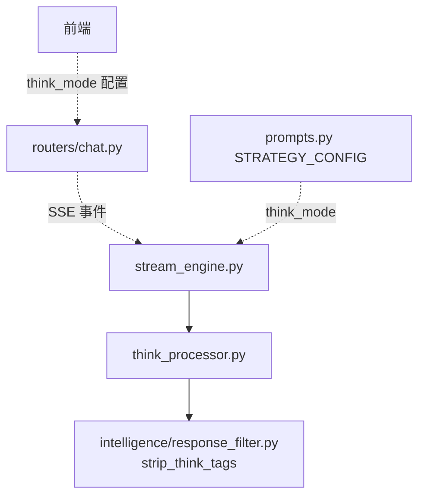
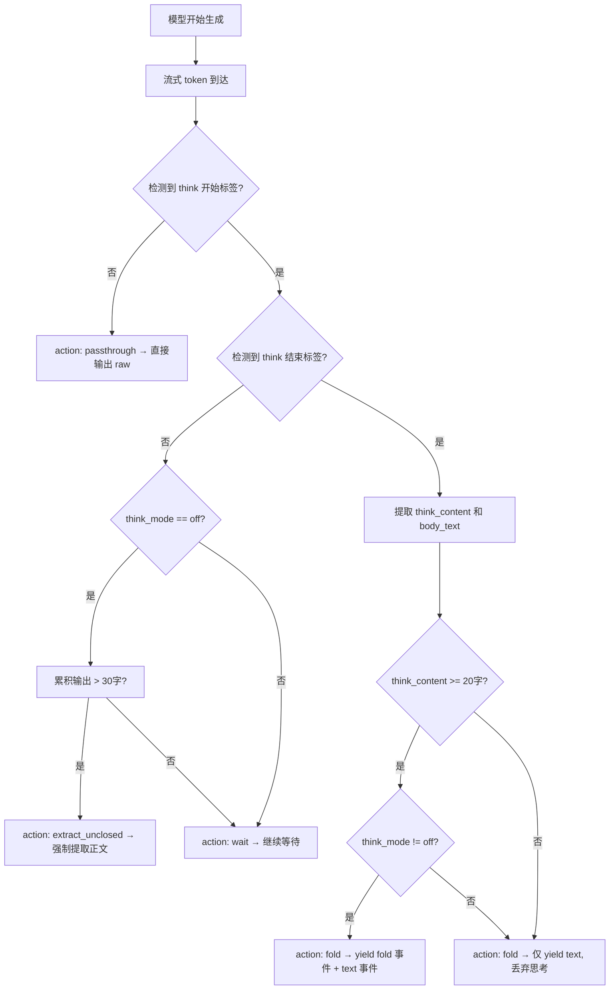
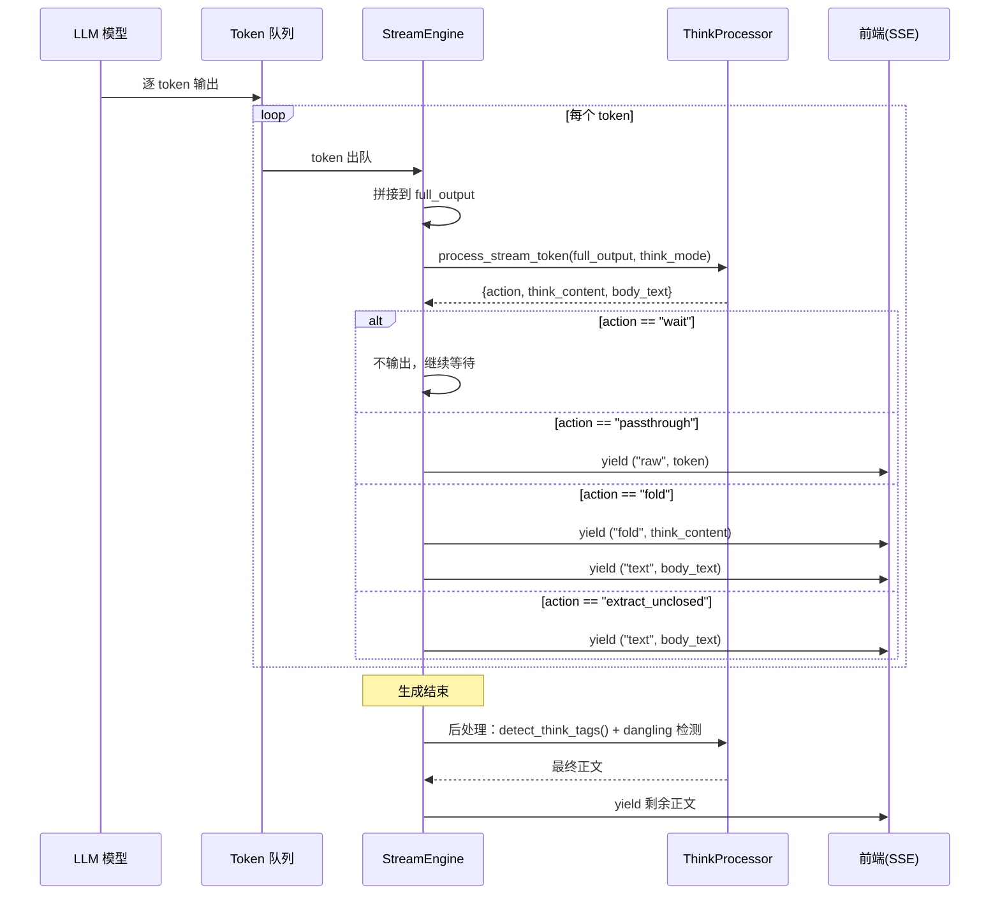
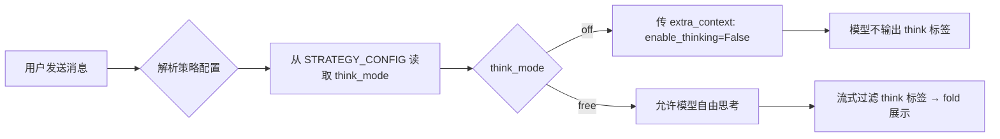
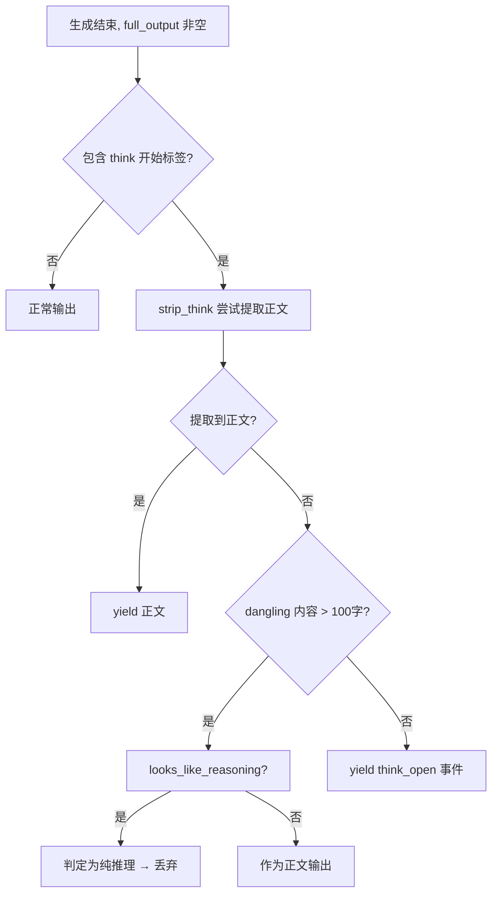

# THINK_PIPELINE — 思考过程完整设计

> 桌伴 Sidemate 后端设计文档
> 模块路径：`core/think_processor.py` + `core/stream_engine.py`
> 版本：v3.0（Patch 12 统一重构后）

---

## 1. 模块概览

Think（思考过程）管线负责处理 LLM 输出中的思维链标签，实现思考内容与正文的分离、折叠展示和模式控制。

### 1.1 模块职责

| 模块 | 文件 | 职责 |
|------|------|------|
| Think 处理器 | `core/think_processor.py` | 统一的思维链标签检测、剥离、判断、流式处理 |
| 流式引擎 | `core/stream_engine.py` | 集成 ThinkProcessor 的流式生成循环，含标签边界实时检测和折叠输出 |

### 1.2 依赖关系



### 1.3 设计目标

1. **透明处理**：无论模型是否输出 think 标签，前端始终收到干净的正文
2. **模式可控**：通过 `think_mode` 配置，支持完全禁用、自由思考两种模式
3. **流式实时**：在流式生成过程中实时检测标签边界，做到零延迟折叠
4. **鲁棒兜底**：处理未闭合标签、空 think、纯推理内容等边界情况

---

## 2. 核心数据结构

### 2.1 Think 标签标记

```python
# 支持的标签对（宽松匹配）
_THINK_TAG_MARKERS = [
    ("<think",     "</think"),       # 标准 / Qwen3-8B
    ("<thinking>", "</thinking>"),
    ("<reason>",   "</reason>"),
    ("<reasoning>","</reasoning>"),
    ("<thought>",  "</thought>"),
]
```

设计选择：使用字符串搜索而非正则匹配，提高鲁棒性——兼容标签内含属性的变体（如 `<think >`）。

### 2.2 流式处理结果（process_stream_token 返回值）

```python
{
    "action": str,        # "passthrough" | "fold" | "extract_unclosed" | "wait"
    "think_content": str, # 思考内容（fold 时有值）
    "body_text": str,     # 正文内容（fold/extract 时有值）
    "think_len": int      # 思考内容长度
}
```

**Action 语义**：

| Action | 含义 | 场景 |
|--------|------|------|
| `passthrough` | 无 think 标签，直接输出 | 普通对话输出 |
| `wait` | 找到开始标签但未闭合，等待更多 token | 流式生成中间态 |
| `fold` | 找到完整标签对，返回思考内容 + 正文 | 正常 think 完成 |
| `extract_unclosed` | off 模式下模型"偷偷思考"，强制提取正文 | off 模式异常处理 |

### 2.3 SSE 事件类型

| Phase | Content | 说明 |
|-------|---------|------|
| `"think"` | 思考片段文本 | 前端以折叠方式展示（保留，但当前版本使用 fold） |
| `"fold"` | 完整思考内容 | 思考完成，前端渲染为可折叠区域 |
| `"text"` | 正文文本 | 正文 token 流 |
| `"think_open"` | 输出长度（int） | think 标签未关闭的异常通知 |
| `"raw"` | 原始文本 | 无 think 标签时的直接输出 |

---

## 3. 关键流程

### 3.1 Think 管线整体流程



### 3.2 StreamEngine 中的 Think 处理流程



### 3.3 Think 模式控制



**模式说明**：

| 模式 | 行为 | 使用场景 |
|------|------|----------|
| `"off"` | 传入 `enable_thinking=False` 禁用模型思考；若模型仍输出 think 标签，则强制剥离 | 日常对话、KB 问答（节省 token） |
| `"free"` | 允许模型思考，流式过滤 think 标签后展示为可折叠区域 | 复杂推理、数学计算 |

**KB 模式强制 `off`**：文库问答不需要思考过程，强制禁用以节省 token 预算。

### 3.4 空回复保护（Dangling Think）



**核心逻辑**：

1. **detect_think_tags**：先用标准方法检测完整标签对
2. **启发式分离**：对未闭合内容，按行检测 `looks_like_reasoning()`，分离推理部分和正文部分
3. **body 二次验证**：分离出的"正文"如果也像推理内容，则合并回推理部分
4. **纯推理丢弃**：如果分离出的推理内容过长（>100 字）且无正文，直接丢弃

---

## 4. API 接口列表

### 4.1 ThinkProcessor 类

| 方法 | 签名 | 说明 |
|------|------|------|
| `strip_think` | `(text: str) -> str` | 过滤所有标准思维链标签，返回纯正文 |
| `detect_think_tags` | `(text: str) -> tuple[bool, str, str]` | 检测标签对，返回 `(has_think, think_content, after_text)` |
| `looks_like_reasoning` | `(text: str) -> bool` | 判断内容是否为推理过程（非正文） |
| `process_stream_token` | `(full_output: str, think_mode: str) -> dict` | 流式 token 的 think 标签实时处理（统一入口） |
| `extract_body_from_raw` | `(raw: str) -> tuple[str, str]` | 从原始累积文本提取正文，返回 `(body, method)` |
| `tag_markers` | `@property -> list` | 标签对标记列表 |
| `end_markers` | `@property -> list` | 结束标记列表 |

### 4.2 StreamEngine.run() 输出 Phase

| Phase | Content 类型 | 说明 |
|-------|-------------|------|
| `"task_type"` | `(task_type, confidence)` | 任务分类结果 |
| `"fold"` | `str` | 思考内容完成，前端渲染为折叠区域 |
| `"text"` | `str` | 正文 token 流 |
| `"raw"` | `str` | 原始输出（无 think 标签时） |
| `"mode_hint"` | `str` | 模式切换建议 |
| `"reload"` | `str` | 模型正在重载 |
| `"think_open"` | `int` | think 标签未关闭（异常通知） |

---

## 5. 配置参数说明

### 5.1 Think 模式来源

Think 模式不直接由 config.py 控制，而是通过策略系统间接配置：

```python
# prompts.py 中的 STRATEGY_CONFIG
STRATEGY_CONFIG = {
    "code": {"think_mode": "free", ...},
    "math": {"think_mode": "free", ...},
    "text": {"think_mode": "off", ...},
    ...
}
```

- 策略类型由 `intelligence/task_classifier.py` 的 `resolve_strategy()` 根据用户消息动态确定
- KB 模式（`kb_mode=True`）强制 `think_mode = "off"`

### 5.2 相关模型参数

| 参数 | 来源 | 说明 |
|------|------|------|
| `enable_thinking` | `extra_context` | 传给模型的思考开关，`False` 时模型不输出 think 标签 |
| `max_tokens` | StreamEngine | `think_mode == "free"` 时自动提升到至少 8192 |

---

## 6. 已知限制和注意事项

### 6.1 标签兼容性

- 支持五种标签变体（think/thinking/reason/reasoning/thought），覆盖主流模型
- 使用宽松匹配（不要求 `>` 闭合），兼容 `<think ... >` 等带属性的变体
- 不支持嵌套 think 标签

### 6.2 流式处理的延迟

- `action == "wait"` 状态下，token 被缓存但不输出，用户感知为"暂停"
- 如果模型长时间不闭合 think 标签，`extract_unclosed` 仅在累积 30 字后触发
- 20 字质量检查（`_uniq_ratio < 0.30`）可能在特殊情况下误触发

### 6.3 推理判断的局限

- `looks_like_reasoning()` 基于关键词信号计数，可能误判包含多个推理关键词的正文内容
- 中文语境优化，对英文推理内容的识别率较低
- 结构性检测（无结论标记 + 不确定开头）是补充信号，仍有边缘情况

### 6.4 StreamEngine 中的遗留逻辑

- StreamEngine 中保留了部分 inline think 处理代码（dangling think 后处理），与 ThinkProcessor 存在功能重叠
- 前缀累积检测（`_accum_token_history`）独立于 ThinkProcessor，用于检测模型输出异常

### 6.5 空 think 处理

- think 内容 < 20 字时不 fold，直接丢弃 think 内容，仅输出正文
- 这避免了模型输出 `<think />` 空标签时产生空折叠区域
