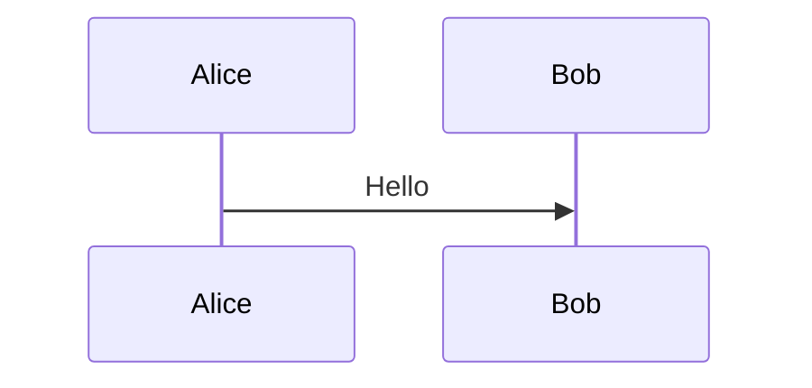
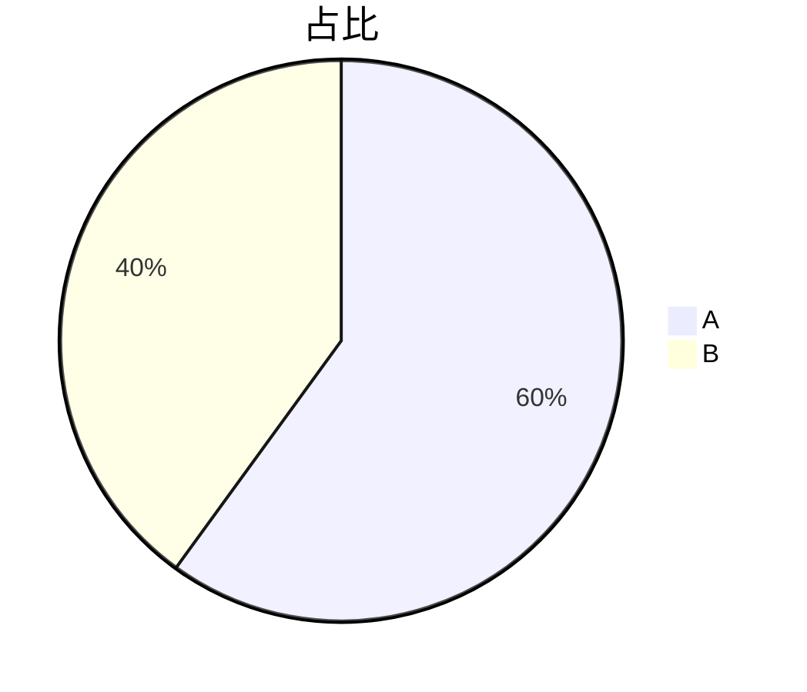

# 可视化报告使用指南

> ✅ **本文档随 0.9.6 首发重发**（HTML 可视化报告是 0.9.6 重要新功能）。
>
> 版本：v0.9.6 | 适用人群：所有需要"图文报告"输出场景的用户

---

## 1. 什么是可视化报告

可视化报告是 Sidemate 在 0.9.6 新增的产物格式：**单文件 HTML 报告**，自带样式和图表渲染引擎，浏览器打开即可看到完整图文排版与可交互图表。

**对比传统 Word/PPT 文档**：

| 维度 | Word 文档 | 可视化报告（HTML） |
|------|----------|------------------|
| 文件大小 | 几十 KB | ~3.4 MB（含 mermaid.js 引擎） |
| 打开方式 | Word/WPS | 任意浏览器（Chrome/Edge/Safari） |
| 图表支持 | 静态图片 | **mermaid 流程图/思维导图/时序图**（可缩放拖拽） |
| 排版样式 | 默认文档样式 | 暖灰背景 + 衬线标题 + 卡片组件库 |
| 离线查看 | ✅ | ✅（单文件自包含） |
| 适合场景 | 纯文字报告 | **多步骤/对比/架构类需要图说明的内容** |

---

## 2. 怎么生成可视化报告

### 2.1 对话里直接说

进入「文档模式」（Doc Mode）或 Chat → Action=doc 模式，对话框输入：

> 「帮我整理一份**可视化报告**：XXX 主题，包含 mermaid 流程图」

AI 会自动：
1. 调 `write_workspace` 写入 `.html` 文件
2. 调 `set_doc_status` 生成最终产物
3. 出现 **「下载 HTML 报告 xxx.html」** 按钮

### 2.2 工作区里手动触发

如果你已经有 `.md` 笔记想让 AI 做成报告：

1. 工作区上传/写入 `.md` 文件
2. 对话里说：「把 `xxx.md` 做成可视化报告」
3. AI 读取文件 → 生成 HTML → 下载

---

## 3. 报告里能用什么组件

LLM 写 HTML 时直接用这些 class 即可获得专业排版（**无需自己写 CSS**）：

### 3.1 基础结构

```html
<div class="lead">
<strong>核心结论：</strong>一段最重要的导读。
</div>

<h1>主标题</h1>
<h2>章节标题</h2>
<h3>小节标题</h3>
<p>段落文字</p>
```

### 3.2 卡片 / 网格

```html
<div class="grid-3">
  <div class="card">
    <div class="card-title">标题</div>
    <p>内容</p>
  </div>
  <div class="card">...</div>
  <div class="card">...</div>
</div>
```

`grid-2` / `grid-3` 自动响应式：手机宽度会自动变成单列。

### 3.3 提示框

```html
<div class="callout">普通提示</div>
<div class="callout warn">警告</div>
<div class="callout danger">危险</div>
<div class="callout tip">小贴士</div>
```

### 3.4 统计数字

```html
<div class="stats">
  <div class="stat card">
    <div class="stat-num pos">+58%</div>
    <div class="stat-label">提升</div>
  </div>
  <div class="stat card">
    <div class="stat-num neg">-12%</div>
    <div class="stat-label">下降</div>
  </div>
</div>
```

### 3.5 标签 / 徽章

```html
<span class="badge">新</span>
<span class="badge green">已完成</span>
<span class="badge orange">待处理</span>
<span class="badge red">失败</span>
```

### 3.6 表格

普通 `<table>` 标签已被美化（衬线标题 + 斑马纹 + hover 高亮），直接写即可。

---

## 4. mermaid 图表

报告里所有 mermaid 图都会**自动渲染**为 SVG，并支持：

- **滚轮缩放**（0.3x ~ 3x）
- **鼠标拖拽**（移动图）
- **双击复位**（回到 100%）
- **工具栏**：放大/缩小/百分比/复位

### 4.1 支持的图类型

````markdown
```mermaid
flowchart LR          # 流程图
  A[开始] --> B[结束]
```



```mermaid
mindmap               # 思维导图
  root((主题))
    分支1
    分支2
```

```mermaid
gantt                 # 甘特图
  title 计划
  section A
  任务1 :a1, 2026-01-01, 30d
```


````

### 4.2 图表渲染失败怎么办

如果 LLM 写的 mermaid 语法有错（比如节点标签里用了半角双引号 `"..."`），图会显示**带源码的友好错误框**，你可以：

1. 让 AI 重新生成该图
2. 自己用浏览器开发者工具复制源码手动修

---

## 5. 下载与查看

### 5.1 下载

生成完成后，对话里出现「下载 HTML 报告」按钮，点击即下载到本地。

> **注意**：报告文件名约定 `<主题>.html`（如果是 PPT 是 `<主题>.ppt.html`，下载按钮会显示为「下载 HTML 报告 <主题>PPT.html」）。

### 5.2 浏览器打开

下载后双击 `.html` 文件即可用浏览器打开。**完全离线**——不需要网络，不需要 Sidemate 运行。

### 5.3 分享给他人

直接把 `.html` 文件发给同事/客户，对方双击就能看。

> **注意隐私**：报告里可能包含你和 AI 的对话摘要，分发前请确认无敏感信息。

---

## 6. 常见用法示例

### 6.1 知识总结

> 「把'兵棋推演原理'做成可视化报告，包含六维度对比图」

LLM 会用 mermaid 思维导图 + 卡片网格做对比。

### 6.2 流程说明

> 「把我这段代码的架构做成可视化报告」

LLM 会用 mermaid flowchart 画架构图。

### 6.3 历史案例对比

> 「对比巴巴罗萨/越战/伊拉克/俄乌四个案例，做可视化报告」

LLM 会用表格 + stats 统计块 + 多个 mermaid 图。

---

## 7. 故障排查

| 现象 | 原因 | 解决 |
|------|------|------|
| 下载按钮不出现 | AI 没调 `set_doc_status` | 让 AI 重新生成或加一句"生成 HTML 报告" |
| 报告打开后图表不显示 | mermaid 源码语法错 | 看是否显示带源码的错误框，让 AI 重写 |
| 文件太大（>5MB） | mermaid 引擎 + marked 引擎内联 | 这是正常的，gzip 后约 1MB |
| 浏览器卡顿 | mermaid 图太复杂（>50 个节点） | 让 AI 拆分多张图 |

---

## 8. 相关文档

- **PPT 演示文稿**：见 [v0.9.6-PPT 演示文稿使用指南](v0.9.6-PPT演示文稿使用指南.md)
- **三模式切换**：见 [v0.9.6-三模式切换使用指南](v0.9.6-三模式切换使用指南.md)
- **架构原理**：见 [v0.9.6-架构-HTML报告与PPT](v0.9.6-架构-HTML报告与PPT.md)
- **故障排查**：见 [故障排查.md](../故障排查.md)