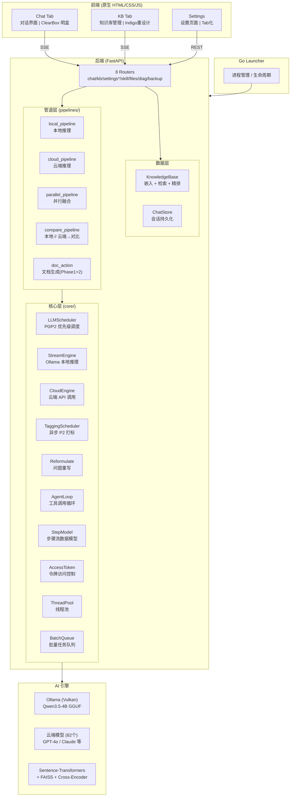

# Sidemate v0.9.7 架构总览

> 版本：v0.9.7
> 技术栈：Python 3.14 + FastAPI + Ollama (Vulkan) + Qwen3.5-4B GGUF
> 部署模式：纯内网离线 / 可选云端增强 / 并行融合
> 日期：2026-06-24

---

## 1. 系统架构图



---

## 2. 技术栈概览

| 层级 | 技术 | 说明 |
|------|------|------|
| 进程管理 | Go Launcher | 管理后端进程生命周期，自动重启 |
| 后端框架 | FastAPI + Uvicorn | 异步 Python Web 框架 |
| 本地推理 | Ollama (Vulkan backend) | 运行 Qwen3.5-4B GGUF 格式模型 |
| 云端推理 | OpenAI 兼容 API | 支持 82 个云端模型 |
| 知识库 | Sentence-Transformers + FAISS + Cross-Encoder | 嵌入、检索、精排三阶段 RAG |
| 前端 | 原生 HTML/CSS/JS | 传统 script 引入，非 ES Module |
| 通信 | SSE (Server-Sent Events) | 流式响应，支持多通道 |
| 配置 | config.py 集中管理 | MAX_INPUT_TOKENS=16384, MAX_OUTPUT_TOKENS=4096 |
| 扩展 | extensions/registry.py | VALID_IDS = {"knowledge", "recorder"} |

---

## 3. 后端架构

### 3.1 包结构

```
server/
├── core/                   # 核心引擎层
│   ├── stream_engine.py    # 本地推理引擎（Ollama）
│   ├── cloud_engine.py     # 云端推理引擎
│   ├── agent_loop.py       # Agent 工具调用循环
│   ├── agent_tools.py      # 工具注册与 Prompt 管理
│   ├── llm_scheduler.py    # LLM 统一调度器（P0/P2）
│   ├── tagging_scheduler.py # 异步文档打标调度器
│   ├── reformulate.py      # 问题重写模块
│   ├── step_model.py       # 步骤流数据模型 (v0.9.7)
│   ├── access_token.py     # 令牌访问控制 (v0.9.7)
│   ├── thread_pool.py      # 线程池 (v0.9.7)
│   └── batch_queue.py      # 批量任务队列 (v0.9.7)
├── pipelines/              # 管道层
│   ├── _base.py            # 基础类型
│   ├── local_pipeline.py   # 本地管道
│   ├── cloud_pipeline.py   # 云端管道
│   ├── parallel_pipeline.py # 并行融合管道 (v0.9.7)
│   ├── compare_pipeline.py # 对比管道
│   └── doc_action.py       # 文档生成两阶段 (v0.9.7)
├── routers/                # API 路由层（8 个 Router）
│   ├── chat.py             # 对话 API
│   ├── kb.py               # 知识库管理 API
│   ├── settings_system.py  # 系统设置
│   ├── settings_cloud.py   # 云端配置
│   ├── settings_extensions.py # 扩展管理
│   ├── skill.py            # Action 管理
│   ├── files.py            # 文件管理
│   ├── diagnostics.py      # 诊断
│   └── backup.py           # 备份
├── session/                # 会话管理
│   └── chat_store.py       # 对话历史持久化
├── knowledge/              # 知识库 (v0.9.7 重组)
│   ├── search.py           # 语义检索
│   ├── ops.py              # 文档操作
│   ├── chunker.py          # 文本分块
│   └── models.py           # 数据模型
├── config.py               # 集中配置管理
├── prompts.py              # Prompt 模板库
├── extensions/             # 扩展系统
│   └── registry.py         # 扩展注册中心
└── server.py               # FastAPI 应用入口
```

**规模**：9 包，30+ 模块，8 Router。

### 3.2 请求处理流程

```
浏览器请求 → FastAPI Router → Pipeline 选择 → Core Engine → SSE 流式响应
```

管道路由逻辑（`pipelines/__init__.py`）：

```python
def create_pipeline(ctx: StreamContext):
    if ctx.is_kb_compare:      # 知识库对比模式
        return run_compare_pipeline(ctx)
    elif ctx.ai_mode == "cloud":  # 云端模式
        return run_cloud_pipeline(ctx)
    else:                         # 本地模式
        return run_local_pipeline(ctx)
```

---

## 4. 核心组件

### 4.1 LLM 调度器 (core/llm_scheduler.py)

统一管理所有本地 LLM 调用请求，基于优先级调度：

| 优先级 | 用途 | 行为 |
|--------|------|------|
| P0 | 对话、知识库问答、录音纪要 | 最高优先级，FIFO 排队，可抢占 P2 |
| P2 | 文档打标、后台任务 | 低优先级，被 P0 抢占时暂停 |

**关键接口**：

```python
class LLMScheduler:
    async def submit(priority, task) -> Ticket   # 提交任务
    async def cancel(ticket_id) -> bool          # 取消排队任务
    def get_queue_status() -> list[QueueItem]    # 查询队列状态
```

**调度规则**：
- P0 任务之间 FIFO 排队，互不抢占
- P0 到达时，P2 当前任务完成后让出资源
- 云端调用（CloudEngine）不走调度器，独立执行

### 4.2 标签调度器 (core/tagging_scheduler.py)

异步文档打标队列，P2 优先级，FIFO 顺序处理：

```python
class TaggingScheduler:
    async def enqueue(doc_id)              # 文档上传后入队
    async def _worker()                    # 后台循环：取任务→打标→写回
    def get_status(doc_id) -> str          # "pending" / "done" / "not_found"
```

**打标流程**：
1. 文档上传成功后入队
2. Worker 取任务，调用 StreamEngine 生成 3-5 个标签 + 100 字摘要
3. 长文档策略：≤3000 字用全文，>3000 字提取标题层级+各段首句
4. 结果写回 KBDocument 的 `tags` 和 `summary` 字段
5. 被 P0 抢占时标记 pending，LLM 空闲后重新执行

### 4.3 Reformulate (core/reformulate.py)

在知识库对话中，当存在历史记录时（Round 2+），自动重写用户问题以提升检索质量：

```python
async def reformulate_query(
    query: str,
    history: list[dict],
    stream_engine: StreamEngine,
) -> str
```

**设计要点**：
- 无历史时原样返回，不浪费调用
- 有历史时调用本地 LLM 进行补全（~100 tokens in / 50 out）
- 典型场景："它是什么意思" → "上一轮讨论的 xxx 概念是什么意思"

### 4.4 对比管道 (pipelines/compare_pipeline.py)

本地与云端并行推理 → 融合输出的核心管道：

```
用户提问（在线模式 + 对比开关开启）
  ↓
Step 0: Reformulation（Round 2+）
  ↓
Step 1: asyncio.gather 并行
  ├─ 本地（LLMScheduler P0）: search_kb → rerank → 本地总结
  └─ 云端（独立 HTTP）: CloudEngine 直接回答
  ↓
Step 2: 本地融合（LLMScheduler P0）
  └─ StreamEngine 融合（本地总结 + 云端回答 → 综合分析）
```

**SSE 多通道事件**：

```python
{"channel": "local",  "phase": "stream", "content": "根据知识库..."}
{"channel": "cloud",  "phase": "stream", "content": "根据公开信息..."}
{"channel": "merge",  "phase": "stream", "content": "综合分析..."}
{"channel": "merge",  "phase": "done"}
```

### 4.5 双线记忆

对比管道维护两套独立的对话记忆：

| 记忆线 | 存储内容 | 用途 |
|--------|---------|------|
| memory_local | 融合结果 F（信息最全，本地安全） | 本地侧上下文 |
| memory_cloud | 云端回答 C（纯云端输出，零泄露） | 云端侧上下文 |

**隐私保证**：云端模型的上下文中只包含云端自己生成的回答，永远不会包含本地知识库的任何内容。

### 4.6 知识库独立会话上下文

知识库 Tab 拥有独立的会话管理，与 Chat Tab 互不干扰：

```python
_kb_sessions = {
    "session_id": {
        "turns": [...],               # 对话轮次
        "memory_local": [...],        # 融合结果历史
        "memory_cloud": [...],        # 云端回答历史
        "mode": "local" | "compare",  # 当前模式
    }
}
```

**上下文管理**：
- 自适应记忆裁剪：从最旧消息开始裁剪，保持 token 数 ≤ `history_token_budget`（默认 3000）
- 前端展示上下文使用率指示器，80% 时提示用户新建对话

### 4.7 步骤流模型 (core/step_model.py) （v0.9.7 新增）

统一的流水线步骤数据模型，替代散落的计时变量：

```python
@dataclass
class Step:
    id: str            # "local_gen" | "cloud_gen" | "merge"
    label: str         # 中文标签
    status: str        # pending | running | done | error
    started_at: float  # 时间戳
    elapsed_ms: int    # 耗时
```

并行管道中 6 个变量 → 4 个 Step 对象，SSE 事件格式统一。

> 详见 [v0.9.7-step_model设计.md](v0.9.7-step_model设计.md)

### 4.8 访问令牌 (core/access_token.py) （v0.9.7 新增）

三级令牌访问控制（full/search/none），仅存内存。私密文档标记持久化到 `kb_meta.json`。

### 4.9 并行管道 (pipelines/parallel_pipeline.py) （v0.9.7 新增）

本地检索 KB + 云端通用知识独立回答，本地自动融合。KB 原文不离开本机。

### 4.10 文档生成管道 (pipelines/doc_action.py) （v0.9.7 新增）

两阶段文档生成：Phase 1 AI 生成 Markdown 提纲 → 用户编辑确认 → Phase 2 生成完整 .docx。

---

## 5. AI 引擎

### 5.1 本地推理 (StreamEngine)

- **引擎**：Ollama，Vulkan GPU 加速
- **模型**：Qwen3.5-4B GGUF 格式
- **接口**：通过 Ollama `/api/chat` API 通信
- **输出**：流式 token 生成，支持 Think 模式

### 5.2 云端推理 (CloudEngine)

- **协议**：OpenAI 兼容 API
- **模型数**：82 个云端模型（GPT-4o、Claude 等）
- **Token 统计**：从 SSE 最终帧的 `usage` 字段提取 `prompt_tokens` / `completion_tokens` / `reasoning_tokens`

### 5.3 知识库 RAG (KnowledgeBase)

三阶段检索增强生成：

```
用户问题
  ↓ Reformulate（有历史时）
  ↓
Sentence-Transformers 嵌入 → FAISS 向量检索（Top-K）
  ↓
Cross-Encoder 精排重排
  ↓
拼接上下文 → LLM 生成回答
```

**参数**：
- `kb_search_top_k`：检索数量，默认 5
- `kb_vector_score_threshold`：相似度阈值，默认 0.28
- `kb_max_documents`：最大文档数，默认 20

---

## 6. 前端架构

- **技术**：原生 HTML/CSS/JS，传统 `<script>` 标签引入，非 ES Module
- **通信**：SSE 流式接收，EventSource 自动重连
- **关键文件**：
  - `static/js/chat.js` — 对话界面逻辑
  - `static/js/chat-actions.js` — Action 管理
  - `static/css/main.css` — CSS 变量 + 主题系统

### 6.1 对比管道前端渲染

前端根据 SSE 事件中的 `channel` 字段分发到不同 UI 区域：

| Channel | UI 区域 | 标识 |
|---------|--------|------|
| `local` | 左列 | "本地知识库 · 数据不离开本机" |
| `cloud` | 右列 | "云端AI · 无法访问您的文档" |
| `merge` | 底部融合气泡 | "综合分析（由本地模型安全融合）" |

---

## 7. 配置体系

配置集中管理于 `config.py`，通过 `get()` / `set_value()` 读写：

| 配置项 | 默认值 | 说明 |
|--------|--------|------|
| `MAX_INPUT_TOKENS` | 16384 | 最大输入 token 数 |
| `MAX_OUTPUT_TOKENS` | 4096 | 最大输出 token 数 |
| `kb_permission` | `"full"` | KB 权限：full / search-only / disabled |
| `kb_compare_enabled` | `False` | 云端对比开关 |
| `kb_compare_privacy_read` | `False` | 隐私弹窗已读标记 |
| `history_token_budget` | 3000 | KB 对话历史 token 预算 |
| `kb_search_top_k` | 5 | KB 检索数量 |
| `kb_vector_score_threshold` | 0.28 | KB 相似度阈值 |
| `kb_max_documents` | 20 | KB 最大文档数 |

---

## 8. 扩展系统

通过 `extensions/registry.py` 管理扩展注册：

```python
VALID_IDS = {"knowledge", "recorder"}
```

**扩展安装**：通过 `.sidemate` 包格式，支持 HMAC 签名验证。

---

## 9. SSE 事件协议

### 9.1 通用事件格式

```
data: {"phase": "stream", "content": "..."}
data: {"phase": "done"}
```

### 9.2 对比管道扩展格式

```
data: {"channel": "local", "phase": "stream", "content": "..."}
data: {"channel": "cloud", "phase": "stream", "content": "..."}
data: {"channel": "merge", "phase": "stream", "content": "..."}
data: {"channel": "merge", "phase": "done"}
```

### 9.3 排队事件

```
data: {"phase": "queued", "position": 2, "message": "文库正在生成中，您的请求正在排队"}
```

---

## 10. 数据结构

### 10.1 EngineResult

```python
@dataclass
class EngineResult:
    content: str
    finish_reason: str = "stop"
    token_stats: dict | None = None  # {"input_tokens": int, "output_tokens": int, "reasoning_tokens": int|None}
```

### 10.2 KBDocument

```python
@dataclass
class KBDocument:
    doc_id: str
    filename: str
    file_path: str
    file_size: int
    import_time: str
    chunk_count: int
    summary: str = ""
    tags: list[str] = field(default_factory=list)  # Patch 3: AI 生成标签
    tag_status: str = "pending"                     # "pending" / "done"
```

### 10.3 Chat Message

```python
# assistant message
{
    "role": "assistant",
    "content": "...",
    "timestamp": "...",
    "token_stats": {                    # 可选，Patch 3 新增
        "input_tokens": 8523,
        "output_tokens": 421,
        "reasoning_tokens": 3200        # 仅在线模式
    }
}
```

---

## 11. 架构约束

1. **调度器全局唯一**：LLMScheduler 全局单例，所有本地 LLM 调用必须通过它调度
2. **云端不走调度器**：CloudEngine 的 HTTP 调用独立，不参与本地排队
3. **文库 Tab 永远走本地**：KB 总结、融合等推理永远走本地模型
4. **隐私铁律**：云端模型永远不能看到本地知识库内容，云端上下文只含云端自己的回答
5. **前端非 ES Module**：所有 JS 使用传统 `<script>` 引入，注意全局命名冲突

---

## 12. 内存参考

全功能运行时的内存占用估算：

| 组件 | 占用 |
|------|------|
| Qwen3.5-4B GGUF 权重 | ~3 GB |
| KV Cache | ~0.4 GB |
| 嵌入模型 (Sentence-Transformers) | ~0.4 GB |
| Cross-Encoder Reranker | ~0.4 GB |
| Whisper (录音转写) | ~1 GB |
| **总计（全开）** | **~5.2 GB** |

可通过配置控制内存占用：
- `reranker_resident: False` — 空闲 5 分钟后卸载 Reranker
- `recorder_resident: False` — 空闲后卸载 Whisper
- `whisper_keep_loaded: False` — 用完立即卸载
