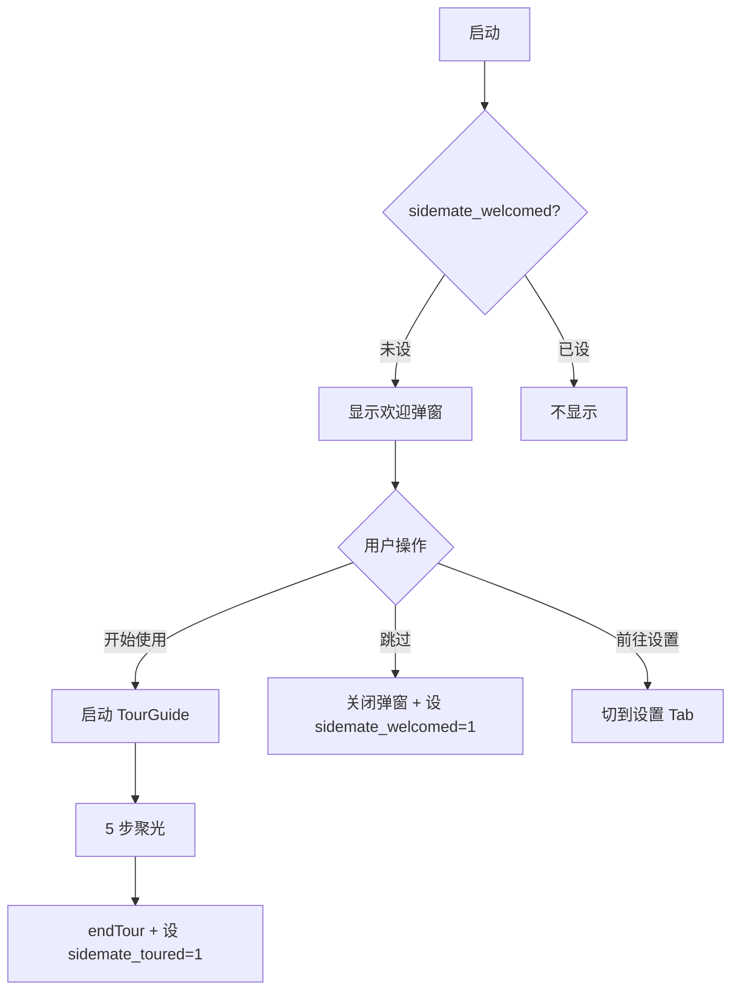

# Onboarding（新手引导）前端设计

> ✅ **本文档随 0.9.6 首发重发**（功能已在 0.9.6 完整发版）。
>
> 版本：v0.9.7 | 文件：`server/static/js/welcome-tour.js` / `server/index.html`
> 适用人群：前端开发者 / 想理解引导系统设计的 PM

---

## 1. 设计背景

### 1.1 v0.9.7 之前的痛点

- 新用户首次启动，**无任何引导**，直接看到 Chat Tab
- 三模式 / KB 私密 / 令牌机制 / 知识库权限等高级功能**无人知晓**
- 早期 P2 阶段设计的欢迎弹窗（`showWelcome`）功能单一，**没有 TourGuide**

### 1.2 设计目标

v0.9.7 提出**两阶段引导**：

1. **阶段 1（欢迎弹窗）**：根据当前安装状态（AI / KB / 云端）智能分支，介绍核心能力
2. **阶段 2（TourGuide）**：交互式 5 步聚光引导，**带用户走一遍核心操作**

设计原则：
- **不阻断**：弹窗是「提示」而非「拦截」
- **不冷漠**：路径选项 + 功能卡片，避免空状态
- **不啰嗦**：信息层级克制（图标 → 标题 → 描述 → 按钮）
- **可重看**：设置页「重新查看新手指引」入口

---

## 2. 状态机

### 2.1 localStorage 状态

| Key | 类型 | 含义 |
|-----|------|------|
| `sidemate_welcomed` | `'1'` | 阶段 1 是否被关闭 |
| `sidemate_toured` | `'1'` | 阶段 2 是否完成 |
| `sidemate_mode_confirm_skip_{mode}` | `'1'` | 模式切换确认弹窗「下次不再提示」标记 |

### 2.2 启动流程



### 2.3 重置入口

设置页「关于」分组 → 「重新查看新手指引」：

```js
function resetOnboarding() {
  localStorage.removeItem('sidemate_welcomed');
  localStorage.removeItem('sidemate_toured');
  endTour();        // 关闭当前 TourGuide（如果有）
  showWelcome();    // 重新显示欢迎弹窗
}
```

`window.resetOnboarding` 暴露为全局函数，可被任何 UI 触发。

---

## 3. 阶段 1：欢迎弹窗

### 3.1 数据来源

```js
async function showWelcome() {
  if (typeof iconSvg !== 'function') return;  // 工具函数未加载
  try {
    var resp = await fetch('/api/onboard/status');
    var status = await resp.json();
    var hasAI = status.llm_installed || status.cloud_configured;
    var hasKB = status.kb_installed;
    var hasCloud = status.cloud_configured;
    // ... 根据状态分支
  } catch(e) {
    console.error('[welcome]', e);
  }
}
```

**关键点**：依赖 `iconSvg` 全局函数（utils.js），如果未加载则**直接 return**（不抛错）。

### 3.2 三路径分支

| 状态 | 标题 | 副标题 | 主推 | 跳过入口 |
|------|------|--------|------|----------|
| 无 AI | 欢迎使用桌伴 | 需要一个 AI 引擎才能开始工作 | 前往设置 | 跳过新手引导，直接开始 |
| AI 已有，KB 未装 | AI 已就绪！ | 你可以开始与 AI 对话 | 开始使用（→ TourGuide） | 跳过新手引导，直接开始 |
| 全功能就绪 | 全功能就绪！ | 所有模块已安装 | 开始浏览（→ TourGuide） | 跳过新手引导 |

### 3.3 弹窗结构

```html
<div id="welcomeOverlay" class="welcome-overlay" style="display:flex">
  <div id="welcomeCard" class="welcome-card">
    <div class="welcome-top-decoration"></div>          <!-- 渐变顶条 -->
    <div style="text-align:center;padding-top:8px">
      <div class="welcome-icon-circle">                  <!-- 圆形图标 -->
        {iconCircleSvg(routeIcon, 28)}
      </div>
      <h2>{routeTitle}</h2>
      <p>{routeDesc}</p>
    </div>
    {routeActions}                                       <!-- 路径选项 + 按钮 -->
  </div>
</div>
```

### 3.4 路径选项卡

```js
function optionCard(icon, title, desc, color) {
  return `<div class="option-card" style="border-color:var(--border-color)">
    <div class="option-icon" style="background:{color}15;color:{color}">
      {iconSvg(icon, 16)}
    </div>
    <div>
      <div class="option-title">{title}</div>
      <div class="option-desc">{desc}</div>
    </div>
  </div>`;
}
```

**视觉规范**：
- 12px padding + 1px border + 10px 圆角
- hover 时 border 变彩色（15% 透明度色）
- 图标 36×36 + 10px 圆角 + 主题色背景（15% 透明）

### 3.5 圆形图标（iconCircleSvg）

```js
function iconCircleSvg(icon, size) {
  var gradient = icon === 'welcome' ? 'linear-gradient(135deg,#534AB7,#A78BFA)' :
                 icon === 'chat' ? 'linear-gradient(135deg,#1E3A5F,#3270B0)' :
                 'linear-gradient(135deg,#534AB7,#3DA89E)';
  return `<div style="width:56px;height:56px;border-radius:28px;
    background:${gradient};
    display:inline-flex;
    box-shadow:0 4px 16px rgba(83,74,183,.25)">
    {iconSvg(icon, size)}
  </div>`;
}
```

**三种渐变**：
- welcome（紫色系）：未安装 AI
- chat（蓝色系）：已安装 AI
- check（青绿系）：全功能就绪

### 3.6 关闭行为

```js
function dismissWelcome() {
  var overlay = document.getElementById('welcomeOverlay');
  if (overlay) overlay.style.display = 'none';
  localStorage.setItem('sidemate_welcomed', '1');
  fetch('/api/onboard/complete', {method: 'POST'}).catch(function(){});
}
```

**注意**：同时调用 `/api/onboard/complete` 通知后端（统计完成率 + 写入持久化状态）。

---

## 4. 阶段 2：交互式 TourGuide

### 4.1 步骤定义

```js
var _tourSteps = [
  { id: 'modes',    tab: 'chat', targetSel: '#chatMode',
    title: '三种 AI 模式', desc: '...', pos: 'bottom' },
  { id: 'input',    tab: 'chat', targetSel: '#msgInput',
    title: '开始对话', desc: '...', pos: 'top' },
  { id: 'kb1',      tab: 'qa',   targetSel: '#kbToolbar button',
    title: '上传你的文档', desc: '...', pos: 'bottom' },
  { id: 'kb2',      tab: 'qa',   targetSel: '#kbAIOverview .s-hdr',
    title: 'AI 洞察', desc: '...', pos: 'bottom' },
  { id: 'recap',    tab: 'chat', targetSel: '.tabs-nav button[onclick*="settings"]',
    title: '设置入口', desc: '...', pos: 'bottom' }
];
```

**字段**：
- `id`：步骤 ID（用于事件追踪）
- `tab`：目标所在 Tab（触发自动切换）
- `targetSel`：CSS 选择器（指向要 spotlight 的元素）
- `title` / `desc`：卡片显示内容
- `pos`：卡片相对目标位置（'top' / 'bottom' / 'right'）

### 4.2 启动流程

```js
function startTour() {
  _tourStep = 0;
  if (typeof switchTab === 'function') {
    var btn = _tourFindTabBtn('chat');
    if (btn) { switchTab('chat', btn); }
  }
  _tourLastTab = 'chat';
  document.getElementById('tourOverlay').style.display = 'block';
  document.getElementById('tourCard').style.display = 'block';
  var tries = 0;
  var waitForChat = function() {
    var target = document.querySelector('#chatMode');
    if (target && target.offsetWidth > 0) {
      renderTourStep();
      return;
    }
    if (++tries > 20) { renderTourStep(); return; }  // 1s 超时兜底
    setTimeout(waitForChat, 50);
  };
  waitForChat();
}
```

**关键点**：
- 启动时强制切到 Chat Tab（兼容从设置页「重新查看」触发的场景）
- 轮询 `#chatMode` 是否渲染完成（`offsetWidth > 0`）
- 1s 内 20 次重试（每 50ms 一次）后强制走，避免无限等待

### 4.3 跨 Tab 引导

#### 4.3.1 Tab 按钮智能匹配

```js
function _tourFindTabBtn(tabName) {
  // 优先匹配 onclick 里的 switchTab('xxx',...)
  var btn = document.querySelector(
    '.tabs-nav button[onclick*="switchTab(\'' + tabName + '\'"]'
  );
  if (btn) return btn;
  // 兜底：按文本匹配
  var btns = document.querySelectorAll('.tabs-nav button');
  var labelMap = { chat: '对话', qa: '知识库', settings: '设置' };
  var label = labelMap[tabName];
  if (label) {
    for (var i = 0; i < btns.length; i++) {
      if (btns[i].textContent.trim() === label) return btns[i];
    }
  }
  return null;
}
```

**v0.9.7 修复**：旧版用 `[data-tab="chat"]` 选择器匹配不到实际 `onclick="switchTab('chat',this)"` 形式的 tab 按钮，导致切 Tab 失败。

#### 4.3.2 Tab 切换等待

```js
if (step.tab && step.tab !== _tourLastTab && typeof switchTab === 'function') {
  var btn = _tourFindTabBtn(step.tab);
  if (btn) { switchTab(step.tab, btn); _tourLastTab = step.tab; }
}

// 等 Tab 切换完成后再定位
var doPosition = function() {
  // ...
};
if (step.tab === 'qa') {
  setTimeout(doPosition, 400);  // KB Tab 复杂，慢一点
} else {
  setTimeout(doPosition, 150);
}
```

### 4.4 目标元素定位

#### 4.4.1 视口内目标

直接 `getBoundingClientRect()` 拿坐标。

#### 4.4.2 视口外目标（KB Tab 可滚动）

```js
if (target) {
  var _r = target.getBoundingClientRect();
  var _inViewport = (_r.top >= 0 && _r.bottom <= (window.innerHeight || 600));
  if (!_inViewport) {
    target.scrollIntoView({ block: 'center', behavior: 'instant' });
    requestAnimationFrame(function() {
      positionTourElements(findTourTarget(s), s.pos);
    });
    return;
  }
}
```

**v0.9.7 修复**：KB Tab 等可滚动 Tab 中目标可能在视口外（`getBoundingClientRect` 的 top 很大或为负），先 `scrollIntoView` 让它进入视口再定位。

### 4.5 Spotlight 镂空（v0.9.7 核心修复）

#### 4.5.1 旧方案（已废弃）

```css
.tour-spotlight {
  position: fixed;
  box-shadow: 0 0 0 9999px rgba(0,0,0,0.45);
}
```

**问题**：如果目标元素在 `overflow:hidden` 容器内（如 `.tabs-nav`），box-shadow 会被裁剪。

#### 4.5.2 新方案

```js
// spotlight 在独立的 #tourOverlay 层（position:fixed/absolute，不在 overflow:hidden 容器内），
// 不受 tabs-nav 等 overflow:hidden 裁剪影响。
spotlight.style.clipPath = 'none';
spotlight.style.inset = 'auto';
spotlight.style.left = tx + 'px';
spotlight.style.top = ty + 'px';
spotlight.style.width = tw + 'px';
spotlight.style.height = th + 'px';
spotlight.style.borderRadius = tRadius + 'px';
spotlight.style.background = 'transparent';
spotlight.style.boxShadow = '0 0 0 9999px rgba(0,0,0,0.45)';
```

**核心**：
- spotlight 元素**位于 `#tourOverlay` 顶层**，不嵌套在 `overflow:hidden` 容器内
- spotlight 自身是「目标大小的透明块」，box-shadow 向四周扩散 9999px 形成半透明遮罩
- 中间天然镂空（露出目标）

#### 4.5.3 曾尝试 clip-path 方案（废弃）

```js
// 旧尝试：用 clip-path: path(evenodd, ...) 画镂空
// 问题：path(evenodd, ...) 是无效语法，clip-path 不支持 evenodd 填充规则参数
// 结果：整屏纯暗色无镂空
```

**结论**：clip-path 方案不可靠，box-shadow 方案**最稳**。

### 4.6 卡片定位

```js
function positionTourElements(target, pos) {
  var cardW = 280, cardH = 140;
  var cx, cy;
  if (pos === 'bottom') {
    cx = Math.max(16, Math.min(viewW - cardW - 16, tx + tw / 2 - cardW / 2));
    cy = ty + th + 12;
    // 卡片底部超出视口 → 改放到目标上方
    if (cy + cardH > viewH - 8 && ty - cardH - 12 >= 8) {
      cy = ty - cardH - 12; pos = 'top';
    }
  } else if (pos === 'top') {
    cx = Math.max(16, Math.min(viewW - cardW - 16, tx + tw / 2 - cardW / 2));
    cy = ty - cardH - 12;
    if (cy < 8) { cy = ty + th + 12; pos = 'bottom'; }
  } else {
    cx = tx + tw + 12;
    cy = ty;
    if (cx + cardW > viewW - 8) cx = tx - cardW - 12;
  }
  // 最终兜底：卡片必须落在视口内
  cx = Math.max(8, Math.min(viewW - cardW - 8, cx));
  cy = Math.max(8, Math.min(viewH - cardH - 8, cy));
  // ...
}
```

**容错策略**：
1. 按 `pos` 放置卡片
2. 屏幕边缘 → 自动翻转（bottom↔top / left↔right）
3. 翻转仍放不下 → 强制 clamp 到视口内

### 4.7 箭头位置（v0.9.7 修复）

```js
// 箭头水平位置：指向目标中心，而非固定卡片中心
var targetCenterX = tx + tw / 2;
var arrowX = targetCenterX - cx;  // 相对卡片左边的偏移
// clamp 到卡片内 [8, cardW-8]
arrowX = Math.max(8, Math.min(cardW - 8, arrowX));
card.style.setProperty('--tour-arrow-x', arrowX + 'px');
```

**v0.9.7 修复**：旧版箭头恒在 `left:50%`（卡片中心），目标偏离卡片中心时指偏。

### 4.8 步骤切换

```js
function nextTourStep() {
  _tourStep++;
  if (_tourStep >= _tourSteps.length) {
    endTour();
    return;
  }
  renderTourStep();
}

function prevTourStep() {
  if (_tourStep > 0) {
    _tourStep--;
    renderTourStep();
  }
}

function endTour() {
  document.getElementById('tourOverlay').style.display = 'none';
  document.getElementById('tourCard').style.display = 'none';
  localStorage.setItem('sidemate_toured', '1');
}
```

**进度点**：底部 5 个圆点，当前步骤用品牌色填充，其他用 border 灰色。

---

## 5. UI 元素

### 5.1 HTML 结构

```html
<!-- 阶段 1 欢迎弹窗 -->
<div id="welcomeOverlay" class="welcome-overlay" style="display:none">
  <div id="welcomeCard" class="welcome-card">
    <!-- 动态填充 -->
  </div>
</div>

<!-- 阶段 2 TourGuide -->
<div id="tourOverlay" class="tour-overlay" style="display:none">
  <div id="tourSpotlight" class="tour-spotlight"></div>
  <div id="tourCard" class="tour-card" style="display:none">
    <h3 id="tourCardTitle"></h3>
    <p id="tourCardDesc"></p>
    <div class="tour-dots" id="tourDots"></div>
    <div class="tour-actions">
      <button id="tourPrevBtn" onclick="prevTourStep()">上一步</button>
      <button id="tourNextBtn" onclick="nextTourStep()">下一步</button>
    </div>
  </div>
</div>
```

### 5.2 CSS 关键样式

```css
.welcome-overlay {
  position: fixed;
  inset: 0;
  background: rgba(0, 0, 0, 0.45);
  z-index: 9000;
  display: flex;
  align-items: center;
  justify-content: center;
}

.welcome-card {
  width: 460px;
  max-width: 90vw;
  background: var(--bg-surface);
  border-radius: 14px;
  padding: 24px;
  box-shadow: 0 12px 40px rgba(0, 0, 0, 0.25);
}

.welcome-top-decoration {
  position: absolute;
  top: 0; left: 0; right: 0;
  height: 4px;
  background: linear-gradient(90deg, #534AB7, #A78BFA);
  border-radius: 14px 14px 0 0;
}

.tour-overlay {
  position: fixed;
  inset: 0;
  z-index: 9100;
  pointer-events: auto;  /* 拦截点击，避免穿透 */
}

.tour-spotlight {
  position: fixed;
  background: transparent;
  box-shadow: 0 0 0 9999px rgba(0, 0, 0, 0.45);
  z-index: 9100;
  transition: all 0.2s ease;
}

.tour-card {
  position: fixed;
  width: 280px;
  background: var(--bg-surface);
  border-radius: 12px;
  padding: 16px 18px;
  box-shadow: 0 8px 24px rgba(0, 0, 0, 0.18);
  z-index: 9200;
  /* 箭头用 CSS 变量定位 */
  --tour-arrow-x: 50%;
}

.tour-card::before {
  content: '';
  position: absolute;
  top: var(--tour-arrow-top, -6px);
  bottom: var(--tour-arrow-bottom, auto);
  left: var(--tour-arrow-x);
  margin-left: -6px;
  border: 6px solid transparent;
  border-bottom-color: var(--bg-surface);
  border-top: 0;
}
```

---

## 6. 失败容错

| 失败点 | 兜底行为 |
|--------|----------|
| `iconSvg` 未加载 | 直接 `return`，不显示弹窗 |
| `/api/onboard/status` 失败 | `console.error` + 不显示弹窗（不阻断） |
| `_tourFindTabBtn` 找不到 Tab | `console.warn` + 留在原 Tab |
| 目标元素不存在 | 退化到整屏纯遮罩 + 卡片居中 |
| 目标不可见（`offsetWidth=0`） | 同上 |
| `scrollIntoView` 失败 | requestAnimationFrame 兜底 |
| 卡片超出视口 | clamp 到 [8, viewW-8] / [8, viewH-8] |
| 1s 内 `#chatMode` 仍未渲染 | 强制 `renderTourStep()` |

---

## 7. 可重看入口

### 7.1 设置页入口

`server/index.html` 中：

```html
<div class="settings-section">
  <h4>程序版本</h4>
  <div class="version-display" id="versionDisplay">v0.9.7</div>
  <div style="margin-top:6px">
    <a href="javascript:void(0)"
       onclick="resetOnboarding()"
       style="color:var(--text-muted);text-decoration:none;font-size:11px">
      重新查看新手指引
    </a>
  </div>
</div>
```

### 7.2 调试快捷键

```js
window.addEventListener('keydown', function(e) {
  if (e.ctrlKey && e.shiftKey && e.key === 'O') {
    e.preventDefault();
    localStorage.removeItem('sidemate_welcomed');
    localStorage.removeItem('sidemate_toured');
    location.reload();
  }
});
```

`Ctrl+Shift+O`：清状态 + 刷新页面，强制重新显示引导（开发者调试用）。

---

## 8. 与其他模块的协作

| 模块 | 协作方式 |
|------|----------|
| `index.html` | 提供 `#welcomeOverlay` / `#tourOverlay` / `#tourCard` HTML |
| `settings.js` | 设置页「重新查看新手指引」按钮调用 `resetOnboarding()` |
| `utils.js` | 提供 `iconSvg` 全局函数（依赖） |
| `chat.js` | 提供 `switchTab` 全局函数（依赖） |
| 后端 `/api/onboard/status` | 返回 `llm_installed` / `kb_installed` / `cloud_configured` |
| 后端 `/api/onboard/complete` | 接收关闭通知（统计用） |

---

## 9. 设计权衡

| 选择 | 理由 |
|------|------|
| **传统 JS（非 ES Module）** | 与项目整体保持一致；零构建工具 |
| **clip-path → box-shadow 改造** | 旧 clip-path 方案受 `overflow:hidden` 裁剪影响，box-shadow 方案**最稳** |
| **polling 替代 timeout** | 切 Tab 后等 DOM 渲染完成比固定 timeout 更可靠 |
| **数据驱动 vs 硬编码** | `_tourSteps` 数组定义步骤，新增/调整步骤不动核心代码 |
| **手动重看 vs 自动重看** | 一次性引导容易让用户疲劳；手动按需重看更尊重用户 |
| **每模式独立 confirm 标志** | 模式切换的「下次不再提示」是**用户级选择**，尊重细粒度控制 |

---

## 10. v0.9.8 计划

- [ ] 「设置 → 隐私安全 → 关闭新手指引」全局开关
- [ ] TourGuide 步骤可跳过（每步右上角 × 按钮）
- [ ] 视频/动图替代部分文字说明
- [ ] 多语言支持（英文 / 日文）
- [ ] 「已完成 TourGuide」标记 + 完成率统计

---

## 11. 相关代码

| 文件 | 行号 | 作用 |
|------|------|------|
| `server/static/js/welcome-tour.js` | 全文件 | 主逻辑 |
| `server/static/js/welcome-tour.js` | 4-69 | `showWelcome` |
| `server/static/js/welcome-tour.js` | 119-133 | `_tourFindTabBtn` |
| `server/static/js/welcome-tour.js` | 135-157 | `startTour` |
| `server/static/js/welcome-tour.js` | 159-209 | `renderTourStep` |
| `server/static/js/welcome-tour.js` | 221-316 | `positionTourElements` |
| `server/static/js/welcome-tour.js` | 340-345 | `resetOnboarding` |
| `server/index.html` | 找 #welcomeOverlay / #tourOverlay | HTML 容器 |
| `server/static/css/main.css` | 找 .welcome-* / .tour-* | 样式 |
| `server/routers/chat.py` | `/api/onboard/*` | 后端 API |
